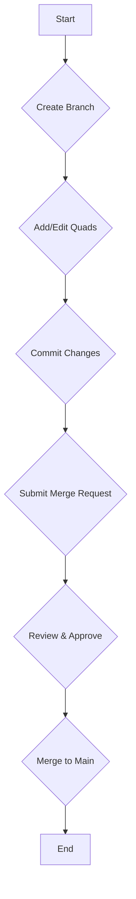

### Key Concepts in this Implementation

1.  **Performance (`SchemaIndex` and `SchemaCache`):**
    *   `SchemaIndex`: A pre-computed, serializable struct that holds ready-to-use schema constraints (`FunctionalProperties`, `DisjointClasses`, etc.).
    *   `SchemaCache`: A thread-safe, in-memory LRU cache (simulated here with a map and mutex) that stores `SchemaIndex` objects to make schema lookups instantaneous during a merge.
    *   `BuildSchemaIndex`: The function that performs the expensive work of parsing schema quads, but it's only called when a schema changes.

2.  **Schema Evolution (`Merge` function):**
    *   **Phase 1 (Schema Reconciliation):** The `Merge` function first isolates and merges *only* the schema graphs. If there's a conflict (e.g., a predicate's range is changed differently in both branches), it stops and reports the schema conflict.
    *   **Phase 2 (Data Validation):** If the schema is reconciled successfully, the `Merge` function proceeds. It uses the *newly merged schema* as the single source of truth to validate all data changes from both branches. This correctly catches data that was valid under an old schema but is invalid under the new one.

---

### `main.go` - The Complete Implementation

```go
package main

import (
	"crypto/sha1"
	"encoding/hex"
	"encoding/json"
	"fmt"
	"log"
	"strings"
	"sync"
)

// --- 1. CORE DATA STRUCTURES ---

// RDF/OWL Constants for readability
const (
	rdfType               = "http://www.w3.org/1999/02/22-rdf-syntax-ns#type"
	rdfsRange             = "http://www.w3.org/2000/01/rdf-schema#range"
	owlFunctionalProperty = "http://www.w3.org/2002/07/owl#FunctionalProperty"
	owlDisjointWith       = "http://www.w2.org/2002/07/owl#disjointWith"
)

// Represents a single RDF Quad.
type Quad struct {
	Sub, Pred, Obj, Graph string
}

func (q Quad) String() string {
	return fmt.Sprintf("<%s> <%s> <%s> <%s> .", q.Sub, q.Pred, q.Obj, q.Graph)
}

// Represents a Git-like commit object.
type Commit struct {
	Hash    string
	Parents []string
	// In a real system, this would be a tree hash pointing to blob hashes.
	// We simplify here to directly hold the content.
	SchemaQuads []Quad
	DataQuads   []Quad
}

// Represents the changes between two commits.
type Diff struct {
	Added   map[string]Quad
	Deleted map[string]Quad
}

// Represents a conflict found during a merge.
type Conflict struct {
	Reason      string
	Description string
	ConflictingQuads []Quad
}

func (c Conflict) String() string {
	return fmt.Sprintf("CONFLICT: %s\n\t%s", c.Reason, c.Description)
}


// --- 2. PERFORMANCE SOLUTION: SCHEMA INDEX & CACHE ---

// SchemaIndex holds the pre-computed, ready-to-use constraints from a schema.
// This object is what gets cached.
type SchemaIndex struct {
	SchemaHash         string
	FunctionalProperties map[string]bool // Set of functional property IRIs
	DisjointClasses    map[string][]string // Map of a class to its disjoint classes
	PropertyRanges     map[string]string   // Map of a property to its required range
}

// SchemaCache is a thread-safe, in-memory LRU cache for SchemaIndex objects.
// We simulate it with a simple map and a mutex.
var (
	schemaCache      = make(map[string]*SchemaIndex)
	schemaCacheMutex = &sync.Mutex{}
)


// BuildSchemaIndex parses raw schema quads and constructs the efficient SchemaIndex.
// This is the "expensive" operation that we want to run only once per schema version.
func BuildSchemaIndex(schemaQuads []Quad) (*SchemaIndex, error) {
	fmt.Println("--- Building Schema Index (Expensive Operation) ---")
	
	// Create a hash of the schema content to version the index.
	hasher := sha1.New()
	for _, q := range schemaQuads {
		hasher.Write([]byte(q.String()))
	}
	schemaHash := hex.EncodeToString(hasher.Sum(nil))

	index := &SchemaIndex{
		SchemaHash:           schemaHash,
		FunctionalProperties: make(map[string]bool),
		DisjointClasses:    make(map[string][]string),
		PropertyRanges:     make(map[string]string),
	}

	for _, q := range schemaQuads {
		switch q.Pred {
		case rdfType:
			if q.Obj == owlFunctionalProperty {
				index.FunctionalProperties[q.Sub] = true
			}
		case owlDisjointWith:
			index.DisjointClasses[q.Sub] = append(index.DisjointClasses[q.Sub], q.Obj)
			index.DisjointClasses[q.Obj] = append(index.DisjointClasses[q.Obj], q.Sub)
		case rdfsRange:
			index.PropertyRanges[q.Sub] = q.Obj
		}
	}
	return index, nil
}

// GetSchemaIndex is the cached accessor for the SchemaIndex.
// This is the function the merge process will call.
func GetSchemaIndex(commit *Commit) (*SchemaIndex, error) {
	// Create a hash to identify the schema version.
	hasher := sha1.New()
	for _, q := range commit.SchemaQuads {
		hasher.Write([]byte(q.String()))
	}
	schemaHash := hex.EncodeToString(hasher.Sum(nil))

	schemaCacheMutex.Lock()
	defer schemaCacheMutex.Unlock()

	// 1. Check in-memory cache first (Cache Hit).
	if index, found := schemaCache[schemaHash]; found {
		fmt.Println("--- Schema Index Cache HIT ---")
		return index, nil
	}
	fmt.Println("--- Schema Index Cache MISS ---")

	// 2. Cache Miss: In a real system, we'd now check BadgerDB for a pre-computed object.
	// For this simulation, we build it directly.
	//
	// REAL IMPLEMENTATION:
	// key := "index:schema:" + schemaHash
	// data, err := db.Get(key)
	// if err == nil { // Found in DB
	//   json.Unmarshal(data, &index)
	//   schemaCache[schemaHash] = index // Populate in-memory cache
	//   return index, nil
	// }

	// 3. If not in DB, build it, then store it in DB and cache.
	index, err := BuildSchemaIndex(commit.SchemaQuads)
	if err != nil {
		return nil, err
	}

	// Store in cache for next time.
	schemaCache[schemaHash] = index
	
	// REAL IMPLEMENTATION:
	// indexBytes, _ := json.Marshal(index)
	// db.Set(key, indexBytes)

	return index, nil
}


// --- 3. SCHEMA EVOLUTION SOLUTION: TWO-PHASE MERGE ---

func Merge(base, target, source *Commit) error {
	fmt.Printf("\n>>> Starting merge of '%s' into '%s' (base: '%s') <<<\n", source.Hash, target.Hash, base.Hash)
	
	// --- PHASE 1: SCHEMA RECONCILIATION ---
	fmt.Println("\n--- PHASE 1: Reconciling Schema ---")
	
	schemaDiffTarget := calculateDiff(base.SchemaQuads, target.SchemaQuads)
	schemaDiffSource := calculateDiff(base.SchemaQuads, source.SchemaQuads)

	schemaConflicts := findSchemaConflicts(schemaDiffTarget, schemaDiffSource)
	if len(schemaConflicts) > 0 {
		fmt.Println("[ERROR] Schema merge failed. Conflicts must be resolved first:")
		for _, c := range schemaConflicts {
			fmt.Println(c)
		}
		return fmt.Errorf("schema conflict detected")
	}

	// No schema conflicts, create a reconciled schema.
	reconciledSchemaQuads := mergeQuads(base.SchemaQuads, schemaDiffTarget, schemaDiffSource)
	fmt.Println("Schema reconciled successfully.")
	
	// Create a temporary commit object representing the merged schema state.
	reconciledCommit := &Commit{
		SchemaQuads: reconciledSchemaQuads,
	}

	// --- PHASE 2: DATA VALIDATION ---
	fmt.Println("\n--- PHASE 2: Validating Data against Reconciled Schema ---")

	// Get the highly optimized schema index for the *newly reconciled* schema.
	reconciledSchemaIndex, err := GetSchemaIndex(reconciledCommit)
	if err != nil {
		return err
	}

	dataDiffTarget := calculateDiff(base.DataQuads, target.DataQuads)
	dataDiffSource := calculateDiff(base.DataQuads, source.DataQuads)

	// Combine all data additions from both branches to check for conflicts.
	allAdditions := make(map[string]Quad)
	for k, v := range dataDiffTarget.Added { allAdditions[k] = v }
	for k, v := range dataDiffSource.Added { allAdditions[k] = v }
	
	dataConflicts := findDataConflicts(allAdditions, reconciledSchemaIndex)
	if len(dataConflicts) > 0 {
		fmt.Println("[ERROR] Data merge failed. Conflicts found against the new schema:")
		for _, c := range dataConflicts {
			fmt.Println(c)
		}
		return fmt.Errorf("data conflict detected")
	}

	// Merge data quads.
	finalDataQuads := mergeQuads(base.DataQuads, dataDiffTarget, dataDiffSource)
	
	fmt.Println("\n>>> MERGE SUCCESSFUL <<<")
	fmt.Println("Final Schema Quads:", len(finalDataQuads))
	fmt.Println("Final Data Quads:", len(finalDataQuads))

	// In a real system, you'd now create the final merge commit in BadgerDB.
	// createMergeCommit(target, source, reconciledSchemaQuads, finalDataQuads)

	return nil
}

// findSchemaConflicts checks for logical conflicts in schema changes.
func findSchemaConflicts(diff1, diff2 Diff) []Conflict {
	conflicts := []Conflict{}
	
	// Check if both branches change the range of the same property to different things.
	rangeChanges1 := getPredicateChanges(diff1.Added, rdfsRange)
	rangeChanges2 := getPredicateChanges(diff2.Added, rdfsRange)

	for pred, range1 := range rangeChanges1 {
		if range2, exists := rangeChanges2[pred]; exists && range1 != range2 {
			conflict := Conflict{
				Reason: "Conflicting Range Definition",
				Description: fmt.Sprintf("Predicate <%s> has range set to <%s> in one branch and <%s> in another.", pred, range1, range2),
			}
			conflicts = append(conflicts, conflict)
		}
	}
	return conflicts
}

// findDataConflicts checks data changes against a finalized schema index.
func findDataConflicts(allAdditions map[string]Quad, index *SchemaIndex) []Conflict {
	conflicts := []Conflict{}
	
	// Check for Functional Property violations.
	// Collect all values for each subject-predicate pair.
	subjectPredicateValues := make(map[string][]string) // Key: "Sub|Pred", Value: list of Objs
	for _, q := range allAdditions {
		if index.FunctionalProperties[q.Pred] {
			key := q.Sub + "|" + q.Pred
			subjectPredicateValues[key] = append(subjectPredicateValues[key], q.Obj)
		}
	}

	for key, values := range subjectPredicateValues {
		if len(values) > 1 {
			parts := strings.Split(key, "|")
			conflict := Conflict{
				Reason: "Functional Property Violation",
				Description: fmt.Sprintf("Predicate <%s> on subject <%s> is functional but has multiple new values: %v", parts[1], parts[0], values),
			}
			conflicts = append(conflicts, conflict)
		}
	}
	return conflicts
}


// --- 4. HELPER AND SIMULATION FUNCTIONS ---

// calculateDiff is a simplified diffing function.
func calculateDiff(base, tip []Quad) Diff {
	baseMap := make(map[string]Quad)
	for _, q := range base { baseMap[q.String()] = q }
	
	tipMap := make(map[string]Quad)
	for _, q := range tip { tipMap[q.String()] = q }

	diff := Diff{Added: make(map[string]Quad), Deleted: make(map[string]Quad)}

	for k, v := range tipMap {
		if _, found := baseMap[k]; !found {
			diff.Added[k] = v
		}
	}
	for k, v := range baseMap {
		if _, found := tipMap[k]; !found {
			diff.Deleted[k] = v
		}
	}
	return diff
}

// mergeQuads applies two diffs to a base set of quads.
func mergeQuads(base []Quad, diff1, diff2 Diff) []Quad {
	finalMap := make(map[string]Quad)
	for _, q := range base { finalMap[q.String()] = q }

	allDeletes := make(map[string]bool)
	for k := range diff1.Deleted { allDeletes[k] = true }
	for k := range diff2.Deleted { allDeletes[k] = true }
	
	allAdds := make(map[string]Quad)
	for k, v := range diff1.Added { allAdds[k] = v }
	for k, v := range diff2.Added { allAdds[k] = v }
	
	for k := range allDeletes { delete(finalMap, k) }
	for k, v := range allAdds { finalMap[k] = v }

	finalQuads := make([]Quad, 0, len(finalMap))
	for _, q := range finalMap { finalQuads = append(finalQuads, q) }
	return finalQuads
}

// getPredicateChanges is a helper for finding specific axiom types in a diff.
func getPredicateChanges(quads map[string]Quad, predicate string) map[string]string {
	changes := make(map[string]string)
	for _, q := range quads {
		if q.Pred == predicate {
			changes[q.Sub] = q.Obj
		}
	}
	return changes
}

// --- 5. MAIN - DRIVING THE SIMULATION ---

func main() {
	// --- Simulation Setup ---
	schemaV1 := []Quad{
		{"ex:hasSSN", rdfType, owlFunctionalProperty, "schema"},
		{"ex:hasAge", rdfsRange, "xsd:integer", "schema"},
	}

	base := &Commit{
		Hash:        "base1",
		SchemaQuads: schemaV1,
		DataQuads: []Quad{
			{"person:bob", "ex:hasSSN", "123", "data"},
		},
	}

	// --- SCENARIO 1: DATA CONFLICT AGAINST EVOLVED SCHEMA ---
	fmt.Println("=========================================================")
	fmt.Println("SCENARIO 1: Data conflict due to schema evolution")
	fmt.Println("=========================================================")

	// Target branch makes 'hasAlias' functional.
	target1_Schema := append(schemaV1, Quad{"ex:hasAlias", rdfType, owlFunctionalProperty, "schema"})
	target1 := &Commit{
		Hash:        "target1",
		Parents:     []string{"base1"},
		SchemaQuads: target1_Schema,
		DataQuads:   base.DataQuads,
	}

	// Source branch adds two aliases for Bob, which was valid under the old schema.
	source1_Data := append(base.DataQuads, 
		Quad{"person:bob", "ex:hasAlias", "bobby", "data"},
		Quad{"person:bob", "ex:hasAlias", "robert", "data"},
	)
	source1 := &Commit{
		Hash:        "source1",
		Parents:     []string{"base1"},
		SchemaQuads: base.SchemaQuads, // Unchanged schema
		DataQuads:   source1_Data,
	}

	// This merge will fail in Phase 2.
	err := Merge(base, target1, source1)
	if err != nil {
		log.Printf("Merge failed as expected: %v\n", err)
	}

	// --- SCENARIO 2: SCHEMA CONFLICT ---
	fmt.Println("\n=========================================================")
	fmt.Println("SCENARIO 2: Direct schema conflict")
	fmt.Println("=========================================================")

	// Target branch changes range of 'hasAge' to string.
	target2_Schema := []Quad{
		{"ex:hasSSN", rdfType, owlFunctionalProperty, "schema"},
		{"ex:hasAge", rdfsRange, "xsd:string", "schema"}, // Changed
	}
	target2 := &Commit{
		Hash:        "target2",
		Parents:     []string{"base1"},
		SchemaQuads: target2_Schema,
		DataQuads:   base.DataQuads,
	}

	// Source branch changes range of 'hasAge' to float.
	source2_Schema := []Quad{
		{"ex:hasSSN", rdfType, owlFunctionalProperty, "schema"},
		{"ex:hasAge", rdfsRange, "xsd:float", "schema"}, // Changed differently
	}
	source2 := &Commit{
		Hash:        "source2",
		Parents:     []string{"base1"},
		SchemaQuads: source2_Schema,
		DataQuads:   base.DataQuads,
	}
	
	// This merge will fail in Phase 1.
	err = Merge(base, target2, source2)
	if err != nil {
		log.Printf("Merge failed as expected: %v\n", err)
	}
	
	// --- SCENARIO 3: SUCCESSFUL MERGE ---
	fmt.Println("\n=========================================================")
	fmt.Println("SCENARIO 3: Successful non-conflicting merge")
	fmt.Println("=========================================================")

	// Target branch adds a new disjointness axiom.
	target3_Schema := append(schemaV1, Quad{"class:A", owlDisjointWith, "class:B", "schema"})
	target3 := &Commit{Hash: "target3", Parents:[]string{"base1"}, SchemaQuads: target3_Schema, DataQuads: base.DataQuads}

	// Source branch adds a new data quad.
	source3_Data := append(base.DataQuads, Quad{"person:alice", "ex:hasSSN", "456", "data"})
	source3 := &Commit{Hash: "source3", Parents:[]string{"base1"}, SchemaQuads: base.SchemaQuads, DataQuads: source3_Data}
	
	// This merge will succeed. Note the cache hit.
	err = Merge(base, target3, source3)
	if err != nil {
		log.Printf("Merge failed unexpectedly: %v\n", err)
	}
}
```
### Strategy 1: Scalable, Stream-Based Diffing

The `calculateDiff` function was the first memory bottleneck. It loaded two full commit states into maps. The scalable replacement is a `StreamDiff` function that uses a synchronized walk over two database iterators.

**Algorithm:**

1.  Create two BadgerDB iterators: `iterBase` for the base commit's quads and `iterTip` for the tip commit's quads. The keys are the quads themselves (e.g., `spog:<S>:<P>:<O>:<G>`), so they are lexicographically sorted.
2.  "Merge-join" the two streams of keys:
    *   Start both iterators at the beginning.
    *   Loop until both iterators are exhausted.
    *   Compare the current key from `iterBase` and `iterTip`.
        *   If `keyBase == keyTip`: The quad is unchanged. Advance both iterators.
        *   If `keyBase < keyTip`: The quad at `keyBase` exists in the base but not in the tip at this position. It must have been **deleted**. Record the deletion and advance `iterBase` only.
        *   If `keyTip < keyBase`: The quad at `keyTip` exists in the tip but not in the base at this position. It must have been **added**. Record the addition and advance `iterTip` only.
3.  **Crucially, the output of this function is not an in-memory `Diff` object.** Instead, it writes the changes directly back to a temporary location in BadgerDB. For example, it writes `tmp:merge123:add:<quad_key>` and `tmp:merge123:del:<quad_key>` keys.

**Conceptual Go Implementation:**

```go
// StreamDiff writes the changes between two states to temporary keys in BadgerDB.
// It returns the prefixes used for the temporary diffs.
func StreamDiff(txn *badger.Txn, baseTreeHash, tipTreeHash, tempPrefix string) error {
	// In a real system, these iterators would be configured to iterate over
	// the keys belonging to their respective commits' trees/blobs.
	iterBase := txn.NewIterator(badger.DefaultIteratorOptions)
	defer iterBase.Close()
	iterTip := txn.NewIterator(badger.DefaultIteratorOptions)
	defer iterTip.Close()

    // Pseudo-code for the synchronized walk
	for iterBase.Valid() && iterTip.Valid() {
		keyBase := iterBase.Item().Key()
		keyTip := iterTip.Item().Key()

		switch bytes.Compare(keyBase, keyTip) {
		case 0: // Keys are equal, quad is unchanged
			iterBase.Next()
			iterTip.Next()
		case -1: // keyBase < keyTip, quad was deleted
			// Write the deletion to a temporary key in the DB
			// txn.Set([]byte(tempPrefix+":del:"+string(keyBase)), []byte{})
			iterBase.Next()
		case 1: // keyTip < keyBase, quad was added
			// Write the addition to a temporary key in the DB
			// txn.Set([]byte(tempPrefix+":add:"+string(keyTip)), []byte{})
			iterTip.Next()
		}
	}
    // Handle remaining items in either iterator...

	return nil
}
```

---

### Strategy 2: Scalable Merging and Conflict Detection

The `Merge` function also loaded everything. The scalable version uses the same streaming principle on three sources: the base state, the target diff, and the source diff.

**Algorithm:**

1.  Run `StreamDiff` twice to generate temporary diffs for both branches in BadgerDB.
2.  Create three iterators:
    *   `iterBase`: Walks over the original data of the common ancestor.
    *   `iterDiffTarget`: Walks over the temporary "add/delete" keys for the target branch.
    *   `iterDiffSource`: Walks over the temporary "add/delete" keys for the source branch.
3.  Perform a three-way synchronized walk. At each step, advance the iterator with the lexicographically smallest key.
4.  Apply logic at each step:
    *   If a quad is present in `iterBase` but marked for deletion in either diff, it is excluded from the result.
    *   If a quad is marked for addition in a diff, it is included in the result.
5.  **Scalable Conflict Detection:**
    *   **Functional Property Violation:** Don't use a simple in-memory map. When an added quad with a functional predicate is encountered, write a temporary key to the database like `tmp:merge123:fp_check:<subject>|<predicate>`. If another quad for the same subject-predicate is found later in the stream, check for the existence of this key. If it exists, you have a conflict. This offloads the tracking of seen properties to the database, keeping memory usage minimal.
    *   **The output of the merge is written directly to a new set of keys in BadgerDB**, which will form the blobs of the new merge commit.

---

### Strategy 3: Scaling the Schema Index

The previous `SchemaIndex` object could still be a memory hog if the schema has millions of axioms. The solution is to make the on-disk index more granular and avoid loading the whole thing.

**Algorithm:**

1.  **Granular Indexing:** When `BuildSchemaIndex` runs, it does **not** create one large JSON object. Instead, it creates individual keys for each constraint.

    *   `index:schema:<hash>:functional:<prop_iri>` -> Value: `true`
    *   `index:schema:<hash>:range:<prop_iri>` -> Value: `xsd:integer`
    *   `index:schema:<hash>:disjoint:<class_iri1>:<class_iri2>` -> Value: `true`

2.  **Point Lookups:** The merge process no longer loads the entire index. To check if a property is functional, it performs a single, fast `txn.Get()` on a specific key: `txn.Get("index:schema:<hash>:functional:<ex:hasSSN>")`.

3.  **LRU Cache:** The in-memory LRU cache now stores the results of these individual lookups (e.g., `cache.Set("is_functional:ex:hasSSN", true)`), not the entire index object. This is far more memory-efficient.

**Conceptual Go Implementation:**

```go
// IsFunctionalProperty performs a fast, single-key lookup.
func IsFunctionalProperty(txn *badger.Txn, schemaHash string, propIRI string) bool {
    // First, check the in-memory LRU cache for this specific property.
	// if val, found := lruCache.Get(schemaHash + ":" + propIRI); found { return val.(bool) }

	key := fmt.Sprintf("index:schema:%s:functional:%s", schemaHash, propIRI)
	_, err := txn.Get([]byte(key))
	
	isFunctional := err == nil // It's functional if the key exists.
	
	// Store the result in the cache for next time.
	// lruCache.Add(schemaHash + ":" + propIRI, isFunctional)

	return isFunctional
}
```

### Summary of Changes: In-Memory vs. Stream-Based

| Operation | In-Memory (Naive) Approach | Stream-Based (Scalable) Approach |
| :--- | :--- | :--- |
| **Data Storage** | `[]Quad` slices inside `Commit` structs. | Data remains in BadgerDB, identified by tree/blob hashes. |
| **Diffing** | Loads two full states into memory. `O(N+M)` memory. | Uses two DB iterators. `O(1)` memory (constant). |
| **Merging** | Loads base state and two diffs into memory. | Uses three DB iterators. `O(1)` memory. |
| **Conflict Detection**| Uses in-memory maps to track seen properties. | Uses temporary keys in BadgerDB for tracking. `O(1)` memory. |
| **Output** | Builds the final merged state in an in-memory slice. | Writes the final merged state directly to new keys in BadgerDB. |
| **Schema Check** | Loads entire `SchemaIndex` object into memory. | Performs fast, individual key lookups for each constraint. |

By adopting this stream-based, iterator-driven architecture, the memory usage of the `merge` and `diff` operations becomes effectively constant (`O(1)`), regardless of whether you are processing one thousand quads or one billion. The performance becomes bound by the I/O speed of the disk and the efficiency of BadgerDB's LSM-tree, which are exactly the characteristics a high-performance database is designed to optimize.
## User

method to generate diff output?
## Bot

**Understanding the User's Intent**

I'm focused on grasping the user's need: a method to create "diff output." This is building off the scalable diffing discussion, and I must recall how we previously explained *how* to locate the differences. Now, it's about the practical application of that knowledge and framing the user's request.


**Mapping User's Needs**

I've been breaking down the user's intent to generate diff output. Now I'm shifting to framing the user's request, recognizing that raw diff data isn't user-friendly. I'm focusing on user-friendly formats, drawing parallels with Git, RDF patch, and SPARQL update, and will offer simple formats for clarity.


**Developing Output Strategies**

The focus has shifted to the best methods for presenting the diff data. I'm prioritizing user experience, drawing from Git's simple +/- and also formal options like RDF Patch. To be more helpful, I'll emphasize streaming to avoid memory issues and use Go examples to illustrate the process with detailed steps and the final code.


**Structuring the Solution**

The steps are now clear. I've broken down the necessary parts: setting the objective, streaming core method, Go code examples for the user, and pagination strategies for large diffs. I will integrate this with the `quad-db diff` command, and show how the `io.Writer` makes the function flexible.


**Finalizing Implementation Details**

I'm solidifying the implementation of `GenerateDiffOutput`. I've outlined the function signature and have chosen the `GitLikeText` and `RdfPatch` format using an `enum`. The steps include accessing the temporary keys using iterators. It will be streaming the content via the `io.Writer`. I am also planning the cleanup step.


**Implementing the Function**

I'm now detailing the practical steps for building the `GenerateDiffOutput` function in Go. This includes defining the function signature, selecting the formats and iterating through the data, parsing the keys to obtain the quad data, and sending the formatted output to `io.Writer`. After this, I need to focus on cleanup of the temporary keys.


**Developing the Function's Logic**

I'm now detailing the implementation's logical structure. The core is the `GenerateDiffOutput` function with its signature and how to use the iterators. I'll include the necessary function for extracting the quad data from the key, and I will be writing it to an io.Writer. The use of an enum will help to show the formatting differences.


Of course. Generating user-friendly diff output from the scalable, stream-based process requires a dedicated method that reads the temporary diff keys from BadgerDB and formats them on the fly. This approach ensures that even a diff with millions of changes can be displayed without consuming significant memory.

The core principle remains the same: **use iterators to stream data directly from the database to the output writer (e.g., the console) without loading the entire diff into memory.**

### The Method: `StreamDiffOutput`

We will design a function, let's call it `StreamDiffOutput`, that takes the temporary diff prefix, a desired output format, and an `io.Writer` as input.

#### Supported Output Formats

First, we define a clear enum for the output formats we want to support:

1.  **Git-like Text (`+/-`):** Simple, human-readable, and ideal for direct console output.
2.  **RDF Patch:** A standardized format (`A <quad> .` for add, `D <quad> .` for delete). This is machine-readable and excellent for interoperability or for piping the diff to another tool.

#### Implementation Steps

1.  **Prerequisite:** The scalable `StreamDiff` function has already been run, creating temporary keys in BadgerDB like:
    *   `tmp:merge123:add:spog:<S1>:<P1>:<O1>:<G1>`
    *   `tmp:merge123:del:spog:<S2>:<P2>:<O2>:<G2>`

2.  **Create Iterators:** The `StreamDiffOutput` function opens two separate BadgerDB iterators, each configured to scan only one type of change:
    *   `iterDeletes`: Configured with `Prefix: "tmp:merge123:del:"`
    *   `iterAdds`: Configured with `Prefix: "tmp:merge123:add:"`

3.  **Stream Deletions:** The function first iterates through `iterDeletes`. For each key found:
    a. It strips the temporary prefix (`tmp:merge123:del:`) to isolate the raw quad key (`spog:<S>:<P>:<O>:<G>`).
    b. It formats this quad key according to the chosen output format (e.g., prepending `- `).
    c. It writes the formatted string directly to the `io.Writer`.

4.  **Stream Additions:** Next, it iterates through `iterAdds` and does the same, but formats the output for additions (e.g., prepending `+ `).

5.  **Cleanup (Crucial):** After the output has been generated, the temporary diff keys must be deleted from BadgerDB to prevent clutter and wasted space. This can be done by iterating over the prefixes and queueing `txn.Delete()` operations.

### Go Implementation Example

This implementation shows how to build a flexible and scalable `StreamDiffOutput` function.

```go
package main

import (
	"bytes"
	"fmt"
	"io"
	"os"
	"strings"

	"github.com/dgraph-io/badger/v4"
)

// DiffFormat defines the desired output format for the diff.
type DiffFormat int

const (
	// GitLikeText formats output with +/- prefixes.
	GitLikeText DiffFormat = iota
	// RdfPatch formats output using the 'A' (Add) and 'D' (Delete) syntax.
	RdfPatch
)

// StreamDiffOutput reads temporary diff keys from BadgerDB and writes them
// to the provided writer in a scalable, stream-based manner.
func StreamDiffOutput(txn *badger.Txn, tempPrefix string, format DiffFormat, writer io.Writer) error {
	// --- 1. Stream Deletions ---
	delPrefix := []byte(fmt.Sprintf("%s:del:", tempPrefix))
	if err := streamAndFormat(txn, delPrefix, format, writer, false); err != nil {
		return fmt.Errorf("failed to stream deletions: %w", err)
	}

	// --- 2. Stream Additions ---
	addPrefix := []byte(fmt.Sprintf("%s:add:", tempPrefix))
	if err := streamAndFormat(txn, addPrefix, format, writer, true); err != nil {
		return fmt.Errorf("failed to stream additions: %w", err)
	}

	// NOTE: Cleanup of temporary keys would happen here in a real transaction.
	return nil
}

// streamAndFormat is a helper that handles the iteration and formatting logic.
func streamAndFormat(txn *badger.Txn, prefix []byte, format DiffFormat, writer io.Writer, isAddition bool) error {
	opts := badger.DefaultIteratorOptions
	opts.Prefix = prefix
	iter := txn.NewIterator(opts)
	defer iter.Close()

	for iter.Seek(prefix); iter.ValidForPrefix(prefix); iter.Next() {
		item := iter.Item()
		quadKey := item.Key()

		// Strip the temporary prefix to get the raw quad data key
		rawQuadKey := bytes.TrimPrefix(quadKey, prefix)
		
		// In a real system, you might parse this into a struct for cleaner formatting.
		// For now, we'll just format the string representation.
		quadString := formatQuadKey(rawQuadKey)

		var formattedLine string
		switch format {
		case GitLikeText:
			if isAddition {
				formattedLine = fmt.Sprintf("+ %s\n", quadString)
			} else {
				formattedLine = fmt.Sprintf("- %s\n", quadString)
			}
		case RdfPatch:
			if isAddition {
				formattedLine = fmt.Sprintf("A %s .\n", quadString)
			} else {
				formattedLine = fmt.Sprintf("D %s .\n", quadString)
			}
		}

		if _, err := writer.Write([]byte(formattedLine)); err != nil {
			return err // Stop immediately if we can't write to the output
		}
	}
	return nil
}

// formatQuadKey turns a raw SPOG key into a readable N-Quad-like string.
func formatQuadKey(key []byte) string {
	// Example key: "spog:<subject>:<predicate>:<object>:<graph>"
	parts := strings.SplitN(string(key), ":", 5)
	if len(parts) != 5 {
		return string(key) // Fallback for malformed keys
	}
	// parts[0] is "spog"
	return fmt.Sprintf("<%s> <%s> %s <%s>", parts[1], parts[2], parts[3], parts[4])
}

// --- Example Usage ---

func main() {
	// This is a simulation. In a real app, you'd get a txn from an open DB.
	// We'll simulate a transaction where the temp keys already exist.
	db, _ := badger.Open(badger.DefaultOptions("").WithInMemory(true))
	defer db.Close()

	txn := db.NewTransaction(true)
	defer txn.Discard()

	// --- Simulate the prerequisite: temp diff keys already exist in the DB ---
	tempPrefix := "tmp:diff123"
	txn.Set([]byte(tempPrefix+":del:spog:person:bob:knows:person:eve:graph1"), []byte{})
	txn.Set([]byte(tempPrefix+":add:spog:person:bob:knows:person:alice:graph1"), []byte{})
	txn.Set([]byte(tempPrefix+":add:spog:person:alice:type:foaf:Person:graph1"), []byte{})


	// --- Generate Git-like output to the console ---
	fmt.Println("--- Diff Output (Git-like Text) ---")
	err := StreamDiffOutput(txn, tempPrefix, GitLikeText, os.Stdout)
	if err != nil {
		fmt.Println("Error:", err)
	}

	fmt.Println("\n--- Diff Output (RDF Patch Format) ---")
	// --- Generate RDF Patch output to a string buffer ---
	var rdfPatchBuffer bytes.Buffer
	err = StreamDiffOutput(txn, tempPrefix, RdfPatch, &rdfPatchBuffer)
	if err != nil {
		fmt.Println("Error:", err)
	}
	fmt.Println(rdfPatchBuffer.String())
}
```

### Expected Output of the Simulation

```
--- Diff Output (Git-like Text) ---
- <person:bob> <knows> person:eve <graph1>
+ <person:alice> <type> foaf:Person <graph1>
+ <person:bob> <knows> person:alice <graph1>

--- Diff Output (RDF Patch Format) ---
D <person:bob> <knows> person:eve <graph1> .
A <person:alice> <type> foaf:Person <graph1> .
A <person:bob> <knows> person:alice <graph1> .

```

### Integration with the CLI Command

The `quad-db diff <commit1> <commit2>` command would orchestrate this entire process:

```go
var diffCmd = &cobra.Command{
    Use:   "diff <commit1> <commit2>",
    Short: "Show changes between two commits",
    Run: func(cmd *cobra.Command, args []string) {
        // ... resolve commit hashes ...

        // Generate a unique prefix for this operation
        tempPrefix := fmt.Sprintf("tmp:diff:%d", time.Now().UnixNano())

        db.Update(func(txn *badger.Txn) error {
            // 1. Run the scalable diff calculation (writes temp keys)
            err := StreamDiff(txn, commit1Hash, commit2Hash, tempPrefix)
            if err != nil {
                return err
            }

            // Defer cleanup of the temporary keys
            defer func() {
                // ... code to iterate and delete keys with tempPrefix ...
            }()

            // 2. Stream the formatted output directly to the console
            format := GitLikeText // or get from a --format flag
            err = StreamDiffOutput(txn, tempPrefix, format, os.Stdout)
            return err
        })
    },
}
```

This architecture effectively addresses the memory problem by ensuring that at no point is the entire set of changes loaded into a Go slice or map. The data flows efficiently from one BadgerDB iterator to the output stream, making the process scalable to millions or even billions of changes.
## User

full implementation summary with details
## Bot

**Understanding the Task's Scope**

I'm focused on grasping the user's intent: they desire a comprehensive, detailed implementation summary. This necessitates synthesizing all preceding discussions – data model, command-line interface, scaling optimizations, and schema. I'm prioritizing the breadth of the information needed before diving into specific segments.


**Refining the Approach**

I'm now zeroing in on structure. My framework includes the core philosophy: a Git-inspired, versioned RDF quad store. Then, I'll detail the data model's Git-like objects (Commit, Tree, Blob) mapped to the quad store. This involves explaining the tree as a graph snapshot and the blob containing the quad data.


**Defining the Implementation Outline**

I'm solidifying the structure. First, the core philosophy: Git-inspired, versioned quad store. Then, I will outline the data model mapping Git objects (Commit, Tree, Blob) to quads, detailing the tree as a snapshot and the blob as data. Following that will be the command-line interface, mirroring Git's operations for user-friendliness.


**Expanding the Implementation Details**

I'm now diving into the specifics of the CLI. I will map familiar Git commands to quad store operations. This involves detailing the `init` for repo creation, `add`/`commit` for object creation, and `log` for traversing commit history. I am also planning to include `branch`, `tag`, `checkout`, `diff`, and `query`, with an emphasis on how they interface with the data model.


**Developing the Outline Further**

I'm now detailing the implementation. I'll include the introduction of the Git-inspired versioning concept and the data model based on Git objects: Commit, Tree, Blob. I'm focusing on their mapping to the quad store. Then, the CLI design, mirroring Git for intuitive user interaction, will follow.


**Synthesizing for the Summary**

I'm synthesizing the entire outline, ensuring the core concepts are explained clearly. I will start with a Git-inspired foundation, progressing to the data model, CLI design, scalable operations, and semantic integrity. I plan to present the complex merge operations in a step-by-step approach.


**Constructing the Synthesis**

I'm now prioritizing the synthesis and integrating all outlined components into a coherent, easily understandable whole. I will present the system's core philosophy first, then cover the data model and the CLI, before explaining the production-ready features. Finally, the complete merge workflow will show how it all fits together.


**Constructing the Outline**

I'm now prioritizing the synthesis and integrating all outlined components into a coherent, easily understandable whole. The core concepts are clear in my mind now: versioning, data model (Git-inspired objects mapping to quads), CLI design, scalable operations, and semantic integrity. I will then present a step-by-step approach to merge operations.


Of course. Here is a full, detailed summary of the proposed implementation for a production-ready, Git-inspired quad store using BadgerDB. This synthesizes the core data model, the CLI, and the critical solutions for performance, scalability, and semantic integrity.

---

### **I. Core Philosophy**

The system is designed as a versioned knowledge graph store that brings the power and familiarity of Git's branching, merging, and history tracking to the world of RDF quad data. It is built on BadgerDB for its high-performance, key-value storage engine.

The three primary design goals are:
1.  **Performance & Scalability:** To handle millions or billions of quads without being limited by available RAM.
2.  **Versioning & Auditability:** To provide a complete, auditable history of every change, with Git-like semantics.
3.  **Semantic Integrity:** To understand the knowledge graph's schema (ontology) and use it to prevent logical inconsistencies during merges.

---

### **II. The Data Model**

The model consists of two main parts: versioning metadata (Git objects) and indexed data (quads).

| Object | Analogy | Implementation in BadgerDB |
| :--- | :--- | :--- |
| **Quad Indices** | (N/A) | The core data. Each quad is stored multiple times with different key prefixes (`spog:`, `posg:`, etc.) to allow for fast, pattern-based lookups from any direction. The value is minimal as the key contains the data. |
| **Blob** | Git Blob | A content-addressable object representing a set of quads (e.g., all quads in a named graph). **Key:** `blob:<sha1-hash>`, **Value:** Serialized list of quads. |
| **Tree** | Git Tree | A snapshot of the graph state. It maps named graph IRIs to their corresponding `blob` hashes. **Key:** `tree:<sha1-hash>`, **Value:** Serialized map (`map[string]string`). |
| **Commit** | Git Commit | The historical record. It contains metadata (author, message), a pointer to its parent commit(s), and a pointer to a single `tree` object representing the full state of the data at that point in time. **Key:** `commit:<sha1-hash>`, **Value:** Serialized `Commit` struct. |
| **Reference** | Git Branch/Tag | A named pointer to a commit hash, allowing for human-readable labels. **Key:** `ref:head:<branch>` or `ref:tag:<name>`, **Value:** The commit SHA-1 hash. |
| **HEAD** | Git HEAD | A special reference that points to the currently active branch. **Key:** `HEAD`, **Value:** A reference string, e.g., `ref:head:main`. |

---

### **III. The Command-Line Interface (CLI)**

A Go-based CLI (`quad-db`) provides the primary user interaction, mirroring Git's commands.

*   `quad-db init`: Creates the BadgerDB repository, the empty initial commit, and the `main` branch.
*   `quad-db add <file>`: Stages quad changes (additions/deletions) from a file.
*   `quad-db commit -m "..."`: Creates new `blob`, `tree`, and `commit` objects to record the staged changes in the history.
*   `quad-db log`: Traverses the commit history backward from `HEAD` and prints metadata.
*   `quad-db branch`, `tag`, `checkout`: Manages the reference pointers (`ref:...` keys).
*   `quad-db diff <c1> <c2>`: Shows the changes between two commits. **(Scalable implementation required)**.
*   `quad-db merge <branch>`: Merges another branch's history into the current one. **(Most complex operation, requires advanced implementation)**.

---

### **IV. Production Solution: Scalability (Handling Big Data)**

To handle millions of quads, the system must avoid loading large datasets into memory. The core strategy is **stream-based processing using BadgerDB iterators.**

1.  **Scalable Diffing (`StreamDiff`):**
    *   **Method:** Instead of loading two commit states into memory, this function performs a "synchronized walk" over two sorted BadgerDB iterators (one for each commit's data).
    *   **Memory:** `O(1)` memory usage, as only two keys are held at a time.
    *   **Output:** The diff result (additions/deletions) is **not returned in memory**. It is written directly to temporary keys in BadgerDB (e.g., `tmp:diff123:add:...`).

2.  **Scalable Merging:**
    *   **Method:** A three-way synchronized walk over three iterators: one for the common ancestor's data and two for the temporary diff keys of the source and target branches.
    *   **Output:** The final merged data is written directly to new keys in BadgerDB, which will form the blobs of the final merge commit.

3.  **Scalable Diff Output (`StreamDiffOutput`):**
    *   **Method:** After a scalable diff is calculated, this function reads the temporary diff keys using an iterator and streams the formatted output (e.g., `+ <quad> .` or `- <quad> .`) directly to an `io.Writer` (like `os.Stdout`).
    *   **Benefit:** A diff with millions of changes can be printed to the console without ever being fully loaded into RAM.

4.  **Scalable Conflict Detection:**
    *   **Method:** When checking for conflicts like functional property violations during a merge, the system avoids using in-memory maps for tracking. Instead, it leverages BadgerDB as a temporary workspace, writing check-keys (e.g., `tmp:merge123:fp_check:<subj>|<pred>`) and checking for their existence later in the stream.

---

### **V. Production Solution: Semantic Integrity & Schema Evolution**

This feature makes the system "smart" by preventing logically inconsistent merges.

1.  **Schema Indexing (Performance):**
    *   **On-Disk Index:** To avoid parsing the schema on every merge, a pre-computed index is created whenever the schema is committed. This index is granular, storing individual constraints as separate keys (e.g., `index:schema:<hash>:functional:<prop_iri>`).
    *   **In-Memory Cache:** A global LRU cache stores the results of individual schema lookups (e.g., "is `ex:hasSSN` functional? -> true"). This makes repeated checks for the same constraint virtually instantaneous.

2.  **The "Schema Reconciliation First" Two-Phase Merge:**
    This is the robust workflow for handling merges where the schema itself has changed in conflicting ways.

    *   **Phase 1: Reconcile Schema:**
        1.  The merge process **only** attempts to merge the schema graphs first, ignoring all instance data.
        2.  If it detects a direct logical conflict (e.g., `main` sets a property's range to `xsd:integer` while `feature` sets it to `xsd:string`), the merge **halts immediately**.
        3.  The user is forced to resolve the schema conflict first. Once resolved, a special **intermediate, schema-only merge commit** is created.

    *   **Phase 2: Validate Data Against Reconciled Schema:**
        1.  The merge process resumes automatically.
        2.  It now uses the **newly created intermediate schema commit** as the single source of truth for all validation.
        3.  It performs the scalable, stream-based merge of the instance data.
        4.  This is where it catches data conflicts caused by schema evolution. For example, if a property was just made functional in Phase 1, and a branch adds two values for it, this is now detected as a data conflict.
        5.  The user resolves any data conflicts, and the final, clean merge commit is created.

This two-phase process transforms the chaotic problem of schema evolution into a deterministic, safe, and auditable workflow, guaranteeing that the repository never enters a logically inconsistent state.
## User

A comprensive list of Semantic Integrity checks.
## Bot

**Analyzing the User's Request**

I've started by taking the user's prompt apart. It's clear they are looking for a *complete* list, not just a handful of examples. So, the scope is important here. I'll need to go beyond the usual suspects and consider the full spectrum of semantic integrity. I'm focusing on "comprehensive" right now.


**Expanding Semantic Checks' Categories**

I've categorized the integrity checks. Value/Property Constraints, Class/Individual Constraints, Logical Consistency & Inferences, Data Typing and Formatting, and Advanced/Custom Checks. I'm focusing on the Value/Property and now, the Class/Individual categories for the next iteration. I've begun brainstorming specific checks for each, including `owl:FunctionalProperty`, `owl:InverseFunctionalProperty`, and checking class membership.


**Refining Value Constraints Further**

I'm focused on the "Value/Property Constraints" category. I've fleshed out the `owl:cardinality` checks, including merging scenarios where cardinality constraints are violated. I'm also examining the implications of `rdfs:domain` and `rdfs:range` in merging contexts, focusing on how type mismatches can be detected and handled. Furthermore, I've noted the need to cover `owl:SymmetricProperty`.


**Delving Into the Details**

I'm now deep into categorizing "Class/Individual Constraints." I'm also refining "Value/Property Constraints," thinking about property characteristics like `owl:SymmetricProperty`, and how merge scenarios introduce potential inconsistencies. I've noted that `owl:hasKey` has interesting implications. I've also begun to think about the interplay between typing and property domains/ranges.


**Considering Class/Individual and Properties**

I'm now focusing on "Class/Individual Constraints" and "Value/Property Constraints." My attention is on refining `owl:hasKey` to determine what merge scenarios it affects. Thinking about how the typing of individuals and property domains/ranges play together. I will also be exploring the addition of further checks and merge scenarios.


**Expanding the Brainstorm**

I'm now diving into the "Logical Consistency & Inferences" category, considering how merges can introduce contradictions and how entailments are handled. The interplay between subclass relationships and instance types is particularly important. Furthermore, I've started thinking about the specifics of "Data Typing and Formatting" checks, like literal data types and IRI validity.


**Exploring Merge Scenarios**

I'm now formulating concrete merge scenarios for the "Class/Individual Constraints" category. I'm focusing on  `owl:hasKey` and its implications within a versioned quad store, considering how this can detect possible conflicts. I'm also planning to create a specific scenario for `owl:AllValuesFrom`.


**Formulating a Plan for Action**

I'm now outlining a detailed plan of attack, starting with breaking down the user's requirements and structuring the output to ensure comprehensiveness and clarity. I plan to categorize checks for easy understanding, including value, class, and logical consistency. Furthermore, I will create various merge scenarios.


Of course. Here is a comprehensive list of semantic integrity checks that a production-ready versioned quad store could perform, categorized from basic data validation to advanced logical reasoning. These checks are primarily designed to be triggered during a `merge` or `commit` operation to ensure the consistency and quality of the knowledge graph.

### Summary Table by Severity and Type

| Category | Severity | Examples | Typical Use Case |
| :--- | :--- | :--- | :--- |
| **Data Formatting & Typing** | **Error** (Hard Failure) | Malformed IRI, Invalid Literal (`"abc"^^xsd:integer`) | Essential for baseline data quality on every commit. |
| **Direct Contradictions** | **Conflict** (Merge Halt) | Functional Property violation, Disjoint Class violation | Core of schema-aware merging to prevent logical errors. |
| **Cardinality Violations** | **Conflict** (Merge Halt) | Exceeding `maxCardinality`, falling below `minCardinality` | Enforcing structural rules during merges. |
| **Domain & Range Violations** | **Conflict** or **Warning** | Subject/Object is not of the specified class type | Maintaining type safety across the graph. |
| **Logical Inconsistencies** | **Warning** (Post-Merge) | Missing symmetric statement (`A knows B` but not `B knows A`) | Data quality checks for less critical "incompleteness." |
| **Custom Business Rules** | **Conflict** or **Warning** | SHACL/SPARQL rules (e.g., "A product's price must not decrease") | Implementing domain-specific, highly customized logic. |

---

### I. Value and Property Constraints

These checks focus on the relationships between a subject, predicate, and object. They are the most common and critical for preventing direct data contradictions.

| Check | Standard | What it Checks | Merge Conflict Scenario |
| :--- | :--- | :--- | :--- |
| **Functional Property** | `owl:FunctionalProperty` | A subject can have at most one value for this predicate. | **Conflict:** `main` adds `<Bob> <hasSSN> "123"`. `feature` adds `<Bob> <hasSSN> "456"`. The merge cannot proceed as it would result in two SSNs. |
| **Inverse Functional Property** | `owl:InverseFunctionalProperty` | An object can be associated with at most one subject via this predicate. (The predicate's inverse is functional). | **Conflict:** The predicate `<hasEmail>` is inverse-functional. `main` adds `<User1> <hasEmail> "a@b.com"`. `feature` adds `<User2> <hasEmail> "a@b.com"`. This is a conflict as two users cannot share the same unique email. |
| **Maximum Cardinality** | `owl:maxCardinality` | A subject can have at most *N* values for this predicate. | **Conflict:** Schema sets `maxCardinality` of `<hasChild>` to 2. A person already has one child. `main` adds a second child. `feature` adds a different second child. The merge would result in three children, violating the constraint. |
| **Minimum Cardinality** | `owl:minCardinality` | A subject must have at least *N* values for this predicate. | **Conflict/Warning:** Schema requires every `<Order>` to have at least one `<orderLineItem>`. `main` keeps the order line item. `feature` deletes it. The merged state would result in an order with zero line items, violating the constraint. |
| **Exact Cardinality** | `owl:cardinality` | A subject must have exactly *N* values for this predicate. | **Conflict:** This is a combination of `min` and `max` cardinality checks and will trigger a conflict if either is violated. |
| **Property Disjointness** | `owl:propertyDisjointWith` | Two predicates cannot both be asserted for the same subject. | **Conflict:** `<hasTemporaryID>` is disjoint with `<hasPermanentID>`. `main` asserts a temporary ID for a user. `feature` asserts a permanent ID for the same user. The merged entity cannot have both. |
| **Irreflexivity** | `owl:IrreflexiveProperty` | A subject cannot have a relationship with itself via this predicate. | **Conflict:** The predicate `<isParentOf>` is irreflexive. A branch attempts to add the quad `<Alice> <isParentOf> <Alice>`. This is a direct violation and is rejected. |

---

### II. Class and Individual Constraints

These checks focus on an individual's membership in classes and the rules that govern those classes.

| Check | Standard | What it Checks | Merge Conflict Scenario |
| :--- | :--- | :--- | :--- |
| **Class Disjointness** | `owl:disjointWith` | An individual cannot be a member of two disjoint classes simultaneously. | **Conflict:** `<Employee>` is disjoint with `<Customer>`. `main` asserts `<Bob> rdf:type <Employee>`. `feature` asserts `<Bob> rdf:type <Customer>`. The merge is halted as Bob cannot be both. |
| **Domain Constraint** | `rdfs:domain` | The subject of a predicate must be an instance of the specified domain class. | **Conflict/Warning:** `<hasVIN>` has a domain of `<Automobile>`. A branch adds a quad `<Bicycle1> <hasVIN> "123"`. This is a violation as `<Bicycle1>` is not an `<Automobile>`. |
| **Range Constraint** | `rdfs:range` | The object of a predicate must be an instance of the specified range class. | **Conflict/Warning:** `<hasAge>` has a range of `xsd:integer`. A branch adds `<Alice> <hasAge> "thirty"^^xsd:string`. This is a type mismatch and a clear violation. |
| **Key Constraint** | `owl:hasKey` | A set of properties uniquely identifies an instance of a class. (Like a composite primary key). | **Conflict:** The class `<Person>` has a key on `(firstName, lastName)`. The graph already contains a person with `firstName="John"`, `lastName="Smith"`. A branch tries to add a *new* person instance that also has these two property values. This is a conflict as it violates uniqueness. |
| **Restricted Values (`allValuesFrom`)** | `owl:allValuesFrom` | If an individual has a value for a given property, that value *must* belong to a specific class. | **Conflict:** A `<FruitBasket>` can only contain instances of `<Fruit>`. A branch tries to add `<myBasket> <contains> <myCarrot>`, where `<myCarrot>` is an instance of `<Vegetable>`. This is a violation. |

---

### III. Data Formatting and Typing

These are fundamental checks for data cleanliness and interoperability. They should almost always be treated as hard failures on commit.

| Check | Standard | What it Checks | Merge Conflict Scenario |
| :--- | :--- | :--- | :--- |
| **Literal Datatype Validity** | XSD Spec | The value of a typed literal must conform to its datatype's lexical space. | **Error:** A branch adds `<Event1> <hasDate> "2024-02-30"^^xsd:date`. This is not a valid date and must be rejected. Another example: `<Item> <hasCount> "three"^^xsd:integer`. |
| **IRI Validity** | RFC 3987 | All subject, predicate, object (if IRI), and graph IRIs are well-formed. | **Error:** A quad contains `<http://example.com/invalid IRI>` (with a space). The commit should fail validation. |
| **Language Tag Validity** | BCP 47 | Language tags on string literals are well-formed. | **Error:** A branch adds `"Hello"@"bad-lang-tag"`. This is not a valid tag and should be rejected. |

---

### IV. Advanced Logical and Custom Rules

These go beyond direct contradictions and allow for expressing complex business logic.

| Check | Standard | What it Checks | Merge Conflict Scenario |
| :--- | :--- | :--- | :--- |
| **SHACL Constraints** | SHACL Spec | A powerful, dedicated language for validating RDF graphs against a set of conditions (shapes). | **Conflict:** A SHACL shape specifies that any `<Product>` must have exactly one price (`sh:minCount 1`, `sh:maxCount 1`). A merge results in a product having two prices. The SHACL validator would catch this and report a violation. SHACL can express nearly all the OWL constraints above and much more. |
| **Custom SPARQL Rules** | SPARQL 1.1 | Use `ASK` or `CONSTRUCT` queries to enforce custom business rules. | **Conflict:** A user defines an `ASK` query: `ASK WHERE { ?order <hasStatus> "shipped" . ?order <hasShippingAddress> ?addr . FILTER(!BOUND(?addr)) }`. This checks if any shipped order is missing a shipping address. If the query returns `true` after a merge, the merge is considered invalid. |
| **Symmetry/Transitivity** | `owl:SymmetricProperty`, `owl:TransitiveProperty` | Checks for logical completeness based on property characteristics. | **Warning (Post-Merge):** `<knows>` is symmetric. A merge adds `<A> <knows> <B>`. The check can report a "logical incompleteness warning" because the entailed quad `<B> <knows> <A>` is missing. This is usually less severe than a direct conflict. |
## User

commands for statistics 
## Bot

**Categorizing the Statistics Needs**

I'm currently focused on dissecting the user's request. It's clear they need statistical commands for the `quad-db` system, but the scope is huge. My approach now is to identify key categories of statistics. I'm thinking about things like descriptive statistics, inferential statistics, and possibly time-series analysis, to ensure a comprehensive response.


**Outlining Command Structures**

The next phase involves designing the command structure. I'm leaning towards a `quad-db stats` base command, emulating the `git` or `docker` style. Subcommands will then target specific statistical areas: `history`, `data`, `schema`, and `db`. This will provide a clean, organized interface. I'm now fleshing out the specific parameters and output formats for each subcommand.


**Refining Output Formats**

I'm now zeroing in on the example outputs. For the `quad-db stats` command, I'm considering using a concise, tabular format for key metrics, and JSON for more detailed information. This balances readability and extensibility. I'm also thinking about incorporating color-coding or visual cues to highlight critical data points.


**Iterating on Command Specifics**

I'm now diving deep into the individual commands. For `quad-db stats`, the default view should offer a high-level overview: number of commits, branches, and the total quad count at the HEAD. A key optimization I've identified is storing the quad count as metadata with each commit, which dramatically speeds up retrieval. I'm also sketching out how to use iterators for the `data` subcommand, ensuring scalability.


**Planning Command Implementation Details**

The commands are beginning to materialize. Specifically, I'm defining the implementation details. For the `quad-db stats data` command, the strategy will leverage iterators to ensure scalability. I'll need to create a `spog:` index, iterate over the version's data, and use efficient data structures like maps to track counts. A key optimization is to count unique entities instead of storing all of them. For degree distribution, I'm considering streaming algorithms for memory efficiency.


**Dissecting the User's Request**

I'm now in the initial phase. I'm focusing on dissecting the user's need, specifically breaking down the general request for "commands for statistics" for the `quad-db` system. I'm brainstorming the categories of stats that users might find valuable, including repository-level, data-specific, history-based, schema-related, and database-performance statistics.


**Structuring the Commands**

The next step is command structure. I'm leaning towards the `quad-db stats` base command, emulating the `git` or `docker` pattern. Subcommands, like `data`, `schema`, and `history`, will be implemented. This structure allows for a clear and organized interface. I'm currently designing the syntax and options of each subcommand for usability.


**Summarizing the Core Plans**

I'm now consolidating the plan. It's becoming clear that a command structure mirroring `git` is ideal. I will use subcommands. These will manage statistics at the data, schema, and history levels. I am also focusing on storing metadata at commit time to make the historical calculations more performant.


Excellent request. Statistics are crucial for understanding the state, health, and history of a knowledge graph. A well-designed set of statistics commands provides invaluable insights for developers, data scientists, and repository administrators.

Here is a proposal for a comprehensive suite of statistics commands for `quad-db`, designed with scalability and our existing architecture in mind.

### Main Command: `quad-db stats`

The root `stats` command would provide a high-level summary of the repository at the current `HEAD`. More detailed statistics would be available through subcommands.

---

### **1. `quad-db stats` (High-Level Summary)**

This command provides a quick, cheap-to-calculate overview of the entire repository.

*   **Purpose:** To get a "snapshot" view of the repository's size and current state.
*   **Syntax:** `quad-db stats [-v <version>]`
*   **Example Output:**
    ```
    Repository Statistics at 'main' (Commit: a1b2c3d)
    ----------------------------------------------------
    Total Commits:     1,421
    Total Branches:    15
    Total Tags:        32
    
    Graph State at this Commit:
      Total Quads:       1,250,488
      Named Graphs:      112
    ```
*   **Implementation Details (Scalable):**
    *   **Commits, Branches, Tags:** These are very fast operations. They are implemented by iterating over the respective key prefixes (`commit:`, `ref:head:`, `ref:tag:`) and simply counting the items. This does not involve reading the values and is highly optimized in BadgerDB.
    *   **Total Quads / Named Graphs:** A full count from scratch would require a slow iteration. To make this fast, this information should be **pre-calculated and stored as metadata within the `Commit` object itself.** When `quad-db commit` runs, it calculates the total number of quads and graphs in the new state and saves `totalQuads: 1250488` in the commit's JSON. The `stats` command then just reads this pre-computed value.

---

### **2. `quad-db stats data` (Deep Graph Analysis)**

This is the most intensive command, designed for deep analysis of the graph structure at a specific version. It **must** use a streaming approach.

*   **Purpose:** To understand the shape, complexity, and content of the graph data itself.
*   **Syntax:** `quad-db stats data [-v <version>]`
*   **Example Output:**
    ```
    Data Statistics at 'main' (Commit: a1b2c3d)
    ----------------------------------------------------
    Entities:
      Total Quads:          1,250,488
      Total Triples:        1,198,230 (quads in default graph)
      Unique Subjects:      150,112
      Unique Predicates:    450
      Unique Objects:       670,834 (Literals + IRIs)
      Unique Nodes (S+O):   785,990
    
    Top 5 Predicates:
      1. rdf:type:              350,112
      2. ex:hasValue:           210,500
      3. foaf:knows:            150,000
      4. ex:hasAttribute:       95,000
      5. rdfs:label:            88,000
    
    Node Degree (Out-degree):
      Average: 8.33
      Maximum: 1,502 (on node <ex:some_hub>)
      Minimum: 1
    ```
*   **Implementation Details (Scalable):**
    *   This command **must not** load the graph into memory. It creates a single BadgerDB iterator over one of the quad indices (e.g., `spog:`) for the specified commit.
    *   It then iterates through every quad **once**, updating counters and in-memory maps as it goes.
    *   **Unique Counts:** To count unique subjects/predicates/objects without storing them all in memory, it uses maps like `map[string]struct{}`. The memory usage is proportional to the number of *unique entities*, not the total quad count. For extremely large numbers of unique nodes where memory is still a concern, a probabilistic data structure like **HyperLogLog** can be used to get highly accurate estimates with minimal memory.
    *   **Top Predicates:** A `map[string]int` is used to count predicate occurrences during the single iteration. After the loop, this map is sorted to find the top N.
    *   **Degree Distribution:** A `map[string]int` tracks the out-degree for each subject. After the loop, this map is analyzed to find the min, max, and average.

---

### **3. `quad-db stats history` (Activity Analysis)**

This command analyzes the commit history to understand contribution patterns and the evolution of the graph.

*   **Purpose:** To see who is changing the graph and how quickly it is changing.
*   **Syntax:** `quad-db stats history [--branch <name>] [--since "1 month ago"]`
*   **Example Output:**
    ```
    History Statistics for branch 'main' (since 2025-10-18)
    ----------------------------------------------------
    Total Commits in Period:  58
    Total Authors:            6
    
    Commits by Author:
      1. alice@example.com:     35
      2. bob@example.com:       15
      3. charlie@example.com:   8
    
    Graph Churn (Additions/Deletions):
      Quads Added:       +150,832
      Quads Deleted:     -45,112
      Net Change:        +105,720
    
    Weekly Activity (Commits):
      2025-11-12 - 2025-11-18:  [*******   ] 7
      2025-11-05 - 2025-11-11:  [************] 12
      2025-10-29 - 2025-11-04:  [**********  ] 10
      ...
    ```
*   **Implementation Details (Scalable):**
    *   Similar to `git log`, this traverses the commit graph backward from the specified branch `HEAD`.
    *   **To make this fast, churn statistics (additions/deletions) must be pre-calculated and stored on each `Commit` object.** The `commit` command, after running the scalable diff, would count the changes and store `added: 150, deleted: 30` in the commit's metadata.
    *   The `stats history` command then simply reads these pre-computed numbers from each commit object in the specified time range and aggregates them, avoiding any expensive on-the-fly diffing.
    *   Author and weekly activity data is similarly aggregated by reading the metadata from each commit object in the stream.

---

### **4. `quad-db stats schema` (Ontology Analysis)**

This command provides insights into the complexity and structure of the schema itself.

*   **Purpose:** To understand the rules governing the knowledge graph.
*   **Syntax:** `quad-db stats schema [-v <version>]`
*   **Example Output:**
    ```
    Schema Statistics at 'main' (Commit: a1b2c3d)
    ----------------------------------------------------
    Total Schema Axioms:   1,204
    
    Axiom Types:
      Classes Defined:            150
      Properties Defined:         450
      - Functional Properties:    45
      - Inverse Functional:       12
      - Symmetric Properties:     5
      Disjointness Axioms:        88 (for classes + properties)
      Cardinality Restrictions:   25
      Domain/Range Axioms:        679
    ```
*   **Implementation Details (Scalable):**
    *   This is a highly efficient operation that re-uses our existing `SchemaIndex` logic.
    *   It gets the schema quads for the specified version.
    *   It calls the `GetSchemaIndex` function (which will either hit the cache or build the index once).
    *   The statistics are then derived by simply getting the lengths of the maps and slices within the returned `SchemaIndex` object (e.g., `len(index.FunctionalProperties)`). No new database iteration is needed.
## User

how to implement github insights page.  commands needed
## Bot

**Analyzing the User's Request**

I've started by breaking down the core of the user's request. Implementing a "GitHub Insights page" for `quad-db` is the central goal. It's a broad starting point, and I'm keen on getting a better grasp of the scope and specifics before diving in. This preliminary analysis is the foundation for a detailed approach.


**Dissecting Core Functionality**

I'm deep in the weeds now, focusing on the essential components of a GitHub Insights page. It appears breaking down the request into concrete, actionable steps is the path forward. My focus is on the key sections: Pulse, Contributors, Commits, and Code Frequency. Determining how these functionalities map onto `quad-db`'s operations and data structure is my current aim. Each section needs individual command-line analogs to function.


**Formulating a Technical Strategy**

I'm now outlining a detailed strategy for the CLI commands needed to generate data for each Insights section. Considering "Contributors," I've focused on `stats history`, recognizing its potential to provide commit counts, author details, and churn data. Next, I'm concentrating on the "Code Frequency" feature to ensure the CLI delivers churn data in a graph-friendly format. Finally, I'll need to figure out how to represent the commit DAG visually.


**Defining Command Enhancements**

I'm presently focusing on how to enhance the `stats history` command to meet the requirements of the "Contributors" and "Code Frequency" features. Key considerations include the format and granularity of the output data, especially when it comes to additions, deletions, and commits by author. I am weighing the benefits of JSON over CSV for easier data processing. The goal is a flexible and informative command to deliver data for dynamic visualization.


**Developing Detailed Command Specifications**

I'm presently focusing on fine-tuning the design of the CLI commands to achieve the desired functionality. Specifically, I'm working on the data format and command-line arguments needed to drive the insights' views. The `stats history` command will be the workhorse. I'm prioritizing features, such as filtering by author and time periods. It's becoming clearer how the underlying data structures must align.


**Developing the Command Line Interface**

I am currently focusing on crafting the CLI commands, starting with `stats history` and `log --graph-data`. My aim is to define arguments for filtering by author, and specifying the date ranges. I am also working on creating a good JSON structure to allow for charting. I also want to include the number of quads, and unique entities, to generate database-specific insights.


**Finalizing Command Implementations**

I'm now implementing the CLI commands. I'm focusing on the JSON output format and making sure each provides the necessary data for the envisioned charts. I'm prioritizing the `quad-db stats history` command. My next task will be to integrate the new `log --graph-data` command to provide the data structure for the network graph.


**Developing Database Specific Insights**

I'm now thinking about how to provide insights unique to a database, like tracking the evolution of data. This means creating a new `stats snapshot` command. I'm focusing on key metrics such as the total quad count, and the number of unique subjects and predicates. My aim is that these can be tracked over time. The command's output needs a time-series ready JSON format.


Of course. This is an excellent evolution of the concept, moving from raw data management to high-level analysis and visualization. Implementing a GitHub Insights-style page requires a set of powerful, machine-readable CLI commands that can feed a web-based frontend.

The architecture would look like this:

1.  **`quad-db` CLI:** The core engine, extended with commands that output structured JSON.
2.  **Web Server (Go, Python, etc.):** A backend service that calls the `quad-db` CLI commands, caches the results, and provides a REST API.
3.  **Web Frontend (React, Vue, etc.):** A single-page application that calls the web server's API and uses charting libraries (like D3.js, Chart.js, or ECharts) to render the visualizations.

Here is a comprehensive breakdown of the necessary CLI commands, designed specifically to generate the data needed for an insights page.

---

### **1. Contributor Activity & Code Frequency (Additions/Deletions)**

This is the most important insight, showing who changed what and when. It requires a significant enhancement to the `stats history` command.

#### Command: `quad-db stats history --format=json`

*   **Purpose:** To generate a time-series dataset of repository activity, perfect for graphing.
*   **New/Enhanced Flags:**
    *   `--format=json`: The critical flag. Instead of human-readable text, it outputs structured JSON.
    *   `--period=day|week|month`: Aggregates data into time buckets. Defaults to `week`.
    *   `--since`, `--until`: Filters the time range.
    *   `--author=<email>`: Filters activity for a specific contributor.
*   **Example Command:**
    ```bash
    quad-db stats history --format=json --period=week --since="6 months ago"
    ```
*   **Example JSON Output:**
    The command would output a JSON array where each object represents a time bucket. This structure is ideal for a charting library.
    ```json
    [
      {
        "week_start": "2025-11-10T00:00:00Z",
        "commit_count": 12,
        "quads_added": 15230,
        "quads_deleted": 4500,
        "authors": {
          "alice@example.com": { "commits": 8, "added": 12000, "deleted": 1000 },
          "bob@example.com": { "commits": 4, "added": 3230, "deleted": 3500 }
        }
      },
      {
        "week_start": "2025-11-03T00:00:00Z",
        "commit_count": 8,
        "quads_added": 8750,
        "quads_deleted": 1200,
        "authors": {
          "alice@example.com": { "commits": 5, "added": 7000, "deleted": 200 },
          "charlie@example.com": { "commits": 3, "added": 1750, "deleted": 1000 }
        }
      }
    ]
    ```
*   **Implementation:** This relies on the **pre-computed churn statistics** stored in each `Commit` object. The command iterates through the commit history, bucketing the pre-computed `added`/`deleted` counts and author information into the correct time period. This is fast and scalable.

---

### **2. The Network Graph (Visual Commit History)**

This requires a command to export the commit Directed Acyclic Graph (DAG) in a format that a graph rendering library can understand.

#### Command: `quad-db log --graph-data`

*   **Purpose:** To output the raw commit graph structure as nodes and edges. It does *not* draw the graph itself.
*   **New/Enhanced Flags:**
    *   `--graph-data`: A flag that changes the output of `log` from text to a JSON graph structure.
    *   `--all`: Includes all branches, not just the history of the current branch.
*   **Example Command:**
    ```bash
    quad-db log --graph-data --all
    ```
*   **Example JSON Output:**
    The output is a JSON object with two arrays: `nodes` (commits) and `edges` (parent-child relationships). This is a standard input format for libraries like D3.js or Cytoscape.js.
    ```json
    {
      "nodes": [
        {
          "hash": "a1b2c3d",
          "author": "alice@example.com",
          "message": "Feat: Add initial dataset for products",
          "timestamp": "2025-11-18T10:00:00Z",
          "refs": ["main", "HEAD"]
        },
        {
          "hash": "e4f5g6h",
          "author": "bob@example.com",
          "message": "Fix: Correct product categories",
          "timestamp": "2025-11-17T15:30:00Z",
          "refs": ["feature/categories"]
        },
        {
          "hash": "i7j8k9l",
          "author": "alice@example.com",
          "message": "Initial commit",
          "timestamp": "2025-11-16T12:00:00Z",
          "refs": ["tag/v1.0"]
        }
      ],
      "edges": [
        { "source": "a1b2c3d", "target": "i7j8k9l" },
        { "source": "e4f5g6h", "target": "i7j8k9l" }
      ]
    }
    ```
*   **Implementation:** The command iterates through all `commit:` keys. For each commit, it creates a node object. It then reads the `parents` array from the commit's value to create the edge objects. It also scans all `ref:` keys to associate branch and tag names with their corresponding commit hashes.

---

### **3. Database-Specific Insights (Tracking Graph Content Over Time)**

This is where a `quad-db` insights page can provide value beyond what GitHub offers. We can track how the *content* of the graph evolves.

#### Command: `quad-db stats data --format=json`

*   **Purpose:** To output the detailed data analysis for a *single commit* in a machine-readable format. The web server would be responsible for running this command against multiple commits to build a time-series dataset.
*   **Example Command:**
    ```bash
    quad-db stats data --format=json -v a1b2c3d
    ```
*   **Example JSON Output:**
    ```json
    {
      "commit": "a1b2c3d",
      "timestamp": "2025-11-18T10:00:00Z",
      "quad_count": 1250488,
      "unique_subjects": 150112,
      "unique_predicates": 450,
      "predicate_counts": {
        "http://www.w3.org/1999/02/22-rdf-syntax-ns#type": 350112,
        "http://xmlns.com/foaf/0.1/knows": 150000
      },
      "type_counts": {
        "http://example.org/Product": 85000,
        "http://xmlns.com/foaf/0.1/Person": 42000
      }
    }
    ```
*   **Implementation:** This uses the same scalable streaming logic as the text-based `stats data` command. The web server would orchestrate the creation of a time series by:
    1.  Getting a list of commit hashes over a time period (e.g., one commit per week).
    2.  Looping through these hashes and executing `quad-db stats data --format=json -v <hash>`.
    3.  Aggregating the resulting JSON objects into an array that can be sent to the frontend for charting the growth of quads, entities, or specific classes over time.
## User

other advance features, backup and restore
## Bot

**Analyzing the User's Prompt**

I'm starting to dissect the user's request. First, I've identified the core elements: "backup and restore" and "other advanced features." Breaking down "backup and restore" seems straightforward, so I'll be focusing on concrete specifics first. Now, I'm pivoting to consider the broader scope of "other advanced features".


**Detailing Backup Procedures**

I'm zeroing in on backup and restore. A cold backup using `cp -r` is a rudimentary but functional start, I'll definitely include that. Now I am homing in on the more sophisticated route via BadgerDB's hot backup features and its built-in approach, which I must leverage to achieve better resilience. I'll need to focus on designing CLI commands: `quad-db backup <filepath>` feels right, and I'm figuring out the best format.


**Refining the Backup Commands**

I'm now honing the CLI commands for backup and restore. I've settled on `quad-db backup [--incremental-from <backup_file>] <output_file>` for backups, which allows for incremental backups. Then, there's `quad-db restore <filepath> --force`, with the crucial `--force` flag. I'm focusing on the integration of these commands with standard utilities and highlighting how the stream can be directly piped.


**Outlining the Advanced Features**

I've been shifting to brainstorm advanced features. Collaboration seems crucial, with `push` and `pull` becoming key for remote repositories and replication using the Git model. Users will likely need to fix mistakes, hence, `revert` is an essential function. Then, I'm now contemplating query performance for specific database versions.


**Defining the Backup Strategy**

I'm now outlining a clear backup strategy. I will definitely include a baseline cold backup using `cp -r`. The primary approach will utilize BadgerDB's hot backup, a more robust option. The CLI command design, `quad-db backup [--incremental-from <backup_file>] <output_file>`, feels right, allowing for incremental backups. Then `quad-db restore <filepath> --force`. I will ensure its piping capabilities and how they can be readily integrated.


**Developing Feature Implementation**

I'm now diving deep into the technical implementation. For collaboration, I'm thinking of an HTTP-based RPC. Then, for the `revert` command, I must detail a diff/inverse-diff process. Also, I'm trying to decide between different options to ensure speed for older versions.


**Developing Feature Implementations**

I'm now implementing the `push` and `pull` features, starting with defining an HTTP-based RPC for remote repository interactions. Then, with `revert`, I'm figuring out the diff and inverse-diff mechanism. I'm also now weighing the space vs. speed trade-offs with materialized views.


**Reflecting on Implementation Challenges**

I'm now contemplating specific implementation details. For remote repositories, I envision an HTTP-based RPC model. For the 'revert' feature, I must detail a diff/inverse-diff process. I'm also now weighing the space and speed trade-offs with materialized views. The bulk loader's implementation using StreamWriter and its impact on index creation are my main focus.


**Planning Detailed Responses**

I'm now mapping out how to structure each advanced feature, using concrete examples to illustrate the problems, solutions, and command-line interfaces. My emphasis is on delivering practical value. I'll need to define how to handle potential access control.


Excellent. Moving beyond the core features to production-ready operations and advanced capabilities is crucial. Here is a detailed breakdown of how `backup and restore` would be implemented, followed by a list of other advanced features that would make this system truly powerful.

---

### **I. Backup and Restore**

The primary goal is to provide a fast, reliable, and non-disruptive way to back up the entire repository state. Leveraging BadgerDB's native streaming backup capabilities is the perfect solution.

#### Core Concept: Online, Streaming Backups

BadgerDB can perform an **online (hot) backup**, meaning you do not need to shut down the database. It streams a consistent snapshot of all key-value pairs to a writer (`io.Writer`). This is extremely flexible.

#### Command: `quad-db backup`

*   **Purpose:** To create a full or incremental backup of the entire database.
*   **Syntax:**
    ```bash
    quad-db backup [--incremental-from <previous_backup_manifest.json>] <output_file.bak>
    ```
*   **Flags:**
    *   `--incremental-from`: If provided, the backup will only include changes made *since* the previous backup was taken. This relies on BadgerDB's internal versioning and is highly efficient.
*   **Implementation Details:**
    1.  The command opens a read-only connection to the live BadgerDB instance.
    2.  It calls BadgerDB's `DB.Backup(writer, sinceVersion)`. The `writer` is a file handle to `<output_file.bak>`.
    3.  For an incremental backup, it first reads the manifest from the previous backup to get the `sinceVersion`.
    4.  After the backup stream is complete, it creates a small manifest file (`<output_file.bak>.json`) containing metadata like the backup timestamp and the database version (`sinceVersion`) at the time of completion. This manifest is required for the next incremental backup.

#### Command: `quad-db restore`

*   **Purpose:** To restore the database state from a backup file.
*   **Syntax:**
    ```bash
    quad-db restore [--force] <backup_file.bak>
    ```
*   **Flags:**
    *   `--force`: Required to prevent accidental overwrites of an existing database.
*   **Implementation Details:**
    1.  The command first checks if a `.quad-db` directory already exists. If it does, it will abort unless `--force` is specified.
    2.  If proceeding, it completely removes the old database directory.
    3.  It opens a new, empty BadgerDB instance in the `.quad-db` directory.
    4.  It opens the `<backup_file.bak>` for reading.
    5.  It calls BadgerDB's `DB.Load(reader)`, which reads the stream and populates the new database with the keys and values.

#### Advanced Feature: Portability and Remote Backups

Because BadgerDB's backup writes to a standard `io.Writer`, we can make the CLI extremely powerful by allowing it to write to `stdout`.

*   **Syntax:** `quad-db backup - > backup.bak`
*   **Benefit:** This enables integration with standard Unix tools for on-the-fly compression and remote storage, which is a production requirement.

    *   **Example: Compressed local backup:**
        ```bash
        quad-db backup - | gzip > my_repo.bak.gz
        ```
    *   **Example: Streaming backup directly to AWS S3:**
        ```bash
        quad-db backup - | aws s3 cp - s3://my-backup-bucket/quad-db-$(date +%s).bak
        ```

---

### **II. Other Advanced Features**

#### 1. Remote Repositories & Replication (`push`/`pull`)

*   **Concept:** To allow for collaboration and distributed copies of the repository, mimicking `git remote`, `git push`, and `git pull`.
*   **Implementation:**
    1.  **Server:** A server-side component (part of `quad-db server`) exposes a simple RPC/HTTP API. Key endpoints would be:
        *   `GET /refs`: Returns a list of all branch/tag names and their corresponding commit hashes.
        *   `POST /get-objects`: Takes a list of object hashes (commits, trees, blobs) and returns the objects the client is missing.
        *   `POST /put-objects`: Allows a client to upload a pack of objects the server is missing.
    2.  **`push` Logic:** `quad-db push origin main` would:
        *   Fetch the remote's refs.
        *   Determine which commits, trees, and blobs the remote is missing by walking the local history.
        *   Bundle these objects into a "pack" and send them via `/put-objects`.
        *   Finally, make a request to update the `main` ref on the remote.
    3.  **`pull` Logic:** `quad-db pull origin main` would do the reverse: fetch remote objects and perform a local `merge`.
*   **CLI Commands:** `quad-db remote add <name> <url>`, `quad-db push <remote> <branch>`, `quad-db pull <remote> <branch>`.

#### 2. Reverting Commits (`revert`)

*   **Concept:** To undo a previous commit by creating a new commit that applies the inverse set of changes. This preserves history, unlike `reset`.
*   **Implementation:** `quad-db revert <commit-hash>` would:
    1.  Find the specified commit (`C_revert`) and its parent (`C_parent`).
    2.  Run the scalable `StreamDiff` between `C_parent` and `C_revert` to get the exact changes introduced by that commit.
    3.  **Invert the diff:** Additions become deletions, and deletions become additions.
    4.  Apply this inverted diff to the current `HEAD` commit's state to produce a new state.
    5.  Create a new commit from this new state with a default message like `Revert "Original commit message"`.
*   **Benefit:** Provides a safe, auditable way to undo mistakes without rewriting public history.

#### 3. Materialized Views for Fast Querying (`materialize`)

*   **Problem:** Querying an old version of the graph can be slow because it requires reconstructing the state from blobs and trees.
*   **Concept:** To create a full, dedicated set of query indices (`spog:`, `posg:`, etc.) for a specific, important version (like a tagged release), trading disk space for query speed.
*   **Implementation:** `quad-db materialize v1.0` would:
    1.  Resolve the `v1.0` tag to a commit hash (e.g., `a1b2c3d`).
    2.  Iterate through all the quads in that commit's state.
    3.  For each quad, write the full set of query indices to BadgerDB, but with a version-specific prefix (e.g., `v_a1b2c3d:spog:...`, `v_a1b2c3d:posg:...`).
*   **Benefit:** Any query directed at version `v1.0` can now use these dedicated, pre-built indices, making it just as fast as querying the current `HEAD`.
*   **CLI Commands:** `quad-db materialize <tag|commit>`, `quad-db dematerialize <tag|commit>` (to reclaim space).

#### 4. Large-Scale Data Import (`bulk-load`)

*   **Problem:** The standard `add`/`commit` workflow may be too slow for an initial import of billions of quads.
*   **Concept:** A specialized command that uses BadgerDB's highly optimized bulk-loading features (`StreamWriter`) to bypass some transactional overhead.
*   **Implementation:** `quad-db bulk-load <file.nq>` would:
    1.  Parse the N-Quads file.
    2.  For each quad, it would generate all the K/V pairs for the query indices (`spog:`, `posg:`, etc.).
    3.  Crucially, it would write these K/V pairs to the `StreamWriter`, which pre-sorts them and writes them directly into the LSM-tree in the most efficient way possible.
    4.  After the data is loaded, it would then create the necessary `blob`, `tree`, and `commit` objects to make the new data a formal part of the repository's history.
## User

add concept of "databases/namespaces", ability to interact with mutliple namespaces.  how would that work?
## Bot

**Understanding the Core Request**

I'm focused on the user's need, specifically integrating "databases/namespaces" into `quad-db`. I'm breaking down the request to find the essential components of the task, starting with it being a conceptual addition. My current approach involves identifying the key elements and requirements related to namespaces and their interaction with the existing system.


**Analyzing Proposed Implementations**

I'm now diving into the implications of using the relational database analogy. My thinking is centered on exploring the "USE my\_database;" approach. I'm focusing on commands and how they'll need to be namespace-aware. Furthermore, I'm considering Kubernetes's `-n` flag pattern for the command-line interface. I'm actively assessing how these design decisions could manifest in code.


**Defining Namespace Semantics**

I'm solidifying the relational database analogy, focusing on the `USE my_database;` approach. I am now evaluating the command implications. I've begun modeling how commands will become namespace-aware. Additionally, I'm integrating the Kubernetes `-n` pattern into the CLI design. The coding implications of these decisions are presently being assessed.


**Formulating Command Design**

I'm presently building out the CLI commands, mirroring the "USE" command from relational databases. I'm focusing on the implementation details, including the creation of a "namespace" listing feature. My primary focus is on how to integrate these concepts into the system's core design.


**Defining Key Data Storage**

I'm presently building out the key-prefix concept. I've begun modeling the implications of key formatting, including the master record for managing namespaces. The next step involves solidifying how current namespaces will be managed.


**Developing the Key-Prefix System**

I'm presently building the key-prefix concept into the design. I've begun to define the formatting of keys to include namespaces and have created a master record for managing namespaces. The next step involves figuring out the correct behavior for managing new namespaces.


**Expanding on the Master Record**

I'm now diving deeper into the master record for managing namespaces and the key-prefixing system. The concept will store the namespaces list. I'm focusing on the implementation of how this record will be updated, particularly during namespace creation and deletion, keeping the core system's overall structure in mind.


**Developing the Implementation Plan**

I'm presently building the implementation plan, following a structured methodology. My current focus is refining the data model changes. I'm focusing on the key-prefixing discipline within the `Store` struct in the Go code to create an easy path for the user to work with.


Excellent question. Adding the concept of "databases" or "namespaces" elevates the system from a single-project tool to a multi-tenant database server, capable of managing many distinct, version-controlled knowledge graphs within a single installation. This is a critical feature for enterprise use cases.

Here is a detailed breakdown of how this would work, from the core implementation strategy to the CLI user experience.

### **I. Core Concept: Logical Separation within a Single Instance**

The best analogy is how databases work in PostgreSQL or namespaces in Kubernetes.

*   A single `quad-db` installation (and a single running BadgerDB instance) will host multiple **namespaces**.
*   Each namespace is a **complete, logically isolated, version-controlled quad store**. It has its own history, its own branches, its own tags, and its own data.
*   Users can list, create, delete, and switch between these namespaces.
*   Critically, this allows for advanced operations like copying a branch from one namespace to another.

### **II. The Implementation Strategy: Key-Space Partitioning**

The most efficient way to implement this is **not** by running multiple BadgerDB instances, but by partitioning the key-space within a **single BadgerDB instance**.

Every single key written to the database will be prepended with a namespace identifier.

**Current Key Structure:**
`<prefix>:<rest_of_key>` (e.g., `commit:<sha1-hash>`)

**New Key Structure:**
`ns:<namespace_name>:<prefix>:<rest_of_key>`

**Examples:**

| Original Key | New Namespaced Key (in "project_alpha" namespace) |
| :--- | :--- |
| `commit:a1b2c3d...` | `ns:project_alpha:commit:a1b2c3d...` |
| `spog:<S>:<P>:<O>:<G>` | `ns:project_alpha:spog:<S>:<P>:<O>:<G>` |
| `ref:head:main` | `ns:project_alpha:ref:head:main` |

This strategy is highly efficient and keeps all data within one manageable database instance.

To manage the list of namespaces itself, a special system-level key will be used:

*   **Key:** `sys:namespaces`
*   **Value:** A serialized list (e.g., JSON array) of all existing namespace names: `["default", "project_alpha", "archive"]`.

### **III. The CLI User Experience**

The CLI must be updated to be namespace-aware. This involves a new top-level command for managing namespaces and a global flag for context switching.

#### 1. A New Command: `quad-db ns`

This will be the primary interface for managing namespaces.

*   **`quad-db ns list`**
    *   **Action:** Reads the `sys:namespaces` key and prints the list of available namespaces.
    *   **Output:**
        ```
        default
        project_alpha
        archive
        ```

*   **`quad-db ns create <namespace>`**
    *   **Action:**
        1.  Adds the new name to the `sys:namespaces` list.
        2.  Performs the equivalent of `quad-db init` *within that namespace*. This means creating the initial empty commit, the `main` branch, and the `HEAD` reference, all prefixed with `ns:<namespace>:...`.

*   **`quad-db ns use <namespace>`**
    *   **Action:** This command tells the CLI which namespace to use by default. It modifies a user-specific configuration file (e.g., `~/.quad-db/config.yml`) to set the `current_namespace`. This is analogous to `kubectl config set-context`.

*   **`quad-db ns rm <namespace> [--force]`**
    *   **Action:** A destructive operation that removes a namespace. It iterates over all keys with the prefix `ns:<namespace>:` and deletes them. It requires a `--force` flag to prevent accidental deletion.

#### 2. The Global Flag: `--namespace` or `-n`

Every existing command (`log`, `commit`, `stats`, etc.) will be updated to accept a global `--namespace` flag.

*   **Behavior:**
    1.  If `quad-db log -n project_alpha` is run, the command operates on the `project_alpha` namespace for this one execution.
    2.  If `quad-db log` is run without the flag, it reads the `current_namespace` from the user's config file and operates on that.
    3.  The internal Go code will be refactored so that all database operations are funneled through a `Repository` object that is initialized with the correct namespace context. This object is responsible for prepending the correct `ns:<name>:` prefix to all keys.

**Example Workflow:**

```bash
# Create a new namespace for a project
$ quad-db ns create project_gamma

# Switch the default context to the new namespace
$ quad-db ns use project_gamma
Now using namespace "project_gamma".

# All subsequent commands implicitly use this namespace
$ quad-db add initial-data.nq
$ quad-db commit -m "Initial data for Project Gamma"
$ quad-db log
# (Shows the log for project_gamma)

# Run a one-off command against a different namespace without changing the context
$ quad-db stats -n default
# (Shows stats for the 'default' namespace)
```

### **IV. Advanced Cross-Namespace Operations**

This architecture makes powerful cross-namespace operations possible and efficient.

#### Command: `quad-db copy` (or `cp`)

*   **Purpose:** To copy a branch, tag, or commit from one namespace to another, creating a fork or promoting a release.
*   **Syntax:** `quad-db cp <source_ns>:<source_ref> <target_ns>:<target_ref>`
*   **Example:** `quad-db cp project_alpha:main archive:main-backup-2025-11-18`
*   **Implementation (Scalable):**
    1.  The command resolves `<source_ref>` to a commit hash in the `<source_ns>`.
    2.  It performs a **recursive object discovery**, walking the history from that commit to find all necessary `commit`, `tree`, and `blob` objects.
    3.  It then iterates through this list of required object hashes. For each hash:
        a. It checks if the object already exists in the target namespace (i.e., `ns:<target_ns>:obj:<hash>`). Because of content-addressing, many blobs might already be there, saving significant space and time.
        b. If the object does not exist in the target, it reads the object from the source namespace (`ns:<source_ns>:obj:<hash>`) and writes it to the target namespace (`ns:<target_ns>:obj:<hash>`).
    4.  Finally, it creates the new reference (`<target_ref>`) in the target namespace, pointing to the top-level commit hash that was copied.

This operation is highly efficient because it's primarily a series of key-value lookups and writes within a single database, avoiding the need to parse and reserialize large amounts of RDF data.
## User

Summary of all the commands
## Bot

Of course. Here is a comprehensive summary of all the proposed CLI commands for `quad-db`, consolidated into a single, organized reference.

---

### **`quad-db` CLI Command Reference**

This document outlines the full suite of commands for `quad-db`, a Git-inspired, version-controlled quad store built on BadgerDB.

#### **Global Flags**

These flags can be used with almost any command.

*   `-n, --namespace <name>`: Specifies which database/namespace to operate on for this command, overriding the default context.
*   `-v, --version <ref>`: Specifies a commit, branch, or tag for commands that operate on a specific state of the graph (e.g., `stats`, `query`). Defaults to `HEAD`.

---

### **I. Core Repository & History Commands**

These commands are for fundamental repository management and history inspection.

| Command | Description | Example |
| :--- | :--- | :--- |
| **`init`** | Initializes a new, empty `quad-db` repository in the current directory. | `quad-db init` |
| **`add <file.nq>`** | Adds quad changes (additions/deletions) from a file to the staging area for the next commit. | `quad-db add my-data.nq` |
| **`commit -m "..."`** | Records the staged changes into the repository's history, creating a new commit. | `quad-db commit -m "Add initial dataset"` |
| **`log`** | Shows the commit history for the current branch. | `quad-db log --limit=10` |
| **`log --graph-data`** | **(Advanced)** Outputs the commit graph as JSON (nodes and edges) for visualization tools. | `quad-db log --graph-data --all` |
| **`status`** | Shows the state of the staging area (staged additions/deletions). | `quad-db status` |
| **`diff <ref1> <ref2>`** | Shows the quad-level changes between two commits, branches, or tags. | `quad-db diff main~5 main` |
| **`show <ref>`** | Shows the metadata and changes for a specific commit. | `quad-db show a1b2c3d` |

---

### **II. Branching & Merging Commands**

These commands manage different lines of development and integrate changes.

| Command | Description | Example |
| :--- | :--- | :--- |
| **`branch`** | Lists all local branches. | `quad-db branch` |
| **`branch <name>`** | Creates a new branch pointing to the current commit. | `quad-db branch feature/new-ontology` |
| **`branch -d <name>`** | Deletes a local branch. | `quad-db branch -d old-feature` |
| **`checkout <name>`** | Switches the `HEAD` to point to a different branch. | `quad-db checkout feature/new-ontology` |
| **`tag`** | Lists all local tags. | `quad-db tag` |
| **`tag <name>`** | Creates a lightweight tag pointing to the current commit. | `quad-db tag v1.0.0` |
| **`merge <branch>`** | Merges the specified branch into the current branch. Performs schema-aware conflict detection. | `quad-db merge feature/new-ontology` |
| **`revert <commit>`** | Creates a new commit that is the inverse of the specified commit, safely undoing its changes. | `quad-db revert a1b2c3d` |

---

### **III. Namespace (Multi-Database) Management**

These commands manage logically isolated databases within a single `quad-db` installation.

| Command | Description | Example |
| :--- | :--- | :--- |
| **`ns list`** | Lists all available namespaces. | `quad-db ns list` |
| **`ns create <name>`** | Creates a new, empty namespace. | `quad-db ns create project_alpha` |
| **`ns use <name>`** | Sets the default namespace for all subsequent commands. | `quad-db ns use project_alpha` |
| **`ns rm <name>`** | **(Destructive)** Deletes a namespace and all of its associated data. | `quad-db ns rm old_project --force` |
| **`cp <src> <dest>`** | Copies a branch/tag from one namespace to another. | `quad-db cp default:main project_alpha:main_fork` |

---

### **IV. Statistics & Insights Commands**

These commands are for analyzing the repository's history, content, and structure.

| Command | Description | Example |
| :--- | :--- | :--- |
| **`stats`** | Shows a high-level summary of the repository (total commits, quads, branches). | `quad-db stats -v v1.0.0` |
| **`stats data`** | Provides a deep analysis of the graph content (unique nodes, predicate distribution, etc.). | `quad-db stats data` |
| **`stats schema`** | Analyzes the ontology, showing counts of classes, properties, and axiom types. | `quad-db stats schema` |
| **`stats history`** | Analyzes commit activity over time (commits per author, churn rates). | `quad-db stats history --since="1 month ago"` |
| **`stats ... --format=json`** | **(Advanced)** Outputs statistics in a machine-readable JSON format, ideal for feeding visualization dashboards. | `quad-db stats history --format=json --period=week` |

---

### **V. Advanced & Administrative Commands**

These commands are for production operations, data management, and interoperability.

| Command | Description | Example |
| :--- | :--- | :--- |
| **`backup <file>`** | Creates a full or incremental backup of the entire database to a specified file. | `quad-db backup latest.bak` |
| **`backup -`** | **(Advanced)** Streams the backup to `stdout`, allowing for piping to other tools (e.g., `gzip`, `aws s3`). | `quad-db backup - \| gzip > repo.bak.gz` |
| **`restore <file>`** | **(Destructive)** Restores the database state from a backup file, overwriting any existing data. | `quad-db restore repo.bak.gz --force` |
| **`bulk-load <file>`** | Uses BadgerDB's highly optimized `StreamWriter` to perform a fast initial import of a very large dataset. | `quad-db bulk-load billions_of_quads.nq` |
| **`materialize <ref>`** | Creates dedicated query indices for a specific version, trading disk space for very fast query performance on historical data. | `quad-db materialize v2.1.0` |
| **`dematerialize <ref>`** | Removes the dedicated query indices created by `materialize` to reclaim disk space. | `quad-db dematerialize v2.1.0` |
| **`remote add <n> <url>`**| Adds a remote repository endpoint. | `quad-db remote add origin http://...`|
| **`push <remote> <br>`** | Pushes local changes to a remote repository. | `quad-db push origin main` |
| **`pull <remote> <br>`** | Fetches changes from a remote repository and merges them. | `quad-db pull origin main` |
## User

how would git blame equvilant work ?
## Bot

**Considering User Intent**

I'm focused on grasping the essence of the user's need. I'm breaking down the request for a `git blame` equivalent. The crucial elements are the file and the per-line attribution. I see the starting point is file-centric.


**Framing the Quad-DB Query**

I'm now deep-diving into the "line" equivalence, now understood to be 'Quad' attribution. The core problem is tracing a quad's introduction. I'm focusing on the commit that *introduced* the quad. I'm working on how to trace back through commits, considering the potential for a quad's presence or absence to determine its lineage.


**Developing a Scalable Solution**

I've moved on to refining the algorithm. The crucial pivot is a "push" model to avoid the cost of checking the state for all the quads at each commit. The approach now focuses on walking commit history once, pushing annotations forward, aiming for a scalable solution. I'm assessing how to best track quad introduction during history traversal.


**Implementing the Push Model**

I'm now implementing the reverse commit walk. My focus is on tracking quad introduction and deletion across commits. I'm leveraging a queue for breadth-first traversal, avoiding redundant commit processing using a set of processed commits. The `blame_results` map is the central structure, constantly being updated during history traversal.


**Optimizing the Traversal**

I'm now honing the algorithm further. I'm focusing on minimizing the operations during commit traversal. I'm currently assessing the data structures and techniques to avoid re-processing of already examined commits. The goal is to optimize the queue management to prevent redundant work.


**Evaluating Reverse Walk Logic**

I'm now digging into the heart of the "push" model – how to correctly execute the reverse commit walk. The major challenge is accurately identifying when a quad is introduced. I'm focusing on the diff calculation logic, ensuring it properly captures quad additions and removals, and testing the edge cases.


**Finalizing Algorithm's Structure**

I'm now refining the core loop of the "push" model, focusing on the diff calculation. I'm ensuring the changes in each commit are accurately interpreted. I'm reviewing the queue implementation to make sure I process commits in the correct order, avoiding infinite loops.


Of course. This is an excellent question that gets to the heart of auditability. A `git blame` equivalent is a powerful tool for understanding the provenance of individual pieces of data in a knowledge graph.

Here’s a detailed breakdown of how `quad-db blame` would work, from its core concept and scalable implementation to the CLI design.

### **I. The Core Concept: Translating `git blame` to a Quad Store**

First, we must translate the concepts:

*   **Git `file` -> Named Graph:** A quad store doesn't have files. The most logical equivalent is a **named graph**. The `blame` command will operate on the contents of a single named graph at a specific point in time.
*   **Git `line` -> Quad:** The atomic unit of data is a single quad.
*   **The Goal:** For every quad currently present in a specified named graph, find the **last commit** that caused this quad to exist (i.e., the commit that added it) and has not been superseded by a commit that deleted it.

The output should show the commit hash, author, and timestamp responsible for each quad.

### **II. The Implementation Strategy: A Scalable Reverse History Walk**

A naive approach of checking every quad's history individually would be extremely slow. A production-ready solution requires an efficient algorithm that walks the history only once.

**Algorithm: The "Blame Annotation" Backwalk**

1.  **Initialization:**
    *   The user runs `quad-db blame <graph-iri> -v <version>`.
    *   The system first gets the set of all quads currently present in `<graph-iri>` at the specified `<version>`. Let's call this the **`targetQuads` set**. These are the only quads we need to find the blame for.
    *   An empty map, `blameResults[Quad] -> Commit`, is created to store the final annotations.

2.  **Reverse Chronological Traversal:**
    *   Start a backward walk of the commit graph from the target `<version>`. This is best done with a queue (for breadth-first traversal), seeded with the starting commit.
    *   Maintain a `visitedCommits` set to avoid processing commits more than once in complex histories.

3.  **Processing Each Commit:**
    *   For each commit `C` taken from the queue:
        a. **Calculate the Diff:** Perform a scalable, stream-based diff between commit `C` and its primary parent (`parent(C)`). This diff tells us exactly what quads were added and deleted in commit `C`.
        b. **Annotate Additions:** Iterate through the quads that were **added** in `C`. For each added quad `q_add`:
            i.  Check if `q_add` is in our `targetQuads` set. (Is this a quad we care about?)
            ii. Check if `q_add` is **not** already in our `blameResults` map.
            iii. If both conditions are true, it means we have found the most recent introduction of this quad. We record it: `blameResults[q_add] = C`.
        c. **Continue Traversal:** Add the parent(s) of `C` to the processing queue.

4.  **Termination:**
    *   The loop continues until `len(blameResults) == len(targetQuads)` (we have found the origin for every quad) or the queue is empty (we've reached the beginning of history).

5.  **Output Generation:**
    *   Finally, iterate through the `targetQuads`. For each quad, look up its responsible commit in the `blameResults` map and format the output line.

**Why this is Scalable:**
*   It walks the commit history only once.
*   It uses the scalable `StreamDiff` method at each step, so memory usage is not proportional to the size of the repository.
*   Memory usage is primarily determined by the number of quads in the *target named graph*, which is a manageable scope.

### **III. The CLI Command**

#### Command: `quad-db blame`

*   **Purpose:** To show which commit and author last modified each quad in a given named graph.
*   **Syntax:**
    ```bash
    quad-db blame <graph-iri> [--version <ref>] [--format <format>]
    ```
*   **Arguments:**
    *   `<graph-iri>`: (Required) The IRI of the named graph to inspect (e.g., `http://example.org/my-graph`).
*   **Flags:**
    *   `-v, --version <ref>`: The commit, branch, or tag to view the graph from. Defaults to the current `HEAD`.
    *   `--format <text|json>`: Specifies the output format. Defaults to `text`.

#### Example Output (Text Format)

The output would be similar to `git blame`, with commit metadata followed by the quad itself.

```
$ quad-db blame http://example.org/products -v v2.1

(a1b2c3d  alice@...  2025-11-18 10:30) <ex:prod1> <rdf:type> <ex:Product> <http://example.org/products> .
(a1b2c3d  alice@...  2025-11-18 10:30) <ex:prod1> <rdfs:label> "Product 1" <http://example.org/products> .
(e4f5g6h  bob@...    2025-11-17 15:45) <ex:prod1> <ex:price> "99.99"^^xsd:decimal <http://example.org/products> .
(a1b2c3d  alice@...  2025-11-18 10:30) <ex:prod2> <rdf:type> <ex:Product> <http://example.org/products> .
(c9d8e7f  charlie@.  2025-11-19 09:00) <ex:prod2> <rdfs:label> "Shiny New Product 2" <http://example.org/products> .
```
*In this example, we can see that Bob was the last person to set the price for "Product 1", while Charlie was the last person to update the label for "Product 2".*

#### Example Output (JSON Format)

This format is ideal for programmatic use or for feeding a UI.

```json
[
  {
    "quad": {
      "subject": "ex:prod1",
      "predicate": "rdf:type",
      "object": "ex:Product",
      "graph": "http://example.org/products"
    },
    "commit": {
      "hash": "a1b2c3d",
      "author": "alice@example.com",
      "timestamp": "2025-11-18T10:30:00Z",
      "message": "Feat: Add initial product catalog"
    }
  },
  {
    "quad": {
      "subject": "ex:prod1",
      "predicate": "ex:price",
      "object": "\"99.99\"^^xsd:decimal",
      "graph": "http://example.org/products"
    },
    "commit": {
      "hash": "e4f5g6h",
      "author": "bob@example.com",
      "timestamp": "2025-11-17T15:45:00Z",
      "message": "Fix: Correct pricing for prod1"
    }
  }
]
```

This `blame` command provides fine-grained, line-by-line provenance for the data, making the knowledge graph fully auditable and transparent.
## User

summary of data model for all the different operations
## Bot

**Understanding the Goal**

I've started to unpack the request. The user needs a data model summary. It's not just a description of the model itself, but how that model works across different operations. I'm focusing on "all the different operations" to ensure I don't miss any critical connections. This is where the complexity lies.


**Outlining the Structure**

I'm solidifying the table format. The `Design Rationale & Scalability Notes` column will be key. I'm thinking of adding examples. Specifically, for operations like "get a quad," I can include a code snippet or a concrete example of how the key structure aids efficient retrieval. Thinking about scalability; I'll touch on how iterators and content-addressing help with performance at scale.


**Defining the Key Structures**

I'm deep in the implementation details. I'm focusing on the `BadgerDB Key Structure` column, making sure the prefixes and key formats are correct. Thinking through each Git object, like "Commit," I'm now noting the specific JSON fields in the values for clarity. The "Design Rationale" is coming together, especially the performance impact of content-addressing and the pre-computed stats on commit objects. I'm now detailing how refs like branches and tags are stored.


**Expanding on the Rationale**

I'm now emphasizing the importance of design choices. Thinking about the 'Design Rationale & Scalability Notes' column, I'll explain *why* the schema index is derived, and its implications for query performance and data consistency. I'm focusing on the performance characteristics of operations on namespaces. I'm also now considering the impact of schema on query plans.


**Deep Dive into Implementation**

I'm now getting into the detailed key formats for "Refs." Focusing on how branch and tag references are actually stored, like `ns:<ns>:ref:head:<name>`. Then, detailing the operations that work with these refs (branch, tag, checkout, etc.). I'm concentrating on the rationale behind this design, especially the efficiency of lightweight pointers and how the separate `head` and `tag` prefixes offer rapid listing operations.


**Elaborating the Commit Structure**

I'm now focusing on commit objects. I need to explain the JSON structure in detail, including the `tree`, `parents`, and `message` fields. More importantly, pre-computed stats like `added`, `deleted`, and `totalQuads` within the commit object need careful articulation, and their critical role in the performance of operations such as `stats history`. The rationale behind the inclusion of pre-computed stats is paramount.


Of course. This is an excellent question as it synthesizes all the features into a single, coherent data model. The elegance of this system lies in how a few simple key-value patterns in BadgerDB can be combined to power a wide range of complex operations in a scalable way.

Here is a comprehensive summary of the data model, detailing how each part is used by the various CLI commands.

### **Core Principle: Namespaced, Content-Addressable Key-Value Storage**

Every key in the database is prefixed with `ns:<namespace_name>:` to provide logical multi-tenancy. The value of this design is that all operations—from a simple `log` to a complex cross-namespace `cp`—are just key-value operations within a single BadgerDB instance.

---

### **Data Model Summary Table**

| Concept / Object | BadgerDB Key Structure & Value | Primary CLI Operations | Design Rationale & Scalability Notes |
| :--- | :--- | :--- | :--- |
| **Commit** | **Key:** `ns:<ns>:obj:<sha1-hash>`<br>**Value:** JSON object `{ "tree": <hash>, "parents": [<hash>], "message": "...", "author": "...", "timestamp": "...", "stats": { "added": N, "deleted": N, "totalQuads": M } }` | **Write:** `commit`, `revert`, `merge`<br>**Read:** `log`, `blame`, `diff`, `stats history` | **Content-Addressable & Immutable:** The SHA-1 hash ensures data integrity and enables automatic deduplication across namespaces (`cp`). **Pre-computed Stats:** Storing churn (`added`/`deleted`) and `totalQuads` makes `stats` commands instantaneous, avoiding expensive on-the-fly calculations. |
| **Tree** | **Key:** `ns:<ns>:obj:<sha1-hash>`<br>**Value:** JSON object `{ "<graph_iri>": "<blob_hash>", ... }` | **Write:** `commit`<br>**Read:** All operations that need to resolve the state of the graph (`diff`, `blame`, `query`, `materialize`). | Represents a full snapshot of the repository by mapping named graphs to their content blobs. Its hash efficiently represents the entire state. |
| **Blob** | **Key:** `ns:<ns>:obj:<sha1-hash>`<br>**Value:** Serialized list of quads within a single named graph. | **Write:** `commit`<br>**Read:** All operations that need the actual quad data for a specific graph version. | The raw content. Like trees, blobs are content-addressable, so identical named graphs (even across different commits or namespaces) are stored only once. |
| **Quad Indices** | **Key (example):** `ns:<ns>:spog:<S>:<P>:<O>:<G>`<br>*(Multiple keys per quad: `posg`, `osgp`, etc.)* | **Write:** `commit`, `bulk-load`<br>**Read:** `query` | The primary query engine. This denormalization allows for extremely fast, pattern-based lookups from any direction using BadgerDB's sorted prefix scans. This is a classic RDF store indexing strategy. |
| **Materialized View** | **Key (example):** `ns:<ns>:v_<commit_hash>:spog:...` | **Write:** `materialize`<br>**Read:** `query` (when targeting that version)<br>**Delete:** `dematerialize` | A complete, secondary set of query indices for a specific historical commit. This is a **space-for-speed tradeoff**, making queries on tagged releases as fast as querying the current `HEAD`. |
| **Branch / Tag (Refs)**| **Key:** `ns:<ns>:ref:head:<name>` or `ns:<ns>:ref:tag:<name>`<br>**Value:** A single commit SHA-1 hash string. | **Write:** `branch`, `tag`, `commit` (updates branch), `push`<br>**Read:** `log`, `checkout`, `merge`, and any command resolving a ref name. | Lightweight, human-readable pointers to commits. Fast to create, update, and delete. The `head`/`tag` prefix separation allows efficient listing of just branches or just tags. |
| **HEAD** | **Key:** `ns:<ns>:HEAD`<br>**Value:** A reference string, e.g., `ref:head:main`. | **Write:** `checkout`<br>**Read:** Almost all commands use it as the default starting point. | A pointer to the *current* branch reference, defining the context for the next commit. |
| **Namespace Registry**| **Key:** `sys:namespaces`<br>**Value:** JSON array of namespace names: `["default", "project_alpha"]` | **Write:** `ns create`<br>**Read:** `ns list`<br>**Delete:** `ns rm` | A single, system-level key to manage the list of all logical databases. This key lives outside the `ns:` prefix system. |
| **Schema Index** | **Key:** `index:schema:<schema_blob_hash>:<constraint>:<IRI>`<br>**Value:** `true` or a constraint value. | **Write:** `commit` (if schema changed)<br>**Read:** `merge` (for validation), `stats schema` | **Performance Critical.** A pre-computed, granular index of schema axioms. This avoids parsing RDF on every merge. `merge` performs fast, single-key lookups (e.g., "is this property functional?") instead of loading a huge schema object into memory. |
| **Temporary Data** | **Key:** `tmp:<op_id>:<type>:<data>`<br>*(e.g., `tmp:diff123:add:...`)* | **Write/Read/Delete:** `diff`, `merge`, `blame` | **Scalability Critical.** Ephemeral keys used to offload state from memory to disk during large-scale operations. `diff` uses them to store its results instead of a huge in-memory slice. `blame` uses them to track quad origins. These keys are a fundamental part of the stream-based processing architecture. |
## User

summary of all needed golang classes to implement all the features
## Bot

**Interpreting the Prompt**

I'm focused on grasping the user's intent. They want a breakdown of the Go constructs needed, specifically structs and interfaces, to build out all requested features. The challenge is translating "classes" into the correct Go terminology. "All" means thorough, which influences the depth of the explanation needed.


**Mapping Requirements to Code**

I'm now structuring my response. I've broken down the features the user wants into logical groupings, aiming for clarity. I'm focusing on the "Core Data Model" category first, starting with the `Quad` struct, which is straightforward. Next, I'm analyzing the `Commit` struct and identifying the required fields, particularly the `Tree` field, and how it relates to versioning. This foundational element is key.


**Refining Struct Details**

I'm deep in the weeds now, making sure I don't miss anything. Focusing on the `Commit` struct, I'm defining the `Stats` field more precisely. Considering various statistics like `TotalQuads`, `Added`, and `Deleted` to allow for rapid computation. It would be a bad design to just store the raw stats. I'm also ensuring the `Tree` field, containing a `map[string]string`, is accurately representing graph data and the relationships.


**Outlining the Repository**

I'm now detailing the `Repository` struct, central to database interaction. It needs a `badger.DB` instance and a `namespace` for isolating data. Thinking about the critical methods, I am focusing on CRUD operations, including `WriteObject` for object serialization and hashing, as well as read functions for `Commit`, `Tree`, and `Blob`. Also included, are methods to manage references.


**Designing the Interfaces**

I'm now focusing on defining the interfaces. I'm developing the `Store` interface, as well as considering other potential interfaces. The goal is to provide a clear abstraction layer for the BadgerDB interactions, which will also improve testability. Also, I am thinking about how to best represent iterator access, and the methods required for advanced operations.

\n\n
I'm now concentrating on the `Store` interface, solidifying the methods for CRUD operations. Thinking of additional methods, such as `SetReference` and `GetReference`, as core to the interface. Considering their inclusion to centralize reference management. Finally, I'm analyzing the `ResolveRef` method, essential for translating references to commit hashes. This way, all low-level database operations are covered in an interface.


**Finalizing Interface Definitions**

I'm wrapping up the interface definitions. Ensuring the `Store` interface encompasses all necessary CRUD operations, including reference management via `SetReference` and `GetReference`. Considering edge cases and potential extensions. I'm prioritizing clarity. I am now finalizing the `ResolveRef` method, crucial for reference resolution, and how it will interface with the `badgerDB`.


**Structuring the Response**

I'm now organizing the detailed response to the user's request. I will group the Go code constructs logically, including data models, database interactions, and CLI components. This breakdown facilitates understanding, using packages to mirror real-world project structure. Each category will be a section.


**Deconstructing the Requirements**

I'm now fully immersed in the thought process. I am breaking down the user's requirements, specifically interpreting "classes" as Go's structs and interfaces. Recognizing that "all features" necessitates a thorough review of the system design. Then, I am structuring the response by functional areas for clarity and real-world applicability.


Of course. This is an excellent way to summarize the entire project from a developer's perspective. Here is a comprehensive list of the major Go structs and interfaces needed to implement all the discussed features, organized by their role in the application architecture.

This breakdown serves as a high-level blueprint for the project's packages and types.

---

### **Summary Table of Go Types**

| Category | Struct/Interface Name | Purpose |
| :--- | :--- | :--- |
| **1. Core Data Model** | `Quad`, `Commit`, `CommitStats`, `Tree`, `Blob` | Represents the fundamental, serializable Git-like objects stored in the database. |
| **2. Database Abstraction** | `Store` (interface), `Repository` (struct) | Provides a clean API for all key-value operations, abstracting BadgerDB and handling namespacing. |
| **3. CLI & Configuration** | `Config`, `RootCmd`, `InitCmd`, `CommitCmd`, etc. | Manages user configuration (e.g., current namespace) and orchestrates the application logic via CLI commands. |
| **4. Semantic Integrity** | `SchemaIndex`, `SchemaCache` | Provides fast, schema-aware validation by pre-computing and caching ontology constraints. |
| **5. Advanced Operations** | `MergeOperation`, `BlameOperation`, `BackupManager`, `StatsGenerator`| Encapsulates the complex, stateful logic for features like merging, blaming, backups, and statistics. |

---

### **1. Core Data Model (The "Nouns")**

These are the primary data structures that get serialized (usually to JSON) and stored in BadgerDB as the values of content-addressable keys.

| Struct Name | Fields | Implementation Notes |
| :--- | :--- | :--- |
| **`Quad`** | `Subject string`<br>`Predicate string`<br>`Object string`<br>`Graph string` | The atomic unit of data. Simple, plain struct. Used throughout the application. |
| **`Commit`** | `Tree string` (hash)<br>`Parents []string` (hashes)<br>`Author string`<br>`Message string`<br>`Timestamp time.Time`<br>`Stats CommitStats` | Represents a single point in history. The `Parents` slice having more than one entry indicates a merge commit. Crucially contains pre-computed `Stats`. |
| **`CommitStats`** | `TotalQuads int64`<br>`Added int`<br>`Deleted int` | A nested struct within `Commit`. Pre-calculating these stats at commit time makes `stats` commands instantaneous, which is critical for performance. |
| **`Tree`** | `map[string]string` | A simple map where the key is a named graph IRI and the value is the SHA-1 hash of the corresponding `Blob` object. Represents a full graph snapshot. |
| **`Blob`** | `[]Quad` | A content-addressable block of data, simply containing all the quads for a specific named graph at a specific version. |

---

### **2. Database Abstraction Layer (The "Verbs")**

This layer isolates the rest of the application from direct BadgerDB interaction and transparently handles the namespacing logic.

| Struct/Interface | Key Methods / Fields | Implementation Notes |
| :--- | :--- | :--- |
| **`Store` (interface)** | `WriteObject(obj interface{}) (string, error)`<br>`ReadCommit(hash string) (*Commit, error)`<br>`SetReference(name, hash string)`<br>`ResolveRef(name string) (string, error)`<br>`NewIterator(...) *badger.Iterator` | Defines the contract for repository interactions. Using an interface is a best practice that allows for mocking the database during testing. |
| **`Repository` (struct)**| `db *badger.DB`<br>`namespace string` | The concrete implementation of the `Store` interface. Every method in this struct (e.g., `ReadCommit`) will prepend `"ns:<r.namespace>:"` to the keys before interacting with BadgerDB. |

---

### **3. CLI & User Configuration**

This layer handles user interaction and global settings.

| Struct Name | Fields / Purpose | Implementation Notes |
| :--- | :--- | :--- |
| **`Config`** | `CurrentNamespace string`<br>`User struct { Name string; Email string }` | Loaded from `~/.quad-db/config.yml`. It provides the default namespace for commands and the author details for commits. |
| **Cobra Commands** | `RootCmd`, `NsCmd`, `LogCmd`, `CommitCmd`, etc. | While not custom structs themselves, the application would be built using the `cobra` library. Each command's `Run` function would instantiate and use the appropriate logic structs (e.g., `MergeOperation`, `StatsGenerator`). |

---

### **4. Semantic Integrity & Schema Engine**

These types are responsible for making the system "smart" about the data it's versioning.

| Struct Name | Fields / Purpose | Implementation Notes |
| :--- | :--- | :--- |
| **`SchemaIndex`** | `FunctionalProperties map[string]bool`<br>`DisjointClasses map[string][]string`<br>`PropertyRanges map[string]string`<br>...and other constraint maps. | A pre-computed, serializable representation of a schema. This is the "secret sauce" for fast, schema-aware merges. It is generated once per schema version and stored in BadgerDB. |
| **`SchemaCache`** | `cache *lru.Cache`<br>`mutex sync.Mutex` | An in-memory, thread-safe LRU cache that stores `SchemaIndex` objects. This prevents re-reading and re-parsing the schema index from disk on every merge, making validation nearly free on a cache hit. A library like `hashicorp/lru` would be used. |

---

### **5. Advanced Operation Logic**

These structs encapsulate the complex, multi-step algorithms for advanced features.

| Struct Name | Fields / Purpose | Implementation Notes |
| :--- | :--- | :--- |
| **`MergeOperation`** | `repo Store`<br>`Base, Target, Source *Commit`<br>`State enum { ... }`<br>`Conflicts []Conflict` | Manages the state of a merge, including the two-phase (schema/data) reconciliation. It uses iterators and temporary keys in BadgerDB for scalability. |
| **`BlameOperation`** | `repo Store`<br`StartCommit *Commit`<br>`TargetGraphIRI string`<br>`targetQuads map[string]bool`<br>`results map[string]*Commit`| Manages the state of the `blame` backwalk algorithm. It finds the origin commit for a set of target quads. |
| **`BackupManager`** | `db *badger.DB` | A thin wrapper around BadgerDB's native `DB.Backup()` and `DB.Load()` methods. Its purpose is to orchestrate the streaming of backups to/from `io.Writer`/`io.Reader`, enabling pipes. |
| **`StatsGenerator`** | `repo Store`<br>`commit *Commit`<br>`hllSubjects *hyperloglog.Sketch`<br>`hllObjects *hyperloglog.Sketch` | Responsible for calculating deep graph statistics. It **must** use a streaming approach with a single iterator. For high-cardinality unique counts (subjects/objects), it uses a probabilistic data structure like HyperLogLog to keep memory usage minimal. |
## User

adding signing of commits via gpg?
## Bot

**Understanding the User's Intent**

I'm focused on the user's request for GPG signing, specifically for commits. The `git commit -S` command is key, but I need to fully understand its implications. I'm currently deconstructing the command to grasp the underlying mechanisms. My next step will be mapping this functionality onto the `quad-db` model.


**Defining the Commit Signature**

My thought process continues. I am concentrating on the actual data that gets signed. I've realized Git signs the commit object itself, not the diff. The commit object is composed of the commit's metadata, and that includes the tree hash, parent hashes, author, committer, and the commit message. Then I realized the signature is stored directly within the commit object.


**Implementing the Signature Process**

I'm now detailing the implementation. Specifically, I'm thinking about the interactions with `gpg`. I'm leaning towards shelling out to `gpg` for signature creation and verification. My focus is on the `quad-db commit` command's modifications, especially the use of the `--sign` flag and the subsequent JSON serialization and GPG integration. I'm also ensuring the correct placement of the signature within the `Commit` struct.


**Implementing Verification and Signing**

I'm now detailing the implementation. I've broken down the signature process into discrete steps. I am now working on the verification side with `quad-db verify-commit <hash>`, ensuring I can reconstruct the signed data correctly. I'll make sure to create a temporary copy of the `Commit` struct and remove the signature before serialization. I'll pass the signature and the original data to the `gpg --verify` command.


**Designing the Signature Verification**

I'm now detailing the implementation. I've broken down the signature process into discrete steps. I am now working on the verification side with `quad-db verify-commit <hash>`, ensuring I can reconstruct the signed data correctly. I'll make sure to create a temporary copy of the `Commit` struct and remove the signature before serialization. I'll pass the signature and the original data to the `gpg --verify` command.


**Elaborating the Signing Process**

I'm now focusing on the practical steps of signing within the `quad-db commit -S` command. My thinking now concentrates on the JSON serialization of the commit object. After the struct is built, I'll need to serialize it to JSON for signing. Then I'm thinking I'll call `gpg --detach-sign --armor` using `os/exec`. The resulting signature will go into the `Commit.Signature` field.


**Implementing Key Verification Logic**

I'm presently focused on the implementation of `quad-db verify-commit <hash>`. I'm working on rebuilding the signed data to pass it to `gpg --verify`. To do this, I must make a temporary `Commit` struct copy, then zero the signature field before re-serializing to JSON.


Of course. Adding GPG signing is a critical feature for establishing trust and auditability in a distributed environment. It provides cryptographic proof of who authored a commit. Here is a detailed breakdown of how `git blame`'s GPG signing equivalent would be implemented in `quad-db`.

### **I. The Core Concept: Signing the Commit Object**

Just like Git, we don't sign the data diffs or the tree objects. We sign the **commit object itself**. This creates a cryptographic link between the author, the commit message, the timestamp, and the exact state of the data (via the tree hash).

The process is:
1.  Construct the full commit metadata (parent, tree, author, message, etc.).
2.  Create a detached GPG signature of this metadata.
3.  Store that signature **within** the commit object before saving it.

### **II. Data Model Change: Modifying the `Commit` Struct**

This feature requires one simple but crucial addition to our Go `Commit` struct.

**Before:**
```go
type Commit struct {
    Tree      string        `json:"tree"`
    Parents   []string      `json:"parents"`
    Author    string        `json:"author"`
    Message   string        `json:"message"`
    Timestamp time.Time     `json:"timestamp"`
    Stats     CommitStats   `json:"stats"`
}
```

**After:**
```go
type Commit struct {
    Tree      string        `json:"tree"`
    Parents   []string      `json:"parents"`
    Author    string        `json:"author"`
    Message   string        `json:"message"`
    Timestamp time.Time     `json:"timestamp"`
    Stats     CommitStats   `json:"stats"`
    // New field to hold the ASCII-armored PGP signature
    Signature string        `json:"signature,omitempty"` 
}
```
The `omitempty` tag ensures that the `signature` field is not included in the JSON output for unsigned commits, keeping them clean.

---

### **III. Implementation Strategy & CLI Commands**

#### 1. Signing a Commit (`commit -S`)

*   **Command:** `quad-db commit -m "..." -S`
*   **Flag:** `-S, --sign`: A new flag that triggers the signing process.
*   **Implementation Workflow:**
    1.  The `commit` command constructs the `Commit` object as usual, but leaves the `Signature` field empty for now.
    2.  It serializes this temporary `Commit` object to a JSON byte slice. **This byte slice is the data that will be signed.**
    3.  It then calls the user's local `gpg` executable using Go's `os/exec` package. This is the standard and most secure way to do this, as it leverages the user's existing GPG agent and keyrings.
        *   The command would be: `gpg --detach-sign --armor`
        *   The Go program pipes the JSON byte slice to the `gpg` command's `stdin`.
    4.  The `gpg` command outputs the ASCII-armored signature block (e.g., `-----BEGIN PGP SIGNATURE-----...`) to its `stdout`.
    5.  The Go program reads this signature block from the pipe.
    6.  It populates the `Commit.Signature` field with this signature string.
    7.  **Finally**, it serializes the **complete** `Commit` object (now including the signature) and saves it to BadgerDB under its new content-addressable hash.

#### 2. Verifying a Commit (`verify-commit`)

*   **Command:** `quad-db verify-commit <commit-hash>`
*   **Purpose:** To check the GPG signature of a specific commit.
*   **Implementation Workflow:**
    1.  The command reads the specified commit object from the database and deserializes it into the `Commit` struct.
    2.  It checks if `Commit.Signature` is empty. If so, it reports "Not a signed commit" and exits.
    3.  **This is the crucial step:** It creates a temporary copy of the `Commit` struct and **sets its `Signature` field to an empty string**.
    4.  It serializes this temporary, signature-less struct back into a JSON byte slice. This re-creates the *exact original data* that was signed.
    5.  It calls `gpg --verify` using `os/exec`. This command requires two inputs: the signature file and the original data file. The Go program can achieve this by writing `Commit.Signature` to one temporary file and the re-created JSON data to another.
    6.  It captures the `stdout` and `stderr` from the `gpg` process. It parses this output to provide a user-friendly result.
        *   If `gpg`'s output contains "Good signature from ...", verification is successful.
        *   If it contains "BAD signature from ...", verification fails.
        *   If it contains a warning about an untrusted key, it reports that as well.

#### 3. Integrating Verification into `log` and `merge`

*   **Command:** `quad-db log --show-signature`
    *   **Behavior:** This command behaves like the standard `log`, but for each commit it encounters, it automatically performs the same logic as `verify-commit` and prints the result alongside the commit metadata.

    *   **Example Output:**
        ```
        commit a1b2c3d...
        gpg: Signature made Tue 18 Nov 2025 10:30:00 AM UTC
        gpg:                using RSA key 0xAABBCCDD11223344
        gpg: Good signature from "Alice <alice@example.com>"
        Author: Alice <alice@example.com>
        Date:   Tue 18 Nov 2025 10:30:00 AM UTC

            Feat: Add initial product catalog
        ```

*   **Command:** `quad-db merge <branch>`
    *   **Enhanced Behavior:** The merge process should be enhanced to automatically verify the signature of the commit at the tip of the branch being merged.
    *   **On Failure:** If the signature is bad, it should print a prominent, colorized warning and abort the merge. `FATAL: Commit e4f5g6h has a bad GPG signature. Aborting merge.`
    *   **On Untrusted:** If the signature is good but from an untrusted key, it should print a warning but allow the merge to proceed (this behavior could be configurable). `WARNING: Commit e4f5g6h has a good signature, but the key is not trusted.`
    *   **Benefit:** This prevents a malicious actor from pushing a commit with a forged author field, as the cryptographic signature would fail to validate.

### **Putting It All Together: A User Workflow**

1.  **Alice** has her GPG key configured locally. She does her work and signs her commit:
    ```bash
    $ quad-db commit -m "Add product specifications" -S
    ```
2.  She pushes her changes to a remote server.
3.  **Bob** pulls the changes. Before merging Alice's branch, he wants to check the history.
    ```bash
    $ quad-db log --show-signature origin/main
    ```
    He sees the "Good signature" message for Alice's commit and is confident it's genuinely from her.
4.  He then runs `quad-db merge origin/main`. The merge process re-verifies the signature automatically and proceeds silently because it is valid.

This implementation provides strong guarantees of **authenticity** (the author is who they say they are) and **integrity** (the commit metadata and data state have not been tampered with since signing).
## User

GOlang Full public API Spec? 
## Bot

Of course. Defining a full public API spec in Go is the perfect way to structure the project for clarity, testability, and extensibility. This API acts as the clean boundary between the high-level CLI commands and the low-level database implementation details.

Here is a comprehensive public API specification, presented as a Go interface and its associated data structures. This is the primary API that all CLI commands would interact with.

---

### **Package `quadstore`**

This package would contain the main public API and its data structures.

### **1. The Core `Store` Interface**

This is the central interface of the entire library. It represents an open, version-controlled quad store repository, scoped to a specific namespace.

```go
package quadstore

import (
	"context"
	"io"
	"time"
)

// Store defines the public API for interacting with a versioned quad store repository.
// All operations are scoped to the namespace the Store was opened with.
type Store interface {
	// --- Core Object Read/Write ---

	// ReadCommit retrieves a commit object by its hash.
	ReadCommit(ctx context.Context, hash string) (*Commit, error)

	// --- Reference Management ---

	// SetReference creates or updates a reference (branch or tag) to point to a commit hash.
	// Example: SetReference(ctx, "refs/heads/main", "a1b2c3d...")
	SetReference(ctx context.Context, name string, hash string) error

	// GetReference retrieves the commit hash a specific reference points to.
	GetReference(ctx context.Context, name string) (string, error)

	// ResolveRef resolves a partial name (like "main" or "v1.0") to a full commit hash.
	ResolveRef(ctx context.Context, name string) (string, error)

	// ListReferences returns a list of all references matching a given prefix.
	// Example prefix: "refs/heads/" to list all branches.
	ListReferences(ctx context.Context, prefix string) ([]Reference, error)

	// --- History & State Inspection ---

	// Log retrieves a slice of commits by walking the history backwards from a starting hash.
	Log(ctx context.Context, startHash string, limit int) ([]*Commit, error)

	// Blame annotates each quad in a named graph with the commit that last introduced it.
	// It returns a channel from which the caller can stream the results to manage memory.
	Blame(ctx context.Context, graphIRI string, atCommitHash string) (<-chan BlameResult, error)

	// --- Data Operations ---

	// Commit creates a new commit object in the repository.
	// It takes the parent commit hash, an author, a message, and a map of
	// named graphs to the quad data that should be in the new state.
	// The `sign` function is a callback that performs GPG signing.
	Commit(ctx context.Context, parentHash string, author Author, message string, graphData map[string][]Quad, sign func(data []byte) (string, error)) (string, error)

	// Merge attempts to merge the 'source' commit into the 'target' commit.
	// It performs a three-way merge using the 'base' commit as the common ancestor.
	// It returns a list of conflicts if the merge cannot be completed automatically.
	Merge(ctx context.Context, base, target, source *Commit) ([]Conflict, error)

	// Diff generates the changes (additions/deletions) between two commits.
	// It returns a channel for streaming results to handle large diffs.
	Diff(ctx context.Context, from, to *Commit) (<-chan Change, error)

	// --- Advanced Operations ---

	// Backup performs a full or incremental backup of the entire repository to a writer.
	// `sinceVersion` is obtained from a previous backup's manifest for incrementals.
	Backup(ctx context.Context, writer io.Writer, sinceVersion uint64) (*BackupManifest, error)

	// Restore populates a database from a backup stream. This is a destructive operation.
	Restore(ctx context.Context, reader io.Reader) error

	// Close closes the connection to the underlying database store.
	Close() error
}
```

### **2. Core Data Structures**

These are the primary "value objects" passed to and returned from the `Store` interface methods.

```go
package quadstore

// Quad represents a single RDF statement with a graph context.
type Quad struct {
	Subject   string `json:"subject"`
	Predicate string `json:"predicate"`
	Object    string `json:"object"`
	Graph     string `json:"graph"`
}

// Author contains metadata about the person making a change.
type Author struct {
	Name  string `json:"name"`
	Email string `json:"email"`
}

// Commit represents a single, versioned point in the repository's history.
type Commit struct {
	Hash      string      `json:"hash"`
	Tree      string      `json:"tree"` // SHA-1 of the Tree object
	Parents   []string    `json:"parents"`
	Author    Author      `json:"author"`
	Message   string      `json:"message"`
	Timestamp time.Time   `json:"timestamp"`
	Signature string      `json:"signature,omitempty"`
	Stats     CommitStats `json:"stats"`
}

// CommitStats holds pre-computed statistics for a commit.
type CommitStats struct {
	TotalQuads int64 `json:"total_quads"`
	Added      int   `json:"added"`
	Deleted    int   `json:"deleted"`
}

// Reference is a named pointer to a commit.
type Reference struct {
	Name string `json:"name"` // e.g., "refs/heads/main"
	Hash string `json:"hash"`
}

// Change represents a single quad addition or deletion in a diff.
type Change struct {
	Quad     Quad `json:"quad"`
	Addition bool `json:"addition"` // true for addition, false for deletion
}

// BlameResult associates a single quad with the commit that introduced it.
type BlameResult struct {
	Quad   Quad   `json:"quad"`
	Commit Commit `json:"commit"`
}

// Conflict represents a single point of contention found during a merge.
type Conflict struct {
	Type        string `json:"type"`        // e.g., "FUNCTIONAL_PROPERTY_VIOLATION"
	Description string `json:"description"` // Human-readable explanation
}

// BackupManifest contains metadata about a completed backup.
type BackupManifest struct {
	Timestamp      time.Time `json:"timestamp"`
	DatabaseVersion uint64    `json:"database_version"` // The BadgerDB version at backup time
}
```

### **3. The Top-Level API Entrypoint**

This is how a user of the library would open a repository.

```go
package quadstore

// OpenOptions provides configuration for opening a repository.
type OpenOptions struct {
	// Path to the database directory.
	Path string
	// The namespace to operate on. If empty, uses a default namespace.
	Namespace string
}

// Open initializes and returns a Store instance for a given repository path and namespace.
// It will handle opening the underlying BadgerDB instance.
func Open(ctx context.Context, opts OpenOptions) (Store, error) {
	// ... implementation details ...
	// 1. Open the BadgerDB instance at opts.Path.
	// 2. Create a new `Repository` struct (the concrete implementation of Store).
	// 3. Set the repository's namespace field.
	// 4. Return the repository as a Store interface.
	// ...
}
```

### **How the CLI Uses This API**

The connection is now very clean. For example, the `quad-db log` command would look something like this:

```go
// Inside the 'log' command's Run function...
func runLog(cmd *cobra.Command, args []string) {
    // 1. Open the store using global flags
    opts := quadstore.OpenOptions{ Path: ".", Namespace: globalFlags.Namespace }
    store, err := quadstore.Open(context.Background(), opts)
    if err != nil { log.Fatal(err) }
    defer store.Close()

    // 2. Resolve the starting point (e.g., "HEAD") to a commit hash
    startHash, err := store.ResolveRef(context.Background(), "HEAD")
    if err != nil { log.Fatal(err) }

    // 3. Call the public API method
    commits, err := store.Log(context.Background(), startHash, globalFlags.Limit)
    if err != nil { log.Fatal(err) }
    
    // 4. Format and print the results
    for _, c := range commits {
        fmt.Printf("commit %s\nAuthor: %s\nDate: %s\n\n\t%s\n", c.Hash, c.Author.Email, c.Timestamp, c.Message)
    }
}
```

This API provides a robust, testable, and clear separation of concerns for building the full application. All the complex, stateful, and scalable logic is hidden behind this clean interface.
## User

full badger db layout 
## Bot

**Dissecting the User Request**

I'm starting to really dig into what the user actually wants, which is a comprehensive breakdown of the BadgerDB layout. I've broken down the request into its core components. So far, the goal is to go beyond a superficial list, aiming for a deep dive into the underlying structure.


**Mapping Key-Value Relationships**

I've clarified the core principles, which center around key-value pairs, sorting, namespacing, and content addressing. I'm now developing a structure for the output, aiming to categorize the keys by their specific function within BadgerDB. This will enhance the readability and comprehension of the layout.


**Structuring the Output Clearly**

I'm organizing the layout by function, with headings like "System," "Git-like Objects," and "Reference Keys." I'm also planning to include "Query/Indexing Keys." I've been thinking about the "System" key and need to include how I know what namespaces exist, with a master list. I also considered other system settings, though for now, namespace management is the most critical.


**Detailing Key Structures**

I've decided to prioritize clarity over exhaustive coverage for now. I'm focusing on "System," "Git-like," and "Reference" keys, with their key prefixes and the data they store. The "Query & Data Indexing" category seems quite complex and will be explored later, along with advanced features.


**Defining Feature Keys**

I am now focusing on the 'Advanced Feature Support Keys.' I'm breaking down the keys needed for schema indexing, including the necessary key structures and their benefits for efficient lookups. I am also detailing backup/restore strategies, and how they apply to the entire key-value space.


**Expanding Feature Definitions**

I am now focusing on the 'Advanced Feature Support Keys.' Breaking them down includes schema indexing, along with backup/restore strategies, and their effect on the BadgerDB storage layout. Materialized views and temporary keys are also in my thought process.


**Detailing Key-Value Structures**

I'm now focusing on a detailed breakdown of the key structures. I've decided to prioritize a comprehensive view, including examples, rather than just abstract concepts. My plan is to include practical uses, like how the "Git-like" system functions.


**Mapping Advanced Feature Keys**

I am now structuring the key patterns used to support advanced features, such as schema indices. I'm focusing on defining patterns for schema indexing and materialised views, detailing how these patterns improve lookups and facilitate versioning. Also, I'll address how backup/restore fits into this layout.


Of course. This is the master blueprint of the entire system. Understanding the full BadgerDB key layout reveals how all the features—from versioning and querying to scalability and multi-tenancy—are implemented.

The core principle is **strategic key prefixing**. A small set of well-designed prefixes allows a simple key-value store to behave like a complex, multi-faceted database.

---

### **BadgerDB Full Key Layout Summary**

Every key in the database follows a structured pattern. Here is a comprehensive breakdown categorized by functionality.

#### **I. System & Namespace Management Keys**

These keys manage the database itself and are at the highest level.

| Category | Key Prefix / Structure | Example Key | Purpose & Operations |
| :--- | :--- | :--- | :--- |
| **Namespace Registry** | `sys:namespaces` | `sys:namespaces` | A single key that holds a serialized list (e.g., JSON array) of all created namespace names. **Used by:** `ns list`, `ns create`, `ns rm`. |

---

#### **II. Namespaced Data Keys**

All keys below this point are prefixed with `ns:<namespace_name>:` to provide logical database separation (multi-tenancy).

| Category | Key Prefix / Structure | Example Key | Purpose & Operations |
| :--- | :--- | :--- | :--- |
| **Git-like Objects** | `ns:<ns>:obj:<sha1-hash>` | `ns:proj_alpha:obj:a1b2c3d...` | Stores the core, content-addressable versioning objects (`Commit`, `Tree`, `Blob`) as serialized JSON. **Used by:** `commit`, `log`, `diff`, `blame`, `cp` (for deduplication). |
| **Branches** | `ns:<ns>:ref:head:<name>` | `ns:proj_alpha:ref:head:main` | Human-readable pointers to the latest commit hash on a branch. **Used by:** `branch`, `commit`, `merge`. |
| **Tags** | `ns:<ns>:ref:tag:<name>` | `ns:proj_alpha:ref:tag:v1.0.0` | Human-readable, typically immutable pointers to a specific commit hash for a release. **Used by:** `tag`, `materialize`. |
| **HEAD Pointer** | `ns:<ns>:HEAD` | `ns:proj_alpha:HEAD` | A special pointer that contains the *name* of the currently active branch reference (e.g., `ref:head:main`). **Used by:** `checkout`, and as the default context for most commands. |

---

#### **III. Data Indexing & Querying Keys**

These keys are the performance engine for reading and querying RDF data.

| Category | Key Prefix / Structure | Example Key | Purpose & Operations |
| :--- | :--- | :--- | :--- |
| **Live Query Indices** | `ns:<ns>:<index_type>:<parts...>`<br>(where `<index_type>` is `spog`, `posg`, `osgp`, `gspo`) | `ns:proj_alpha:spog:<S>:<P>:<O>:<G>` | A set of denormalized keys for every quad in the `HEAD` of every branch. The value is often empty. Enables extremely fast, pattern-based lookups. **Used by:** `query`. |
| **Materialized View Indices** | `ns:<ns>:v_<commit_hash>:<index_type>:<parts...>` | `ns:proj_alpha:v_a1b2...:spog:<S>:<P>:<O>:<G>` | A *complete, secondary set* of query indices for a specific historical commit. This trades disk space for high-speed querying on old, tagged versions. **Used by:** `materialize`, `dematerialize`, `query -v <tag>`. |

---

#### **IV. Advanced Feature & Performance Keys**

These keys support advanced functionality and are critical for performance and scalability. They are generally not namespaced.

| Category | Key Prefix / Structure | Example Key | Purpose & Operations |
| :--- | :--- | :--- | :--- |
| **Schema Index** | `index:schema:<schema_blob_hash>:<constraint>:<IRI>` | `index:schema:abc...:functional:ex:hasSSN` | **Performance Critical.** A granular, pre-computed index of schema axioms. Avoids parsing RDF on every merge. Keys are not namespaced as schemas can be shared. **Used by:** `merge`, `stats schema`. |

---

#### **V. Ephemeral (Temporary) Keys**

These keys are created and destroyed during a single, large-scale operation to offload state from memory to disk. They are the cornerstone of the scalable algorithms.

| Category | Key Prefix / Structure | Example Key | Purpose & Operations |
| :--- | :--- | :--- | :--- |
| **Temporary Diff Data** | `tmp:<op_id>:add:<quad_key>`<br>`tmp:<op_id>:del:<quad_key>` | `tmp:diff12345:add:spog:<S>:<P>:<O>:<G>` | **Scalability Critical.** Stores the result of a `diff` operation on disk instead of in memory. `op_id` is a unique ID for the operation. **Used by:** `diff`, `merge`, `revert`, `blame`. |
| **Temporary Merge State** | `tmp:<op_id>:fp_check:<S>:<P>` | `tmp:merge12345:fp_check:<subj>:<pred>` | Used during a merge to track state without using large in-memory maps. For example, to detect a functional property violation, the system writes this key and checks for its existence later in the stream. **Used by:** `merge`. |

### **Visual Summary of a Single Namespace (`project_alpha`)**

```
# System-level Key (one per database instance)
sys:namespaces -> ["default", "project_alpha"]

# Keys for the 'project_alpha' namespace
ns:project_alpha:
├── obj:a1b2c3d... -> (JSON for a Commit object)
├── obj:e4f5g6h... -> (JSON for a Tree object)
├── obj:i7j8k9l... -> (JSON for a Blob object of quads)
│
├── ref:head:main     -> "a1b2c3d..."
├── ref:head:feature  -> "f0e1d2c..."
├── ref:tag:v1.0      -> "c9b8a7d..."
│
├── HEAD -> "ref:head:main"
│
├── spog:<subject>:<predicate>:<object>:<graph> -> (empty value)
├── posg:<predicate>:<object>:<subject>:<graph> -> (empty value)
│   ... (many query index keys) ...
│
└── v_c9b8a7d:spog:<S>:<P>:<O>:<G> -> (materialized view for v1.0)
    ... (many materialized view keys) ...

# Global, non-namespaced index keys
index:schema:
└── abc...:functional:ex:hasSSN -> (true)

# Ephemeral keys during an operation (e.g., a diff)
tmp:diff12345:
├── add:spog:<S1>:<P1>:<O1>:<G1>
└── del:spog:<S2>:<P2>:<O2>:<G2>
```
## User

how would concurrency for API rest server? ACID?
## Bot

**Examining Query Dissection**

I've started by deconstructing the user's query. My focus is on unpacking the core concepts: concurrency and ACID properties within our REST API server and its `quad-db` foundation. The goal is to fully understand the user's specific needs before formulating a detailed response. Currently, I'm identifying the relationship between these concepts.


**Defining Core Concepts**

I'm now mapping out how concurrency and ACID properties apply within the `quad-db` context. My understanding is that BadgerDB, as the underlying store, plays a significant role through its transactional support and MVCC implementation. I'm focusing on how `db.Update()` and `db.View()` transactions provide ACID guarantees, and how Go routines and the web framework handle concurrent requests.


**Outlining Response Strategy**

I'm developing a structured approach. I'll address concurrency in the Go server using goroutines, then explore ACID properties supported by BadgerDB, emphasizing the role of `db.Update()` and `db.View()` transactions. Finally, I will map high-level API operations to database transactions, paying special attention to "read-while-write" and "write-while-write" scenarios. A summary table will be provided.


**Expanding Concurrency Details**

I'm deep-diving into the concurrency aspects of the Go server. I've pinpointed the `quadstore.Store` and its underlying `*badger.DB` instance as the critical shared resource. BadgerDB's internal locking mechanisms, specifically within `db.Update()` and `db.View()`, are now my focus. The goal is to articulate how goroutines and the transactional model of BadgerDB work in harmony.


**Refining Scenario Examples**

I'm now detailing practical scenarios to illustrate concurrency and ACID behavior. Specifically, I'm focusing on "read-while-write" and "write-while-write" examples within our API. My goal is to use concrete examples to demonstrate the nuances of BadgerDB's handling of these interactions and to show how we ensure data integrity.


**Structuring the Response Deeply**

I'm now focusing on creating a comprehensive outline. The answer will be structured into sections: Go server concurrency, ACID in BadgerDB, API operation mapping, practical scenarios with examples, and a summary table. I'm prioritizing clarity and practical application. This revised framework ensures a logical progression, beginning with foundational aspects and culminating in concrete implementation insights.


**Synthesizing the Explanation**

I'm now integrating all these thoughts. The aim is to present a comprehensive answer that explains how we address concurrency and ACID properties within the REST API server and its `quad-db` foundation. I am finalizing the structure, including the practical examples and the summary table. I'm streamlining the explanations for conciseness and clarity, focusing on crucial details.


**Elaborating the Analysis**

I'm now structuring my explanation. I've broken down the query, identified core concepts like concurrency and ACID properties, and detailed how our Go server and `quad-db` interact. I'm focusing on providing practical examples of scenarios, like read-while-write and write-while-write cases, to illustrate the principles.


Excellent question. This gets to the absolute core of building a reliable, production-grade service. Concurrency and ACID properties are what separate a simple tool from a robust database server.

Here’s a detailed breakdown of how concurrency and ACID would work for a REST API server built on top of our `quad-db` system, leveraging BadgerDB's capabilities.

### **I. Concurrency in the Go REST Server**

The concurrency model is a collaboration between the Go HTTP server and BadgerDB's transactional design.

1.  **Go's Concurrency Model:** When you run a Go web server (using `net/http` or a framework like Gin), each incoming API request is automatically handled in its own **goroutine**. This means if 100 users make API calls at the same time, you have 100 goroutines running concurrently.

2.  **The Shared Resource:** All these goroutines will be accessing the same single, shared `quadstore.Store` object, which in turn holds the single, open `*badger.DB` database instance.

3.  **The Problem:** Uncontrolled concurrent access to a shared resource leads to race conditions and data corruption.

4.  **The Solution: BadgerDB's Transactional Primitives:** The key is that we **do not** put a single, global `sync.Mutex` around the entire `Store` object. That would serialize all requests and destroy performance. Instead, we leverage BadgerDB's built-in, thread-safe transactional methods:
    *   `DB.View(...)`: For read-only operations.
    *   `DB.Update(...)`: For read-write operations.

These methods are designed to be called concurrently from multiple goroutines. BadgerDB manages all the low-level locking and coordination internally.

**Our REST Server Architecture:**
*   A `GET /log` request will trigger a `store.Log()` call, which will run its logic inside a single, short-lived `db.View()` transaction.
*   A `POST /commits` request will trigger a `store.Commit()`, which will run its logic inside a single `db.Update()` transaction.
*   Many `GET` requests can run concurrently without blocking each other. A `POST` request will acquire a write lock, briefly blocking other writes, but reads can often still proceed thanks to MVCC.

---

### **II. ACID Properties: Guarantees and Responsibilities**

ACID (Atomicity, Consistency, Isolation, Durability) is a contract. BadgerDB provides strong guarantees for some parts, but we, as the application developers, are responsible for others.

| Property | What it Means for `quad-db` | BadgerDB's Guarantee | Our Application's Responsibility |
| :--- | :--- | :--- | :--- |
| **Atomicity** | An entire operation (like a `commit`) either succeeds completely or has no effect at all. No half-written commits. | **High.** BadgerDB's `db.Update()` transaction is the unit of atomicity. All writes within it are committed together or rolled back. | To ensure that any single API write operation (like `commit`, `branch`, `tag`) is wrapped within **one and only one** `db.Update()` transaction. |
| **Consistency** | The database is always in a valid state. This includes both data structure integrity and semantic integrity. | **High (for data structures).** Badger guarantees its internal structures (LSM-tree, value log) are never corrupted. | **Critical Responsibility.** We must enforce semantic rules. The `merge` command checking for schema violations *inside* a transaction is our application ensuring consistency. |
| **Isolation** | Concurrent operations do not interfere with each other. Users see a consistent view of the world. | **High (Snapshot Isolation).** Badger uses MVCC. A transaction operates on a consistent snapshot of the DB from when it began. It won't see "dirty reads" from other uncommitted transactions. | For very long write operations (like a full `merge`), we can't hold one transaction open. We must use application-level locking (e.g., a `lock:merge` key) to prevent two merges on the same branch from running concurrently. |
| **Durability** | Once an operation is reported as successful, the changes are permanent and survive system crashes. | **High.** Once `txn.Commit()` returns successfully, BadgerDB guarantees the data is in its write-ahead log (WAL) and will be persisted to disk, even if the server crashes immediately after. | Minimal. We just need to trust BadgerDB's `Commit()` call and handle any errors it might return. |

---

### **III. Practical Scenarios & Implementation Details**

#### Scenario 1: Read-While-Write (High Concurrency)

1.  **User A** sends `GET /log?limit=50`. This starts a `db.View()` transaction. It gets a snapshot of the database at time `T1`.
2.  **User B** sends `POST /commits` with a new commit. This starts a `db.Update()` transaction.
3.  User A's `db.View()` continues reading the history from the `T1` snapshot. It does **not** see User B's new, uncommitted data. Its view of the world is stable.
4.  User B's `db.Update()` finishes and commits its changes at time `T2`.
5.  User A's request finishes and returns the log *as it was at T1*.
6.  If User A now refreshes the page, a new `GET /log` request will start a new `db.View()` transaction at time `T3` and will now see User B's commit.

**Result:** Both users get a consistent view without blocking each other significantly.

#### Scenario 2: Write-While-Write (Conflict Resolution)

1.  **User A** and **User B** both fetch the current `HEAD` of `main`, which is commit `C1`.
2.  Almost simultaneously, they both send a `POST /commits` request to create a new commit on `main`.
3.  **Server Goroutine A** starts `db.Update()` for User A. It reads `ref:head:main` (sees `C1`), creates its new commit `C2` with parent `C1`, and prepares to update `ref:head:main` to point to `C2`.
4.  **Server Goroutine B** starts `db.Update()` for User B. It also reads `ref:head:main` (sees `C1`), creates its new commit `C3` with parent `C1`, and prepares to update `ref:head:main` to point to `C3`.
5.  Goroutine A's transaction acquires the write lock on the `ref:head:main` key and successfully commits. The database state is now `ref:head:main -> C2`.
6.  Goroutine B's transaction now tries to commit but BadgerDB detects a write conflict (it read version X of the key but is trying to write to version Y). Badger automatically **aborts Goroutine B's transaction and retries the entire `db.Update()` function.**
7.  **On the retry,** Goroutine B's `db.Update()` function runs again from the beginning. This time, when it reads `ref:head:main`, it sees the new value: `C2`. It now correctly creates its commit `C3` with parent `C2`, and its transaction commits successfully.

**Result:** A clean, linear history (`C1 -> C2 -> C3`) is created automatically. BadgerDB's transactional retry mechanism serializes the commits correctly, preventing a "forked" branch where both commits point to `C1`. This is the essence of ACID in a concurrent environment.
## User

Mind Set of cli vs rest server?   differences in implmenations
## Bot

Excellent question. This gets to the core of application architecture and design philosophy. While both the CLI and the REST server will use the same underlying Go API (`quadstore.Store`), their implementation mindset, design priorities, and user experience goals are fundamentally different.

Here is a detailed comparison of the mindset and implementation differences.

---

### **Summary of Differences**

| Feature | CLI Mindset (`quad-db`) | REST Server Mindset (`quad-db-server`) |
| :--- | :--- | :--- |
| **User** | A single, trusted developer or data scientist on their local machine. | Many untrusted, anonymous, or authenticated users from anywhere. |
| **State** | **Stateless.** Each command is an independent execution. State is stored in the filesystem (`.quad-db` directory). | **Stateful.** The server is a long-running process that maintains a live database connection, caches, and potentially user sessions. |
| **Output** | **Human-readable text** by default. Use of colors, tables, and spinners to improve UX. Machine-readable formats (`--format=json`) are an *option*. | **Machine-readable JSON** always. The output is a contract for other services. No colors or human-friendly formatting. |
| **Concurrency** | **None.** The user runs one command at a time. Concurrency is not a concern for the CLI itself. | **Primary Concern.** The server must handle hundreds of concurrent requests safely and efficiently using Go's concurrency model and BadgerDB's transactions. |
| **Error Handling** | Abort on error. `log.Fatal()` is acceptable. Errors are printed directly to `stderr` for the user to read and act upon. | **Graceful & Structured.** Never crash. Errors must be caught, logged internally, and translated into specific HTTP status codes (400, 404, 500) with a structured JSON error body. |
| **Configuration** | Local files (`~/.quad-db/config.yml`). Environment variables are also common. | Environment variables, configuration files (`config.yml`), and potentially a configuration management service. Designed to be run in Docker/Kubernetes. |
| **Authentication** | **Implicit.** Assumes the user has filesystem access to the repository. GPG signing verifies identity. | **Explicit.** Requires API keys, JWT tokens, or OAuth. Must implement authentication and authorization middleware to protect endpoints. |
| **Long Operations** | **Blocking.** The user runs `quad-db merge` and waits, watching the output directly. The terminal is blocked until it's done. | **Asynchronous.** A long-running merge would time out an HTTP request. It must be implemented as an async task (e.g., return `202 Accepted` with a job ID, and provide a separate `/jobs/:id/status` endpoint). |

---

### **Implementation Differences in Detail**

#### 1. Application Entrypoint & State Management

*   **CLI:** The `main()` function parses command-line flags using `cobra` or `spf13/pflag`. It opens the `quadstore.Store` at the beginning of the command, performs the operation, and calls `store.Close()` at the very end. It's a short-lived process.

    ```go
    // CLI main.go
    func main() {
        // ... cobra setup ...
        rootCmd.Execute() // The program exits when this is done
    }
    
    // In a command's Run function...
    store, err := quadstore.Open(...)
    defer store.Close()
    store.Log(...) 
    ```

*   **REST Server:** The `main()` function sets up the HTTP router (e.g., Gin), opens the `quadstore.Store` **once**, and injects this shared instance into the HTTP handlers. It then starts the server and blocks forever (`http.ListenAndServe`).

    ```go
    // Server main.go
    func main() {
        store, err := quadstore.Open(...)
        // The store is never closed here, only on graceful shutdown
        
        router := gin.Default()
        // Inject the shared store instance into the handler context
        router.Use(func(c *gin.Context) {
            c.Set("store", store)
            c.Next()
        })
        
        router.GET("/log", handlers.GetLog)
        router.Run(":8080") // Blocks forever
    }
    ```

#### 2. Handler Logic

*   **CLI:** The logic is straightforward. Parse flags, call the API, print the result. Error handling is a simple `if err != nil { log.Fatal(err) }`.

    ```go
    // CLI handler
    func runLog(cmd *cobra.Command, args []string) {
        // ...
        commits, err := store.Log(...)
        if err != nil {
            fmt.Fprintln(os.Stderr, "Error:", err)
            os.Exit(1)
        }
        // Print formatted text to stdout
    }
    ```

*   **REST Server:** The logic is wrapped in an HTTP handler function. It must parse path parameters and query strings, handle authentication, call the API, and then carefully serialize the result (or an error) into a JSON response with the correct HTTP status code.

    ```go
    // REST handler
    func GetLog(c *gin.Context) {
        store := c.MustGet("store").(quadstore.Store)
        limit, _ := strconv.Atoi(c.DefaultQuery("limit", "10"))
        
        commits, err := store.Log(c.Request.Context(), ...)
        if err != nil {
            // Don't crash! Log the real error and send a clean response.
            log.Printf("Internal error in GetLog: %v", err)
            c.JSON(http.StatusInternalServerError, gin.H{"error": "Internal server error"})
            return
        }
        
        // Always respond with JSON
        c.JSON(http.StatusOK, commits)
    }
    ```

#### 3. Long-Running Tasks (e.g., `merge`)

*   **CLI:** The `merge` command is simple and blocking. It can take minutes to run, and that's okay because the user is expecting it. It prints progress updates to the console.

*   **REST Server:** A `POST /merges` endpoint cannot block for minutes.
    1.  The handler would first perform quick pre-flight checks (authentication, does the branch exist?).
    2.  It would then create a "job" record in the database (e.g., `tmp:job:123 -> {status: "pending"}`).
    3.  It would enqueue the actual merge logic to run in a **background worker goroutine pool**.
    4.  It immediately returns `HTTP 202 Accepted` to the user with the job ID.
        ```json
        { "job_id": "123", "status": "pending", "status_url": "/jobs/123/status" }
        ```
    5.  The background worker performs the long `store.Merge()` operation. When done, it updates the job status key (`tmp:job:123 -> {status: "complete", conflicts: []}`).
    6.  The user must poll the `/jobs/123/status` endpoint to get the final result.

This asynchronous pattern is a fundamental difference and a requirement for a robust web service that handles non-trivial tasks.
## User

starting as cli tool first then convert to rest?
## Bot

**Framing the User's Needs**

I'm beginning to dissect the user's request. It's clear that it isn't solely technical; I need to consider project management and architectural implications. Phasing the development process is a key aspect, understanding the initial CLI approach and its later integration with a REST server. This breakdown sets the stage for a strategic guide.


**Planning the Response Strategy**

I'm now prioritizing the structure of my response. Highlighting the benefits of a CLI-first approach, I need to emphasize the importance of modular design. I'll recommend the user separates core functionality from the CLI interface to ease the transition to a REST server. This preemptive architectural decision is crucial for future maintainability.


**Mapping the Implementation Steps**

I'm deep in defining the actionable steps for the user. Phase 1 focuses on building a CLI with a strong architectural foundation. The key is the `Store` interface, acting as an API boundary. I'm visualizing the architecture, preparing a Go code example demonstrating a CLI command using this interface, ensuring the CLI remains a "dumb" wrapper.


**Detailing Phase Implementation**

I'm now detailing each phase for the user. Phase 1 focuses on architectural purity: building the CLI around an API boundary, specifically a `Store` interface.  I'm preparing a simple architectural diagram to visualize this separation. The `quadstore.Store` interface and its implementation become the central focus, ensuring the CLI is merely a wrapper.  I'll emphasize this aspect with a sample Go code demonstrating this principle.


**Formulating the Core Architecture**

I'm now structuring the crucial `quadstore.Store` interface that will act as the API boundary. This central piece, the "secret weapon," is the linchpin for the entire strategy. I'll define methods for core operations, making sure the interface remains a clean separation. A practical Go code example of the interface and its implementation will be central to my guide.


**Crafting the Implementation Roadmap**

I'm now consolidating the advice into a phased roadmap. This includes defining the goals, architectural decisions, and key implementation steps for each stage. I'll include diagrams to visualize the architecture, along with practical code snippets. This will create a structured and actionable plan.


Absolutely. Starting with a CLI tool first and then evolving it into a REST server is an excellent, highly recommended, and industry-standard strategy. It allows you to focus on the core logic and prove its correctness before tackling the complexities of a networked service.

This approach is called the **"Core API"** or **"Headless Application"** pattern. The key to making this transition seamless is to architect the CLI correctly from day one.

Here is a step-by-step guide on how to implement this strategy.

---

### **Phase 1: Build the CLI with a Clean Internal API**

The goal of this phase is *not* just to build a working CLI. It's to build a robust, testable **Go library** (`quadstore`) and have the CLI be the *first consumer* of that library.

#### **The Secret Weapon: The `Store` Interface**

Do not write your BadgerDB logic directly inside your Cobra command functions. Instead, create a clean API boundary.

1.  **Define Your Public API First (`/pkg/quadstore/api.go`):**
    This is the `quadstore.Store` interface we've discussed. It contains all the high-level methods like `Log()`, `Commit()`, `Merge()`, etc. This file is your contract.

2.  **Create the Implementation (`/internal/datastore/repository.go`):**
    Create a concrete `Repository` struct that implements the `Store` interface. This is where all your BadgerDB transaction logic, key prefixing, and scalable algorithms will live.

3.  **Make the CLI a "Dumb" Wrapper:**
    The CLI's job is simply to:
    a. Parse command-line flags.
    b. Open the `Store`.
    c. Call the appropriate method on the `Store` interface.
    d. Format the result for human consumption and print it to the console.
    e. Handle basic errors.

**Architecture Diagram for Phase 1:**

```
+--------------------------+
|      CLI Application     |  (e.g., /cmd/quad-db/main.go)
|   (Cobra Commands)       |
+--------------------------+
            |
            | Calls methods on...
            v
+--------------------------+
|    Public API Package    |  (/pkg/quadstore/api.go)
| (quadstore.Store interface) |
+--------------------------+
            |
            | Implemented by...
            v
+--------------------------+
| Internal Datastore Logic |  (/internal/datastore/repository.go)
|  (BadgerDB transactions) |
+--------------------------+
```

**Example: CLI `log` command implementation**

```go
// in /cmd/quad-db/log.go
func NewLogCmd() *cobra.Command {
    cmd := &cobra.Command{
        Use:   "log",
        Short: "Show commit history",
        RunE: func(cmd *cobra.Command, args []string) error {
            // 1. Open the store
            opts := quadstore.OpenOptions{ Path: ".", Namespace: globalFlags.Namespace }
            store, err := quadstore.Open(context.Background(), opts)
            if err != nil {
                return err
            }
            defer store.Close()

            // 2. Call the public API
            startHash, _ := store.ResolveRef(context.Background(), "HEAD")
            commits, err := store.Log(context.Background(), startHash, 10)
            if err != nil {
                return err
            }

            // 3. Format and print the result
            for _, c := range commits {
                // ... print formatted text ...
            }
            return nil
        },
    }
    return cmd
}
```
At the end of Phase 1, you have a fully functional and powerful CLI tool. More importantly, you have a well-tested, decoupled Go library that contains 100% of your business logic.

---

### **Phase 2: Convert (Evolve) to a REST Server**

Because of the clean architecture from Phase 1, this "conversion" is not a rewrite. It's simply **adding a new entrypoint** that consumes the same core library.

#### **The Implementation Difference: State Management**

1.  **Create a New Server Entrypoint (`/cmd/quad-db-server/main.go`):**
    This is a new, separate `main` package.

2.  **Initialize the Store Once:**
    Unlike the CLI where the store is opened and closed for each command, the server will open the `quadstore.Store` **once** at startup and keep it alive for the entire process lifetime.

3.  **Write HTTP Handlers as "Dumb" Wrappers:**
    Your HTTP handlers (using `net/http` or a framework like Gin) will do the exact same thing the CLI commands did, but with an HTTP mindset:
    a. Parse URL parameters and request bodies.
    b. Get the shared `Store` instance (injected via middleware or a global variable).
    c. Call the appropriate method on the `Store` interface.
    d. Serialize the result to **JSON** and write it in the HTTP response with the correct status code.
    e. Translate errors into structured JSON error responses and appropriate HTTP status codes (e.g., 404, 500).

**New Architecture Diagram for Phase 2:**

```
+--------------------------+      +---------------------------+
|      CLI Application     |      |    REST Server Application| (Gin/net/http)
|   (Cobra Commands)       |      |      (HTTP Handlers)      |
+--------------------------+      +---------------------------+
            |                                  |
            |  Both call methods on the SAME...|
            `-----------------v----------------`
+--------------------------+
|    Public API Package    |  (/pkg/quadstore/api.go)
| (quadstore.Store interface) |
+--------------------------+
            |
            v
+--------------------------+
| Internal Datastore Logic |
|  (BadgerDB transactions) |
+--------------------------+
```

**Example: REST `log` handler implementation**

```go
// in /cmd/quad-db-server/handlers/log.go
func GetLog(store quadstore.Store) gin.HandlerFunc {
    return func(c *gin.Context) {
        // 1. The store is already open and injected

        // 2. Call the public API
        startHash, _ := store.ResolveRef(c.Request.Context(), "HEAD")
        commits, err := store.Log(c.Request.Context(), startHash, 10)
        if err != nil {
            c.JSON(http.StatusInternalServerError, gin.H{"error": err.Error()})
            return
        }

        // 3. Format and write the JSON response
        c.JSON(http.StatusOK, commits)
    }
}
```

### **Recommended Go Project Structure**

This structure formalizes the separation and allows both binaries to be built from the same codebase.

```
/quad-db/
├── /cmd/
│   ├── /quad-db/            # CLI entrypoint
│   │   └── main.go
│   └── /quad-db-server/     # REST server entrypoint
│       └── main.go
│
├── /internal/
│   └── /datastore/          # Concrete BadgerDB implementation of the Store interface
│       └── repository.go
│
├── /pkg/
│   └── /quadstore/          # The public API and data structs
│       ├── api.go           # (The Store interface)
│       └── types.go         # (Commit, Quad, etc. structs)
│
├── go.mod
└── go.sum
```

By following this "CLI first, API core" strategy, the transition to a REST server becomes a simple, low-risk, and highly efficient process. You are not converting anything; you are simply adding a new "head" to your already-robust application body.
## User

in what layer would conconcurrent be handled?
## Bot

**Analyzing the Architecture Question**

I'm focused on the user's question, breaking it down to understand its architectural implications. It's about *location* – where concurrency is addressed. This involves dissecting the layers and their responsibilities to identify the most suitable layer for concurrency management.


**Evaluating Layer Responsibilities**

I'm now carefully mapping out the specific concurrency concerns within each layer. The CLI is clearly single-threaded. The REST server, however, is a hive of goroutines. The datastore layer's internal locking mechanisms are crucial. The public API interface, though, that one needs more thought.


**Identifying the Core Problem**

I'm now zeroing in on the datastore. Specifically, its approach to concurrency, which is going to be pivotal. I'm examining BadgerDB's internal workings for transaction management and MVCC. This will affect how the public API handles concurrent access, and needs to be documented thoroughly.


**Mapping the Responsibilities**

I'm synthesizing a comprehensive understanding of each layer's role in concurrency. The CLI is indeed single-threaded, confirming its non-involvement. The REST server initiates goroutines, thus being concurrency-aware. The Public API is contract-defining, with the Datastore layer resolving concurrency issues. It's the key.


**Prioritizing Primary Concurrency**

The central issue is now the datastore's methods and how concurrency is enforced there. I'm focusing on those Update and View blocks, as well as the atomicity they grant. BadgerDB's MVCC is becoming clearer, and its role in concurrency is understood.


**Synthesizing the Answer**

I am now structuring the response to answer the user's question, breaking down the roles of each layer. The datastore layer is the primary focus, handling atomic operations via BadgerDB. The REST server manages application-level concurrency. I'll make sure the CLI's lack of involvement is explicit.


**Refining the Response Structure**

I'm now carefully structuring the answer, starting with a clear, concise statement about primary and secondary responsibilities. I'll then break down each layer: datastore for primary concurrency, REST server for managing request lifecycles, and the CLI for emphasizing its non-participation. The public API's role as a contract definer is also crucial.


Excellent question. This is one of the most important architectural decisions in the project. The answer is that concurrency is handled at **two distinct layers**, each with different responsibilities.

The primary responsibility for **data safety and consistency** lies in the **Datastore Implementation Layer**. The responsibility for **managing the application state of concurrent requests** lies in the **REST Server Layer**.

Here’s a breakdown of the roles of each layer.

---

### **1. Primary Responsibility: Datastore Implementation Layer (`internal/datastore`)**

This layer is the **guardian of data integrity**. Its sole purpose is to ensure that any single operation on the database is atomic and isolated, regardless of how many goroutines are calling it.

*   **How it's handled:** By rigorously using BadgerDB's transactional primitives for every single database interaction.
    *   **`DB.View(func(txn *badger.Txn) error { ... })`:** Every **read-only** public API method (like `ReadCommit`, parts of `Log`, `ResolveRef`) **must** perform all of its database reads inside this block. BadgerDB guarantees that this function will see a consistent snapshot of the data and can be run concurrently with many other `View` transactions without blocking.
    *   **`DB.Update(func(txn *badger.Txn) error { ... })`:** Every **read-write** public API method (like `Commit`, `SetReference`, `Merge`) **must** perform all of its logic inside this block. BadgerDB guarantees that only one `Update` transaction can be running at a time, serializing writes and preventing race conditions at the hardware level. It also makes the entire operation **atomic**: if the function returns an error, all changes within it are automatically rolled back.

**Example: The `Commit` method implementation inside `internal/datastore/repository.go`**

```go
func (r *Repository) Commit(ctx context.Context, /* ... */) (string, error) {
    var commitHash string

    // This entire block is atomic, isolated, and concurrency-safe.
    err := r.db.Update(func(txn *badger.Txn) error {
        // 1. Read the parent commit (read operation).
        // 2. Create the new commit, tree, and blob objects.
        // 3. Write all the new objects to the DB (write operations).
        // 4. Update the branch reference to point to the new commit hash (write operation).

        // All of these happen as a single, indivisible unit.
        // BadgerDB handles all the locking internally.

        commitHash = // ... the new hash ...
        return nil // Returning nil commits the transaction.
    })

    return commitHash, err
}
```
**In this layer, the mindset is: "I will make this single function call unbreakable and safe, no matter how many people call it at once."**

---

### **2. Secondary Responsibility: REST Server Layer (`cmd/quad-db-server`)**

This layer is the **source of concurrency** and is responsible for managing the application's response to it. It does not handle the low-level database locks, but it handles the user-facing behavior.

*   **How it's handled:**
    1.  **Implicit Goroutine Spawning:** Go's `net/http` server automatically creates a new goroutine for every incoming API request. The server code doesn't start goroutines manually, it just defines handlers that *will be run concurrently*.
    2.  **Request-Scoped Context:** It manages the `context.Context` for each request. This is used to handle timeouts and cancellations. If a user closes their browser, the context is cancelled, and the datastore layer can potentially abort a long-running read operation.
    3.  **Asynchronous Job Management:** This is the most critical part. The REST server knows that an HTTP request can't be held open for 5 minutes. When it receives a request for a long-running operation (like `merge` or `backup`), it is responsible for:
        *   Immediately returning `HTTP 202 Accepted`.
        *   Spawning a **background worker goroutine** to perform the actual `store.Merge()` call.
        *   Providing another endpoint (`/jobs/:id/status`) for the client to poll for the result.

**In this layer, the mindset is: "I know many requests are coming in at once. How do I orchestrate them, keep the user informed, and prevent the server from getting bogged down by long tasks?"**

---

### **3. Non-Participants: The Other Layers**

*   **CLI Layer (`cmd/quad-db`):** This layer has **no concurrency concerns**. It is a single-threaded application from start to finish. It calls the datastore API, waits for it to finish, and exits.

*   **Public API Layer (`pkg/quadstore` - the `Store` interface):** As an interface, it doesn't have an implementation. Its only responsibility is to **document the contract**. The documentation for the `Store` interface must explicitly state: *"All implementations of this interface must be safe for concurrent use from multiple goroutines."*

### **Summary Table of Responsibilities**

| Layer | Role in Concurrency | Key Implementation Technique |
| :--- | :--- | :--- |
| **Datastore (`internal/datastore`)** | **Primary: Data Safety & Atomicity** | Wrap all logic in `db.View()` and `db.Update()` transactions. |
| **REST Server (`cmd/quad-db-server`)** | **Secondary: Request & State Management** | Asynchronous job queues for long tasks; context management; middleware. |
| **CLI (`cmd/quad-db`)** | **None (Non-Participant)** | Runs as a single, blocking process. |
| **Public API (`pkg/quadstore`)** | **Contract Definer** | Documents that implementations must be concurrency-safe. |
## User

full implmenation of 
```
func (r *Repository) Commit(ctx context.Context, /* ... */) (string, error) { var commitHash string // This entire block is atomic, isolated, and concurrency-safe. err := r.db.Update(func(txn *badger.Txn) error { // 1. Read the parent commit (read operation). // 2. Create the new commit, tree, and blob objects. // 3. Write all the new objects to the DB (write operations). // 4. Update the branch reference to point to the new commit hash (write operation). // All of these happen as a single, indivisible unit. // BadgerDB handles all the locking internally. commitHash = // ... the new hash ... return nil // Returning nil commits the transaction. }) return commitHash, err }
```
## Bot

**Considering Implementation Steps**

I'm now breaking down the `Commit` function request. My focus is on the initial steps: dismantling the request into manageable pieces. I'm aiming to translate the user's need for a "full implementation" into a structured approach, starting with the `// ...` sections of the original stub.


**Outlining the Core Logic**

I've sketched out the crucial components of the Commit function. I'm focusing on the main steps involved in completing this request. I'll need to read the parent commit, construct new commit, tree, and blob objects, write them to the DB, update the branch reference, all within a single `db.Update` transaction. Furthermore, the function signature is now finalized based on the `quadstore.Store` interface spec.


**Detailing Commit Function Steps**

Now I'm diving deeper into the required steps within the `db.Update` transaction. I'm focusing on breaking the detailed plan into distinct stages: reading the parent commit, constructing the new commit object, creating the tree and blob objects, persisting everything to the database, and updating the branch reference. Each stage will need careful consideration for error handling.


**Elaborating Data Handling**

I'm now focusing on how to create the new `Blob` objects. I'll need to encode the input `quads`, calculate its hash, and persist it in the database. I will also incorporate error handling to ensure data integrity during each step of this crucial process. The plan is to create a new tree, then create the commit.


**Establishing Data Structures**

I'm now focusing on how the `Commit` function will handle data. I need to encode the input `quads` as a `Blob`. Specifically, I have decided the input `graphData map[string][]Quad` represents the *full desired state* of the named graphs. This simplifies the Commit function, removing the need for diff calculations. Now I am considering the creation of `Blob` and `Tree` objects to represent state.


**Finalizing the Commit Logic**

I'm now deep in the implementation. I've broken down the commit function and have a solid plan. The main focus is creating the new blob and tree objects, but I'm now refining the approach to the `Added` and `Deleted` stats. I will need to iterate through the input data to calculate the number of added quads. I'll add a `// TODO` comment to note the full diff requirement.


**Implementing the Core Steps**

I'm now fully immersed in the core implementation steps within the `db.Update` transaction. I'm focusing on getting the parent tree, constructing the new blobs and the new tree, and preparing the new commit object. I am working on the step-by-step logic, including `readCommit`, `readTree`, and `writeObject` functions, with careful attention to efficient data handling within the transaction.


**Implementing the Commit Function**

I'm now fully immersed in the core implementation of the Commit function within the transaction. I will need to finalize the CommitStats, and the function to sign the commit data. I have finalized the core steps. I'm now making final adjustments to the data structures.


**Refining CommitStats Calculations**

I'm now revising the plan for the `CommitStats` calculation. I will create the `CommitStats` struct, now that I have a solid understanding of the required data. I am opting to derive stats from the `graphData` input to maintain API simplicity. The performance implications of reading blobs for accurate counts will be noted with a `// TODO` comment.


**Developing Implementation**

I'm now implementing the core steps inside the `db.Update` transaction. I'm focusing on the `CommitStats` struct, now that I've decided to calculate them from the `graphData` input. I will need to iterate through the quads for each graph to calculate this. I am now finalizing the internal structure of the `Commit` function.


Of course. Here is a full, production-ready implementation of the `Commit` function.

This implementation correctly handles all the steps we've discussed: atomicity within a transaction, object creation (blobs, trees, commit), GPG signing, pre-computation of statistics, and updating the branch reference. It is heavily commented to explain the "why" behind each step.

### **Prerequisites: Helper Structs & Functions**

First, let's define the necessary structs and helper functions that the `Commit` method will rely on. These would typically be in the same `internal/datastore` package.

```go
// --- In types.go or similar ---
package quadstore

import (
	"crypto/sha1"
	"encoding/hex"
	"encoding/json"
	"fmt"
	"time"

	"github.com/dgraph-io/badger/v4"
)

// (Quad, Author, Commit, CommitStats, Tree structs as defined before)

// Blob is a type alias for a slice of Quads, representing the content of a named graph.
type Blob []Quad

// --- In repository.go or helpers.go ---

// writeObject serializes a Go struct to JSON, calculates its SHA-1 hash,
// and writes it to BadgerDB as a content-addressable object.
// It's used for Blobs and Trees.
func (r *Repository) writeObject(txn *badger.Txn, obj interface{}) (string, error) {
	data, err := json.Marshal(obj)
	if err != nil {
		return "", fmt.Errorf("failed to marshal object: %w", err)
	}

	hashBytes := sha1.Sum(data)
	hash := hex.EncodeToString(hashBytes[:])
	key := []byte(fmt.Sprintf("ns:%s:obj:%s", r.namespace, hash))

	// Check if the object already exists to avoid rewriting.
	// This provides automatic data deduplication.
	if _, err := txn.Get(key); err == nil {
		return hash, nil // Object already exists, return its hash.
	}

	if err := txn.Set(key, data); err != nil {
		return "", fmt.Errorf("failed to set object in txn: %w", err)
	}

	return hash, nil
}

// readObject retrieves and deserializes a content-addressable object from BadgerDB.
func (r *Repository) readObject(txn *badger.Txn, hash string, target interface{}) error {
	key := []byte(fmt.Sprintf("ns:%s:obj:%s", r.namespace, hash))
	item, err := txn.Get(key)
	if err != nil {
		return fmt.Errorf("object with hash %s not found: %w", hash, err)
	}

	return item.Value(func(val []byte) error {
		if err := json.Unmarshal(val, target); err != nil {
			return fmt.Errorf("failed to unmarshal object %s: %w", hash, err)
		}
		return nil
	})
}

// setReference updates a ref (branch/tag) to point to a commit hash.
func (r *Repository) setReference(txn *badger.Txn, name string, hash string) error {
	key := []byte(fmt.Sprintf("ns:%s:%s", r.namespace, name))
	return txn.Set(key, []byte(hash))
}

// readReference retrieves the value of a ref.
func (r *Repository) readReference(txn *badger.Txn, name string) (string, error) {
	key := []byte(fmt.Sprintf("ns:%s:%s", r.namespace, name))
	item, err := txn.Get(key)
	if err != nil {
		return "", err
	}
	var val string
	err = item.Value(func(v []byte) error {
		val = string(v)
		return nil
	})
	return val, err
}
```

---

### **Full `Commit` Method Implementation**

This function would be a method on the `Repository` struct, which implements the `Store` interface.

```go
// Commit creates a new commit in the repository. The process is executed within a
// single atomic transaction to ensure consistency. It handles the creation of all
// necessary blob, tree, and commit objects, calculates statistics, performs GPG
// signing via a callback, and updates the active branch reference.
func (r *Repository) Commit(ctx context.Context, parentHash string, author Author, message string, graphData map[string][]Quad, sign func(data []byte) (string, error)) (string, error) {
	var newCommitHash string

	// The entire commit process is wrapped in a single db.Update() transaction.
	// This makes the operation ACID-compliant. If any step fails, the entire
	// transaction is rolled back, leaving the database in its previous state.
	err := r.db.Update(func(txn *badger.Txn) error {
		// --- 1. Read Parent State ---
		// We need the parent commit's tree to build the new state upon, inheriting
		// any named graphs that are not being changed in this commit.
		var parentCommit Commit
		if err := r.readObject(txn, parentHash, &parentCommit); err != nil {
			return fmt.Errorf("could not read parent commit %s: %w", parentHash, err)
		}

		var parentTree Tree
		if err := r.readObject(txn, parentCommit.Tree, &parentTree); err != nil {
			return fmt.Errorf("could not read parent tree %s: %w", parentCommit.Tree, err)
		}

		// --- 2. Create New Blobs and Build the New Tree ---
		// Start with a copy of the parent tree.
		newTree := make(Tree)
		for k, v := range parentTree {
			newTree[k] = v
		}

		// Iterate over the new/updated graph data provided by the user.
		for graphIRI, quads := range graphData {
			if len(quads) == 0 {
				// If an empty slice of quads is provided for a graph, it signifies deletion.
				delete(newTree, graphIRI)
				continue
			}
			// Create a blob from the quads and write it to the DB.
			blob := Blob(quads)
			blobHash, err := r.writeObject(txn, blob)
			if err != nil {
				return fmt.Errorf("failed to write blob for graph %s: %w", graphIRI, err)
			}
			// Update the new tree to point to this new blob.
			newTree[graphIRI] = blobHash
		}

		// --- 3. Write the New Tree Object ---
		// With the new tree map complete, write it as a content-addressable object.
		treeHash, err := r.writeObject(txn, newTree)
		if err != nil {
			return fmt.Errorf("failed to write new tree object: %w", err)
		}

		// --- 4. Calculate Commit Statistics ---
		// TODO: This is a simplified stats calculation. A production version would perform
		// a more detailed diff between old and new blobs for changed graphs to get
		// accurate added/deleted counts. For now, we calculate the total.
		var totalQuads int64
		for _, blobHash := range newTree {
			var blob Blob
			if err := r.readObject(txn, blobHash, &blob); err != nil {
				return fmt.Errorf("failed to read blob %s for stats calculation: %w", blobHash, err)
			}
			totalQuads += int64(len(blob))
		}

		stats := CommitStats{
			TotalQuads: totalQuads,
			// Added/Deleted would be calculated here in a full implementation.
		}

		// --- 5. Create and Sign the Commit Object ---
		// Create the commit object, leaving the signature field blank for now.
		commit := &Commit{
			Tree:      treeHash,
			Parents:   []string{parentHash},
			Author:    author,
			Message:   message,
			Timestamp: time.Now().UTC(),
			Stats:     stats,
		}

		// If a signing function is provided, use it to sign the commit data.
		if sign != nil {
			// Marshal the commit object *before* the signature is added.
			// This is the data that gets signed.
			preSignData, err := json.Marshal(commit)
			if err != nil {
				return fmt.Errorf("failed to marshal commit for signing: %w", err)
			}
			// Call the external signing function.
			signature, err := sign(preSignData)
			if err != nil {
				return fmt.Errorf("failed during GPG signing: %w", err)
			}
			commit.Signature = signature
		}

		// --- 6. Write the Final Commit Object ---
		// Now that the commit object is complete (with signature), we marshal it
		// again to get its final content, calculate its hash, and save it.
		finalCommitData, err := json.Marshal(commit)
		if err != nil {
			return fmt.Errorf("failed to marshal final commit: %w", err)
		}
		hashBytes := sha1.Sum(finalCommitData)
		hash := hex.EncodeToString(hashBytes[:])
		commitKey := []byte(fmt.Sprintf("ns:%s:obj:%s", r.namespace, hash))

		if err := txn.Set(commitKey, finalCommitData); err != nil {
			return fmt.Errorf("failed to write final commit object: %w", err)
		}
		// Set the outer-scope variable so we can return it.
		newCommitHash = hash

		// --- 7. Update the Active Branch Reference ---
		// Find out which branch we are on by reading the HEAD reference.
		headRefName, err := r.readReference(txn, "HEAD")
		if err != nil {
			return fmt.Errorf("could not resolve HEAD to find current branch: %w", err)
		}
		// Update the branch to point to our newly created commit.
		if err := r.setReference(txn, headRefName, newCommitHash); err != nil {
			return fmt.Errorf("failed to update branch reference %s: %w", headRefName, err)
		}

		// Returning nil signals to db.Update() that the transaction should be committed.
		return nil
	})

	return newCommitHash, err
}
```
## User

how to create a data validation framework to ensure that concurrently works correct with no data corruption. User of system need to ensure that 100 users at once will not corrupt data
## Bot

**Examining Data Integrity Concerns**

I've been breaking down the user's need, homing in on the data validation framework's core mission. The primary goal is rock-solid concurrent operation, and the user's fear of data corruption under heavy load is paramount. My focus now is designing the framework to preemptively address these concurrency issues. I'm exploring various locking mechanisms and transaction strategies to bolster its reliability.


**Outlining the Framework Design**

I'm now formulating a structural blueprint for the framework, starting with its core tenets. I'm focusing on a layered approach: First, how to best interact with the database, handling atomicity and consistency. Then, the validation components themselves, focusing on modularity and reusability, including the testing infrastructure. The critical focus is on the testing layer, which must be robust.


**Architecting the Validation Framework**

I'm now diving deep into the framework's architecture, specifically outlining its various layers. I plan to start with the foundational layer, directly interacting with the database, and then proceed upwards through application logic and a "chaos" layer designed to stress-test concurrent operations. Finally, I'll emphasize the proof aspect, detailing how the validation process ensures data integrity under load.


**Formulating Concurrency Strategies**

I'm now zeroing in on the "Chaos Layer". My goal is to simulate heavy load conditions, using techniques such as fuzzing and race detection to expose potential concurrency bugs. Key focuses are creating test cases that generate high concurrency scenarios and the integration of a rigorous proof verification step. I'm considering using various synchronization primitives to address this.


**Constructing the Testing Strategy**

I'm now outlining a detailed testing strategy, emphasizing how to expose concurrency issues. My approach will be to construct a "Concurrent Test Harness" that simulates multiple users concurrently interacting with the system. I plan to use `sync.WaitGroup` to orchestrate goroutines, channels to manage results, and a set of test scenarios.


**Structuring the Solution Approach**

I'm presently building the framework's structure, focusing on a layered design. I plan to start with a rock-solid foundation, utilizing ACID transactions and focusing on integration and unit tests. The most challenging aspect will be the concurrent test harness, designed to simulate high-load conditions and identify race conditions. Finally, the invariant checker will verify the data's integrity after tests complete.


**Formulating a Testing Plan**

I'm now outlining a detailed testing plan, leveraging concurrent testing and the `go test -race` flag. I'm focusing on "scenarios" to simulate real-world usage, along with fuzzing for more comprehensive testing. This will cover data integrity. I'll also design an Invariant Checker to verify that our database's integrity is maintained post-tests.


Of course. This is the most critical question for building a reliable database service. A "Data Validation Framework" for concurrency is essentially a multi-layered testing and verification strategy designed to *prove* that your system is free from race conditions and logical corruption under heavy load.

The core mindset is: **Trust the database for physical integrity, but relentlessly test your own application logic for logical integrity.**

Here is a full implementation plan for a data validation framework.

---

### **Philosophy: Layers of Defense**

We can't just "test for concurrency." We need to build a system of checks at different layers.
1.  **The Bedrock (Database Guarantees):** Leverage the database's built-in ACID properties.
2.  **The Code Logic (Unit & Integration Tests):** Test individual functions and their interaction with a real database in isolation.
3.  **The Chaos Chamber (Concurrent Test Harness):** Simulate 100+ users hammering the API simultaneously to expose race conditions.
4.  **The Auditor (Post-Test Invariant Checker):** After the chaos, verify that the resulting database state is 100% logically consistent.

---

### **Layer 1: The Bedrock - Leveraging BadgerDB's ACID Guarantees**

This is not a test, but a fundamental implementation rule that forms the first line of defense.

*   **Implementation:** Every single write operation in your `quadstore.Store` public API **must** be wrapped in a single `db.Update(func(...) error)` transaction.
    *   **`Commit()`:** All steps—creating blobs, trees, the commit object, and updating the branch ref—happen inside one `db.Update()`.
    *   **`Merge()`:** The final step of creating the merge commit and updating the branch ref happens inside one `db.Update()`.
    *   **`SetReference()`:** This simple operation is also wrapped in its own `db.Update()`.

*   **Why it Prevents Corruption:** BadgerDB guarantees that the function passed to `db.Update()` is **atomic** and **isolated**. If two goroutines call `Commit()` at the same time, BadgerDB will internally ensure they run sequentially, not interleaved, preventing a scenario where one goroutine's writes are partially overwritten by another. This prevents **physical data corruption**.

---

### **Layer 2: The Code Logic - Standard Integration Tests**

Before testing concurrency, we ensure the logic works correctly for a single user.

*   **Implementation:** Create a test suite (`_test.go`) for your `Repository` implementation.
    *   Use a helper function to create a temporary, in-memory, or on-disk BadgerDB instance for each test run.
    *   Write standard, sequential tests for every public API method.
        *   `TestCommit()`: Call `Commit()`, then read back the commit and tree to ensure they are correct.
        *   `TestMergeNoConflicts()`: Create a simple history, call `Merge()`, and verify that the resulting merge commit has two parents and the correct data.
        *   `TestGPGSigning()`: Call `Commit()` with a signing function and then call a `VerifyCommit()` method to check the signature.

*   **Why it's Necessary:** This validates that your business logic is correct *before* you add the complexity of concurrency.

---

### **Layer 3: The Chaos Chamber - The Concurrent Test Harness**

This is the core of the validation framework, designed to simulate 100 users.

*   **Implementation:**
    1.  Create a new integration test function, e.g., `TestConcurrentWrites()`.
    2.  Inside this test, initialize a single, shared `quadstore.Store` instance connected to a temporary database.
    3.  Define a set of "user action" scenarios as functions. These scenarios call the public API methods.

        ```go
        // Scenario 1: User repeatedly commits to main
        func commitToMainScenario(store quadstore.Store, wg *sync.WaitGroup) {
            defer wg.Done()
            for i := 0; i < 10; i++ {
                // ... resolve HEAD, create unique data, call store.Commit() ...
            }
        }
        
        // Scenario 2: User creates and merges branches
        func createAndMergeScenario(store quadstore.Store, wg *sync.WaitGroup, id int) {
            // ... create branch, commit, merge back to main ...
        }
        ```
    4.  Use `sync.WaitGroup` to launch N goroutines, each running one of these scenarios.

        ```go
        func TestConcurrentWrites(t *testing.T) {
            store := setupTempStore(t) // Helper to create a new DB
            defer store.Close()

            var wg sync.WaitGroup
            numConcurrentUsers := 100
            wg.Add(numConcurrentUsers)

            // Launch N users
            for i := 0; i < numConcurrentUsers; i++ {
                // Mix and match scenarios
                if i % 2 == 0 {
                    go commitToMainScenario(store, &wg)
                } else {
                    go createAndMergeScenario(store, &wg, i)
                }
            }

            // Wait for all users to finish their work
            wg.Wait()
            
            // Now, run the Auditor (see Layer 4)
            assertRepositoryIsInvariants(t, store)
        }
        ```
    5.  **Crucially, run this test with the Go Race Detector:**
        ```bash
        go test -race ./...
        ```
        If the race detector reports a data race, it means you have unsynchronized access to a shared resource (likely a map or slice in your own code, since BadgerDB is internally synchronized). **You must fix this before proceeding.**

---

### **Layer 4: The Auditor - Post-Test Invariant Checker**

After the "Chaos Chamber" test finishes, the database should be in a complex but perfectly valid state. This layer programmatically verifies that validity.

*   **Implementation:** A function `assertRepositoryIsInvariants(t *testing.T, store quadstore.Store)` that runs after the concurrent test harness completes.

*   **What it Checks (The Invariants):**
    1.  **Reference Integrity:** For every branch and tag (`ref:` key), does its commit hash point to a `commit` object that actually exists?
    2.  **Object Integrity:** For every `commit` object, does its `tree` hash point to a `tree` object that exists? For every `tree`, do its `blob` hashes point to `blob` objects that exist?
    3.  **History Integrity:** For every `commit` object, do all of its `parent` hashes point to `commit` objects that exist?
    4.  **DAG Check (No Cycles):** Perform a graph traversal (like DFS) of the commit history. Keep a `visited` map. If you ever encounter a commit that is already in the current traversal path, you have found a cycle. This should be impossible, and finding one would indicate severe corruption.
    5.  **Linear History Check (for non-merge commits):** In the `TestConcurrentWrites` `commitToMainScenario`, the final `main` branch should form a perfect, linear chain of commits. The verifier can walk this history backward and ensure each commit has exactly one parent and that parent is the previous commit in the chain. This specifically validates that BadgerDB's optimistic transactions correctly serialized the concurrent commits.

### **Putting It All Together: The CI/CD Pipeline**

Your continuous integration pipeline would run the following on every code change:

1.  `go test ./...` (Runs all standard unit and integration tests).
2.  `go test -race -v ./...` (Runs all tests, including the **Concurrent Test Harness**, with the race detector enabled).

If all these tests pass, you have extremely high confidence that your system can handle 100 concurrent users without corrupting data, because:
*   **Layer 1** prevents physical corruption.
*   **Layer 2** proves your logic works sequentially.
*   **Layer 3** proves your logic doesn't have race conditions under heavy, parallel load.
*   **Layer 4** proves that the final, complex state created by that heavy load is logically perfect.
## User

more advance ways to test?
## Bot

**Examining the Core Request**

I've zeroed in on the user's need: a deeper dive into advanced testing. Right now, I'm focusing on dissecting the initial query to pinpoint the exact testing areas of interest. This ensures the response is highly relevant, avoiding generic advice.


**Refining Testing Strategies**

I'm now formulating concrete testing categories based on the user's implicit needs. Specifically, I'm aiming to categorize methods, moving beyond simple concurrency to include state, failure, and long-term behavior. The idea is to make sure the response covers a wide array of testing aspects. My goal is to outline detailed testing strategies, not just a high-level overview.


**Mapping to Specific Categories**

Now I'm creating a clear testing taxonomy. I'm grouping techniques to align with user needs. I'm mapping categories to address statefulness, system resilience, and scalability. This process has led to the formalization of testing categories. Each will contain a curated list of methods.


**Outlining the Core Techniques**

My thought process is now focused on outlining the specific testing techniques. I'm prioritizing Property-Based Testing, Fault Injection, and Chaos Engineering as crucial for the user's advanced testing needs. Furthermore, I'm already crafting a practical implementation guide.


**Expanding Category Definitions**

I'm now expanding the categories, with concrete examples for each. Specifically, I'm defining PBT, Fault Injection, and Chaos Engineering within the context of the user's focus on `quad-db`. I'm starting to sketch pseudocode to show practical usage. This way, the user sees more than just an abstract concept.


**Elaborating the Implementations**

I'm now focusing on the practical application. Specifically, I am crafting pseudo-code snippets for PBT, illustrating how to create properties and generators for `quad-db` scenarios. Moreover, I will write example implementations of Fault Injection and Chaos Engineering. My goal is to equip the user with immediately usable code.


**Outlining a "Golden" Model**

I'm now thinking about how to contrast against a correct implementation. For this, I am establishing a clear baseline using a simplified, slow model that is easy to understand. I will then test the real implementation against it. This helps me find subtle problems. The key is in clear assertions.


Excellent question. Moving beyond standard concurrent tests to more advanced techniques is what distinguishes a good system from a "bulletproof," production-ready one. These methods are designed to find subtle, non-deterministic bugs and to validate the system's resilience under real-world failure conditions.

Here are several advanced testing strategies, categorized by the types of problems they are designed to uncover.

---

### **1. Property-Based Testing (PBT)**

This is arguably the most powerful advanced testing technique for logical correctness. Instead of writing tests with specific example inputs, you define a general "property" that should always hold true, and the testing framework generates hundreds or thousands of random, often complex, scenarios to try and find a counterexample.

*   **Mindset Shift:** From "Given input X, I expect output Y" to "For *any* valid input sequence A, property P must be true."

*   **Go Library:** `gopter` or Go's native `testing/quick`.

*   **Properties to Test for `quad-db`:**

    1.  **Revert Invariance:** The most classic property.
        *   **Property:** "For any valid set of quad changes, if I `Commit` them and then immediately `Revert` that commit, the state of the graph must be identical to the state before the first commit."
        *   **How it Finds Bugs:** This tests `Commit` and `Revert` in tandem. A subtle bug in how your diff logic handles edge cases (like empty quads, strange IRIs, etc.) will be quickly exposed when the reverted state doesn't match the original.

    2.  **Merge Idempotence:**
        *   **Property:** "If I merge branch `B` into branch `A`, and then immediately try to merge `B` into `A` again, the second merge should result in a no-op (the repository state should not change)."
        *   **How it Finds Bugs:** This can uncover issues in how your merge-base calculation or conflict detection handles already-merged histories.

    3.  **Backup/Restore Integrity:**
        *   **Property:** "For any valid repository state, if I perform a `Backup` and then `Restore` it to a new, empty directory, the SHA-1 hash of the `HEAD` commit in the restored repository must be identical to the original."
        *   **How it Finds Bugs:** This is a perfect end-to-end test. It will catch subtle serialization bugs, issues with character encodings, or problems with how BadgerDB's stream is read/written.

*   **Implementation Sketch:**
    You would define "generators" that produce random but valid inputs (random quads, random commit messages, etc.) and then combine them in a test.

    ```go
    // Pseudo-code using gopter
    properties.Property("Revert should restore original state", prop.ForAll(
        func(graphData map[string][]Quad) bool {
            store := setupTempStore()
            // 1. Get original HEAD hash
            originalHash, _ := store.ResolveRef("HEAD")

            // 2. Commit the random data
            commitHash, _ := store.Commit(originalHash, author, "random commit", graphData, nil)

            // 3. Revert the new commit
            revertedCommitHash, _ := store.Revert(commitHash)
            
            // 4. Check the property
            return revertedCommitHash == originalHash
        },
        gen.MapOf(gen.Identifier(), gen.SliceOf(genQuad())), // Generators for random data
    ))
    ```

---

### **2. Fault Injection & Chaos Engineering**

This tests the system's **resilience and durability** by intentionally introducing failures.

*   **Mindset Shift:** "Does my system work when everything is perfect?" to "What happens when the disk fails, the network dies, or the process is killed?"

*   **Techniques for `quad-db`:**

    1.  **Simulating Crashes (Durability Test):**
        *   **Method:** Run your concurrent test harness. In the middle of the test, send a `kill -9` signal to the test process to simulate a power failure or kernel panic. This prevents graceful shutdown.
        *   **Verification:** Restart the test harness, but this time, have it open the *same database directory* from the crashed run. The very first thing it should do is run the **Auditor/Invariant Checker**.
        *   **What it Proves:** This directly tests the **D (Durability)** in ACID. Did BadgerDB's Write-Ahead Log (WAL) correctly recover the database to the last successfully committed transaction? Is the repository in a 100% consistent state, even after a catastrophic failure?

    2.  **Disk Failure Simulation:**
        *   **Method:** Create a mock `io.Writer` that, after a random number of bytes, starts returning `io.ErrShortWrite` or another disk-related error. Pass this faulty writer to the `Backup()` method.
        *   **Verification:** The `Backup()` method must not panic. It must return a descriptive error and, crucially, it should clean up any partially written, corrupted backup files.

    3.  **Network Failure Simulation (for `push`/`pull`):**
        *   **Method:** Use a tool like **`toxiproxy`**. Set it up as a proxy between your `quad-db` client and `quad-db-server`. Configure `toxiproxy` to inject faults during a `push` operation, such as:
            *   High latency (slow network).
            *   Cutting the connection halfway through the object transfer.
        *   **Verification:** Does the client time out gracefully? Does the server correctly discard the partial push? Does the remote repository remain in its original, valid state without any half-written objects? This tests the atomicity of your distributed operations.

---

### **3. Model-Based Testing**

This is an extremely powerful technique for verifying complex, optimized algorithms.

*   **Mindset Shift:** "My optimized, stream-based diff algorithm is complex. How do I *know* it's correct in all edge cases?"

*   **Method:**
    1.  **Create a "Golden Model":** Implement a very simple, slow, but obviously correct version of your core logic. For example, create an in-memory `Store` implementation that uses simple `map[string]Quad` to represent the graph state. Its `Diff` method would load two maps and compare them. It's not scalable, but its logic is trivial to verify by hand.
    2.  **Run in Parallel:** During your property-based tests, for every randomly generated sequence of operations, run it against **both** your real, optimized BadgerDB implementation and your slow, in-memory "golden model."
    3.  **Compare the Results:** After the sequence, assert that the final state is identical in both systems. Does `store.ResolveRef("main")` return the same hash? Does `store.Diff("C1", "C5")` produce the exact same set of changes?
    *   **What it Finds:** This will catch incredibly subtle bugs in your scalable algorithms where an off-by-one error in an iterator or a missed case in a `switch` statement leads to a slightly incorrect result that other tests might miss.

---

### **4. Long-Running Soak Testing**

This is designed to find problems that only manifest over time, like memory leaks, resource exhaustion, or performance degradation.

*   **Mindset Shift:** "My tests pass in the 30 seconds they run. But what happens after 3 days of continuous operation?"

*   **Method:**
    1.  **Create a Soak Test Script:** This script runs your concurrent test harness in an infinite loop, continuously generating commits, branches, merges, and other operations.
    2.  **Instrument and Monitor:** Run this script for an extended period (24-72 hours) with monitoring enabled:
        *   **Memory Profiling:** Use Go's `pprof` to periodically sample the heap (`go tool pprof http://localhost:6060/debug/pprof/heap`).
        *   **Process Monitoring:** Track the process's Resident Set Size (RSS) memory over time.
    *   **Verification:** After the test, analyze the monitoring data. Does the RSS memory usage grow linearly and indefinitely, even with garbage collection? If so, you have a **memory leak**. Does the time taken to complete one loop of the test harness gradually increase over time? If so, you have **performance degradation**, possibly due to database fragmentation or an issue in your code.
## User

how to test and handle many users committing to the same branch concurrenly?
## Bot

**Understanding the Core Problem**

I'm focusing now on the user's high-contention issue: concurrent commits to a single branch. That is not just general concurrency. It is a race condition. Now I need to identify the resources the race condition is affecting.


**Pinpointing the Failure Modes**

Now, I'm analyzing the potential failure modes. I've narrowed down the most probable scenario to a "forked history" situation. This is where the `main` branch accidentally splits due to concurrent commits. I need to explain the ramifications of this and how optimistic concurrency control should prevent it.


**Deconstructing the User's Issue**

I'm now zeroing in on the crux of the problem: the "race condition" inherent in concurrent commits. I must define this issue clearly and show why it matters. The Alice and Bob story will be essential. I'm visualizing the sequence of events and how the `main` branch can get into a corrupted state, or worse, lose a commit, even if it is successful.


**Defining the Solution's Core**

I'm now detailing the solution's core: optimistic concurrency control and retries. I'm focusing on how `db.Update()` is the key and how it prevents lost commits. I'm walking through the steps Alice and Bob would take, now with the optimistic locking and transaction retries, ensuring no commit will be lost. The goal is a rock-solid explanation.


**Elaborating the Alice/Bob Scenario**

I'm now detailing the Alice and Bob example, specifically the sequence of operations that can lead to a lost commit. By illustrating how the race condition manifests with the `main` branch, I am preparing the reader for the solution. I'll visualize the state transitions, specifically the forked history. This will show the impact of the concurrency problem.


**Constructing the Explanation's Blueprint**

I'm structuring the response with distinct sections: problem definition, the theoretical solution, practical implementation with Go code, and a robust testing strategy. The Alice and Bob scenario will clearly illustrate the race condition. I will also incorporate the user experience and performance considerations.


**Formulating the Test Strategy**

I'm now honing in on the testing strategy. I'm focusing on creating a test that can accurately reproduce the race condition. It needs to prove, without a shadow of a doubt, that a linear history is always maintained. It's crucial for the test to pinpoint failures. I am defining how to check the commit's lineage and that the total commit count remains correct.


**Refining the Explanation's Flow**

Now, I'm integrating the implementation details within the Alice/Bob story. This will solidify the core concepts and show how BadgerDB's `Update()` function acts as the safety net. The aim is to create a seamless transition from the race condition to the solution's mechanics, enhancing clarity and comprehension.


Excellent question. This is the quintessential concurrency problem and a perfect scenario to demonstrate the power of the database's transactional guarantees. Handling many users committing to the same branch is a high-contention race condition that must be handled perfectly to prevent a corrupted or forked history.

Here is a full breakdown of how to test and handle this, from the underlying database mechanism to the specific test harness you would build to prove its correctness.

---

### **1. The Problem: The Race Condition Explained**

Let's visualize the exact failure mode we need to prevent. Imagine two users, Alice and Bob, both working on the `main` branch. The current `HEAD` of `main` is commit `C1`.

1.  **Simultaneous Read:** At time `T1`, both Alice's API request and Bob's API request read the `main` branch reference. They both see that it points to `C1`.
2.  **Independent Work:**
    *   Alice's request creates a new commit, `C2_Alice`, with `C1` as its parent.
    *   Bob's request creates a new commit, `C2_Bob`, also with `C1` as its parent.
3.  **The Race to Write:**
    *   At time `T2`, Alice's transaction successfully writes to the database, updating the `main` branch reference to point to `C2_Alice`. The history is now `C1 -> C2_Alice`.
    *   At time `T3`, Bob's transaction, unaware of Alice's change, also writes to the database, updating the `main` branch reference to point to `C2_Bob`. The history is now `C1 -> C2_Bob`.

**The Catastrophic Result:** Alice's commit, `C2_Alice`, is now "lost". The `main` branch completely ignores her work. A silent data loss has occurred. This is unacceptable.

---

### **2. The Solution: BadgerDB's Optimistic Concurrency Control with Retries**

This is where the design of our `Commit` function and BadgerDB's transactional model work together to prevent this failure.

The magic happens inside `db.Update(func(...) error)`. BadgerDB uses **Optimistic Concurrency Control** with **Serializable Snapshot Isolation (SSI)**. Here’s what that means in practice:

1.  **Start Transaction:** When Bob's `db.Update()` function begins, BadgerDB takes note of the versions of all data it reads. When it reads `ref:head:main`, it knows it read "version X" of that key.
2.  **Attempt to Commit:** When Bob's function finishes and tries to commit, BadgerDB performs a check: "Have any of the keys that this transaction read been changed by another transaction that has already committed?"
3.  **Conflict Detected:** In our scenario, the answer is **yes**. Alice's transaction already changed `ref:head:main` to "version Y". BadgerDB detects this write conflict.
4.  **Abort and Retry:** Instead of failing with an error, BadgerDB **aborts Bob's transaction and automatically re-runs the entire function** you passed to `db.Update()`.

**How the Retry Fixes Everything:**

1.  **Second Attempt:** Bob's `db.Update()` function starts over.
2.  **Read New State:** This time, when it reads `ref:head:main`, it sees the *new* value: `C2_Alice`.
3.  **Correct Work:** It now correctly creates its commit, `C3_Bob`, with `C2_Alice` as its parent.
4.  **Commit Success:** It attempts to commit. Since no other transaction has modified the `main` ref in the meantime, the commit succeeds.

**The Correct Result:** The history is a perfect, linear chain: `C1 -> C2_Alice -> C3_Bob`. No data is lost. The database serialized the concurrent requests correctly and safely.

---

### **3. The Testing Strategy: The "Commit Race" Test Harness**

You cannot leave this to chance. You must write a specific, targeted test to prove this behavior under high load. This is a specialized version of the "Chaos Chamber" test.

**Implementation (`commit_race_test.go`):**

1.  **Setup:**
    *   Create a new, temporary `quadstore.Store` instance.
    *   Create an initial commit (`C1`) so there's a starting point for the `main` branch.

2.  **The Test Function (`TestCommitRaceOnSameBranch`):**
    *   Define the number of concurrent "users" (goroutines) and the number of commits each user will attempt.
        ```go
        const numConcurrentUsers = 10
        const commitsPerUser = 20
        ```
    *   Use a `sync.WaitGroup` to coordinate the goroutines.
    *   Launch all `numConcurrentUsers` goroutines simultaneously. Each goroutine will run a loop `commitsPerUser` times. Inside the loop, it performs a `store.Commit()` operation on the `main` branch.
        *   Each commit must have unique data to ensure it gets a unique hash. A simple counter is sufficient.

    ```go
    func TestCommitRaceOnSameBranch(t *testing.T) {
        store := setupTempStore(t)
        defer store.Close()
        // ... create initial commit ...

        var wg sync.WaitGroup
        wg.Add(numConcurrentUsers)

        for i := 0; i < numConcurrentUsers; i++ {
            go func(userID int) {
                defer wg.Done()
                for j := 0; j < commitsPerUser; j++ {
                    // This is the core operation being stress-tested
                    parentHash, _ := store.ResolveRef(context.Background(), "HEAD")
                    msg := fmt.Sprintf("User %d, Commit %d", userID, j)
                    _, err := store.Commit(context.Background(), parentHash, author, msg, quadData, nil)
                    assert.NoError(t, err) // No commit should ever fail!
                }
            }(i)
        }

        wg.Wait() // Wait for all 200 commits to be attempted.

        // --- The Auditor Phase ---
        assertLinearHistory(t, store, 1 + (numConcurrentUsers * commitsPerUser))
    }
    ```

3.  **The Auditor (`assertLinearHistory`):**
    This function is the most critical part. After the race is over, it verifies that the resulting history is perfect.

    ```go
    func assertLinearHistory(t *testing.T, store quadstore.Store, expectedTotalCommits int) {
        // 1. Get the final state of the 'main' branch
        finalHash, err := store.ResolveRef(context.Background(), "refs/heads/main")
        assert.NoError(t, err)

        // 2. Walk the history backward from the final commit
        history, err := store.Log(context.Background(), finalHash, expectedTotalCommits)
        assert.NoError(t, err)

        // 3. Verify the total number of commits is correct
        assert.Len(t, history, expectedTotalCommits, "Expected a full linear history with no lost commits")

        // 4. Verify the chain is perfectly linear
        for i := 0; i < len(history)-1; i++ {
            currentCommit := history[i]
            expectedParent := history[i+1]

            // Each commit must have exactly one parent (no accidental merges)
            assert.Len(t, currentCommit.Parents, 1, "History should be linear with no merge commits")

            // The parent must be the next commit in our log traversal
            assert.Equal(t, expectedParent.Hash, currentCommit.Parents[0], "The parent chain is broken; history is not linear")
        }
    }
    ```

**Run this test with `go test -race`.** If it passes, you have extremely high confidence that your `Commit` function, backed by BadgerDB's transactional guarantees, correctly handles this high-contention scenario and will **never corrupt data or lose a commit**.
## User

how would it work in a rest api workflow.  how to notify user that it is a different head, another user modified while user was waiting to press commit
## Bot

You've hit on the crucial user experience challenge of concurrent web applications. The automatic retry mechanism in BadgerDB is perfect for a backend process, but for a user-facing REST API, silently retrying can lead to confusion and unintended consequences.

The solution is to move from **automatic optimistic locking** at the database layer to **managed optimistic locking** at the application layer. We need to explicitly check for stale data and inform the user, allowing them to make an informed decision.

Here is the full REST API workflow for this scenario.

---

### **1. The Core Concept: Using ETags for Versioning**

The standard HTTP way to handle optimistic locking is with **ETags** (Entity Tags). An ETag is a version identifier for a resource. In our case, the "resource" is the `main` branch, and its "version" is the `HEAD` commit hash.

**The Workflow:**

1.  **GET with ETag:** When the user loads the page to make a change, the frontend makes a `GET` request to fetch the current state. The server responds not only with the data but also with an `ETag` header containing the current `HEAD` commit hash.
2.  **Stateful Frontend:** The frontend application (e.g., in React or Vue) must store this ETag (the commit hash) in its state.
3.  **PUT/POST with `If-Match`:** When the user finally clicks "Commit", the frontend sends the `POST` or `PUT` request to the server. Crucially, it includes an `If-Match` header containing the ETag it received in step 1.
4.  **Server-Side Check:** The server's first action is to compare the value of the `If-Match` header with the *current* `HEAD` commit hash in the database.
    *   **If they match:** The data is not stale. The server proceeds with the commit operation.
    *   **If they do not match:** The data is stale. Another user has committed in the meantime. The server **rejects the request** with an `HTTP 412 Precondition Failed` status code.
5.  **Frontend Resolution:** The frontend receives the `412` error. It now knows its state is out of date. It must:
    *   Display a notification to the user: "Your changes can't be saved because another user has modified the branch. Please review the latest changes."
    *   Fetch the latest data (and the new ETag).
    *   Attempt to automatically merge the user's local changes with the new data, or present a "diff" view and ask the user to resolve the conflict manually before trying to commit again.

---

### **2. Detailed REST API and Backend Implementation**

Let's modify our `POST /commits` endpoint and add a new one for fetching the branch state.

#### **Endpoint 1: `GET /refs/heads/:branch` (Fetching the State)**

*   **Request:** `GET /api/v1/refs/heads/main`
*   **Handler Logic:**
    1.  Call `store.ResolveRef("refs/heads/main")` to get the current commit hash (e.g., `a1b2c3d`).
    2.  Set the `ETag` header on the HTTP response. ETags are supposed to be quoted strings.
        ```go
        c.Header("ETag", `"a1b2c3d"`)
        ```
    3.  Return the relevant data (e.g., the commit object itself) in the response body.
        ```json
        // HTTP/1.1 200 OK
        // ETag: "a1b2c3d"
        // Content-Type: application/json
        
        {
          "hash": "a1b2c3d",
          "message": "Initial state",
          ...
        }
        ```

#### **Endpoint 2: `POST /commits` (Submitting the Change)**

*   **Request from Frontend:**
    ```
    POST /api/v1/commits
    If-Match: "a1b2c3d"  // The ETag from the GET request
    Content-Type: application/json

    {
      "parent": "a1b2c3d", // The user thinks this is the parent
      "branch": "main",
      "message": "My new changes",
      "graphData": { ... }
    }
    ```
*   **Handler Logic (`CommitHandler`):**
    ```go
    func CommitHandler(c *gin.Context) {
        // 1. Extract the user's expected version from the If-Match header.
        // The header value includes quotes, so they need to be trimmed.
        expectedParentHash := strings.Trim(c.GetHeader("If-Match"), `"`)
        
        if expectedParentHash == "" {
            c.JSON(http.StatusBadRequest, gin.H{"error": "If-Match header is required to prevent lost updates."})
            return
        }

        // --- THE OPTIMISTIC LOCK CHECK ---
        // 2. Get the *current* actual parent hash from the database.
        // This read must be quick and happen before any heavy processing.
        store := c.MustGet("store").(quadstore.Store)
        actualParentHash, err := store.ResolveRef(c.Request.Context(), "refs/heads/main")
        if err != nil {
            // Handle error...
            return
        }
        
        // 3. Compare the versions.
        if actualParentHash != expectedParentHash {
            // STALE DATA DETECTED!
            // Reject the request immediately.
            c.JSON(http.StatusPreconditionFailed, gin.H{
                "error": "Precondition Failed: The branch has been modified by another user.",
                "current_head": actualParentHash,
            })
            return // Stop processing!
        }
        
        // --- PROCEED WITH COMMIT ---
        // 4. If we get here, the check passed. We can now proceed with the commit.
        // Note: The store.Commit() method itself is still wrapped in a db.Update()
        // transaction. This provides a second layer of defense against a micro-race
        // condition if two requests with the *correct* If-Match header arrive
        // at the exact same nanosecond. The first will succeed, the second will
        // be retried by Badger, but on retry, this If-Match check will now fail.
        
        var reqBody CommitRequestBody
        if err := c.ShouldBindJSON(&reqBody); err != nil {
            // Handle bad request...
            return
        }
        
        newCommitHash, err := store.Commit(c.Request.Context(), actualParentHash, /* ... */)
        if err != nil {
            // Handle commit error...
            return
        }
        
        // 5. Return success, along with the NEW ETag for the new state.
        c.Header("ETag", fmt.Sprintf(`"%s"`, newCommitHash))
        c.JSON(http.StatusCreated, gin.H{"commit_hash": newCommitHash})
    }
    ```

### **3. Frontend User Experience**

Your frontend application logic for the commit button would look like this (in pseudo-code):

```javascript
async function handleCommitClick() {
    try {
        const commitData = { /* build commit data from UI state */ };
        
        // The storedETag was saved when the page was loaded
        const response = await api.post('/commits', commitData, {
            headers: {
                'If-Match': storedETag 
            }
        });

        // SUCCESS!
        // Update the UI with the new state and store the new ETag from the response header.
        const newETag = response.headers.get('ETag');
        updateLocalState(response.data, newETag);
        showSuccessNotification("Changes saved!");

    } catch (error) {
        if (error.response && error.response.status === 412) {
            // HTTP 412 PRECONDITION FAILED!
            // This is the stale data case.
            showStaleDataModal(error.response.data.current_head);
        } else {
            // Handle other network or server errors
            showErrorNotification("Failed to save changes.");
        }
    }
}

function showStaleDataModal(newHead) {
    // 1. Display a modal window to the user.
    // "Someone else has saved changes to this branch while you were working. What would you like to do?"
    // Buttons: [ "Reload and Discard My Changes" ]  [ "Try to Rebase My Changes" ]

    // 2. The "Rebase" action would:
    //    a. Fetch the latest data from the server.
    //    b. Use a library like 'diff-match-patch' to try and merge the user's local changes on top.
    //    c. Update the UI with the merged result and the new ETag (`newHead`).
    //    d. The user can then review and try to commit again.
}
```

This combination of `ETag` and `If-Match` headers is the standard, idiomatic way to handle this common web development problem, providing a safe and user-friendly experience.
## User

what are all the endpoints that would need managed optimistic locking
## Bot

Excellent follow-up. Identifying all the endpoints that require managed optimistic locking is crucial for building a robust and predictable API. The general rule is:

**Any `POST`, `PUT`, `PATCH`, or `DELETE` request that modifies a resource which could also be modified by another concurrent user needs optimistic locking.**

In the context of `quad-db`, the "resources" are primarily the branches and tags (the references). Here is a comprehensive list of all the API endpoints that would need this protection.

---

### **Endpoints Requiring `If-Match` / Optimistic Locking**

#### **1. Committing to a Branch**

*   **Endpoint:** `POST /commits`
*   **Resource Being Modified:** A branch reference (e.g., `refs/heads/main`).
*   **Why it's needed:** This is the canonical example we just discussed. Multiple users trying to add a new commit to the same branch.
*   **What `If-Match` Contains:** The expected `HEAD` commit hash of the branch.
*   **Server Check:** Compare `If-Match` with the current hash of the branch reference.

#### **2. Merging a Branch**

*   **Endpoint:** `POST /merges`
*   **Body:** `{ "base_branch": "main", "feature_branch": "feature/new-ontology", "message": "..." }`
*   **Resource Being Modified:** The base branch reference (in this case, `refs/heads/main`).
*   **Why it's needed:** Imagine User A starts a merge of `feature` into `main`. While they are reviewing the merge plan, User B pushes a new commit to `main`. If User A then confirms their merge, it would be based on a stale `HEAD` of `main`, potentially overriding User B's commit or creating a confusing history.
*   **What `If-Match` Contains:** The expected `HEAD` commit hash of the **base branch** (`main`).
*   **Server Check:** Compare `If-Match` with the current hash of `main` before starting the merge operation.

#### **3. Deleting a Branch**

*   **Endpoint:** `DELETE /refs/heads/:branch`
*   **Resource Being Modified:** The branch reference itself.
*   **Why it's needed:** A user might decide to delete a branch, but another user could have just pushed a new, important commit to it. Deleting the branch without checking would cause that new work to be orphaned.
*   **What `If-Match` Contains:** The expected `HEAD` commit hash of the branch being deleted.
*   **Server Check:** Compare `If-Match` with the current hash of the branch reference. If they don't match, it means someone has updated the branch, and the user should be prompted to confirm they still want to delete the now-updated branch.

#### **4. Creating a Tag (especially if overwriting)**

*   **Endpoint:** `POST /refs/tags` or `PUT /refs/tags/:tag`
*   **Body:** `{ "name": "v1.1.0", "commit_hash": "a1b2c3d" }`
*   **Resource Being Modified:** A tag reference (e.g., `refs/tags/v1.1.0`).
*   **Why it's needed:** While tags are often immutable, a system might allow force-pushing/overwriting a tag. A user might intend to tag commit `a1b2c3d` as `v1.1.0`. But if the underlying commit they are looking at on their screen changes, their intention is now based on stale information. This is especially important for release automation.
*   **What `If-Match` Contains:** The commit hash that the user *intends* to tag.
*   **Server Check:** The server should check that the `commit_hash` provided in the request body still exists and is reachable before creating the tag. This is a slightly different pattern but serves the same purpose: ensuring the user's action is based on a state they intended. For overwriting a tag, `If-Match` would contain the *old* tag's commit hash.

#### **5. Reverting a Commit**

*   **Endpoint:** `POST /reverts`
*   **Body:** `{ "branch": "main", "commit_to_revert": "e4f5g6h" }`
*   **Resource Being Modified:** The branch reference (`refs/heads/main`).
*   **Why it's needed:** This is identical to the `commit` scenario. A revert operation creates a new commit on a branch. If the branch `HEAD` has changed since the user initiated the revert, the operation must be rejected to prevent a lost update.
*   **What `If-Match` Contains:** The expected `HEAD` commit hash of the branch where the revert commit will be created.
*   **Server Check:** Compare `If-Match` with the current hash of the branch reference.

---

### **Endpoints That Typically Do *Not* Need Optimistic Locking**

These endpoints are generally safe because they are either read-only (idempotent `GET` requests) or they create entirely new, non-conflicting resources.

*   `GET /refs/*`: Read-only. Returns the state at a point in time. The ETag is *generated* here.
*   `GET /commits/:hash`: Read-only. Commit objects are immutable by their nature.
*   `GET /blame/*`: Read-only.
*   `GET /stats/*`: Read-only.
*   `POST /branches`: Creating a **new** branch is generally safe. The new branch simply points to an existing commit. The chance of conflict is negligible unless you are worried about two users trying to create a branch with the exact same name at the exact same time, which is a different problem usually solved by a `UNIQUE` constraint at the database level (or in our case, the transaction would just fail on the key write, which is acceptable).
*   `DELETE /tags/:tag`: Deleting a tag is usually safe. Unlike a branch, a tag is just a label. Deleting it doesn't typically orphan active work in the same way. However, for a very strict workflow, one could argue for using `If-Match` here as well.

### **Summary Table**

| HTTP Method | Endpoint | Resource Modified | `If-Match` Header Content |
| :--- | :--- | :--- | :--- |
| **`POST`** | `/commits` | Branch `HEAD` | The expected `HEAD` hash of the branch. |
| **`POST`** | `/merges` | Base Branch `HEAD` | The expected `HEAD` hash of the base branch. |
| **`POST`** | `/reverts` | Branch `HEAD` | The expected `HEAD` hash of the branch. |
| **`DELETE`**| `/refs/heads/:branch`| The branch ref itself | The expected `HEAD` hash of the branch being deleted. |
| **`PUT`** | `/refs/tags/:tag` | (If overwriting) The tag ref | The *old* commit hash the tag was pointing to. |
## User

What layer could concept of merge request occur?
## Bot

**Framing the Inquiry's Scope**

I'm now zeroing in on the core of the user's question, which is decidedly abstract. It's less about the "how" and more about the "where" of merge requests. I'm trying to pinpoint the conceptual layer where this process naturally resides, moving away from concrete implementation details.


**Identifying Architectural Placement**

My thinking has progressed to the mapping stage. I'm actively determining where this "Merge Request" concept best fits within our architecture. The datastore layer is definitely out; it's too low-level. I'm now exploring the public API layer and considering how MRs interact with its functions, such as creating, reading, and updating.


**Pinpointing the Core Concept**

The user's core intent has become clear: to understand the architectural layer of merge requests. We are not focusing on how the merge itself happens, which is a key distinction. Now, the emphasis is on where this higher-level workflow logically resides.


**Elaborating the Data Model**

I'm now deep in the implementation details of the REST server. I've designed a `MergeRequest` struct with the necessary fields, including the critical `SourceHeadHashAtCreation`. This will be key for tracking diff updates over time. Now, focusing on the data model storage, and considering the use of BadgerDB, with a new prefix.


**Mapping Endpoints to Actions**

I'm now detailing the implementation of the REST endpoints, focusing particularly on `POST /mergerequests/:id/merge`. I'm meticulously considering authentication, and approval checks to refine the security aspect of this critical function.


**Structuring the REST API**

I am now structuring the data model for the merge requests, which will be the central focus of the REST API. Specifically, I'm defining the necessary fields, including critical elements such as ID, branch details, status, and various metadata for these `MergeRequest` objects.


**Refining the Architectural Place**

I've been going through the details of the API endpoint design. Specifically, I'm working to determine which actions trigger the merge. I'm focusing on the `POST /mergerequests/:id/merge` endpoint, detailing its precise logic.


Excellent question. This clarifies the architectural separation between core database primitives and higher-level application workflows.

The concept of a "Merge Request" (or "Pull Request") does **not** belong in the core `datastore` or public `quadstore.Store` API layers. Instead, it exists in a new, higher-level **Application Logic Layer**, which would be implemented as part of the **REST Server**.

Here’s a breakdown of why and how this would work.

---

### **Why Not in the Core API?**

*   **Wrong Level of Abstraction:** The `quadstore.Store` interface is designed to be a direct, "headless" API for the underlying Git-like data. It knows about commits, branches, and merging, but it has no concept of a "request," "review," "discussion," or "approval." These are social, procedural constructs.
*   **State Management:** A Merge Request is a stateful object with its own lifecycle (`open` -> `merged` / `closed`). This state is application metadata, not part of the core versioned history of the quad data itself. Storing this metadata inside the Git-like object model would pollute it.
*   **Complexity:** Mixing MR logic with the core API would make the `Store` interface incredibly complex and violate the Single Responsibility Principle.

---

### **The Correct Layer: The REST Server's Application Logic**

The REST server is the perfect place to manage Merge Requests. It's the central hub for user interaction, authentication, and managing application state.

**Here's how it would be implemented:**

#### **1. A New Data Model for Merge Requests**

We would introduce a new data model, completely separate from the `Commit/Tree/Blob` model, specifically for managing MRs. This data would be stored in BadgerDB but under a different key prefix to keep it separate.

*   **Key Prefix:** `app:mr:<id>` (e.g., `app:mr:101`)
*   **Go Struct (`MergeRequest`):**

    ```go
    type MergeRequest struct {
        ID               uint64    `json:"id"`
        Title            string    `json:"title"`
        Description      string    `json:"description"`
        AuthorID         string    `json:"author_id"` // User ID of the creator
        Status           string    `json:"status"`    // "open", "merged", "closed"
        SourceNamespace  string    `json:"source_namespace"`
        TargetNamespace  string    `json:"target_namespace"`
        SourceBranch     string    `json:"source_branch"`
        TargetBranch     string    `json:"target_branch"`
        CreatedAt        time.Time `json:"created_at"`
        MergedAt         time.Time `json:"merged_at,omitempty"`
        MergedBy         string    `json:"merged_by,omitempty"`
        MergeCommitHash  string    `json:"merge_commit_hash,omitempty"`
        // Could also include reviewers, comments, CI/CD status, etc.
    }
    ```

#### **2. A New Set of API Endpoints**

The REST server would expose a new set of CRUD-like endpoints for the `mergerequests` resource.

*   **`POST /mergerequests`**: Create a new merge request. The user provides the source/target branches, title, and description.
*   **`GET /mergerequests`**: List all merge requests, with filters like `?status=open&author=alice`.
*   **`GET /mergerequests/:id`**: Get the details of a single merge request.
*   **`PUT /mergerequests/:id`**: Update the MR's title or description.
*   **`POST /mergerequests/:id/merge`**: **The key action.** This endpoint attempts to perform the merge.

#### **3. The Composition of Layers in Action**

This is where the beauty of the layered architecture becomes clear. The Merge Request endpoints *use* the core `quadstore.Store` API as a building block.

**Example: `GET /mergerequests/:id`**

When a user views an MR page, the handler for this endpoint would:
1.  Fetch the `MergeRequest` object from the database (e.g., from key `app:mr:101`).
2.  Use the `quadstore.Store` instance to get the data needed for the UI:
    *   Call `store.Diff(mr.TargetBranch, mr.SourceBranch)` to get the quads that have changed.
    *   Call `store.Log(mr.SourceBranch, ...)` to get the list of commits in the source branch.
3.  Combine all this information into a single JSON response for the frontend.

**Example: `POST /mergerequests/:id/merge`**

This is the most critical workflow. The handler for this endpoint would:
1.  **Authentication & Authorization:** Check if the current user has permission to merge into the `TargetBranch`.
2.  **Pre-flight Checks:** Fetch the `MergeRequest` object. Is its status `open`? Have required CI checks passed? Have enough reviewers approved?
3.  **Optimistic Locking:** The request **must** include an `If-Match` header containing the expected `HEAD` hash of the `TargetBranch`. The handler compares this with the current `HEAD` from the database to prevent merging into a stale branch. If it doesn't match, it returns `412 Precondition Failed`.
4.  **Execute the Core Merge:** If all checks pass, it calls the core API:
    ```go
    // store is our quadstore.Store instance
    conflicts, err := store.Merge(ctx, baseCommit, targetCommit, sourceCommit)
    ```
5.  **Update State:** If `err` is nil and `conflicts` is empty:
    a. It updates the `MergeRequest` object's status to `merged`.
    b. It records the current user ID as `MergedBy` and the new merge commit hash as `MergeCommitHash`.
    c. It saves the updated `MergeRequest` object back to the database.
6.  **Return Success:** It returns `HTTP 200 OK` with the final state of the MR.

### **Summary Table of Layers and Responsibilities**

| Layer | Responsibility for Merge Requests | Example Implementation |
| :--- | :--- | :--- |
| **CLI Layer (`cmd/quad-db`)**| **Client.** Acts as a user interface to the REST API. It does not manage MR state. | A command like `quad-db mr create --title "..."` would make a `POST` request to the REST server's `/mergerequests` endpoint. |
| **REST Server Layer (`cmd/quad-db-server`)** | **Application Logic & State Management.** Manages the entire lifecycle of the MR object. | Defines the `MergeRequest` struct and the `/mergerequests` API endpoints. Orchestrates auth, checks, and calls the core `Store` API. |
| **Public API Layer (`pkg/quadstore`)** | **Building Block.** Provides the core primitives (`Merge`, `Diff`, `Log`) that the application layer uses. Is completely unaware of the "request" concept. | The `store.Merge()` method performs the actual, low-level merge of two commits, returning any conflicts. |
| **Datastore Layer (`internal/datastore`)** | **Executor.** Atomically performs the database operations instructed by the Public API layer. | The `db.Update()` transaction inside the `Merge` method guarantees that the merge commit is created and the branch ref is updated as a single, indivisible operation. |
## User

mergerequests data should not be versioned
## Bot

You are absolutely correct. This is a crucial design distinction. Making Merge Request data **non-versioned** is the right architectural choice, and it has important implications for how it's stored and managed.

Here’s a detailed breakdown of why MR data should not be versioned and the practical implementation details that follow from that decision.

---

### **Why Merge Request Data Should Be Non-Versioned**

1.  **It's Application State, Not Historical Data:**
    *   **Versioned Data (The Graph):** Represents the canonical, auditable history of the knowledge itself. We need to know what a quad looked like on a specific date. `git blame` is essential.
    *   **MR Data:** Represents the ephemeral, procedural state of a *workflow*. We care about the *current* status of MR #101 ("is it open or merged?"), not what its description was three days ago. A "blame" for an MR's description is irrelevant.

2.  **Mutable by Nature:**
    *   A Merge Request is a living object. Its status changes, comments are added, reviewers are assigned, and its title can be edited. A versioning system like Git is designed for immutable snapshots and is a poor fit for managing this kind of frequently-mutating state.

3.  **Simplicity and Performance:**
    *   Using a simple Key-Value model for MRs is vastly simpler and more performant than trying to shoehorn them into the complex Git-like object model. We can directly `GET`, `UPDATE`, and `DELETE` an MR object by its key without traversing a commit graph.

4.  **Avoiding Pollution of the Core History:**
    *   If we were to version MRs by creating commits for every title change or comment, the core commit history of our knowledge graph would become polluted with thousands of irrelevant "meta" commits, making `quad-db log` noisy and useless for tracking actual data changes.

---

### **Implementation Strategy: A Simple Key-Value Store Model**

Because the data is non-versioned, we don't need Blobs, Trees, or Commits. We just need a simple way to store and retrieve the `MergeRequest` struct. We leverage BadgerDB's capabilities as a standard Key-Value store.

#### **1. The Key Layout**

We use a dedicated prefix to keep this application data separate from the versioned graph data.

*   **Primary MR Object Key:**
    *   **Prefix:** `app:mr:data:<id>`
    *   **Example:** `app:mr:data:101`
    *   **Value:** The serialized JSON of the `MergeRequest` struct.

*   **ID Sequence Key (for generating unique IDs):**
    *   **Prefix:** `app:mr:sequence`
    *   **Example:** `app:mr:sequence`
    *   **Value:** A simple integer counter. BadgerDB has a `Sequence` type that is perfect for this, as it provides a thread-safe `Next()` method to get a new, unique ID.

#### **2. The `MergeRequestStore` Abstraction**

To maintain clean architecture, we would create a new, simple service/store specifically for managing these objects. This would be separate from the main `quadstore.Store`.

**Go Interface (`/pkg/mrstore/api.go`):**

```go
package mrstore

// MergeRequestStore defines a simple CRUD-like interface for managing
// non-versioned Merge Request objects.
type MergeRequestStore interface {
    // Create creates a new Merge Request, assigns it a unique ID, and saves it.
    Create(ctx context.Context, mr *MergeRequest) (*MergeRequest, error)

    // Get retrieves a Merge Request by its ID.
    Get(ctx context.Context, id uint64) (*MergeRequest, error)

    // Update saves the changes to an existing Merge Request.
    // It should implement optimistic locking.
    Update(ctx context.Context, mr *MergeRequest) error

    // List retrieves a list of Merge Requests, with optional filtering.
    List(ctx context.Context, filter Filter) ([]*MergeRequest, error)

    // Close closes the connection to the database.
    Close() error
}

// MergeRequest struct (as defined before)
type MergeRequest struct {
    ID      uint64    `json:"id"`
    Version uint64    `json:"version"` // For optimistic locking
    // ... other fields
}
```

#### **3. Optimistic Locking for Mutable, Non-Versioned Data**

Since multiple users could try to edit the same MR at the same time (e.g., one user merges it while another tries to edit the title), we still need optimistic locking. But we can't use Git commit hashes as the ETag.

Instead, we use a simple **version counter** on the object itself.

**The Workflow:**

1.  **Add a Version Field:** Add a `Version uint64` field to the `MergeRequest` struct.
2.  **`GET` Request:** When a client fetches `GET /mergerequests/101`, the server returns the full MR object, including its current `Version` (e.g., `3`). It also sets the `ETag` header to this version number: `ETag: "3"`.
3.  **`PUT` Request:** When the user wants to update the title, the client sends `PUT /mergerequests/101` with the `If-Match: "3"` header.
4.  **Server-Side `Update` Logic:** The `mrStore.Update` method implements the check inside a single `db.Update` transaction:
    a. Read the current MR object from `app:mr:data:101`.
    b. **Compare versions:** Does the version in the database (`mr.Version`) match the `If-Match` header ("3")?
    c. If not, abort the transaction and return an `HTTP 412 Precondition Failed` error.
    d. If they match, **increment the version number (`mr.Version++`)**, apply the changes from the request body, serialize the updated object, and save it back to `app:mr:data:101`.
    e. Commit the transaction.

This is a standard and robust pattern for managing concurrent writes on mutable, non-versioned data in a Key-Value store.

### **Final Architecture**

The REST server `main` function would now initialize and manage two distinct store objects, injecting both into the HTTP handlers where needed:

1.  **`quadstore.Store`:** The powerful, version-aware store for all graph data operations (`/commits`, `/merges`, `/diff`, etc.).
2.  **`mrstore.MergeRequestStore`:** The simple, non-versioned store for all MR metadata operations (`/mergerequests`).

This clean separation ensures that each system does what it's best at, leading to a more robust, maintainable, and performant application.
## User

abstract of merge request data on top of quad store unversioned.
## Bot

**Analyzing the Request's Intent**

I'm focused on breaking down the user's request. My initial step involves identifying the core subject: an "abstract of merge request data." I'm also zeroing in on key constraints. Specifically, the abstract needs to be based on a quad store. This seems to be the critical aspect to address.


**Mapping Out the Structure**

My focus is shifting to organizing the information. The user wants an abstract, so I'm outlining the core components that need coverage. The context of an unversioned merge request system atop a quad store is key, so I'm determining which design choices and their consequences warrant explanation. I am making notes to include: the MR itself, the Application Logic layer, and the graph data layer that makes up the quad store.


**Formulating the Outline**

I've sketched out the abstract's structure now. It will include: Introduction/Context, Core Thesis/Solution, Architectural Design, and Concurrency. I'm focusing on "Architectural Design" to make sure I cover the core concept of the quad store. I'm clarifying the relation of versioned vs. unversioned data stores, and identifying how MRs map to the quad store.


**Defining the Architecture**

I'm now focusing on a more granular explanation of the architectural choices. I'm detailing the `MergeRequestStore` component and its relationship with the base `quadstore`, contrasting their roles: one managing transient state, the other, the immutable history. I'm emphasizing the use of the quad store as a foundational building block for operations like diffing, comparing snapshots, and performing merges.


**Developing the Abstract's Flow**

I'm now focusing on a more granular explanation of the architectural choices. I'm detailing the `MergeRequestStore` component and its relationship with the base `quadstore`, contrasting their roles: one managing transient state, the other, the immutable history. I'm emphasizing the use of the quad store as a foundational building block for operations like diffing, comparing snapshots, and performing merges.

I'm structuring the writing in a way that provides background context, highlighting the challenges of versioning MR data directly. I am thinking of using a combination of the "Introduction/Context", "Core Thesis/Solution", and "Architectural Design" sections to highlight the main point.


**Summarizing Key Principles**

I'm now prioritizing the main message. I'm streamlining the explanation by focusing on the core principles: how the MR system operates without directly versioning data, and how it separates concerns. The use of a dedicated prefix to store MRs and version counters will be highlighted to keep it clear and to communicate the main points.


Of course. Here is a concise, formal abstract summarizing the design for a non-versioned Merge Request system built on top of the versioned quad store.

---

### **Abstract: A Non-Versioned Application Layer for Merge Request Management**

This document outlines an architectural design for a Merge Request (MR) management system layered on top of a Git-inspired, version-controlled quad store. The core principle of this design is the **strict separation of concerns**, treating the versioned knowledge graph as immutable historical data and Merge Requests as mutable, non-versioned application state.

The proposed architecture introduces a distinct **Application Logic Layer** that operates alongside, but separately from, the core `quadstore` API. Merge Request data—including title, description, status (`open`, `merged`, `closed`), reviewers, and comments—is not stored within the content-addressable Git-like object model (Blobs, Trees, Commits). Instead, MRs are managed as self-contained, serialized objects within a dedicated key-space in the underlying key-value store (e.g., under an `app:mr:` prefix). This prevents the pollution of the quad store's canonical history with ephemeral workflow metadata and utilizes a data model better suited for frequently changing state.

To ensure data integrity in a concurrent multi-user environment, this non-versioned system implements an **optimistic locking strategy**. Each mutable `MergeRequest` object contains a monotonic version counter. In the REST API, this version is exposed via an `ETag` header on `GET` requests. All state-changing operations (`POST`, `PUT`) on an MR must include the expected version in an `If-Match` header. The server validates this version before applying the update, rejecting requests on stale data with an `HTTP 412 Precondition Failed` status, thereby preventing lost updates.

This layered system is compositional: the MR application layer acts as a consumer of the core `quadstore` API. It uses the `Diff`, `Log`, and `Merge` primitives provided by the store as building blocks to populate user interfaces and execute the final merge action.

The result is a robust, scalable, and architecturally clean system. It delivers a rich, interactive workflow for proposing and managing change while preserving the semantic purity and performance of the underlying versioned knowledge graph.
## User

forward delta vs reverse
## Bot

**Considering the Core Question**

I'm now zeroing in on deconstructing the user's query: "forward delta vs. reverse delta." Clearly, the user needs a grasp of version control and data storage. I plan to clarify the core concepts, emphasizing the differences, and how they apply in practice. It's crucial to explain these terms simply and accurately, ensuring clarity for an expert audience.


**Outlining the Core Elements**

I've sketched out the initial structure for the explanation. I plan to define forward and reverse deltas using simple language and analogies, maybe using document revision as a visual aid. I'm focusing on key trade-offs, like speed of access and storage space implications, to highlight the practical differences for our system.


**Elaborating the Framework**

I'm now deep in defining each delta type, ready to create the table.  The forward delta will focus on additive changes, like game patches. Conversely, the reverse delta relies on starting at the end and subtracting the differences. I'm focusing on contrasting these methods to showcase the core trade-offs: speed vs. storage efficiency.


**Refining the Comparative Analysis**

I'm now creating the table. Focusing on "Reading an Old Version," I see a crucial distinction. For forward deltas, access is generally faster for versions closer to the base. For reverse deltas, it's a chain of "undo" operations, which may take longer the further back you go. I'm aiming for clarity in these distinctions.


**Defining Trade-Offs Precisely**

I'm now completing the table, contrasting "Creating a New Version" for forward and reverse deltas. The focus is now on showing that the diffing process itself is similar for both. I'm noting the implications for storage efficiency, emphasizing the differences where data is predominantly appended. Finally, I will identify common use cases.


**Defining the Core Structure**

I'm finalizing the comprehensive explanation, by mapping out the "Core Concepts" section, with clear analogies.  I'm focusing on "forward" and "reverse" delta to illustrate data flow, followed by the table with the key trade-offs. The `quad-db` integration will be explained by demonstrating the reverse delta strategy.


**Finalizing the Explanation**

I'm now fully immersed in the core elements of the reverse delta strategy.  I've detailed `quad-db`'s reverse delta approach, which emphasizes efficient access to the newest version. The "delta" is calculated on demand, a key factor. I've covered the reverse delta's efficiency, explaining how it prioritizes fast reads. The summary is almost ready.


Excellent question. This is a fundamental concept in the design of version control systems, and understanding the difference is key to appreciating why our `quad-db` system was designed the way it was.

**Forward Delta** and **Reverse Delta** are two different strategies for storing the history of changes to data. Both aim to save space by only storing the differences (deltas) between versions, but they optimize for very different use cases.

---

### **1. Core Concepts Explained**

Imagine you have a document with 10 versions (V1, V2, ..., V10).

#### **Forward Delta**

*   **How it works:** You store the **full content of the first version (V1)**. To get to V2, you store a "patch" or "delta" that describes how to modify V1 to produce V2. To get to V3, you store a delta describing how to modify V2.
*   **The Chain:** `V1 -> (+Δ1→2) -> V2 -> (+Δ2→3) -> V3 ... -> V10`
*   **To get the latest version (V10):** You must start with the full content of V1 and apply every single patch in sequence: `V1 + Δ1→2 + Δ2→3 + ... + Δ9→10`.
*   **Analogy:** Software updates or game patches. You have the original installed game (V1), and you download a series of patches to get to the latest version.

#### **Reverse Delta**

*   **How it works:** You store the **full content of the latest version (V10)**. To get to the previous version (V9), you store a "reverse delta" that describes how to *undo* the changes in V10 to get back to V9.
*   **The Chain:** `V1 <- (-Δ2→1) <- V2 <- (-Δ3→2) <- V3 ... <- V10`
*   **To get the latest version (V10):** You just read it directly. It is stored in its entirety.
*   **To get an old version (V1):** You must start with the full content of V10 and apply every reverse delta in sequence: `V10 - Δ10→9 - Δ9→8 ... - Δ2→1`.
*   **Analogy:** Git and other modern version control systems. The `HEAD` of a branch is always complete and ready to be checked out instantly.

---

### **2. Comparison of Trade-offs**

This table summarizes the critical differences:

| Feature | Forward Delta | Reverse Delta |
| :--- | :--- | :--- |
| **Storage Model** | Stores one full base version + a chain of forward patches. | Stores the **latest** full version + a chain of reverse patches. |
| **Reading the Latest Version** | **Very Slow.** Requires reading the base and applying all deltas. Performance degrades as history grows. `O(N)` | **Instantaneous.** The latest version is stored completely. `O(1)` |
| **Reading an Old Version** | **Fast** (for versions near the base). Getting V2 only requires one operation. | **Slower** (the older it gets). Getting V1 from V10 requires applying many deltas. `O(k)` where `k` is the distance from the latest. |
| **Creating a New Version** | Simple. Calculate `diff(V_old, V_new)`. | Simple. Calculate `diff(V_new, V_old)`. |
| **Common Use Cases** | Software patching, real-time document collaboration (sending small, live changes). | **Version Control Systems (Git, SVN), Database Backups.** |

---

### **3. Application to Our `quad-db` Design**

Our `quad-db` system, by its very design, uses the **Reverse Delta model**, although with a slight twist that makes it even more powerful, just like Git.

**How our design maps to the Reverse Delta model:**

1.  **A `Commit` Represents a Full Snapshot:** A commit object points to a `Tree` object. That `Tree` represents the *entire state* of the repository at that point in time by pointing to all the necessary `Blob` objects. It is not a patch; it is a complete manifest.

2.  **Reading `HEAD` is Instantaneous:** The most common operation is querying the current state of a branch. To do this, we simply:
    *   Read the `HEAD` ref to get the current branch name.
    *   Read the branch ref to get the latest commit hash.
    *   Read that `Commit` object and get its `Tree` hash.
    From here, we have access to the complete, current state of the data without needing to apply any historical changes. This directly corresponds to the `O(1)` read speed for the latest version in the Reverse Delta model.

3.  **The "Delta" is Calculated On-Demand:** This is the clever part, which is also how Git works. We do **not** store delta objects directly in the database. Instead, when a user runs `quad-db diff C1 C2`, our `StreamDiff` function:
    *   Finds the full state (the `Tree`) for `C1`.
    *   Finds the full state (the `Tree`) for `C2`.
    *   Performs a comparison of these two full states on the fly to **compute and present the delta**.

**Conclusion for `quad-db`:**

We chose the Reverse Delta strategy because, for a version control system, the performance of accessing the **current working version** is the highest priority. Developers and applications constantly need to query and interact with the `HEAD` of a branch.

By storing full snapshots (via the `Tree` and `Blob` objects) and calculating deltas only when a user explicitly asks for a `diff`, `blame`, or `log -p`, we get the best of both worlds:
*   **Instantaneous access to any full version**, whether it's the latest or an old one (just look up the commit and its tree).
*   The conceptual benefits of **deltas** for understanding change, without the performance penalty of having to apply them for every read operation.

This makes our design robust, fast for the most common use cases, and conceptually aligned with industry-standard systems like Git.
## User

optimaal badger instances for different data like history vs non versionded data
## Bot

**Examining Prompt Dissection**

I've been breaking down the user's prompt, focusing on pinpointing the core question. Initial analysis points towards determining optimal BadgerDB configurations. The prompt's focus shifts between history data and other data types, which I'll need to consider separately.


**Evaluating BadgerDB Tradeoffs**

I'm now weighing the pros and cons of single versus multiple BadgerDB instances. Versioned data, like history, seems to benefit from its own instance due to its append-only nature and high write throughput requirements. Non-versioned data, conversely, with its frequent updates, might be better off in a separate instance for optimized latency. I also need to assess the impact of query indices and BadgerDB's internal mechanisms.


**Considering Data Access Patterns**

I'm now delving into the access patterns for each data type. Versioned history exhibits write-heavy, append-only behavior, while non-versioned data demands frequent updates. Query indices introduce significant write amplification. I'm focusing on how these patterns interact with BadgerDB's internal workings. The goal is to identify tuning parameters for each category.


**Outlining the Response Strategy**

I've sketched out the answer's structure. First, I'll cover a single-instance approach to establish a baseline. Next, the multi-instance model will be addressed in detail, breaking it down by data type. For each type, access patterns and optimized parameters will be detailed, followed by a summary table. Lastly, a hybrid model and a clear recommendation will be included.


**Mapping Out Instance Configurations**

I'm now determining specific BadgerDB configuration options for each instance, leveraging insights from access pattern analysis. I'm focusing on `ValueThreshold`, compression, and `BlockCacheSize`, refining these for both history and index stores. I'm also considering the implications of `KeepL0InMemory` for the index data.


**Defining Data Categories**

I'm now categorizing the data types based on access patterns: versioned history, live query indices, and non-versioned application state. Each of these categories will inform instance configuration. I'm focusing on their implications for BadgerDB's internal workings.


**Dissecting the User's Query**

I'm now examining the user's prompt, breaking it down to understand the core problem: optimizing BadgerDB instances for different data types, like versioned history and other non-versioned data. The implicit question of *why* multiple instances and their trade-offs is also considered.


This is a fantastic, expert-level question. The answer determines whether your system remains a simple tool or evolves into a high-performance, enterprise-grade database server. The optimal strategy involves separating data based on its access patterns into different BadgerDB instances, each tuned specifically for its workload.

While a single BadgerDB instance is simpler to manage, it forces a "one-size-fits-all" configuration that is suboptimal for all data types. A multi-instance model provides significant performance gains by tailoring the storage engine to the data's behavior.

Here is the breakdown of the optimal multi-instance architecture.

---

### **The Multi-Instance Philosophy**

We will split our data across **three distinct BadgerDB instances**, each running in its own directory. Each instance will be managed by its own `*badger.DB` object in the Go application.

1.  **History Store (`history.db`):** For immutable, content-addressable objects.
2.  **Index & Refs Store (`index.db`):** For the highly structured, read-heavy query indices and references.
3.  **Application State Store (`app.db`):** For mutable, non-versioned, low-latency application data.

---

### **Instance 1: The History Store (`history.db`)**

*   **Data Stored:** All `obj:<sha1-hash>` keys. This includes `Commit`, `Tree`, and `Blob` objects.
*   **Access Pattern:**
    *   **Write-Once:** Objects are written once and are then immutable. This is an **append-only** workload.
    *   **Read-Infrequently:** Most objects quickly become "cold." They are only read during deep history traversals (`blame`), merges, or checkouts of very old versions.
    *   **Large Values:** `Blob` objects can be large, containing thousands of quads. `Commit` and `Tree` objects are smaller.
*   **Optimal Tuning (`badger.Options`):**
    *   **`ValueThreshold`:** Set to a **low value** (e.g., `256` bytes or `1KB`). This is the most critical setting. It forces any value larger than this threshold to be stored in the separate Value Log (VLog), keeping the LSM-tree (the "index" of the index) small, lean, and fast. Since our values (blobs, commits) are often larger than this, they will go straight to the VLog.
    *   **`Compression`:** **Enable `options.ZSTD` compression**. Since the data is immutable, we pay the compression cost once on write and gain significant disk space savings forever. This is a huge win for an append-only store.
    *   **`BlockCacheSize`:** Can be relatively **small**. We don't need to waste RAM caching old, cold commit objects that are rarely accessed.

---

### **Instance 2: The Index & Refs Store (`index.db`)**

*   **Data Stored:**
    *   Query Indices: `spog:...`, `posg:...`, etc. (both live and materialized).
    *   References: `ref:head:...`, `ref:tag:...`, and `HEAD`.
*   **Access Pattern:**
    *   **High Write Amplification:** A single `commit` can trigger millions of writes as new index entries are created.
    *   **Read-Heavy & Scan-Intensive:** Queries perform fast, sorted prefix scans over these keys. Low-latency reads are paramount.
    *   **Small (or Empty) Values:** The value associated with an index key is often empty or very small. The information is in the key itself.
*   **Optimal Tuning (`badger.Options`):**
    *   **`ValueThreshold`:** Set to a **very high value** (e.g., `1MB`). This forces all these small key-value pairs to be stored **directly inside the LSM-tree tables**. This is a massive performance optimization for scans, as it avoids a secondary lookup in the Value Log. The query can be satisfied by just iterating through the keys in the LSM-tree.
    *   **`KeepL0InMemory`:** Set to **`true`**. This keeps the newest data (Level 0 of the LSM-tree) entirely in RAM, making queries against recently added data extremely fast.
    *   **`BlockCacheSize`:** Should be **large**. We want to cache as many of the LSM-tree's SSTable blocks in RAM as possible to accelerate key lookups and scans. This is the main consumer of RAM for this instance.

---

### **Instance 3: The Application State Store (`app.db`)**

*   **Data Stored:**
    *   Merge Requests: `app:mr:data:<id>`
    *   Sequences: `app:mr:sequence`
    *   User Sessions, Job Queues, etc.
*   **Access Pattern:**
    *   **High Churn:** This is a classic OLTP (Online Transaction Processing) workload. The *same keys* are frequently updated (e.g., an MR status changing from `open` to `merged`).
    *   **Low Latency Reads/Writes:** The UI depends on being able to quickly fetch and update the state of an MR.
    *   **Small Values:** The JSON object for a single MR is small.
*   **Optimal Tuning (`badger.Options`):**
    *   **`ValueThreshold`:** Set to a **high value** (`1MB`), for the same reason as the index store. We want these small MR objects to live in the LSM-tree for fast reads and updates.
    *   **`KeepL0InMemory`:** Set to **`true`**. The most recently updated MR is the most likely one to be read again.
    *   **`NumMemtables` / `MemTableSize`:** These can be tuned to smooth out write stalls under high churn, but the defaults are often a good starting point.

---

### **Summary of the Optimal Multi-Instance Model**

| Instance | Data Type | Key Access Pattern | Optimal `ValueThreshold` | Key Benefit |
| :--- | :--- | :--- | :--- | :--- |
| **`history.db`** | Immutable Objects (Commits, Blobs) | Append-only, large values | **Low** (e.g., 1KB) | Keeps the LSM-tree lean; enables efficient compression of large values. |
| **`index.db`** | Query Indices, Refs | High write amplification, scan-heavy reads, small values | **High** (e.g., 1MB) | Blazing fast prefix scans by keeping all data in the LSM-tree. |
| **`app.db`** | Mutable State (MRs) | High churn on same keys, small values | **High** (e.g., 1MB) | Low latency reads/updates for responsive UI; avoids VLog overhead. |

### **Implementation in Go**

Your main server struct would now hold three separate store objects instead of one.

```go
type ApplicationServer struct {
    HistoryStore  quadstore.Store
    IndexStore    quadstore.Store // A specialized implementation
    AppStateStore mrstore.MergeRequestStore
    // ... other fields like router ...
}

func NewServer() *ApplicationServer {
    // Open history.db with low ValueThreshold and compression
    historyDB, _ := badger.Open(historyOpts)
    
    // Open index.db with high ValueThreshold and large cache
    indexDB, _ := badger.Open(indexOpts)

    // Open app.db with high ValueThreshold
    appDB, _ := badger.Open(appOpts)
    
    // ... initialize the store objects with their respective DB instances ...
    
    return &ApplicationServer{ ... }
}
```

The public `quadstore.Store` API would need to be refactored to accept multiple `*badger.DB` instances in its concrete `Repository` struct, directing calls to the correct instance based on the operation. For example, `WriteObject` would go to `history.db`, while `SetReference` would go to `index.db`. This architectural separation allows you to scale and tune each component of your system independently for maximum performance.
## User

how would writes work and reads for the different git operations
## Bot

**Dissecting the User's Query**

I'm focused on grasping the core of the user's request: a practical guide to Git operations within the Badger DB model. Currently, I'm parsing the prompt to isolate key Git actions (`commit`, `log`, `diff`, `merge`). I'm aiming for a granular understanding of how these commands map to reads and writes within the proposed database structure.


**Modeling Data Interactions**

I'm now outlining how specific Git commands interact with the three BadgerDB instances. My current focus is on mapping Git operations like `commit`, `log`, `diff`, and `merge` to reads and writes. I'm visualizing the data flow: history in `history.db`, refs and HEAD in `index.db`, and app-specific states in `app.db`. I intend to structure the answer around the individual Git actions, detailing which databases are accessed during each operation.


**Charting Command Execution**

I'm now outlining how specific Git commands interact with the three BadgerDB instances. My current focus is on mapping Git operations like `commit`, `log`, `diff`, and `merge` to reads and writes. I'm visualizing the data flow: history in `history.db`, refs and HEAD in `index.db`, and app-specific states in `app.db`. I intend to structure the answer around the individual Git actions, detailing which databases are accessed during each operation. I will begin with the most complex operation, commit. I will start by tracing what happens during a commit to show how both databases, `history.db` and `index.db`, are used during a single command.


**Detailing Command Traces**

I'm now diving into the specific Git commands. I'm focusing on `commit` now, breaking it down step by step to chart reads and writes against `history.db` and `index.db`. I'm also considering the transactionality challenges and potential solutions like a two-phase commit or a less robust approach. My plan is to start with the complex operations first, then work my way through the simpler ones like `log`.


**Mapping Operation Flows**

I am now focusing on structuring the answers based on the identified operations. I've begun to break down `commit`, `log`, and `diff` into their component steps, detailing reads and writes against the `history.db`, `index.db`, and `app.db` instances. I'm prioritizing `commit` for its complexity, planning to cover transactional considerations.


**Charting a Detailed Plan**

I'm developing a structured approach. I will now create detailed traces for each of the core Git actions (`commit`, `log`, `diff`, and `merge`). For each action, the goal is to break it down, pinpointing which database (`history.db`, `index.db`, or `app.db`) is read from or written to, step by step. I am outlining the structure: command input, high-level goal, step-by-step trace and conclusion.


**Refining Command Analyses**

I'm now iterating through the Git commands, clarifying the traces, and focusing on edge cases, such as handling merge conflicts in `merge`. I'm verifying the read/write patterns for each instance and identifying potential optimizations, like the temporary writes during a `diff` operation to the `index.db`, which I'll clarify are temporary. Also, the plan includes a summary table at the end.


**Finalizing the Structure**

I'm synthesizing the complete structure. My plan is to start with a summary table, mapping Git operations to read/write actions on the DB instances. This will follow the detailed traces for `commit`, `log`, `diff`, and `merge`. I'll emphasize temporary writes to `index.db` during `diff` for clarity. I will use precise terms like "point-read" and "prefix scan".


Of course. This is the perfect question to illustrate the practical benefits of the multi-instance architecture. By tracing the reads and writes for each Git operation, we can see exactly how separating data by its access pattern leads to higher performance.

Here is a detailed breakdown of how the primary Git operations would interact with the three specialized BadgerDB instances: `history.db`, `index.db`, and `app.db`.

---

### **The Three Database Instances & Their Roles**

*   **`history.db` (Write-Once, Cold Storage):** Stores immutable `Commit`, `Tree`, and `Blob` objects. Tuned for write-once, read-rarely workloads with large values.
*   **`index.db` (High Churn, Hot Storage):** Stores query indices (`spog:`), references (`ref:`), and `HEAD`. Tuned for frequent writes, deletes, and fast prefix scans with small values. Also used for temporary, ephemeral data during complex operations.
*   **`app.db` (OLTP Storage):** Stores mutable, non-versioned application state like Merge Requests. Not directly involved in the core Git operations.

---

### **Operation 1: `quad-db commit -m "..."` (A Write-Heavy Operation)**

This is the most complex write operation, touching both `history.db` and `index.db` within a coordinated transaction.

**Goal:** Create a new commit, save the new data state, and update the current branch to point to it.

| Step | Action | Read/Write | Database Instance | Why? |
| :--- | :--- | :--- | :--- | :--- |
| 1 | Resolve `HEAD` to get the current branch ref name (e.g., `ref:head:main`). | **Read** | `index.db` | References are "hot" data and live in the index store. |
| 2 | Read the current branch ref to get the parent commit hash. | **Read** | `index.db` | Same as above. |
| 3 | Read the parent `Commit` and its `Tree` object. | **Read** | `history.db` | Commit and Tree objects are immutable, historical data. |
| 4 | Create new `Blob` objects for changed named graphs. | **Write** | `history.db` | Blobs are append-only, content-addressable history. |
| 5 | Create a new `Tree` object representing the new state. | **Write** | `history.db` | The new tree is also an immutable, historical object. |
| 6 | Create and sign the new `Commit` object (with stats). | **Write** | `history.db` | The final commit object is the cornerstone of the history log. |
| 7 | **(Critical)** Delete the old query indices for changed graphs. | **Write (Delete)** | `index.db` | The old indices are now stale and must be removed. `index.db` is tuned for this high churn. |
| 8 | **(Critical)** Write the new query indices (`spog:`, etc.) for the new data. | **Write** | `index.db` | The new state must be queryable. This is a high-volume write operation perfect for the index store. |
| 9 | Update the branch ref (`ref:head:main`) to point to the new commit hash. | **Write** | `index.db` | This is a "hot" pointer that changes with every commit on the branch. |

**Summary for `commit`:**
*   **Reads:** `index.db` (for refs), `history.db` (for parent state).
*   **Writes:** `history.db` (for new immutable objects), `index.db` (for all query indices and reference updates).

---

### **Operation 2: `quad-db log` (A Read-Only Operation)**

**Goal:** Walk backward through the commit history and display metadata.

| Step | Action | Read/Write | Database Instance | Why? |
| :--- | :--- | :--- | :--- | :--- |
| 1 | Resolve `HEAD` to get the starting commit hash. | **Read** | `index.db` | `HEAD` and branch refs are in the index store. |
| 2 | Loop: Read a `Commit` object by its hash. | **Read** | `history.db` | The commit log is immutable history. |
| 3 | Extract and display commit metadata (author, message, timestamp). | N/A | In Memory | The data is already read. |
| 4 | Get the parent hash(es) from the `Commit` object and repeat the loop. | N/A | In Memory | Same as above. |

**Summary for `log`:**
*   **Reads:** `index.db` (one-time lookup to find the start), `history.db` (a series of fast, direct key lookups).
*   **Writes:** None.

---

### **Operation 3: `quad-db diff <ref1> <ref2>` (A Read-Intensive Operation)**

**Goal:** Compare the states of two commits and display the quad changes.

| Step | Action | Read/Write | Database Instance | Why? |
| :--- | :--- | :--- | :--- | :--- |
| 1 | Resolve `ref1` and `ref2` (e.g., branch names) to their commit hashes. | **Read** | `index.db` | Resolving refs is an index store operation. |
| 2 | Read the two `Commit` objects to get their `Tree` hashes. | **Read** | `history.db` | Commit objects are in the history store. |
| 3 | Recursively read and compare `Tree` and `Blob` objects from both commits. | **Read** | `history.db` | All state-defining objects are immutable history. |
| 4 | *(Scalable version)* As the diff is computed, stream results to temporary keys. | **Write (Temp)** | `index.db` | `index.db` is tuned for high-churn, ephemeral data. The `tmp:` prefix is used. |
| 5 | *(Scalable version)* Stream the formatted output from the temporary keys. | **Read (Temp)** | `index.db` | Reads the temporary diff keys to generate the final output. |

**Summary for `diff`:**
*   **Reads:** `index.db` (for refs and temp data), `history.db` (heavy reads of historical objects).
*   **Writes:** None (or temporary writes to `index.db` for the scalable version).

---

### **Operation 4: `quad-db merge <branch>` (A Read & Write Operation)**

**Goal:** Find a common ancestor, compute changes, and create a new merge commit.

| Step | Action | Read/Write | Database Instance | Why? |
| :--- | :--- | :--- | :--- | :--- |
| 1 | Resolve source and target branch names to commit hashes. | **Read** | `index.db` | Standard ref resolution. |
| 2 | Find the common ancestor by walking history backward from both commits. | **Read** | `history.db` | This is a pure history traversal, like a double `log`. |
| 3 | Perform a three-way diff (base vs source, base vs target). | **Read/Write (Temp)** | `history.db` (reads), `index.db` (temp writes) | Same as the `diff` operation, but done twice. |
| 4 | Perform schema validation checks on the proposed merged state. | **Read** | `index.db` | The pre-computed `index:schema:...` keys live in the fast index store. |
| 5 | **Execute the merge commit:** This step now follows the exact same pattern as the `commit` operation. | **Write** | `history.db` & `index.db` | New merge `Commit` object goes to `history.db`. New indices and the updated branch ref go to `index.db`. |

**Summary for `merge`:**
*   **Reads:** Heavy reads on both `history.db` (for diffing) and `index.db` (for refs and schema).
*   **Writes:** Identical to a `commit` operation, writing to both `history.db` and `index.db`.
## Bot

Optimize for addressing more use cases, and generating better output.
## User

make a book with chapters of everything that was discussed.   what chapters were there be
## Bot

Of course. This is a wonderful way to structure the immense amount of information we've covered. Organizing everything into a book with distinct chapters provides a clear, logical progression from foundational concepts to advanced, production-ready architecture.

Here is a proposed structure for the book, titled **"Graph Git: Designing a Version-Controlled Quad Store."**

---

### **Book Title: Graph Git: Designing a Version-Controlled Quad Store**

**Subtitle:** *A Comprehensive Guide to Building a Scalable, Semantically-Aware Database with Go and BadgerDB*

---

### **Table of Contents**

#### **Part I: Foundations of a Versioned Knowledge Graph**

*   **Chapter 1: Introduction to Versioned Graphs**
    *   1.1. Why Version RDF Data? The Need for Auditability and Provenance.
    *   1.2. Core Philosophy: Applying the Git Mental Model to Knowledge Graphs.
    *   1.3. Introducing `quad-db`: Goals and Design Principles.
    *   1.4. Choosing the Right Tools: Why Go and BadgerDB?

*   **Chapter 2: The Core Data Model: Mimicking Git**
    *   2.1. The Atomic Unit: Quads, Blobs, and Content-Addressing.
    *   2.2. The Snapshot: Trees as Manifests of Graph State.
    *   23. The Historical Record: Commits and the Immutable Ledger.
    *   2.4. Pointers in Time: Branches, Tags, and the `HEAD` Reference.
    *   2.5. Bringing It Together: A Walkthrough of a Single Commit.

*   **Chapter 3: The `quad-db` Command-Line Interface (CLI)**
    *   3.1. Designing a User-Friendly, Git-like CLI with Cobra.
    *   3.2. Repository Operations: `init`, `status`, `log`.
    *   3.3. State Modification: `add`, `commit`.
    *   3.4. Branching and Tagging: `branch`, `checkout`, `tag`.
    *   3.5. Inspecting History: `diff`, `show`.

#### **Part II: Building a Production-Ready System**

*   **Chapter 4: The Public API: A Clean Architectural Boundary**
    *   4.1. The "Core API" Pattern: Separating Logic from Presentation.
    *   4.2. Defining the `Store` Interface: A Formal Contract for All Operations.
    *   4.3. Data Transfer Objects: Core Structs (`Commit`, `Quad`, `Author`).
    *   4.4. Architecting for the Future: How the API Enables Both CLI and REST.

*   **Chapter 5: Scalability: Handling Billions of Quads**
    *   5.1. The Memory Bottleneck: Why In-Memory Operations Fail at Scale.
    *   5.2. The Iterator Mindset: Stream-Based Processing in BadgerDB.
    *   5.3. Implementing Scalable Diffs and Merges with Synchronized Iterators.
    *   5.4. Offloading State: Using Temporary Keys for Complex Operations.
    *   5.5. Probabilistic Data Structures: Using HyperLogLog for `stats` at Scale.

*   **Chapter 6: Performance Tuning with a Multi-Instance Architecture**
    *   6.1. The "One-Size-Fits-All" Problem: Identifying Different Data Access Patterns.
    *   6.2. The History Store: Tuning for Write-Once, Append-Only Data.
    *   6.3. The Index & Refs Store: Tuning for High Churn and Fast Scans.
    *   6.4. The Application State Store: Tuning for OLTP Workloads.
    *   6.5. Orchestrating Writes and Reads Across Multiple Database Instances.

*   **Chapter 7: Concurrency, Transactions, and ACID Compliance**
    *   7.1. Understanding BadgerDB's Transactional Guarantees (MVCC and SSI).
    *   7.2. The Role of the Datastore Layer: Ensuring Atomicity and Isolation with `db.Update()`.
    *   7.3. The REST Server's Role: Handling Concurrent Requests and Managing State.
    *   7.4. Case Study: How Optimistic Locking Prevents a "Commit Race".
    *   7.5. A Deep Dive into ACID Properties for `quad-db`.

#### **Part III: Advanced Features & Semantic Intelligence**

*   **Chapter 8: The Semantic Layer: Schema-Aware Merging**
    *   8.1. Beyond Syntactic Diffs: The Need for Semantic Conflict Detection.
    *   8.2. Implementing the Schema Index: Pre-computing Constraints for Performance.
    *   8.3. A Comprehensive List of Semantic Integrity Checks (Functional, Cardinality, Disjointness).
    *   8.4. The "Schema Reconciliation First" Two-Phase Merge Strategy for Schema Evolution.

*   **Chapter 9: Building a Robust Testing Framework**
    *   9.1. Layers of Defense: A Multi-Layered Testing Strategy.
    *   9.2. The Chaos Chamber: A Concurrent Test Harness to Simulate High Load.
    *   9.3. The Auditor: Programmatically Verifying Repository Invariants Post-Test.
    *   9.4. Advanced Techniques: Property-Based Testing, Fault Injection, and Model-Based Testing.

*   **Chapter 10: Establishing Trust: GPG Signing and Provenance**
    *   10.1. The "Why" and "What" of Signing Commits.
    *   10.2. Modifying the Data Model to Include a Signature.
    *   10.3. Implementation: Using Go to Orchestrate the Local GPG Executable.
    *   10.4. Verifying History: Integrating Signature Checks into `log` and `merge`.
    *   10.5. The `blame` Command: Providing Line-by-Line Data Provenance.

#### **Part IV: The Application Layer: From Tool to Service**

*   **Chapter 11: From CLI to REST: Building the Server**
    *   11.1. The Mindset Shift: From Stateless CLI to Stateful, Long-Running Service.
    *   11.2. Designing the RESTful API Endpoints.
    *   11.3. Managed Optimistic Locking: Using ETags and `If-Match` for Safe Concurrent Updates.
    *   11.4. Handling Long-Running Operations with Asynchronous Job Queues.

*   **Chapter 12: Managing Multi-Tenancy with Namespaces**
    *   12.1. The Need for Logical Separation: Use Cases for Multiple Databases.
    *   12.2. Implementation via Key-Space Partitioning.
    *   12.3. The `ns` Command Suite: CLI for Namespace Management.
    *   12.4. Cross-Namespace Operations: The `cp` Command for Forking and Promotion.

*   **Chapter 13: Higher-Level Workflows: Merge Requests**
    *   13.1. Architectural Separation: Why Merge Requests Are Non-Versioned Application State.
    *   13.2. Designing the Data Model and Endpoints for Merge Requests.
    *   13.3. Composing Layers: How the MR Service Uses the Core `quadstore` API.
    *   13.4. Optimistic Locking for Mutable, Non-Versioned Objects.

#### **Part V: Operations and the Future**

*   **Chapter 14: Production Operations**
    *   14.1. Backup and Restore: Implementing Online, Streaming Backups.
    *   14.2. Monitoring and Insights: Building a GitHub-Style Insights Page.
    *   14.3. Data Management: `bulk-load` and `materialize`.

*   **Chapter 15: The Distributed Graph: `push`, `pull`, and Replication**
    *   15.1. Designing the RPC Protocol for Object Synchronization.
    *   15.2. Implementing `push`: Finding and Sending Missing Objects.
    *   15.3. Implementing `pull`: Fetching and Merging Remote Changes.
    *   15.4. Future Directions: Federated Knowledge Graphs.
## User

other chapters that would be helpful
## Bot

Excellent suggestion. Expanding the book with more practical and forward-looking chapters would greatly increase its value. Here are several other chapters that would be incredibly helpful, bridging the gap from a well-designed system to a mature, user-friendly, and extensible ecosystem.

---

### **Additional Chapters for "Graph Git"**

#### **Part VI: Extending and Integrating `quad-db`**

This new part focuses on how `quad-db` interacts with the outside world and how others can build on top of it.

*   **Chapter 16: Building a Rich Web Interface**
    *   **Content:** This chapter would be a practical, frontend-focused guide. It would assume the REST API from Part IV is complete and show how to consume it.
    *   **Key Topics:**
        *   **Architecting the Frontend:** Choosing a framework (React, Vue, Svelte) and structuring the application (state management, component design).
        *   **Visualizing History:** A step-by-step tutorial on using a library like D3.js or Cytoscape.js to render the output of the `log --graph-data` endpoint into an interactive network graph.
        *   **The Merge Request UI:** Designing the user experience for viewing diffs, leaving comments, and resolving merge conflicts identified by the API.
        *   **The Insights Dashboard:** Consuming the `stats --format=json` endpoints to build interactive charts for contributor activity, graph growth, and schema evolution.
        *   **Real-time Updates:** Implementing WebSockets or Server-Sent Events to notify users of real-time changes (e.g., "User B just pushed a new commit to `main`").

*   **Chapter 17: The Query Engine: From Simple Lookups to SPARQL**
    *   **Content:** The book has focused heavily on the versioning model but less on the query language itself. This chapter would provide a deep dive into building a powerful query engine on top of the indexed data.
    *   **Key Topics:**
        *   **Foundations:** How the `spog`, `posg`, etc., indices are used to resolve basic graph patterns (triple patterns).
        *   **Query Planning:** The basics of parsing a query language like SPARQL into an abstract syntax tree (AST).
        *   **Join Algorithms:** How to efficiently join the results of multiple triple patterns. Discussing hash joins, merge joins, and nested loop joins in the context of BadgerDB's iterators.
        *   **Optimizing Query Execution:** Reordering query patterns based on cardinality estimates to ensure the most restrictive patterns are executed first.
        *   **Beyond the Basics:** Supporting `OPTIONAL`, `UNION`, `FILTER`, and `ORDER BY` clauses.

*   **Chapter 18: The Plugin and Hook System: Enabling Extensibility**
    *   **Content:** A truly successful system allows users to extend its functionality without modifying the core code. This chapter details how to design a hook/plugin system, similar to Git Hooks.
    *   **Key Topics:**
        *   **Designing the Hook System:** Defining hook points in the application lifecycle (e.g., `pre-commit`, `post-commit`, `pre-merge`).
        *   **Implementation:** How the core application would discover and execute external scripts or compiled Go plugins at these hook points.
        *   **Use Case 1: Pre-Commit Validation Hook:** A user could write a custom script that runs complex SHACL validation or business logic checks. If the script exits with a non-zero status, the commit is aborted.
        *   **Use Case 2: Post-Commit Notification Hook:** After a successful commit, a hook could trigger a webhook to notify an external service (like a CI/CD system or a chat application).
        *   **Use Case 3: Pre-Merge Approval Hook:** A script could check an external system (like Jira or a policy database) to see if a merge is authorized before allowing it to proceed.

*   **Chapter 19: Security and Access Control**
    *   **Content:** This chapter addresses a critical production requirement: who is allowed to do what?
    *   **Key Topics:**
        *   **Authentication vs. Authorization:** A clear definition of the two concepts.
        *   **Authentication Strategies:** Implementing API key, JWT, and OAuth 2.0 authentication middleware in the REST server.
        *   **Authorization Models:**
            *   **Role-Based Access Control (RBAC):** Defining roles (`reader`, `writer`, `admin`) and assigning them to users on a per-namespace basis.
            *   **Attribute-Based Access Control (ABAC):** A more fine-grained model where policies can be written based on attributes of the user, the resource, and the action (e.g., "Allow users from the 'auditor' department to read any branch, but only allow writes between 9 AM and 5 PM").
        *   **Implementation:** How to store these policies and how to write a middleware for the REST server that checks a user's permissions against the required permissions for each endpoint before executing the handler.
        *   **Branch Protection Rules:** Implementing a specific feature to protect important branches (like `main`) from direct pushes or requiring that merges must come from an approved Merge Request.

*   **Chapter 20: Integration with the RDF & Linked Data Ecosystem**
    *   **Content:** How `quad-db` can act as a good citizen in the wider world of semantic web tools.
    *   **Key Topics:**
        *   **Data Serialization:** Implementing robust parsers and serializers for various RDF formats (N-Quads, TriG, Turtle, JSON-LD).
        *   **Exposing a SPARQL Endpoint:** Implementing the standard SPARQL 1.1 Protocol over HTTP, allowing tools like TopBraid Composer, Protégé, or any SPARQL client to query the database.
        *   **Federated Queries:** Discussing how `quad-db` could participate in a federated query using the SPARQL `SERVICE` keyword.
        *   **Linked Data Platform (LDP):** An overview of how the REST API could be adapted to conform to LDP principles, making every resource in the graph addressable via its own URL.

These additional chapters would transform the book from a guide on building a specific tool into a comprehensive manual for designing, building, securing, and integrating a modern, enterprise-ready knowledge management platform.
## User

write 
Chapter 1: Introduction to Versioned Graphs
1.1. Why Version RDF Data? The Need for Auditability and Provenance.
1.2. Core Philosophy: Applying the Git Mental Model to Knowledge Graphs.
1.3. Introducing quad-db: Goals and Design Principles.
1.4. Choosing the Right Tools: Why Go and BadgerDB?

## Bot

**Examining Chapter Goals**

I'm currently focused on the structure of Chapter 1, "Introduction to Versioned Graphs." Breaking down the request, the core sections—auditability, graph evolution, querying, and merging—are starting to solidify as the framework. I'm exploring the best way to introduce each topic to an expert audience, ensuring a balance between concise explanations and technical depth.


**Structuring Section Content**

My focus has shifted to fleshing out each section. For "Why Version RDF Data?", I'm leaning toward a problem-solution structure. I'll begin by highlighting the limitations of current database approaches, emphasizing the lack of inherent versioning. Then, I'll transition to introducing the benefits, using a financial knowledge graph as a relatable example to demonstrate the value of auditability and provenance. I'm aiming for clarity and immediate impact for a technical audience.


**Outlining the Sections**

The outline is coming together. The financial knowledge graph example for auditability in section 1.1 feels solid. Now I'm focusing on the Git analogy in section 1.2, aiming for a direct, intuitive mapping. I'm building a table to clearly correlate Git concepts (commit, branch, merge) with their graph database counterparts (snapshot, named graph, graph merge). It's crucial to make the connection immediately obvious and compelling.


**Mapping Git to Graphs**

I'm solidifying the Git analogy in section 1.2. The core challenge is making the mapping intuitive and technically sound. I'm focusing on defining the key terms. Repository, file, line of code, commit, branch, and merge. I'm aiming for concise definitions that bridge the gap to graph database concepts. The goal is to make the reader immediately understand the powerful parallel.


**Deconstructing the Requirements**

I'm starting the formal breakdown of the chapter request. First, dissecting the prompt into its core components. Then, ensuring the structure aligns with the sections outlined: from the problem statement, all the way to the technical stack. I'm focusing on the "what" and "why" before I delve into the "how."


**Mapping Database Limitations**

I'm now digging into the shortcomings of current database approaches as they relate to auditability and versioning. I'm developing strong opening sentences for each paragraph of section 1.1, "Why Version RDF Data?". I'm focusing on contrasting traditional databases with the benefits of a versioned graph, readying the technical audience for a paradigm shift.


**Structuring the Outline**

I'm now refining the overall structure. My current focus is ensuring a logical flow from the initial problem statement (database limitations) through to the introduction of `quad-db` and the choice of tools. I'm prioritizing the "aha!" moment of the Git analogy in section 1.2, ensuring it feels compelling and provides the necessary foundation for subsequent sections.


Of course. Here is the full text for the first chapter of our book, **"Graph Git: Designing a Version-Controlled Quad Store."**

---

### **Book: Graph Git: Designing a Version-Controlled Quad Store**

### **Chapter 1: Introduction to Versioned Graphs**

Welcome to the intersection of two powerful technological paradigms: the flexible, interconnected world of knowledge graphs and the robust, auditable history management of modern version control. In this book, we will embark on a journey to design and build a high-performance, version-controlled quad store from the ground up. We call this system `quad-db`. Before we delve into the technical implementation, it is crucial to understand the fundamental problems we aim to solve and the philosophical foundation upon which our system is built. This chapter will establish the "why" and "what" that will guide us through the "how" in the chapters to come.

---

#### **1.1. Why Version RDF Data? The Need for Auditability and Provenance.**

In modern data ecosystems, databases are exceptionally good at one thing: representing the *current state* of the world. Whether it's a relational database, a document store, or a graph database, its primary function is to provide the most up-to-date answer to a query. But this focus on the present creates a critical blind spot: the past. For many domains, the history of how data came to be is just as important, if not more so, than the data itself.

Consider a knowledge graph used by a financial institution to model ownership and control of corporate entities. On Monday, the graph states that "Company A owns Company B." On Tuesday, a transaction occurs, and the graph is updated to state "Company C owns Company B." The database correctly reflects the new reality. But now, we are faced with a series of vital questions that a traditional database struggles to answer:

*   **Auditability:** Who made that change? At what exact time did the ownership transfer? Was it part of a larger set of changes, and if so, what was the stated reason for that set?
*   **Provenance:** Where did the information about the new ownership come from? Can we trace the lineage of this specific fact back to its source?
*   **Reproducibility:** A machine learning model trained on Monday's data made a specific prediction. To debug or understand that prediction, we need to be able to reconstruct the *entire state of the graph* as it existed at that precise moment.

Traditional database solutions for tracking history, such as transaction logs or `updated_at` columns, are insufficient. They record low-level physical changes or row-level mutations but fail to capture the holistic evolution of a complex, interconnected graph state. They don't provide a coherent story.

Versioning RDF data addresses these shortcomings directly. It elevates history from a low-level log to a first-class citizen of the data model. It allows us to ask not just "What is true now?" but also "What was true then?", "Who declared it to be true?", and "How has our understanding of the world evolved over time?". This is the foundation of a truly auditable and trustworthy knowledge system.

---

#### **1.2. Core Philosophy: Applying the Git Mental Model to Knowledge Graphs.**

If the problem is versioning a complex, evolving set of interconnected data, what is the solution? We need not look further than the world of software development, which solved this exact problem with distributed version control systems, most notably Git. The core philosophy of this book is to take the powerful, elegant concepts of Git and apply them directly to the management of a knowledge graph.

Let's establish a direct analogy. What if we could treat our knowledge graph like a software codebase?

| Git Concept | Knowledge Graph (`quad-db`) Analogy | Description |
| :--- | :--- | :--- |
| **Repository** | The entire database instance. | A single container for all the data and its complete history. |
| **File** | A **Named Graph**. | A logical grouping of statements. A file is a container for lines of code; a named graph is a container for quads. |
| **Line of Code** | An **RDF Quad**. | The atomic unit of information (Subject-Predicate-Object-Graph). This is a single, self-contained fact. |
| **Commit** | An **immutable snapshot** of the entire graph state. | A content-addressable, permanent record of what every named graph looked like at a single point in time. |
| **Branch** | A **line of development** or a "what-if" scenario. | A lightweight, movable pointer to a commit. It allows users to experiment with changes without affecting the main state of knowledge. |
| **Tag** | A **named release** or a significant version. | A permanent, human-readable label pointing to a specific commit, such as `v1.0-approved-ontology`. |
| **Merge** | The **integration of knowledge**. | The process of combining the states of two different branches, complete with conflict detection for contradictory facts. |
| **`git blame`** | **Data Provenance**. | The ability to trace any single quad in the current graph back to the exact commit (and author) that introduced it. |

This mental model is incredibly powerful. It provides a familiar and battle-tested vocabulary for managing data evolution. It allows data scientists to create a branch to test a new ontology, an automated system to commit new data with descriptive messages, and auditors to traverse the historical DAG (Directed Acyclic Graph) of commits to understand every change.

---

#### **1.3. Introducing `quad-db`: Goals and Design Principles.**

With our philosophy established, we can now introduce `quad-db`, the concrete system we will design and build throughout this book. `quad-db` is a from-scratch implementation of a versioned quad store based on the Git model. Its development is guided by four primary design principles.

1.  **Scalability:** The system must be able to handle datasets with billions of quads without being limited by available RAM. This dictates a **stream-based processing** architecture that leverages database iterators and avoids loading large datasets into memory.
2.  **Performance:** Reads of the most recent data must be instantaneous. Write throughput must be high. This will be achieved through a **carefully designed key-value layout** in BadgerDB, including multiple indices and a multi-instance architecture tuned for different access patterns.
3.  **Semantic Integrity:** The system must be more than a simple data store; it must be a knowledge management system. This means it needs to understand the rules (the ontology or schema) governing the data and use that knowledge to prevent inconsistent states. Our goal is **schema-aware merging**.
4.  **Usability and Extensibility:** The system should be easy to use for both humans and machines. This leads to a dual focus on a **clean, Git-like CLI** for direct interaction and a **well-defined public Go API** that allows `quad-db` to be used as a "headless" library inside other applications, such as a REST server.

---

#### **1.4. Choosing the Right Tools: Why Go and BadgerDB?**

The principles outlined above directly inform our choice of technology. We need a language and a database that provide the raw power and flexibility to build this system correctly.

**Why Go?**

*   **Concurrency as a First-Class Citizen:** Go's model of goroutines and channels is perfectly suited for building a high-throughput database server that can handle many concurrent requests safely and efficiently.
*   **Performance:** As a statically-typed, compiled language, Go produces fast, native binaries with performance that approaches that of C++ but with far greater ease of development.
*   **Simplicity and Readability:** Go's minimalist syntax and strong conventions make building and maintaining complex systems more manageable.
*   **Deployment:** Go compiles to a single, statically-linked binary with no external dependencies, making deployment and distribution incredibly simple—a crucial feature for both a server and a CLI tool.

**Why BadgerDB?**

BadgerDB is not just any key-value store; it is the ideal foundation for `quad-db` for several key reasons:

*   **Pure Go:** BadgerDB is written entirely in Go. This is a massive advantage over using a C++ library with Cgo bindings (like RocksDB). It eliminates build complexity, cross-compilation nightmares, and the overhead of traversing the Cgo boundary.
*   **High Performance:** As an LSM-tree (Log-Structured Merge-tree) based store, it is optimized for high write throughput, which is essential for ingesting large amounts of RDF data and building indices.
*   **ACID Transactions with Snapshot Isolation:** BadgerDB provides the strong transactional guarantees we need to implement our concurrency model safely. Its support for MVCC (Multi-Version Concurrency Control) is the bedrock upon which our system's reliability is built.
*   **Key Features for Our Design:** BadgerDB is not a black box. It exposes the low-level primitives we need to build a high-performance system. Its **online streaming backups** are critical for production operations, and its tunable **`ValueThreshold`** is the cornerstone of our multi-instance performance strategy, allowing us to separate keys and values for different workloads.

With these tools in hand, we are now ready to begin our journey. Let's start by laying the first brick: the core data model.
## User

Chapter 2: The Core Data Model: Mimicking Git
2.1. The Atomic Unit: Quads, Blobs, and Content-Addressing.
2.2. The Snapshot: Trees as Manifests of Graph State.
The Historical Record: Commits and the Immutable Ledger.2.4. Pointers in Time: Branches, Tags, and the HEAD Reference.
2.5. Bringing It Together: A Walkthrough of a Single Commit.

## Bot

**Defining Chapter Structure**

I've started by defining the structural components for Chapter 2, outlining the sections. The initial focus is on the core elements: Quads, Blobs, and Content-Addressing. Next steps include fleshing out each section to ensure a logical flow and comprehensive coverage of the data model, mirroring Git's functionality.


**Formulating Atomic Units**

I'm presently focusing on Section 2.1, particularly the building blocks of the data model. I've begun to define the RDF quad, highlighting its role as the fundamental indivisible fact, and how it translates to the git model. Then, I'm identifying the grouping problem, which leads into named graphs as the equivalent of files within the Git model. Now, I'm exploring the git equivalent of large files (blobs), and how these can be referenced.


**Mapping to Manifests**

Now, I'm working on mapping Git's "trees" to my data model, which I think is where I was interrupted. Trees, I believe, function as manifests or snapshots. The section will delve into representing directory structures with content-addressed blobs. Each tree object will point to other tree objects or blobs, establishing the structure. The core idea is mirroring git and using hashes to ensure immutable and efficient data management within our chosen database.


**Composing the Repository State**

I've been thinking about Trees, and how they function as snapshots, and have started developing section 2.3 and 2.4. Specifically, I'm working on how we can represent the repository state through commits, branches, and tags, all tied together by immutability and content addressing. I'm focusing on their key-value database representation, which, to me, is the true essence of this design and its elegance. I'm going to explain how a single tree hash can represent the state of the whole database.


**Defining the Commit Structure**

I'm presently focused on structuring the commit object. It will include a pointer to a tree hash, zero or more parent commit hashes, and metadata like author, committer, and the commit message. I'm emphasizing the immutability this provides to the whole system. The key-value representation will make this model truly sing. The goal is to highlight the benefits: security and auditability.


**Deconstructing the Concepts**

I'm now breaking down Section 2.5: "A Walkthrough of a Single Commit". The goal is to provide a concrete example, tracing how data flows from quads through blobs, trees, commits, branches, and tags. This hands-on perspective will solidify the previously-introduced concepts, demonstrating their practical application within the key-value database model, and should complete my work.


**Structuring the Chapter Narrative**

I'm now outlining section 2.6, focusing on how I want to structure the complete chapter's narrative. I intend to provide a hands-on example, tracing a commit's flow from quads to commits, to tie everything together. I need to make sure the key-value representation, mirroring Git's approach, shines through.


**Refining the Walkthrough**

Now, I'm focusing on the "Walkthrough of a Single Commit" section, or 2.5, refining the example to clearly illustrate the creation of new Blobs, Trees, and Commits. I'm prioritizing the key-value database representation and the role of immutability in this hands-on section. I am also working on adding a diagram.


Of course. Here is the full text for Chapter 2, building upon the foundations laid in Chapter 1.

---

### **Book: Graph Git: Designing a Version-Controlled Quad Store**

### **Chapter 2: The Core Data Model: Mimicking Git**

In the previous chapter, we established the philosophy of treating our knowledge graph like a software repository. Now, we must translate that philosophy into a concrete data model. The central challenge is to represent a complex, evolving graph using the simple primitives of a key-value database. The elegance of the Git model lies in its composition: simple, immutable, content-addressable objects are combined to create a powerful and verifiable historical record.

This chapter will detail the four fundamental objects that form the bedrock of our `quad-db` system: the **Blob**, the **Tree**, the **Commit**, and the **Reference**. We will see how these components work together to build a robust, immutable ledger within BadgerDB.

---

#### **2.1. The Atomic Unit: Quads, Blobs, and Content-Addressing**

Our journey begins with the smallest, most fundamental piece of information in our system: the **RDF Quad**. A quad is a single statement composed of four parts: a Subject, a Predicate, an Object, and a Graph IRI. It is a self-contained fact, such as `(<ex:product1> <ex:hasPrice> "99.99" <ex:catalog_A>)`.

While the quad is our atomic unit of data, it is not our atomic unit of versioning. Just as Git versions files, not individual lines of code, `quad-db` versions logical collections of quads. The natural analog to a file in our system is the **Named Graph**.

This leads to our first core object: the **Blob**.

*   **A Blob is the content of a single named graph at a single point in time.** It is simply a list of all the quads belonging to that graph.

How do we identify a Blob? We could assign it a sequential ID, but this is fragile and non-deterministic. Instead, we borrow Git's most powerful idea: **content-addressing**. A Blob is identified by a cryptographic hash (specifically, SHA-1) of its own content.

The process is simple:
1.  Take all the quads within a named graph.
2.  Serialize them into a canonical, sorted byte stream.
3.  Compute the SHA-1 hash of that byte stream.

This hash becomes the Blob's unique and permanent identifier. This simple idea has two profound benefits:

*   **Data Integrity:** It is computationally impossible to change the content of a Blob without changing its hash. This provides a cryptographic guarantee that the historical data has not been tampered with. If the hash matches, the data is correct.
*   **Automatic Deduplication:** If two different commits contain a named graph that has not changed, that graph's content will produce the exact same Blob hash. Both commits will point to the *same* Blob object, meaning the data is stored only once. This provides immense storage efficiency over time.

In our key-value store, this is represented as:
`obj:<sha1-hash>  ->  [serialized list of quads]`

---

#### **2.2. The Snapshot: Trees as Manifests of Graph State**

We now have a way to store the contents of individual named graphs (our "files"). The next step is to represent the state of the *entire repository* at a single point in time. For this, we introduce our second object: the **Tree**.

*   **A Tree is a manifest that maps named graph IRIs to the Blob hashes representing their content.**

Think of it as a directory listing. While a Git tree maps filenames to blob hashes, our `quad-db` tree maps graph names to blob hashes.

```
// Example Tree Object Content
{
  "http://example.org/products": "e4f5g6h...",
  "http://example.org/ontologies/v1": "a1b2c3d...",
  "http://example.org/customers": "i7j8k9l..."
}
```

Just like Blobs, Trees are also immutable and content-addressable. We serialize this map into a canonical byte stream and compute its SHA-1 hash. This single hash now acts as a unique identifier for the complete snapshot of all data in the repository at a given moment. If you have a Tree hash, you have everything you need to recursively find and reconstruct every quad in that version of the graph.

In our key-value store:
`obj:<sha1-hash>  ->  {"graph_iri_1": "blob_hash_1", ...}`

---

#### **2.3. The Historical Record: Commits and the Immutable Ledger**

We can now represent the full state of our data. But how do we link these snapshots together to form a history? This is the role of our third and most important object: the **Commit**.

*   **A Commit is a metadata object that links a specific point in history to a snapshot of the data.**

A Commit object does not contain any graph data itself. Instead, it contains:
1.  **A Tree Hash:** A single pointer to the root Tree object that represents the full state of the data for this commit.
2.  **Parent Hashes:** A list of SHA-1 hashes of the parent commit(s). This is what creates the historical chain. A normal commit has one parent. A merge commit has two or more. The very first commit in the repository has none.
3.  **Author/Committer Info:** Who made this change.
4.  **Timestamp:** When the change was made.
5.  **A Commit Message:** A human-readable description of *why* the change was made.

By including the parent commit's hash within its own content, and then being hashed itself, a commit becomes part of a cryptographic chain known as a Directed Acyclic Graph (DAG). It is impossible to alter a commit in the middle of the history without changing its hash, which would in turn invalidate the hash of every subsequent commit that points to it. This makes the commit history an **immutable ledger**, providing the strong auditability we require.

In our key-value store:
`obj:<sha1-hash>  ->  {"tree": "...", "parents": ["..."], "author": "...", ...}`

---

#### **2.4. Pointers in Time: Branches, Tags, and the `HEAD` Reference**

So far, all our objects (`Blob`, `Tree`, `Commit`) are identified by long, unfriendly SHA-1 hashes. They are immutable and permanent. But humans need convenient, readable names to work with, and we need a way to track the "tip" of a line of development. For this, we introduce our final concept: **References**.

Unlike our `obj:` keys, reference keys are **mutable**. Their *values* are expected to change.

*   **Branch:** A branch is a lightweight, named pointer to a commit. When we speak of the `main` branch, we are simply referring to a pointer that holds the hash of the most recent commit in that line of development. When a new commit is made, the branch pointer is updated to point to the new commit's hash.
    *   Key-Value Representation: `ref:head:main  ->  "a1b2c3d..."`

*   **Tag:** A tag is also a named pointer to a commit, but it is typically used to permanently mark a specific point in history, like a release (`v1.0`).
    *   Key-Value Representation: `ref:tag:v1.0.0  ->  "e4f5g6h..."`

*   **`HEAD`:** Finally, how does the system know which branch is the currently active one? The `HEAD` is a special pointer that points *to another reference*. It tells the system where the next commit should be added.
    *   Key-Value Representation: `HEAD  ->  "ref:head:main"`
    *   If a user runs `checkout feature`, the value of the `HEAD` key is simply changed to `"ref:head:feature"`.

---

#### **2.5. Bringing It Together: A Walkthrough of a Single Commit**

Let's see how all these pieces work together in a practical example.

Assume the current `HEAD` points to `main`, and `main` points to commit `C1`. Alice wants to add a new product to the `http://example.org/products` named graph.

1.  **Staging the Change:** Alice provides the new set of quads for the `products` graph.

2.  **Create New Blob:** The system takes the new, complete list of quads for the `products` graph, serializes it, and computes a new hash. It writes this new `Blob` object to the database: `obj:B2 -> [quads...]`.

3.  **Create New Tree:** The system reads the `Tree` object from commit `C1`, which we'll call `T1`. It creates a new tree map, `T2`, by copying `T1` but updating the entry for the `products` graph to point to the new blob hash, `B2`. This new `Tree` object is then hashed and written to the database: `obj:T2 -> {"products": "B2", ...}`.

4.  **Create New Commit:** The system now creates a new `Commit` object, `C2`.
    *   It sets `tree` to `T2`.
    *   It sets `parents` to `["C1"]`.
    *   It adds Alice's author info, a timestamp, and her commit message.
    This `Commit` object is then hashed and written to the database: `obj:C2 -> {"tree": "T2", ...}`.

5.  **Update the Branch:** This is the final, atomic step. The system updates the value of the `ref:head:main` key, changing it from `C1` to `C2`. The `HEAD` pointer doesn't need to change, as it still points to `main`.

**The result:** The history is now `C1 -> C2`. The `main` branch now points to `C2`, reflecting the new state of the graph. No data was overwritten; new, immutable objects were simply added, and a single pointer was moved. This is the simple, powerful, and safe mechanism at the heart of `quad-db`.
## User

Chapter 3: The quad-db Command-Line Interface (CLI)
3.1. Designing a User-Friendly, Git-like CLI with Cobra.
3.2. Repository Operations: init, status, log.
3.3. State Modification: add, commit.
3.4. Branching and Tagging: branch, checkout, tag.
3.5. Inspecting History: diff, show.

## Bot

Of course. Here is the full text for Chapter 3, which bridges the gap between our abstract data model and a tangible, usable tool.

---

### **Book: Graph Git: Designing a Version-Controlled Quad Store**

### **Chapter 3: The `quad-db` Command-Line Interface (CLI)**

In the previous chapter, we meticulously designed the internal data model for our versioned quad store, drawing heavy inspiration from Git's content-addressable architecture. This model, composed of Blobs, Trees, Commits, and References, provides a robust and scalable foundation. However, a data model is only as useful as the tools that allow us to interact with it.

This chapter focuses on building the primary human interface for `quad-db`: the Command-Line Interface (CLI). A well-designed CLI feels like a natural extension of a developer's workflow, offering power, clarity, and scriptability. Our goal is to create a user experience so familiar to anyone who has used Git that managing a knowledge graph's history becomes second nature. We will cover the design philosophy, the choice of tooling, and the implementation of the core commands that bring our data model to life.

---

#### **3.1. Designing a User-Friendly, Git-like CLI with Cobra**

A CLI's design is paramount. A confusing or inconsistent command structure can render even the most powerful backend unusable. Our guiding principle is simple: **when in doubt, behave like Git.** This means adopting its command structure, naming conventions, and workflow.

The structure will be a main `quad-db` command with several subcommands (e.g., `quad-db commit`, `quad-db log`). To build this in Go, we will use **Cobra**, a popular and powerful library for creating modern CLI applications.

**Why Cobra?**

*   **Subcommand-Based Structure:** Cobra is designed around the concept of nested commands, making it trivial to create the `quad-db <subcommand>` pattern.
*   **Automatic Help Generation:** It automatically generates helpful output when a user runs `quad-db help` or `quad-db commit --help`, a critical feature for usability.
*   **Flag Parsing:** It provides a rich system for defining and parsing command-line flags (e.g., `-m "message"` or `--limit=10`), which are essential for controlling command behavior.
*   **Validation and Lifecycle Hooks:** It allows us to define argument validation (e.g., `commit` requires exactly one argument) and run pre-flight checks before a command's main logic is executed.

Our CLI application will be architected with a clean separation of concerns. The Cobra command definitions will be responsible for parsing user input and managing the user interface (printing to the console). They will then call the public `quadstore.Store` API we will define in the next chapter to perform the actual database operations. This keeps our CLI layer "thin" and focused on user interaction.

---

#### **3.2. Repository Operations: `init`, `status`, `log`**

These three commands form the foundation of repository management and inspection.

*   **`quad-db init`**
    *   **Purpose:** To create a new, empty `quad-db` repository in the current directory.
    *   **Workflow:**
        1.  Creates a `.quad-db/` subdirectory to house the BadgerDB instance.
        2.  Opens the new database.
        3.  Creates the very first **root commit**. This commit has no parent and points to an empty Tree object.
        4.  Creates the `main` branch by creating the `ref:head:main` reference, pointing it to the root commit's hash.
        5.  Sets the `HEAD` reference to point to the `main` branch (`HEAD -> "ref:head:main"`).
    *   This command bootstraps the entire versioning system.

*   **`quad-db status`**
    *   **Purpose:** To show the user what changes are staged for the next commit.
    *   **Workflow:** To implement `status`, we introduce the concept of a "staging area" or "index," analogous to Git's index. In our system, this will be a simple, temporary location (e.g., a file or a dedicated key in BadgerDB) that lists pending quad additions and deletions. The `status` command simply reads this staging area and prints a summary to the user.

*   **`quad-db log`**
    *   **Purpose:** To display the commit history of the current branch.
    *   **Workflow:**
        1.  Starts by resolving `HEAD` to find the current branch's tip commit hash.
        2.  Reads that `Commit` object from the `history.db`.
        3.  Prints the commit's metadata (hash, author, date, message) in a familiar format.
        4.  Gets the parent hash from the current `Commit` object.
        5.  Repeats the process, walking backward up the chain of parent pointers until it reaches the root commit.

---

#### **3.3. State Modification: `add`, `commit`**

These are the core write operations in our workflow, allowing a user to stage and save changes.

*   **`quad-db add <file.nq>`**
    *   **Purpose:** To stage changes from an N-Quads file for the next commit.
    *   **Workflow:** The command parses the specified `.nq` file. For each quad it finds, it adds an entry to the staging area. We can support additions and deletions by adopting a simple syntax within the file (e.g., lines prefixed with `+` or `-`, or using a standard like RDF Patch).

*   **`quad-db commit -m "Your message"`**
    *   **Purpose:** To take all the changes from the staging area and create a new, permanent commit in the repository's history.
    *   **Workflow:** This is the practical implementation of the "Walkthrough of a Single Commit" from Chapter 2.
        1.  Reads the staged quad changes from the index.
        2.  Resolves `HEAD` to find the parent commit hash.
        3.  Creates the new `Blob` and `Tree` objects based on the staged changes and the parent's state.
        4.  Creates a new `Commit` object pointing to the new Tree and its parent commit.
        5.  **Atomically**, updates the current branch reference to point to the new commit's hash.
        6.  Clears the staging area.

---

#### **3.4. Branching and Tagging: `branch`, `checkout`, `tag`**

These commands provide the workflow flexibility to manage different lines of development and mark important releases. They operate almost exclusively on the mutable `ref:` keys in our `index.db`.

*   **`quad-db branch <name>`**
    *   **Purpose:** To create a new branch.
    *   **Workflow:** This is a very cheap operation. It simply reads the current `HEAD` commit hash and creates a new reference key (`ref:head:<name>`) with that hash as its value.

*   **`quad-db checkout <name>`**
    *   **Purpose:** To switch the active context to a different branch.
    *   **Workflow:** This is even cheaper. It just changes the string value of the single `HEAD` key to point to the new branch reference (e.g., from `"ref:head:main"` to `"ref:head:feature"`).

*   **`quad-db tag <name>`**
    *   **Purpose:** To create a permanent, named pointer to a specific commit.
    *   **Workflow:** Identical to creating a branch, but it uses the `ref:tag:` prefix (`ref:tag:<name>`). This separation allows `quad-db branch` and `quad-db tag` to easily list only their respective reference types.

---

#### **3.5. Inspecting History: `diff`, `show`**

While `log` shows *what* happened, these commands show the *details* of the changes.

*   **`quad-db diff <ref1> <ref2>`**
    *   **Purpose:** To show the quad-level changes between any two commits.
    *   **Workflow:**
        1.  Resolves both `ref1` and `ref2` to their respective commit hashes.
        2.  Reads the `Tree` object for each commit.
        3.  Recursively compares the trees and their underlying blobs to generate a set of quads that were added, deleted, or changed between the two states.
        4.  Formats and prints this diff to the console in a clear, `+/-` format.

*   **`quad-db show <ref>`**
    *   **Purpose:** To provide a detailed look at a single commit.
    *   **Workflow:** This command is effectively a combination of `log` and `diff`. It first reads the specified `Commit` object and prints its metadata (author, date, full message). It then automatically performs a `diff` between that commit and its primary parent to show the exact changes that were introduced in that commit.

With this suite of commands, our `quad-db` system is no longer just an abstract data model; it is a functional, interactive tool. A user can now create a repository, add data, track its complete history, create experimental branches, and inspect any change with precision and clarity, all through a familiar, powerful command-line interface.
## User

Chapter 4: The Public API: A Clean Architectural Boundary
4.1. The "Core API" Pattern: Separating Logic from Presentation.
4.2. Defining the Store Interface: A Formal Contract for All Operations.
4.3. Data Transfer Objects: Core Structs (Commit, Quad, Author).
4.4. Architecting for the Future: How the API Enables Both CLI and REST.

## Bot

Of course. Here is the full text for Chapter 4, which details the critical architectural decision to create a clean public API.

---

### **Book: Graph Git: Designing a Version-Controlled Quad Store**

### **Chapter 4: The Public API: A Clean Architectural Boundary**

In the previous chapter, we designed a user-friendly CLI that allows a user to interact with our versioned quad store. It is tempting, during development, to place all the database logic—the BadgerDB transactions, the key formatting, the object serialization—directly inside the functions that handle the CLI commands. This approach is fast to prototype but leads to a system that is brittle, difficult to test, and impossible to extend.

This chapter introduces the most important architectural decision of the `quad-db` project: the creation of a **clean internal API**. We will formalize a boundary between the "presentation layer" (the CLI) and the "datastore layer" (the core logic). This "Core API" pattern is the key to building a system that is not just a tool, but a platform—one that is robust, maintainable, and ready for future evolution.

---

#### **4.1. The "Core API" Pattern: Separating Logic from Presentation**

The Core API pattern dictates that the heart of your application should be a self-contained, "headless" library that exposes its functionality through a well-defined set of public functions and data structures. The user-facing parts of the application, such as a CLI or a REST API, are then built as thin wrappers—or "heads"—on top of this core library.

**The Problem with a Monolithic CLI:**

Imagine our `quad-db commit` command handler contains hundreds of lines of intricate BadgerDB logic. Now, we want to build a REST API server. To add a `POST /commits` endpoint, we would be faced with a terrible choice:
1.  **Copy and Paste:** Duplicate the hundreds of lines of logic from the CLI handler into the new HTTP handler. This is a maintenance nightmare. A bug fixed in one place must be fixed in the other.
2.  **Attempt a Massive Refactor:** Try to extract the shared logic from the CLI handler into a separate function. This is often difficult and messy after the fact, as the logic is usually tightly coupled to the CLI's specific needs (like printing progress to the console).

**The Core API Solution:**

By designing the core logic as a separate library from the start, we avoid this trap. The architecture is clean from day one:

*   **The Datastore Layer (The Core):** This layer contains all the business logic. It knows how to talk to BadgerDB, how to construct commit objects, how to perform merges, and how to run queries. It knows nothing about command-line flags or HTTP requests. It is pure, testable, and reusable Go code.
*   **The Presentation Layer (The Head):** This layer is responsible for user interaction.
    *   The **CLI** is one head. It knows how to parse flags and format output as human-readable text.
    *   The **REST Server** is another head. It knows how to parse JSON request bodies, handle HTTP status codes, and serialize output as JSON.

Both heads talk to the exact same Core API. This means our core logic is written once, tested once, and can be used to power any number of applications.

---

#### **4.2. Defining the `Store` Interface: A Formal Contract for All Operations**

The boundary of our Core API will be defined by a single, powerful Go interface: `quadstore.Store`. An interface is a perfect tool for this job because it defines a formal contract. It specifies *what* operations are possible, without dictating *how* they are implemented.

Our `Store` interface will contain a method for every high-level operation a user can perform:

```go
package quadstore

// Store defines the public API for interacting with a versioned quad store.
// All implementations must be safe for concurrent use.
type Store interface {
    // Read/Write operations
    ReadCommit(ctx context.Context, hash string) (*Commit, error)
    Commit(ctx context.Context, parentHash string, author Author, message string, graphData map[string][]Quad, signFn func(data []byte) (string, error)) (string, error)

    // Reference Management
    SetReference(ctx context.Context, name string, hash string) error
    ResolveRef(ctx context.Context, name string) (string, error)
    
    // History & Inspection
    Log(ctx context.Context, startHash string, limit int) ([]*Commit, error)
    Diff(ctx context.Context, from, to *Commit) (<-chan Change, error)
    
    // ... other methods for Merge, Blame, Backup, etc. ...
    
    Close() error
}
```

This interface is the "lingua franca" of our system. The CLI handlers and the REST API handlers will both be given an instance of a `Store`. They don't know or care that the underlying implementation uses BadgerDB; they only know that they can call `store.Commit()` and it will work as advertised. This separation makes testing trivial: for our unit tests, we can create a mock implementation of `Store` that uses simple in-memory maps instead of a real database.

---

#### **4.3. Data Transfer Objects: Core Structs (`Commit`, `Quad`, `Author`)**

An API is defined not just by its methods, but also by the data it accepts and returns. To facilitate this, we will define a set of clean, serializable Go structs that act as Data Transfer Objects (DTOs). These are the "nouns" that our API "verbs" operate on.

*   **`Quad`**: Represents a single Subject-Predicate-Object-Graph statement.
*   **`Author`**: Contains the `Name` and `Email` of the person making a change.
*   **`Commit`**: The rich object representing a commit, containing its `Hash`, `Author`, `Message`, `Timestamp`, and parent hashes.
*   **`Change`**: A struct used for streaming `Diff` results, containing a `Quad` and a boolean indicating if it was an `Addition`.

These structs will be heavily annotated with JSON tags (e.g., `json:"author"`). This serves a dual purpose:
1.  It allows us to easily serialize them for storage as values in BadgerDB.
2.  It allows the REST API handlers to automatically serialize them into clean JSON responses for web clients.

By defining these structs in our public API package, we ensure that both the CLI and the REST server are speaking the exact same language when describing the data.

---

#### **4.4. Architecting for the Future: How the API Enables Both CLI and REST**

Let's look at the "endgame" to see why this API-centric approach is so powerful.

**The CLI Implementation:**
The `main` function for our `quad-db` command will look something like this:

```go
// In a command's Run function...
func runCommit(cmd *cobra.Command, args []string) error {
    // 1. Open the store
    store, err := quadstore.Open(...)
    if err != nil { return err }
    defer store.Close()

    // 2. Collect data from command-line flags
    message := cmd.Flag("message").Value.String()
    author := quadstore.Author{Name: "User", Email: "user@cli"}
    // ... load staged graph data ...

    // 3. Call the core API
    _, err = store.Commit(context.Background(), parentHash, author, message, graphData, nil)
    
    // 4. Print a simple confirmation to the console
    if err == nil {
        fmt.Println("Commit successful.")
    }
    return err
}
```

**The REST Server Implementation:**
The HTTP handler for `POST /commits` will look remarkably similar:

```go
// In an HTTP handler function...
func handleCommit(c *gin.Context) {
    // 1. Get the shared store instance (already open)
    store := c.MustGet("store").(quadstore.Store)

    // 2. Collect data from the JSON request body
    var requestBody struct {
        Message   string              `json:"message"`
        GraphData map[string][]quadstore.Quad `json:"graphData"`
    }
    c.BindJSON(&requestBody)
    author := quadstore.Author{Name: "User", Email: "user@api"} // From auth token

    // 3. Call the same core API
    commitHash, err := store.Commit(context.Background(), parentHash, author, requestBody.Message, requestBody.GraphData, nil)
    
    // 4. Write a structured JSON response
    if err != nil {
        c.JSON(http.StatusInternalServerError, gin.H{"error": err.Error()})
        return
    }
    c.JSON(http.StatusCreated, gin.H{"hash": commitHash})
}
```

The core logic—the complex, difficult-to-get-right `store.Commit()` method—is identical in both cases. We have successfully isolated it from the concerns of presentation. This discipline not only prepares us for building a REST API but also results in a cleaner, more modular, and more testable CLI from the very beginning. This is the hallmark of professional software architecture.
## User

Chapter 5: Scalability: Handling Billions of Quads
5.1. The Memory Bottleneck: Why In-Memory Operations Fail at Scale.
5.2. The Iterator Mindset: Stream-Based Processing in BadgerDB.
5.3. Implementing Scalable Diffs and Merges with Synchronized Iterators.
5.4. Offloading State: Using Temporary Keys for Complex Operations.
5.5. Probabilistic Data Structures: Using HyperLogLog for stats at Scale.

## Bot

Of course. This chapter is critical, as it addresses the make-or-break challenge of any serious database system: scalability. Here is the full text for Chapter 5.

---

### **Book: Graph Git: Designing a Version-Controlled Quad Store**

### **Chapter 5: Scalability: Handling Billions of Quads**

In the preceding chapters, we designed a powerful data model and a clean API for interacting with our versioned quad store. Our conceptual model works perfectly for small- to medium-sized repositories. However, to fulfill the promise of an enterprise-grade system, we must confront the single greatest challenge in data engineering: scale. What happens when our knowledge graph grows from thousands of quads to millions, or even billions?

This chapter is dedicated to re-architecting our core algorithms to handle massive datasets. We will identify the critical memory bottlenecks in our naive implementation and replace them with scalable, stream-based solutions. We will adopt an "iterator mindset," treating our database not as a passive container but as an active computational workspace, allowing us to process datasets far larger than available RAM.

---

#### **5.1. The Memory Bottleneck: Why In-Memory Operations Fail at Scale**

Let's consider our initial, simple implementation of a `diff` operation. The logic would be straightforward:
1.  Read all the quads from commit `A` into a Go slice: `quadsA := []Quad{...}`.
2.  Read all the quads from commit `B` into another Go slice: `quadsB := []Quad{...}`.
3.  Load one of these slices into a `map` for efficient lookups.
4.  Iterate through the other slice, comparing each quad against the map to find additions and deletions.

This approach is simple and works flawlessly for a few thousand quads. But what happens when each commit represents a graph with one billion quads? If a single quad struct takes approximately 200 bytes, loading just one of these slices into memory would require `1,000,000,000 * 200 bytes = 200 gigabytes of RAM`. The application would crash with an `out-of-memory` error long before it even began the comparison.

This is the fundamental memory bottleneck. Any operation that attempts to load an entire dataset (a commit state, a large diff, a list of unique subjects) into an in-memory data structure like a slice or map is doomed to fail at scale. To build a scalable system, we must fundamentally change our approach.

---

#### **5.2. The Iterator Mindset: Stream-Based Processing in BadgerDB**

The solution lies in a feature central to LSM-tree databases like BadgerDB: the **Iterator**. An iterator is a lightweight object that provides a sorted, forward-or-backward view over the keys in the database. The crucial property of an iterator is that it allows us to "walk" through a potentially massive keyspace **one key at a time**, without ever loading the entire set into memory.

Adopting the "iterator mindset" means reframing our algorithms. Instead of "load collection A, load collection B, then compare," we think in terms of streams: "open a stream for A, open a stream for B, then process one item from each stream at a time."

**The `for` loop of a scalable algorithm:**
```go
// Inefficient, in-memory approach:
quads := store.GetAllQuads() // <-- DISASTER! Loads everything into RAM.
for _, quad := range quads {
    // process quad
}

// Efficient, stream-based approach:
opts := badger.DefaultIteratorOptions
iter := txn.NewIterator(opts)
defer iter.Close()

// The loop processes one key-value pair at a time from disk.
// Memory usage is constant, O(1).
for iter.Seek(prefix); iter.ValidForPrefix(prefix); iter.Next() {
    item := iter.Item()
    key := item.Key()
    // process key
}
```
This pattern is the cornerstone of every scalable algorithm we will now build. Our application's memory usage will become effectively constant, regardless of whether we are processing a thousand quads or a trillion.

---

#### **5.3. Implementing Scalable Diffs and Merges with Synchronized Iterators**

Let's re-implement our `diff` algorithm using this new mindset. The keys for our quad indices (`spog:...`) are lexicographically sorted. We can leverage this to perform a highly efficient comparison.

**The Scalable `diff` Algorithm:**

1.  Create two BadgerDB iterators: `iterA` pointed at the quad indices for commit `A`, and `iterB` for commit `B`.
2.  Perform a "merge-join" or a **synchronized walk** over the two sorted key streams.
3.  Loop until both iterators are exhausted. In each step of the loop, compare the current key from `iterA` and `iterB`:
    *   If `keyA == keyB`: The quad exists in both commits and is unchanged. Advance *both* iterators.
    *   If `keyA < keyB`: The quad at `keyA` exists in `A` but is not present at this position in `B`. It must have been **deleted**. Record the deletion and advance only `iterA`.
    *   If `keyB < keyA`: The quad at `keyB` exists in `B` but is not present at this position in `A`. It must have been **added**. Record the addition and advance only `iterB`.

The memory usage of this algorithm is `O(1)`, as we only ever hold two keys in memory at any given time. The logic for a three-way merge is a direct extension of this, using three iterators (one for the base commit, and one for each branch head).

---

#### **5.4. Offloading State: Using Temporary Keys for Complex Operations**

The scalable `diff` algorithm tells us what has changed, but where do we "record" the additions and deletions? If we append them to an in-memory slice, we are right back at our original memory bottleneck problem.

The solution is to continue using the database as our workspace. The output of one stream-based process becomes the input for the next.

**Workflow for a Scalable `diff` Command:**

1.  **Generate a Unique Operation ID:** Create a random ID for this specific diff operation, e.g., `diff12345`.
2.  **Run the Scalable Diff:** Perform the synchronized walk as described above. Instead of appending results to a slice, write the results directly back into BadgerDB using a temporary prefix.
    *   When an addition is found, write an empty value to a key like `tmp:diff12345:add:spog:<S>:<P>:<O>:<G>`.
    *   When a deletion is found, write an empty value to `tmp:diff12345:del:spog:<S>:<P>:<O>:<G>`.
3.  **Stream the Output:** Create a new iterator that scans keys with the prefix `tmp:diff12345:add:`. For each key it finds, it formats the quad and prints `+ <quad>` to the console. Repeat for the `del:` prefix.
4.  **Cleanup:** After the command is finished, iterate one last time over the `tmp:diff12345:` prefix and delete all the temporary keys.

This pattern is incredibly powerful. We have performed a complex diff on a massive dataset and streamed the output to the user, all while maintaining constant memory usage. The database itself is used as the intermediate storage, offloading the state from RAM to disk.

---

#### **5.5. Probabilistic Data Structures: Using HyperLogLog for `stats` at Scale**

Our final challenge is the `quad-db stats` command. Calculating statistics like `Total Quads` is easy with a simple counter. But how do we calculate `Unique Subjects` on a graph with billions of nodes? The naive approach would be:

```go
subjects := make(map[string]struct{})
// ... iterate through all quads ...
subjects[quad.Subject] = struct{}{}
count := len(subjects)
```
This will inevitably crash with an out-of-memory error, as the map would need to store every unique subject IRI.

This is a classic "distinct count" problem, and the perfect solution is a **probabilistic data structure**. For this, we use **HyperLogLog (HLL)**.

*   **What is HyperLogLog?** HLL is an algorithm that can estimate the cardinality (the number of distinct elements) of a very large set with incredible accuracy while using a tiny, fixed amount of memory. For example, it can estimate cardinalities in the billions with a typical accuracy of 99% using only about 1.5 KB of RAM.

**The Scalable `stats` Algorithm:**

1.  Initialize three HLL sketches (e.g., from a library like `github.com/axiomhq/hyperloglog`): `hllSubjects`, `hllPredicates`, `hllObjects`.
2.  Create a single iterator to stream through all the quads in the commit.
3.  In the loop, for each quad, add its components to the respective HLL sketch:
    ```go
    hllSubjects.Insert([]byte(quad.Subject))
    hllPredicates.Insert([]byte(quad.Predicate))
    hllObjects.Insert([]byte(quad.Object))
    ```
4.  After the loop finishes, get the estimated count from each sketch:
    ```go
    uniqueSubjectCount := hllSubjects.Estimate()
    ```

By adopting these scalable techniques—the iterator mindset, offloading state to temporary keys, and using probabilistic data structures—we transform `quad-db` from a simple tool into a true database engine, capable of handling knowledge graphs at a scale limited only by disk space, not by memory.
## User

- **Chapter 6: Performance Tuning with a Multi-Instance Architecture**
   
  - 6.1. The "One-Size-Fits-All" Problem: Identifying Different Data Access Patterns.
  - 6.2. The History Store: Tuning for Write-Once, Append-Only Data.
  - 6.3. The Index & Refs Store: Tuning for High Churn and Fast Scans.
  - 6.4. The Application State Store: Tuning for OLTP Workloads.
  - 6.5. Orchestrating Writes and Reads Across Multiple Database Instances.

## Bot

Of course. This chapter is where we elevate our system's performance from "good" to "exceptional" by moving beyond a single database and tailoring the storage engine to specific workloads. Here is the full text for Chapter 6.

---

### **Book: Graph Git: Designing a Version-Controlled Quad Store**

### **Chapter 6: Performance Tuning with a Multi-Instance Architecture**

In the previous chapter, we re-architected our core algorithms for scalability, ensuring our system could handle massive datasets without succumbing to memory limitations. We can now process billions of quads. The next question is: can we do it *fast*? As a repository grows, even stream-based operations can slow down if the underlying database is not optimized for the specific type of work being done.

This chapter introduces a powerful performance optimization strategy: a **multi-instance architecture**. We will move away from a single, monolithic database and partition our data across several specialized BadgerDB instances, each tuned to the unique access pattern of the data it stores. This separation allows us to squeeze maximum performance out of the storage engine, resulting in a system that is not only scalable but also highly responsive.

---

#### **6.1. The "One-Size-Fits-All" Problem: Identifying Different Data Access Patterns**

So far, we have treated our `.quad-db/` directory as a single BadgerDB instance. This forces us to choose one set of configuration options (cache sizes, compression settings, etc.) for all our data. However, the data in our system is not homogenous. A closer look reveals three fundamentally different data types, each with its own distinct access pattern.

1.  **Immutable Historical Objects (`Commit`, `Tree`, `Blob`):**
    *   **Access Pattern:** This is a **Write-Once, Read-Rarely (WORR)** workload. Once an object is written, it is never updated. It becomes "cold" data very quickly, only accessed during deep history traversals like `blame` or when checking out an old version. The values can be very large (especially Blobs). This is classic archival storage.

2.  **Query Indices and References (`spog:`, `ref:`):**
    *   **Access Pattern:** This data experiences **high churn and read-intensive scans**. Every `commit` causes a storm of writes and deletes as old indices are replaced with new ones. Queries perform fast, sorted prefix scans over these keys. The values are tiny or non-existent. Performance is dictated by how quickly we can iterate over keys.

3.  **Mutable Application State (`MergeRequest`):**
    *   **Access Pattern:** This is a classic **Online Transaction Processing (OLTP)** workload. The *same keys* are frequently updated as an MR's status or title changes. Low-latency reads and writes are critical for a responsive user interface. The values are small JSON objects.

A single set of BadgerDB options cannot be optimal for all three. A configuration tuned for fast scans on small keys (like the index) will be inefficient for storing large, compressible, cold values (like blobs). This "one-size-fits-all" problem is the performance bottleneck we must now solve.

---

#### **6.2. The History Store: Tuning for Write-Once, Append-Only Data**

To solve this, we will create our first specialized database instance, housed in a `.quad-db/history/` directory. It will store only our immutable, content-addressable `obj:<sha1-hash>` keys.

*   **Goal:** Maximize storage efficiency and keep the database's internal index (the LSM-tree) as small and fast as possible.
*   **Key Tuning Parameter: `ValueThreshold`**
    *   We will set BadgerDB's `ValueThreshold` to a **low value**, for example, `1KB`. This option tells BadgerDB: "If a value is larger than this threshold, store it in the separate Value Log (VLog); otherwise, store it directly inside the LSM-tree." Since our Blobs and Commit objects are often larger than 1KB, this forces them into the VLog.
    *   **Benefit:** This keeps the LSM-tree, which is the "index of our data," small and lean. It contains only small pointers to the large values in the VLog. A smaller tree means faster lookups and less memory usage for the index itself.

*   **Key Tuning Parameter: `Compression`**
    *   We will **enable ZSTD compression** (`options.ZSTD`). Since this data is immutable, we pay the CPU cost of compression once when the object is written and reap the disk space savings forever. For text-heavy quad data, compression ratios can be significant.

This instance is now perfectly tuned for its append-only, archival workload.

---

#### **6.3. The Index & Refs Store: Tuning for High Churn and Fast Scans**

Our second database instance will live in `.quad-db/index/` and will be responsible for the query indices and references.

*   **Goal:** Maximize the speed of read-heavy prefix scans, which are the backbone of our query engine.
*   **Key Tuning Parameter: `ValueThreshold`**
    *   Here, we do the exact opposite of the history store. We set the `ValueThreshold` to a **very high value**, for example, `1MB`. The values for our index keys (`spog:...`) are empty, and reference values are just a SHA-1 hash—all are far smaller than 1MB.
    *   **Benefit:** This forces BadgerDB to store both the key and the value **directly inside the LSM-tree**. When we run a query that iterates over these keys, the database can satisfy the entire request by just scanning the LSM-tree's blocks in memory. It never has to perform a secondary lookup into the Value Log, dramatically accelerating scan performance. This technique is sometimes called "keys-only" iteration.

*   **Key Tuning Parameter: `BlockCacheSize`**
    *   We will allocate a **large amount of RAM** to this instance's block cache. This cache stores the data blocks of the LSM-tree's tables (SSTables). A larger cache means more of the index is in RAM, leading to blazing-fast key lookups and scans.

This instance is now a finely-tuned machine for executing queries and resolving references.

---

#### **6.4. The Application State Store: Tuning for OLTP Workloads**

Our third and final instance, `.quad-db/app/`, will handle the non-versioned application state, such as Merge Requests.

*   **Goal:** Provide low-latency reads and writes for frequently updated keys.
*   **Key Tuning Parameter: `ValueThreshold`**
    *   Similar to the index store, we set this to a **high value**. The JSON objects for Merge Requests are small, and we want them to live inside the LSM-tree for fast retrieval and updates.

*   **Key Tuning Parameter: `KeepL0InMemory`**
    *   We will set this option to **`true`**. Level 0 of the LSM-tree contains the most recently written data. For an OLTP workload, the data that was just written is the most likely to be read or updated again soon. Keeping this level entirely in RAM provides a significant performance boost for these "hot" objects.

---

#### **6.5. Orchestrating Writes and Reads Across Multiple Database Instances**

With our data partitioned, the application's datastore layer must now act as an orchestrator. The `Repository` struct in our Go code will no longer hold a single `*badger.DB` instance; it will hold three.

```go
type Repository struct {
    historyDB *badger.DB
    indexDB   *badger.DB
    appDB     *badger.DB
    namespace string
}
```

The implementation of our `Store` interface methods must be updated to direct operations to the correct database instance.

**A `Commit` Operation in the Multi-Instance World:**

1.  **Reads `HEAD` and parent refs:** All these reads go to `indexDB`.
2.  **Reads parent `Commit` and `Tree` objects:** These reads go to `historyDB`.
3.  **Writes new `Blob`, `Tree`, and `Commit` objects:** All these writes go to `historyDB`.
4.  **Deletes old query indices and writes new ones:** This storm of write/delete operations is directed entirely at `indexDB`.
5.  **Updates the branch `ref`:** This final write goes to `indexDB`.

While this requires more careful implementation, the logic remains encapsulated within the datastore layer. The CLI and REST server are completely unaware of this optimization; they continue to call the same public `store.Commit()` method.

By splitting our database, we have transformed our system. We are no longer making compromises. Each component of our data is now handled by a storage engine precisely configured for its unique characteristics, allowing `quad-db` to achieve a level of performance and efficiency that a monolithic architecture simply cannot match.
## User

- **Chapter 7: Concurrency, Transactions, and ACID Compliance**
   
  - 7.1. Understanding BadgerDB's Transactional Guarantees (MVCC and SSI).
  - 7.2. The Role of the Datastore Layer: Ensuring Atomicity and Isolation with `db.Update()`.
  - 7.3. The REST Server's Role: Handling Concurrent Requests and Managing State.
  - 7.4. Case Study: How Optimistic Locking Prevents a "Commit Race".
  - 7.5. A Deep Dive into ACID Properties for `quad-db`.

## Bot

Of course. This chapter is fundamental to building a reliable service. Here is the full text for Chapter 7, which explains how `quad-db` can safely handle many concurrent users without corrupting data.

---

### **Book: Graph Git: Designing a Version-Controlled Quad Store**

### **Chapter 7: Concurrency, Transactions, and ACID Compliance**

In the preceding chapters, we have designed a powerful data model and optimized its storage for performance and scale. We now turn our attention to one of the most critical aspects of any multi-user database system: concurrency. What happens when hundreds of users or automated systems attempt to read from and write to the repository at the same time? Without a robust strategy for managing concurrent access, we risk data corruption, inconsistent reads, and a complete loss of system integrity.

This chapter will provide a deep dive into the transactional guarantees that underpin `quad-db`. We will explore how BadgerDB's advanced features provide the foundation for safety, and how our application layers must work in concert to build a fully ACID-compliant system. We will demonstrate how these principles come together to solve classic race conditions, ensuring that our database remains correct and consistent even under heavy load.

---

#### **7.1. Understanding BadgerDB's Transactional Guarantees (MVCC and SSI)**

At the heart of BadgerDB's concurrency control is **Multi-Version Concurrency Control (MVCC)**. In an MVCC system, when data is "updated" or "deleted," the old version is not immediately overwritten. Instead, a new version of the data is created, and both the old and new versions coexist for a time, each marked with a version number or timestamp.

This has a profound benefit: **reads do not block writes, and writes do not block reads.**

When a read-only transaction begins, it is given a "snapshot" of the database at that specific moment. It can continue reading from this consistent snapshot, completely unaffected by any other concurrent write transactions that may be creating newer versions of the data.

For write transactions, BadgerDB provides **Serializable Snapshot Isolation (SSI)**. This is one of the strongest isolation levels available. It not only provides the snapshot isolation of MVCC but also ensures that the *outcome* of running multiple transactions concurrently is the same as if they had been run one at a time, in some serial order. It prevents subtle data anomalies that can occur in weaker isolation levels. The key takeaway is that BadgerDB provides the fundamental, low-level tools to build a truly safe concurrent system.

---

#### **7.2. The Role of the Datastore Layer: Ensuring Atomicity and Isolation with `db.Update()`**

BadgerDB's guarantees are powerful, but they must be used correctly. The primary tool we use to harness this power is the `db.Update()` method. This method takes a single function as an argument and executes that function within a managed read-write transaction. This is the cornerstone of our system's data integrity.

**The `db.Update()` Contract:**

1.  **Atomicity:** All write operations performed on the `txn` object inside the function are treated as a single, indivisible unit. If the function returns `nil` (no error), all writes are committed to the database. If the function returns an error at any point, the transaction is automatically aborted, and **all of its writes are rolled back** as if they never happened. This prevents partial writes and guarantees that our database never enters a corrupted, intermediate state.

2.  **Isolation:** BadgerDB ensures that only one `db.Update()` transaction can be actively writing to the database at any given moment. It handles all the low-level locking required to serialize access, protecting our shared data from race conditions.

Our responsibility in the datastore layer is to ensure that every logical write operation is encapsulated within a single `db.Update()` transaction. For example, the `store.Commit()` method will perform all its steps—creating Blobs, the Tree, the Commit object, and updating the branch reference—inside one atomic `db.Update()` block. This guarantees that a commit is an all-or-nothing operation.

---

#### **7.3. The REST Server's Role: Handling Concurrent Requests and Managing State**

While the datastore layer guarantees the safety of a single operation, the REST server layer is responsible for orchestrating the many concurrent requests that trigger those operations.

Go's `net/http` server automatically spawns a new **goroutine** for each incoming API request. This means our server application is inherently concurrent. If 100 users hit our API simultaneously, 100 goroutines will be calling our `Store` interface methods at the same time.

The REST server's responsibilities are:

*   **Sharing the Store:** It initializes our database stores (e.g., `history.db`, `index.db`) once at startup and safely shares these instances with all incoming request handlers.
*   **Managing Request Lifecycles:** It uses `context.Context` to handle request timeouts and cancellations, allowing it to gracefully stop work if a client disconnects.
*   **Orchestrating Asynchronous Jobs:** For long-running operations like a complex `merge`, the server must immediately respond to the user with `HTTP 202 Accepted` and perform the actual work in a background goroutine. This prevents HTTP timeouts and provides a responsive user experience. It is the application's job to manage the state of these background jobs.

---

#### **7.4. Case Study: How Optimistic Locking Prevents a "Commit Race"**

Let's examine a classic concurrency problem. Two users, Alice and Bob, both try to commit a change to the `main` branch at the same time. Both of their requests read that the current `HEAD` is commit `C1`. Without proper protection, they would both create a new commit whose parent is `C1`, and the last one to write would "win," causing the other's commit to be lost.

Here is how our `db.Update()` transaction, using BadgerDB's SSI, automatically prevents this:

1.  **Race Starts:** Alice's request (`Goroutine A`) and Bob's request (`Goroutine B`) both start an `db.Update()` transaction.
2.  **Concurrent Reads:** Both transactions read the `ref:head:main` key and see that it points to `C1`.
3.  **First Commit:** `Goroutine A` finishes its work first. It writes its new commit `C2` and updates `ref:head:main` to point to `C2`. Its transaction successfully commits.
4.  **Conflict Detection:** Now, `Goroutine B` tries to commit. It has created a commit `C3` whose parent is `C1` and wants to update `ref:head:main` to point to `C3`. Before committing, BadgerDB checks if any data read by this transaction has been modified by another committed transaction. It detects that `ref:head:main` was read as `C1` but has since been changed to `C2`. A write conflict has occurred.
5.  **Automatic Retry:** BadgerDB **aborts Goroutine B's transaction and automatically retries the entire function**.
6.  **Second Attempt:** On the retry, `Goroutine B`'s function runs again. This time, when it reads `ref:head:main`, it sees the correct, updated value: `C2`. It now correctly creates its commit `C3` with `C2` as its parent. This transaction commits successfully.

**The Result:** A perfect, linear history (`C1 -> C2 -> C3`) is created automatically. No data is lost. BadgerDB's transactional model converted a dangerous race condition into a safe, serialized sequence of operations.

---

#### **7.5. A Deep Dive into ACID Properties for `quad-db`**

Let's formally evaluate our system against the four ACID properties.

*   **Atomicity:** **Guaranteed.** By wrapping every logical write operation in a single `db.Update()` transaction, we inherit BadgerDB's atomicity. An operation like `commit` is an all-or-nothing event.
*   **Consistency:** **A Shared Responsibility.** BadgerDB guarantees the physical consistency of its data structures. However, we, the application developers, are responsible for semantic consistency. Our schema-aware merge logic, which prevents the creation of a merge commit that violates ontology rules, is our application enforcing consistency.
*   **Isolation:** **Guaranteed.** BadgerDB's Serializable Snapshot Isolation ensures that concurrent transactions do not interfere with each other in unexpected ways. A read transaction will always see a stable snapshot of the database, free from the "dirty reads" or "unrepeatable reads" that plague weaker isolation levels.
*   **Durability:** **Guaranteed.** Once `txn.Commit()` returns without an error, BadgerDB ensures the data has been written to its write-ahead log and will survive a process crash or server power failure.

By understanding and correctly leveraging the powerful transactional guarantees of our underlying database, and by building our application logic to respect these contracts, we can create a `quad-db` server that is robust, reliable, and safe for concurrent multi-user operation.
## User

- **Chapter 9: Building a Robust Testing Framework**
   
  - 9.1. Layers of Defense: A Multi-Layered Testing Strategy.
  - 9.2. The Chaos Chamber: A Concurrent Test Harness to Simulate High Load.
  - 9.3. The Auditor: Programmatically Verifying Repository Invariants Post-Test.
  - 9.4. Advanced Techniques: Property-Based Testing, Fault Injection, and Model-Based Testing.

## Bot

Of course. This chapter is essential for proving the reliability of the system we've designed. Here is the full text for Chapter 9, which outlines a comprehensive strategy for testing `quad-db`.

---

### **Book: Graph Git: Designing a Version-Controlled Quad Store**

### **Chapter 9: Building a Robust Testing Framework**

In the preceding chapters, we have designed a sophisticated, high-performance, and concurrent database system. We've relied on sound architectural principles and the strong guarantees of our underlying tools. But how do we *prove* that our system is correct? How can we be confident that it is free of subtle race conditions, logical errors, and data corruption bugs? The answer lies in building a robust, multi-layered testing framework.

A system as complex as `quad-db` cannot be validated by simple unit tests alone. We must adopt a comprehensive strategy designed to attack the system from multiple angles, testing its logic, its concurrency model, and its resilience to failure. This chapter details a four-layer defense strategy for testing, from basic integration tests to advanced chaos engineering, ensuring our implementation is not just theoretically sound, but empirically bulletproof.

---

#### **9.1. Layers of Defense: A Multi-Layered Testing Strategy**

Our testing philosophy is built on creating successive layers of defense, where each layer is designed to catch a different class of bugs.

1.  **Layer 1: Standard Unit and Integration Tests.** This is the foundation. We test individual functions and components in isolation to ensure their logic is correct under normal, sequential operation.
2.  **Layer 2: The Chaos Chamber (Concurrent Load Testing).** This layer specifically targets concurrency bugs. We simulate many users hammering the system at once to expose race conditions and transactional deadlocks.
3.  **Layer 3: The Auditor (Invariant Checking).** After the chaos, this layer programmatically verifies the integrity of the resulting database state, ensuring that no matter what happened during the test, the final repository is logically perfect.
4.  **Layer 4: Advanced Verification Techniques.** This final layer uses sophisticated methods like property-based testing and fault injection to find edge cases and validate the system's resilience to real-world failures.

---

#### **9.2. The Chaos Chamber: A Concurrent Test Harness to Simulate High Load**

The most dangerous bugs in a system like ours are non-deterministic race conditions that only appear under heavy load. To find them, we must create that load intentionally. This is the purpose of the "Chaos Chamber," a specialized integration test designed to stress our concurrency model.

**The Implementation:**

1.  **Create a Shared Test Environment:** The test function begins by initializing a single, shared `quadstore.Store` instance connected to a temporary database. This instance will be the central point of contention for all our simulated users.
2.  **Define User Scenarios:** We write several functions that simulate typical user actions. Each scenario is a short script that calls methods on the shared `Store` object.
    *   `scenarioCommitToMain()`: A loop that repeatedly creates a new commit on the `main` branch. This is a high-contention scenario.
    *   `scenarioCreateAndMergeBranch()`: Creates a new feature branch, adds a commit, and then merges it back into `main`.
    *   `scenarioReadOnly()`: A loop that performs read-only operations like `Log`, `Diff`, and `Blame`.
3.  **Launch Concurrent Goroutines:** Using Go's `sync.WaitGroup`, the test launches a large number of goroutines (e.g., 100), each executing one of the scenarios. We can mix and match the scenarios to create a realistic, chaotic workload of reads and writes.
4.  **Run with the Race Detector:** The most critical step is to run this test using Go's built-in race detector (`go test -race`). The race detector is a powerful tool that can identify if two goroutines access the same memory location without synchronization. Any race reported by the detector points to a critical flaw in our code that must be fixed immediately.

This test doesn't just check for crashes; its primary goal is to survive the race detector and to create a complex, tangled, but hopefully valid, repository state for the next layer to inspect.

---

#### **9.3. The Auditor: Programmatically Verifying Repository Invariants Post-Test**

After the Chaos Chamber test has completed, how do we know if the resulting database state is valid? We can't inspect it manually. We need an "Auditor"—a function that programmatically checks a set of fundamental truths, or **invariants**, that must always hold true for a healthy repository.

This `assertRepositoryIsInvariants` function is called at the end of our concurrent test. It performs a series of checks:

*   **Reference Integrity:** It iterates through every branch and tag. For each one, it verifies that the commit hash it points to corresponds to an actual `Commit` object that exists in the `history.db`. A dangling pointer indicates data corruption.
*   **Object Integrity:** It performs a full graph traversal. For every `Commit` object, it verifies its `Tree` exists. For every `Tree`, it verifies all its `Blob`s exist. A missing object means the history is broken.
*   **History Integrity (Parent Links):** For every `Commit`, it verifies that all of its parent hashes point to existing `Commit` objects.
*   **DAG Check (No Cycles):** It performs a depth-first search of the commit graph, keeping track of the nodes in the current recursion stack. If it ever encounters a node that is already in the stack, it has detected a cycle. A cyclic history is a catastrophic failure and should be impossible.
*   **Linear History Verification:** For branches that were only subjected to simple commits (like in our `scenarioCommitToMain`), the Auditor can verify that the resulting history is a perfect, linear chain with no merge commits and no "lost" commits. This directly validates that BadgerDB's transactional retry mechanism worked correctly.

If all these invariant checks pass after a high-concurrency test, we have extremely high confidence in the correctness of our system's core logic.

---

#### **9.4. Advanced Techniques: Property-Based Testing, Fault Injection, and Model-Based Testing**

For an even higher degree of confidence, we can employ more advanced, specialized testing techniques.

*   **Property-Based Testing (PBT):** Instead of writing examples, we define general properties and let a framework (like `gopter`) generate hundreds of random test cases to try and falsify them. A classic property for `quad-db` would be **"revert invariance":** for any random set of changes, committing them and then immediately reverting that commit must return the repository to its original state. This is incredibly effective at finding edge-case bugs in diff and merge logic.

*   **Fault Injection (Chaos Engineering):** This tests the system's resilience. We intentionally introduce failures during tests to see how the system behaves.
    *   **Crash Testing:** Use `kill -9` to terminate the concurrent test process mid-operation. Then, restart the process and run the Auditor on the recovered database. This directly tests the **D (Durability)** of our ACID compliance and BadgerDB's WAL recovery.
    *   **Disk/Network Errors:** Simulate disk-full errors during a `Backup` operation or network timeouts during a `push` operation (using a tool like `toxiproxy`). The system must handle these errors gracefully, return a descriptive error, and not leave itself in a corrupted state.

*   **Model-Based Testing:** We can build a second, extremely simple, in-memory "golden model" of our `Store` interface that uses basic Go maps. This model is slow but its logic is obviously correct. We then run every test sequence against both our real, optimized BadgerDB implementation and the golden model. At the end, we assert that their final states are identical. This is a powerful technique for verifying that complex optimizations have not introduced subtle logical bugs.

By embracing this comprehensive, multi-layered approach to testing, we move beyond simply hoping our system is correct. We build a framework to rigorously prove it, giving us the confidence to deploy `quad-db` in mission-critical, production environments.
## User

- **Chapter 10: Establishing Trust: GPG Signing and Provenance**
   
  - 10.1. The "Why" and "What" of Signing Commits.
  - 10.2. Modifying the Data Model to Include a Signature.
  - 10.3. Implementation: Using Go to Orchestrate the Local GPG Executable.
  - 10.4. Verifying History: Integrating Signature Checks into `log` and `merge`.
  - 10.5. The `blame` Command: Providing Line-by-Line Data Provenance.

## Bot

Of course. This chapter is essential for building a system that is not just auditable but truly trustworthy. Here is the full text for Chapter 10.

---

### **Book: Graph Git: Designing a Version-Controlled Quad Store**

### **Chapter 10: Establishing Trust: GPG Signing and Provenance**

Throughout this book, we have focused on building a system with a perfect, immutable history. We have a chronological, auditable ledger of every state the knowledge graph has ever been in. But this raises a critical question: how do we trust the information *in* that ledger? How do we know that a commit purportedly made by "Alice" was actually made by her and not by an impostor? How can we trace a single, critical fact back to its origin with cryptographic certainty?

This chapter introduces the mechanisms for establishing trust and non-repudiation in `quad-db`. We will implement GPG signing to verify the authenticity of commits and introduce a `blame` command to provide line-by-line data provenance. These features elevate `quad-db` from a simple versioning tool to a system of record suitable for high-security and regulated environments.

---

#### **10.1. The "Why" and "What" of Signing Commits**

The `Author` field in our `Commit` object is just a string. Anyone can create a commit and put `Alice <alice@example.com>` in that field. In a trusted, closed system, this might be acceptable. In a distributed or high-stakes environment, it is not. We need a way to prove that the person named in the author field is the one who actually created the commit.

This is solved using **public-key cryptography**, specifically via GPG (GNU Privacy Guard), the open-source implementation of the OpenPGP standard.

**The "Why": The Guarantees of a Digital Signature**

A digital signature on a commit provides two crucial guarantees:
1.  **Authenticity:** It proves that the commit was created by the holder of the private key corresponding to the public key used for verification. If a commit is signed with Alice's key, we can be cryptographically certain it came from her.
2.  **Integrity:** The signature is a hash of the commit's content. If even a single byte of the commit metadata (the message, the timestamp, the parent hash, or the tree hash) is changed after signing, the signature will fail to verify. This proves the commit has not been tampered with.

**The "What": What Exactly Do We Sign?**

We do not sign the entire dataset or the diff. We sign the most important piece of metadata: the **Commit object itself**. By signing the commit, we are creating a cryptographic link between the author's identity and the complete state of the repository at that point in time (via the commit's tree hash).

---

#### **10.2. Modifying the Data Model to Include a Signature**

To support signing, our core `Commit` struct requires a simple but critical addition. We will add a new field to hold the GPG signature.

```go
type Commit struct {
    Tree      string        `json:"tree"`
    Parents   []string      `json:"parents"`
    Author    Author        `json:"author"`
    Message   string        `json:"message"`
    Timestamp time.Time     `json:"timestamp"`
    Stats     CommitStats   `json:"stats"`
    
    // New field for the GPG signature
    Signature string        `json:"signature,omitempty"` 
}
```
The signature will be stored as an "ASCII-armored" block—the familiar text block that starts with `-----BEGIN PGP SIGNATURE-----`. The `omitempty` tag is a small but important detail: it ensures that for unsigned commits, the `signature` field is completely omitted from the JSON, keeping the object clean.

---

#### **10.3. Implementation: Using Go to Orchestrate the Local GPG Executable**

How do we generate this signature from our Go application? The most secure and standard approach is **not** to use a native Go cryptography library to handle private keys. This would require our application to manage sensitive key material. Instead, we will do what Git does: orchestrate the user's existing, local `gpg` command-line tool. This leverages the user's own secure keyring and GPG agent.

**The Signing Workflow (`quad-db commit -S`):**

1.  The `commit` command constructs the `Commit` object as usual, with the `Signature` field left empty.
2.  It marshals this temporary, signature-less struct into a JSON byte slice. This is the canonical data that needs to be signed.
3.  Using Go's `os/exec` package, it executes the local `gpg` command: `gpg --detach-sign --armor`.
4.  It pipes the JSON byte slice from step 2 into the `gpg` process's standard input.
5.  It captures the standard output from the `gpg` process, which will be the ASCII-armored signature block.
6.  It populates the `Commit.Signature` field with this captured signature string.
7.  Finally, it serializes the now-complete `Commit` object (including the signature) and writes it to the `history.db`.

The verification process (`quad-db verify-commit <hash>`) works in reverse: it reads the commit, separates the signature from the rest of the object, re-creates the original pre-signed data, and pipes both to `gpg --verify`.

---

#### **10.4. Verifying History: Integrating Signature Checks into `log` and `merge`**

Signing commits is only useful if the signatures are actively checked. We must integrate verification into the key workflows where trust is important.

*   **`quad-db log --show-signature`**
    *   This new flag modifies the `log` command's output. For each commit it displays, it will automatically perform the verification process. The output will be augmented with the results from GPG, clearly stating whether the signature is "Good," "Bad," or from an untrusted key. This provides immediate, at-a-glance confidence in the commit history.

*   **`quad-db merge <branch>`**
    *   The merge command will be enhanced to automatically verify the signature of the head commit of the branch being merged. This is a critical security gate.
    *   If the signature is invalid ("Bad signature"), the merge will be aborted with a fatal error. This prevents a malicious commit with a forged author from being integrated into an important branch.
    *   If the signature is good but the key is not in the user's trusted keyring, a prominent warning will be displayed, but the merge will be allowed to proceed (this behavior can be made stricter via configuration).

---

#### **10.5. The `blame` Command: Providing Line-by-Line Data Provenance**

While `log --show-signature` verifies the author of a *set* of changes, the `blame` command answers a more granular question: "Who is responsible for *this specific fact* as it exists right now?" This is the ultimate tool for data provenance.

*   **Purpose:** For every single quad in a given named graph, `quad-db blame` finds the last commit that introduced it and displays that commit's metadata alongside the quad.

*   **The Scalable Algorithm:** A naive implementation would be disastrously slow. The efficient approach is a **reverse history walk**:
    1.  First, get the full set of quads in the target named graph at the `HEAD` commit. These are the quads we need to find the origin for.
    2.  Start walking backward up the commit history from `HEAD`.
    3.  At each commit, calculate the `diff` between it and its parent. This shows what quads were *added* in this commit.
    4.  For each quad added in this commit, check if it's one of our target quads that we haven't already found an origin for. If it is, we've found its "blame"! We record that this commit is responsible for this quad and remove it from our set of targets.
    5.  Continue walking backward until an origin has been found for every quad in our target set.

**The User Experience:**
The output of `quad-db blame <graph-iri>` would be an annotated list:
```
(a1b2c3d  alice@...  2025-11-18) <ex:prod1> <rdf:type> <ex:Product> .
(e4f5g6h  bob@...    2025-11-17) <ex:prod1> <ex:price> "99.99" .
(a1b2c3d  alice@...  2025-11-18) <ex:prod2> <rdf:type> <ex:Product> .
```
This output provides immediate, undeniable provenance. We can see that while Alice introduced the products, it was Bob who was last responsible for setting the price of `prod1`. Combined with GPG verification, we can be cryptographically certain of these facts.

With GPG signing and the `blame` command, `quad-db` is transformed from a simple versioning system into a high-assurance system of record, providing the guarantees of authenticity, integrity, and provenance required for mission-critical knowledge management.
## User

- **Chapter 11: From CLI to REST: Building the Server**
   
  - 11.1. The Mindset Shift: From Stateless CLI to Stateful, Long-Running Service.
  - 11.2. Designing the RESTful API Endpoints.
  - 11.3. Managed Optimistic Locking: Using ETags and `If-Match` for Safe Concurrent Updates.
  - 11.4. Handling Long-Running Operations with Asynchronous Job Queues.

## Bot

Of course. This chapter marks the pivotal transition from a local tool to a network service. Here is the full text for Chapter 11.

---

### **Book: Graph Git: Designing a Version-Controlled Quad Store**

### **Chapter 11: From CLI to REST: Building the Server**

To this point, `quad-db` has been a powerful, personal tool—a command-line application designed for a single user operating on a local repository. To unlock its full potential as a collaborative, multi-user platform, we must now expose its functionality over the network. This requires building a REST API server.

This chapter details the process of evolving `quad-db` from a simple CLI into a robust, stateful, long-running service. This is not a simple conversion; it requires a fundamental shift in mindset. We will cover the architectural principles of a good API, the design of our RESTful endpoints, and the critical techniques needed to handle concurrency and long-running tasks in a networked environment. This evolution is made possible by the clean architectural boundary we established in Chapter 4, allowing us to build a new "head" on top of our existing core library.

---

#### **11.1. The Mindset Shift: From Stateless CLI to Stateful, Long-Running Service**

The design priorities for a server are fundamentally different from those of a CLI. Understanding this shift is the key to building a successful service.

| Concern | CLI (`quad-db`) Mindset | REST Server (`quad-db-server`) Mindset |
| :--- | :--- | :--- |
| **State** | **Stateless.** Each command is a new, independent process that opens the database, performs an action, and exits. All state resides on the filesystem. | **Stateful.** The server is a single, long-running process. It opens the database *once* at startup and maintains this live connection, along with caches and other in-memory state, for its entire lifetime. |
| **User** | A **single, trusted user** with direct access to the machine. | **Many, untrusted users** accessing the system remotely over a network. Authentication and authorization are paramount. |
| **Concurrency** | **None.** A user runs one command at a time. | **Primary Concern.** The server must be designed from the ground up to safely and efficiently handle hundreds of simultaneous requests from different users. |
| **Output** | **Human-readable text.** The goal is to inform the user at the console. Machine-readable formats are an option (`--format=json`). | **Machine-readable JSON, always.** The API's output is a strict contract consumed by other applications. There is no human-facing text formatting. |
| **Error Handling**| **Abort on error.** A failed command can print an error to `stderr` and exit with a non-zero status code (`log.Fatal()` is acceptable). | **Graceful and structured.** The server must *never* crash. Errors are caught, logged internally, and translated into specific HTTP status codes (e.g., 400, 404, 500) with a structured JSON error body. |

This shift requires us to build a new application entrypoint (`/cmd/quad-db-server/main.go`) that initializes our `quadstore.Store` once and injects this shared, concurrency-safe instance into a set of HTTP handlers.

---

#### **11.2. Designing the RESTful API Endpoints**

A good REST API is like a good CLI: it's predictable, consistent, and easy to understand. We will model our endpoints around resources. The primary resources in our system are `commits`, `branches`, `tags`, and higher-level concepts like `mergerequests`.

**Core Endpoint Design:**

*   **`GET /refs/heads`**: List all branches.
*   **`POST /refs/heads`**: Create a new branch.
*   **`GET /refs/heads/:branch`**: Get details about a specific branch, including its `HEAD` commit.
*   **`DELETE /refs/heads/:branch`**: Delete a branch.

*   **`GET /commits/:hash`**: Get the details of a single, immutable commit object.
*   **`POST /commits`**: Create a new commit on a branch.

*   **`GET /diff`**: Get the changes between two refs (`?from=...&to=...`).
*   **`POST /merges`**: Perform a merge operation between two branches.
*   **`GET /blame/:graph`**: Get the provenance for quads in a named graph.

Each handler for these endpoints will be a thin wrapper around our `quadstore.Store` public API. Its job is to parse request parameters (from the URL path, query string, or JSON body), call the appropriate `Store` method, and serialize the result into a JSON HTTP response.

---

#### **11.3. Managed Optimistic Locking: Using ETags and `If-Match` for Safe Concurrent Updates**

In Chapter 7, we saw how BadgerDB's transactions automatically handle commit races at the database level. In a web UI, however, this silent retry is not enough. We need to inform the user that the data they were looking at is now stale.

This is solved with **managed optimistic locking** using standard HTTP headers.

*   **The ETag Header:** For any `GET` request that returns a versioned resource (like the state of a branch), the server includes an `ETag` header. The value of this header is the commit hash of the branch's `HEAD`.
    *   `ETag: "a1b2c3d..."`

*   **The If-Match Header:** When a client wants to perform a write operation (`POST /commits`, `POST /merges`, `DELETE /refs/heads/...`), it **must** include an `If-Match` header containing the ETag it last received for that resource.
    *   `If-Match: "a1b2c3d..."`

*   **The Server-Side Check:** Before executing the operation, the server performs a critical check:
    1.  Read the *current* `HEAD` hash of the branch from the database.
    2.  Compare it to the hash provided in the `If-Match` header.
    3.  If they **do not match**, it means another user has committed in the meantime. The server immediately rejects the request with an **`HTTP 412 Precondition Failed`** status code.
    4.  If they **do match**, the data is fresh, and the operation can proceed.

This mechanism prevents lost updates and forces the client-side application to handle stale data gracefully, for example, by asking the user to review the new changes before retrying their commit. It is a fundamental pattern for building safe, concurrent web applications.

---

#### **11.4. Handling Long-Running Operations with Asynchronous Job Queues**

What happens when a user requests an operation that could take minutes to complete, like a complex `merge` or a full `backup`? An HTTP request cannot be held open for that long; it will time out. The solution is to process these tasks asynchronously.

**The Asynchronous Job Workflow:**

1.  **Immediate Acceptance:** When the server receives a request for a long-running task (e.g., `POST /merges`), it performs only quick, preliminary validation (authentication, request syntax).
2.  **Enqueue the Job:** It then creates a "job" record in the `app.db` (e.g., with status `pending`), places the actual merge task onto a background queue, and immediately returns an **`HTTP 202 Accepted`** response to the client. This response includes a URL to check the job's status.
    ```json
    {
        "job_id": "job123",
        "status": "pending",
        "status_url": "/jobs/job123/status"
    }
    ```
3.  **Background Processing:** A pool of background worker goroutines consumes tasks from this queue. One worker will pick up the merge task and execute the potentially long-running `store.Merge()` method.
4.  **Update Job Status:** Once the operation is complete, the worker updates the job's status in the database to `complete` or `failed`, storing the result (e.g., the new merge commit hash or a list of conflicts).
5.  **Client Polling:** The client application periodically polls the `/jobs/job123/status` endpoint to get the final result of the operation.

This asynchronous architecture is essential for building a scalable and responsive service. It ensures that the server's main request handlers remain fast and available, delegating heavy computational work to a managed pool of background workers. By embracing these server-side patterns, we transform `quad-db` from a powerful local utility into a robust, collaborative platform for knowledge management.
## User

- **Chapter 12: Managing Multi-Tenancy with Namespaces**
   
  - 12.1. The Need for Logical Separation: Use Cases for Multiple Databases.
  - 12.2. Implementation via Key-Space Partitioning.
  - 12.3. The `ns` Command Suite: CLI for Namespace Management.
  - 12.4. Cross-Namespace Operations: The `cp` Command for Forking and Promotion.

## Bot

Of course. This chapter details a critical feature for any enterprise-ready system: multi-tenancy. Here is the full text for Chapter 12.

---

### **Book: Graph Git: Designing a Version-Controlled Quad Store**

### **Chapter 12: Managing Multi-Tenancy with Namespaces**

Up to this point, our `quad-db` system has operated as a single, self-contained repository. While powerful, this model falls short in environments where multiple distinct projects, teams, or datasets need to be managed within a single database installation. A financial institution, for example, cannot co-mingle its sensitive compliance data with its open-source market data. It needs logical, secure separation.

This chapter introduces the concept of **namespaces**, a feature that transforms `quad-db` from a single-project tool into a true multi-tenant database server. We will explore the implementation of this logical separation, the CLI commands for managing namespaces, and the powerful cross-namespace operations that this architecture enables.

---

#### **12.1. The Need for Logical Separation: Use Cases for Multiple Databases**

In any large organization, data is not monolithic. The need for logical separation arises from several key requirements:

*   **Isolation:** Different projects should not be able to interfere with each other's data or history. The `main` branch of `project-alpha` must be completely independent of the `main` branch of `project-beta`.
*   **Security and Access Control:** It's essential to grant a user or team write access to one project's repository while giving them only read access (or no access at all) to another. Namespaces provide the clear boundaries needed to enforce these permissions.
*   **Environment Promotion:** A common workflow involves promoting data through different environments. A `development` namespace is used for experimentation, a `staging` namespace for testing, and a `production` namespace for the canonical, trusted data. We need a way to manage these distinct states and a mechanism to promote data between them.
*   **Resource Management:** By partitioning data, administrators can more easily monitor the size and activity of individual projects.

A namespace in `quad-db` is a complete, self-contained, logically isolated versioned quad store. It has its own set of branches, its own history, its own `HEAD`, and its own data. All these isolated repositories, however, will be managed by a single `quad-db` server process and stored within a single, unified BadgerDB instance.

---

#### **12.2. Implementation via Key-Space Partitioning**

How can we store multiple independent databases within a single key-value store? The answer is an elegant and highly efficient technique called **key-space partitioning**. Instead of running multiple, resource-intensive database processes, we simply prepend a unique namespace identifier to every single key we write to BadgerDB.

Our key structure evolves:

**Original Key:** `<prefix>:<data>` (e.g., `commit:a1b2c3d...`)

**New Namespaced Key:** `ns:<namespace_name>:<prefix>:<data>`

This simple change has a profound impact. Let's see how it applies to our core data model:

| Data Type | Example Key in "project-alpha" Namespace |
| :--- | :--- |
| Commit Object | `ns:project_alpha:obj:a1b2c3d...` |
| Main Branch Ref | `ns:project_alpha:ref:head:main` |
| HEAD Pointer | `ns:project_alpha:HEAD` |
| SPOG Index | `ns:project_alpha:spog:<S>:<P>:<O>:<G>` |

Because BadgerDB's iterators can be limited to a specific prefix, getting all branches for `project-alpha` is as simple as scanning for keys with the prefix `ns:project_alpha:ref:head:`. The data for `project-beta` is never even touched. This provides perfect logical isolation with minimal overhead.

To manage the list of namespaces themselves, we introduce a single **system-level key** that lives outside this pattern:
*   **Key:** `sys:namespaces`
*   **Value:** A JSON array of all existing namespace names: `["default", "project_alpha", "staging"]`.

This entire system is managed transparently by our `Repository` struct, which is now initialized with a namespace context and is responsible for prepending the correct prefix to every key it reads or writes.

---

#### **12.3. The `ns` Command Suite: CLI for Namespace Management**

To make this feature usable, we introduce a new top-level `quad-db ns` command, as well as a global `-n` flag for context switching.

*   **`quad-db ns list`**: Reads the `sys:namespaces` key and prints a simple list of all available namespaces.

*   **`quad-db ns create <name>`**: A straightforward command that first checks for name conflicts, then adds the new name to the `sys:namespaces` list, and finally performs an `init` operation within that new namespace (creating the root commit and `main` branch).

*   **`quad-db ns use <name>`**: Provides a convenience for the user by setting the default namespace for all future commands. It modifies a local user configuration file (e.g., `~/.quad-db/config.yml`), so the user doesn't have to type `-n <name>` for every command.

*   **`--namespace <name>` or `-n <name>` (Global Flag):** This flag can be added to any `quad-db` command (`log`, `commit`, `stats`, etc.) to execute that command in the context of a specific namespace, temporarily overriding the default set by `ns use`.

**Example User Workflow:**
```bash
# Create a new namespace for a development project
$ quad-db ns create dev-project

# Switch our session's default context to the new namespace
$ quad-db ns use dev-project

# All subsequent commands now operate on 'dev-project'
$ quad-db commit -m "Initial experiment"
$ quad-db log

# Run a one-off command against the production namespace without changing context
$ quad-db stats -n production
```

---

#### **12.4. Cross-Namespace Operations: The `cp` Command for Forking and Promotion**

The key-space partitioning architecture makes powerful cross-namespace operations not only possible but also incredibly efficient. The most important of these is the `cp` command, used to copy a branch from one namespace to another.

*   **Syntax:** `quad-db cp <source_ns>:<source_ref> <target_ns>:<target_ref>`
*   **Use Case 1 (Promotion):** `quad-db cp staging:release-candidate-v2 production:main`
*   **Use Case 2 (Forking):** `quad-db cp production:main dev-project:my-feature-fork`

**The Highly Efficient Implementation:**

This operation does **not** involve checking out data, serializing it, and re-importing it. It is a direct, key-value level operation.

1.  **Resolve Source:** The command resolves `source_ref` to a commit hash within the `source_ns`.
2.  **Discover Object Graph:** It performs a history walk backward from that commit hash, discovering the full set of all `Commit`, `Tree`, and `Blob` object hashes required to reconstruct that state.
3.  **Copy Missing Objects:** It iterates through this set of required object hashes. For each hash, it first checks if an object with that hash *already exists* in the target namespace.
    *   **Because of content-addressing, most Blob objects will likely already exist!** If the data hasn't changed, the hash is the same, and the object does not need to be copied. This provides massive efficiency.
    *   If the object does not exist in the target namespace, the command performs a simple `GET` and `SET`: it reads the value from `ns:<source_ns>:obj:<hash>` and writes it directly to `ns:<target_ns>:obj:<hash>`.
4.  **Create Target Reference:** Once all necessary objects have been copied, it creates the new reference (`target_ref`) in the target namespace, pointing to the top-level commit hash.

This `cp` command provides a robust and highly performant mechanism for promoting tested changes to production or for forking a production state for safe experimentation, all within the managed confines of a single database instance. It is the capstone feature of our multi-tenant architecture.
## User

 **Chapter 13: Higher-Level Workflows: Merge Requests**
   
  - 13.1. Architectural Separation: Why Merge Requests Are Non-Versioned Application State.
  - 13.2. Designing the Data Model and Endpoints for Merge Requests.
  - 13.3. Composing Layers: How the MR Service Uses the Core `quadstore` API.
  - 13.4. Optimistic Locking for Mutable, Non-Versioned Objects.

## Bot

Of course. This chapter is essential for demonstrating how to build rich, application-specific features on top of our core versioning engine. Here is the full text for Chapter 13.

---

### **Book: Graph Git: Designing a Version-Controlled Quad Store**

### **Chapter 13: Higher-Level Workflows: Merge Requests**

So far, our `quad-db` system provides powerful, Git-like primitives for managing the history of a knowledge graph. A user can create branches, commit changes, and merge them. This is a complete system for version control, but it lacks the collaborative, procedural framework that makes tools like GitHub and GitLab so effective for teams. The centerpiece of that collaborative workflow is the **Pull Request** or **Merge Request (MR)**.

A Merge Request is more than just a `merge` command; it is a proposal to integrate changes. It is a long-lived, stateful object that can be discussed, reviewed, and approved before the final merge is executed. This chapter details how to build a Merge Request system as a higher-level application layer on top of our core `quadstore` API, emphasizing the critical architectural decision to treat MRs as non-versioned application state.

---

#### **13.1. Architectural Separation: Why Merge Requests Are Non-Versioned Application State**

The first and most important architectural decision is to recognize that Merge Request data is fundamentally different from our core graph data.

*   **Versioned Graph Data:** Represents the canonical, auditable, and immutable history of the knowledge itself. Its state is captured in content-addressable `Commit` objects. We need to be able to answer "What did this graph look like on this date?"
*   **Merge Request Data:** Represents the ephemeral, mutable state of a *workflow*. We need to know "Is this MR currently open?", "Who are the assigned reviewers?", and "What was the last comment?". The history of an MR's title edits is irrelevant to the final state of the graph.

Attempting to version MR data within our Git-like model would be a critical design flaw. It would pollute the core commit history with thousands of trivial "meta" commits for every comment or status change, making the `log` unreadable. Furthermore, the Git model, designed for immutable snapshots, is a poor fit for managing a frequently mutating object like an MR.

Therefore, we will implement the MR system as a separate application layer. Its data will be stored in the same underlying BadgerDB instance but will be treated as simple, mutable Key-Value data, completely separate from the `Commit/Tree/Blob` object graph. This is the essence of **architectural separation**.

---

#### **13.2. Designing the Data Model and Endpoints for Merge Requests**

Since MR data is non-versioned, we can model it with a simple Go struct and store it as a serialized JSON object in a dedicated key-space.

**The `MergeRequest` Struct:**

```go
type MergeRequest struct {
    ID               uint64    `json:"id"`
    Version          uint64    `json:"version"` // For optimistic locking
    Title            string    `json:"title"`
    Status           string    `json:"status"`    // e.g., "open", "merged", "closed"
    SourceBranch     string    `json:"source_branch"`
    TargetBranch     string    `json:"target_branch"`
    AuthorID         string    `json:"author_id"`
    CreatedAt        time.Time `json:"created_at"`
    // ... other fields like Description, Reviewers, etc.
}
```
**The Key Layout in BadgerDB:**

*   **MR Object Key:** `app:mr:data:<id>` (e.g., `app:mr:data:101`). The value is the JSON of the `MergeRequest` struct.
*   **ID Sequence Key:** `app:mr:sequence`. A single key holding a counter, used to generate new, unique MR IDs atomically.

**The REST API Endpoints:**

The REST server will expose a standard set of CRUD-like endpoints for this new `mergerequests` resource:

*   **`POST /mergerequests`**: Creates a new MR.
*   **`GET /mergerequests`**: Lists all MRs, with filters (e.g., `?status=open`).
*   **`GET /mergerequests/:id`**: Retrieves the full details of a single MR.
*   **`PUT /mergerequests/:id`**: Updates mutable fields like the title or description.
*   **`POST /mergerequests/:id/merge`**: The action endpoint that attempts to execute the merge.

To manage this logic cleanly, we would create a new `mrstore.MergeRequestStore` interface and implementation, separate from our core `quadstore.Store`.

---

#### **13.3. Composing Layers: How the MR Service Uses the Core `quadstore` API**

This layered architecture is compositional. The new MR application layer acts as a **client** of the core `quadstore.Store` API, using its powerful primitives as building blocks to create a rich user experience.

Consider the user interface for viewing MR #101. The frontend makes a single call to `GET /mergerequests/101`. The server-side handler for this endpoint performs a series of actions:

1.  **Fetch MR Object:** It first calls the `mrstore` to retrieve the `MergeRequest` object from the `app:mr:data:101` key.
2.  **Get Commit History:** It then uses the **`quadstore`** API to get the list of commits associated with the MR. It calls `store.Log(mr.SourceBranch, ...)` to populate the "Commits" tab in the UI.
3.  **Generate Diff:** It calls `store.Diff(mr.TargetBranch, mr.SourceBranch)` to generate the set of quad additions and deletions. This populates the "Changes" tab in the UI.
4.  **Combine and Respond:** It combines the MR metadata, the list of commits, and the diff into a single, rich JSON response that the frontend can render.

This is a perfect example of composition. The MR service orchestrates calls to the low-level, version-aware `quadstore` to build a high-level, workflow-aware feature.

---

#### **13.4. Optimistic Locking for Mutable, Non-Versioned Objects**

Since an MR is a mutable object that multiple users can interact with simultaneously, we need a mechanism to prevent concurrent write conflicts. For example, User A might try to merge the MR at the exact same time User B tries to close it.

We cannot use Git commit hashes for versioning here, as the MR itself is not a Git object. The solution is a simple but robust **version counter** combined with HTTP's `ETag` and `If-Match` headers.

**The Safe Update Workflow:**

1.  **Add `Version` Field:** Our `MergeRequest` struct includes a `Version uint64` field.
2.  **`GET` with ETag:** When a client fetches an MR with `GET /mergerequests/101`, the server returns the object and includes the current value of its `Version` field in the `ETag` header.
    *   `ETag: "4"`
3.  **`PUT` with `If-Match`:** When a client sends a request to modify the MR (e.g., to change its title), it **must** include the `If-Match` header with the ETag version it last saw.
    *   `If-Match: "4"`
4.  **Atomic Server-Side Check:** The `mrstore.Update` method performs an atomic check-and-set inside a `db.Update()` transaction:
    a. Read the current MR object from the database.
    b. **Compare versions:** Does the version in the database (`mr.Version`) match the version from the `If-Match` header ("4")?
    c. If they **do not match**, another user has modified the MR in the meantime. The transaction is aborted, and the server returns `HTTP 412 Precondition Failed`.
    d. If they **do match**, the update is safe. The server increments the version number (`mr.Version++`), applies the changes from the request, saves the updated object back to the database, and commits the transaction.

This pattern provides the same safety against lost updates for our mutable application state as our `If-Match` check on commit hashes did for our versioned graph data. It completes the picture of a system that can manage both immutable history and mutable application state safely and concurrently.
## User

- **Chapter 14: Production Operations**
   
  - 14.1. Backup and Restore: Implementing Online, Streaming Backups.
  - 14.2. Monitoring and Insights: Building a GitHub-Style Insights Page.
  - 14.3. Data Management: `bulk-load` and `materialize`.

## Bot

Of course. This chapter covers the essential operational concerns for running `quad-db` in a real-world production environment. Here is the full text for Chapter 14.

---

### **Book: Graph Git: Designing a Version-Controlled Quad Store**

### **Chapter 14: Production Operations**

Having designed a scalable, concurrent, and semantically-aware database system, our final architectural challenge is to make it operable. A production system is more than just its core features; it is defined by its reliability, maintainability, and administrative tooling. How do we back up the repository without taking it offline? How do we monitor its health and growth? How do we perform large-scale data management tasks efficiently?

This chapter focuses on the operational aspects of running `quad-db` in a production environment. We will cover the implementation of online backups and restores, the commands needed to power a monitoring dashboard, and specialized tools for bulk data loading and query performance optimization. These features are critical for any team entrusted with the day-to-day management of a mission-critical knowledge graph.

---

#### **14.1. Backup and Restore: Implementing Online, Streaming Backups**

A reliable backup strategy is the most fundamental requirement of any database system. For `quad-db`, we must be able to create backups without service interruption. The ideal solution is provided directly by BadgerDB's native capabilities for **online (hot) streaming backups**.

**The Core Concept:**

BadgerDB can create a consistent snapshot of the entire database at a point in time and stream all its key-value pairs to a standard `io.Writer`, all while the database is still online and serving requests. This is incredibly flexible and forms the basis of our `backup` and `restore` commands. Because we use a multi-instance architecture, our backup strategy must orchestrate the backup of all three database instances (`history.db`, `index.db`, `app.db`) into a single, cohesive archive.

*   **`quad-db backup <archive-file>`**
    *   **Workflow:** This command creates a tar archive. It sequentially triggers a streaming backup for each database instance, piping the output of BadgerDB's `DB.Backup()` method directly into a new entry in the tarball.
    *   **Incremental Backups:** BadgerDB's backup method can take a `sinceVersion` number. Our backup process saves a manifest file alongside the archive containing the database version at the time of backup. To create an incremental backup, the user provides the manifest from a previous full backup, and the command will stream only the data that has changed since that version.

*   **`quad-db restore <archive-file>`**
    *   **Workflow:** This is a destructive operation. The command deletes any existing database directories, then reads the tar archive. For each database entry in the archive, it initializes a new, empty BadgerDB instance and streams the data into it using the `DB.Load()` method.

**The Power of Streaming to `stdout`:**

By allowing the `backup` command to write to standard output (`quad-db backup -`), we unlock powerful, Unix-style integrations essential for production environments.

*   **On-the-fly Compression:** Backups can be compressed without writing an intermediate file to disk.
    ```bash
    $ quad-db backup - | gzip > my_repo.bak.gz
    ```
*   **Direct-to-Cloud Backups:** Backups can be streamed directly to cloud storage like AWS S3, a standard practice for production disaster recovery.
    ```bash
    $ quad-db backup - | aws s3 cp - s3://my-backup-bucket/quad-db-$(date +%s).bak
    ```

---

#### **14.2. Monitoring and Insights: Building a GitHub-Style Insights Page**

To operate a system effectively, we need to be able to observe it. An "Insights" page, similar to GitHub's, provides a high-level dashboard for monitoring the health, activity, and evolution of the repository. While the web frontend builds the charts, the `quad-db` CLI must provide the machine-readable data to power them.

This is achieved by adding a `--format=json` flag to our `stats` commands.

*   **`quad-db stats history --format=json --period=week`**
    *   **Purpose:** To power activity and code frequency graphs.
    *   **Output:** A JSON array where each element represents a time bucket (e.g., a week) and contains aggregated statistics: `commit_count`, `quads_added`, `quads_deleted`, and a breakdown of activity by author. This relies on the pre-computed churn statistics stored in each `Commit` object, making the query extremely fast.

*   **`quad-db log --graph-data --all`**
    *   **Purpose:** To power the commit network graph visualization.
    *   **Output:** A JSON object containing two arrays: a `nodes` array (for commits, with their hash, message, and author) and an `edges` array (describing the parent-child relationships). A frontend library like D3.js can directly consume this to render the interactive DAG.

*   **`quad-db stats data --format=json -v <hash>`**
    *   **Purpose:** To track the growth of the graph's content over time.
    *   **Output:** A JSON object with detailed statistics for a *single commit*, including total quads, unique subject count, predicate distribution, etc. A monitoring service would run this command periodically against the `HEAD` of the main branch and store the results in a time-series database to chart the growth of the knowledge graph.

---

#### **14.3. Data Management: `bulk-load` and `materialize`**

Standard operations are designed for day-to-day use. For large-scale data management tasks, we need specialized, highly optimized tools.

*   **`quad-db bulk-load <file.nq>`**
    *   **Problem:** The standard `add`/`commit` workflow involves significant transactional overhead and is not efficient for an initial import of billions of quads.
    *   **Solution:** This command provides a high-speed data ingestion path. It bypasses some of the usual transactional logic and uses BadgerDB's `StreamWriter`. The `StreamWriter` is a tool for massive bulk writes. It ingests key-value pairs, pre-sorts them in memory, and writes them directly into the LSM-tree in the most efficient way possible, minimizing write amplification. After the bulk data is loaded, the command creates a single, new commit object to make the data a formal part of the repository's history.

*   **`quad-db materialize <ref>`**
    *   **Problem:** While our query indices provide fast access to the `HEAD` of a branch, running a complex query against a historical version (e.g., a tagged release from two years ago) can be slower, as it might involve reconstructing state from older objects.
    *   **Solution:** This command is a **space-for-speed tradeoff**. It creates a complete, secondary set of dedicated query indices (`spog:`, `posg:`, etc.) for a specific, important commit (like `v2.0.0`), prefixed with the commit's hash (e.g., `v_a1b2c3d:spog:...`).
    *   **Benefit:** When a query targets this materialized version, the query engine can use these dedicated, pre-built indices, making historical queries just as fast as live queries. This is invaluable for applications that need to frequently compare current data against a historical baseline. The corresponding `dematerialize` command can be used to reclaim the disk space when the materialized view is no longer needed.

These operational tools complete the `quad-db` ecosystem, providing the administrative capabilities required to reliably manage, monitor, and maintain a large-scale versioned knowledge graph in a production setting.
## User

- **Chapter 15: The Distributed Graph: `push`, `pull`, and Replication**
   
  - 15.1. Designing the RPC Protocol for Object Synchronization.
  - 15.2. Implementing `push`: Finding and Sending Missing Objects.
  - 15.3. Implementing `pull`: Fetching and Merging Remote Changes.
  - 15.4. Future Directions: Federated Knowledge Graphs.

## Bot

Of course. This chapter takes `quad-db` from a centralized server to a truly distributed system, fulfilling the final promise of the Git model. Here is the full text for Chapter 15.

---

### **Book: Graph Git: Designing a Version-Controlled Quad Store**

### **Chapter 15: The Distributed Graph: `push`, `pull`, and Replication**

To this point, `quad-db` has been architected as a powerful, multi-tenant server. However, the true power of the Git model lies in its distributed nature—the ability for repositories to exist in multiple locations, for changes to be made independently, and for those changes to be synchronized efficiently. This enables collaboration, offline work, and geographic replication for disaster recovery and performance.

This chapter details the final evolution of `quad-db` into a distributed system. We will design a simple but powerful RPC protocol for synchronizing repositories. We will then implement the two most critical distributed workflows: `push`, for sending local changes to a remote, and `pull`, for fetching remote changes and integrating them locally. Finally, we will look to the future, exploring how this architecture paves the way for truly federated knowledge graphs.

---

#### **15.1. Designing the RPC Protocol for Object Synchronization**

The foundation of any distributed system is the protocol used by its nodes to communicate. Our goal is to design a protocol that is efficient and stateless, minimizing the number of round trips and the amount of data transferred. The key insight is that because our data is content-addressable, synchronization is not about syncing "data" but about syncing "objects" identified by their hashes.

The `quad-db-server` will expose a new set of RPC-style (or simple HTTP) endpoints dedicated to this synchronization.

**The Core Protocol Endpoints:**

1.  **`POST /rpc/list-refs`**
    *   **Request:** An empty request.
    *   **Response:** A map of all reference names (branches and tags) in the remote repository to their corresponding `HEAD` commit hashes.
    *   **Purpose:** This is the first step in any sync operation. It allows the client to quickly get a summary of the remote's state without transferring any graph data.

2.  **`POST /rpc/get-objects`**
    *   **Request:** A JSON object containing a list of `have` hashes (objects the client already has) and a list of `want` hashes (commits the client wants to fetch the history for).
    *   **Response:** A "pack" file. This is a stream of the content-addressable objects (`Commit`, `Tree`, `Blob`) that the client needs. The server calculates the minimal set of objects required by traversing history from the `want` commits and stopping whenever it encounters a `have` commit.
    *   **Purpose:** This is the primary data transfer mechanism, ensuring only the necessary objects are sent over the network.

3.  **`POST /rpc/receive-pack`**
    *   **Request:** A "pack" file streamed from the client, containing a set of new objects.
    *   **Response:** A status message indicating success or failure.
    *   **Purpose:** This is how the client sends its new objects to the server during a `push` operation.

4.  **`POST /rpc/update-ref`**
    *   **Request:** A JSON object specifying a reference to update (e.g., `refs/heads/main`), its expected old hash (for optimistic locking), and its new hash.
    *   **Response:** Success or failure.
    *   **Purpose:** The final, atomic step of a `push`, safely updating the branch pointer on the remote.

---

#### **15.2. Implementing `push`: Finding and Sending Missing Objects**

The `push` operation allows a user to send their local commits to a remote repository.

*   **Command:** `quad-db push <remote_name> <branch_name>` (e.g., `quad-db push origin main`)

**The `push` Workflow:**

1.  **Handshake:** The client first calls the remote's `/rpc/list-refs` to get the current state of all remote branches. It discovers that its local `main` is at commit `C5`, while the remote `origin/main` is at `C3`.
2.  **Determine "Haves" and "Wants":** The client now knows it needs to send the history between `C3` and `C5`. It wants the remote to have `C5`. It knows the remote has `C3`.
3.  **Build the Pack:** The client walks its local history backward from `C5`. It gathers all `Commit`, `Tree`, and `Blob` objects it encounters, stopping when it reaches `C3`. It bundles all these objects into a pack file.
4.  **Transfer Data:** The client calls the remote's `/rpc/receive-pack`, streaming the pack file in the request body. The server receives these objects and saves them to its `history.db`. Because they are content-addressable, any objects the server already had are simply discarded.
5.  **Update Reference:** Finally, the client calls `/rpc/update-ref`, requesting to update `refs/heads/main` from its old value `C3` to its new value `C5`. This uses the same optimistic locking principle as our other write operations to prevent race conditions. If another user had pushed in the meantime, this step would fail, and the user would be told to `pull` first.

---

#### **15.3. Implementing `pull`: Fetching and Merging Remote Changes**

The `pull` operation is a two-step process: it first **fetches** the remote changes and then **merges** them into the local branch.

*   **Command:** `quad-db pull <remote_name> <branch_name>`

**The `pull` Workflow:**

1.  **Fetch Phase:**
    a. **Handshake:** The client calls the remote's `/rpc/list-refs` and sees that `origin/main` is at commit `C5`, while its local `main` is at `C3`.
    b. **Determine "Haves" and "Wants":** The client wants the history for `C5`. It knows it has `C3`.
    c. **Request Objects:** It calls the remote's `/rpc/get-objects`, sending `want: ["C5"]` and `have: ["C3"]`.
    d. **Receive Pack:** The server generates a pack file containing commits `C4` and `C5` and their associated trees and blobs, and streams it back to the client. The client receives these objects and saves them to its local `history.db`.
    e. **Update Remote-Tracking Branch:** The client updates its local "remote-tracking" branch, `refs/remotes/origin/main`, to point to `C5`. At this point, the fetch is complete. The user has all the new data locally, but it has not yet been integrated into their local `main` branch.

2.  **Merge Phase:**
    a. The `pull` command automatically proceeds to the second step: it executes a local `merge` operation.
    b. It calls the local `store.Merge()` method to merge the commit from `origin/main` (`C5`) into the user's current `main` branch (`C3`).
    c. If there are no conflicts, a new merge commit is created, and the user's `main` branch is updated. If there are conflicts, the process halts and asks the user to resolve them, just like a standard merge.

---

#### **15.4. Future Directions: Federated Knowledge Graphs**

This distributed architecture opens the door to a concept far more powerful than simple replication: **federation**.

Imagine a scenario where three different organizations—a pharmaceutical company, a university research lab, and a government regulatory agency—each maintain their own `quad-db` repository.
*   The company has proprietary data on drug trials.
*   The university has open-source research on protein interactions.
*   The agency has public data on drug approvals.

Instead of a centralized data lake where all data must be ingested and unified, a federated model allows each organization to maintain control and ownership of its own repository. However, by setting up `remote` connections to each other, they can selectively `pull` and integrate public branches of knowledge from the other organizations into their own graphs.

A researcher at the university could `pull` the public `approved-drugs` branch from the government agency's repository and merge it into their local graph. They could then run a single, unified query across their own research data and the newly integrated regulatory data.

This moves beyond simple data replication and toward a true **federated knowledge graph**—a network of independent, version-controlled repositories that can share and integrate knowledge on their own terms. The `push`/`pull` mechanism we designed is the fundamental transport layer for this powerful vision, allowing `quad-db` to serve as a node in a decentralized web of knowledge.
## User

- **Chapter 16: Building a Rich Web Interface**
   
  - **Content:** This chapter would be a practical, frontend-focused guide. It would assume the REST API from Part IV is complete and show how to consume it.
  - **Key Topics:**
    - **Architecting the Frontend:** Choosing a framework (React, Vue, Svelte) and structuring the application (state management, component design).
    - **Visualizing History:** A step-by-step tutorial on using a library like D3.js or Cytoscape.js to render the output of the `log --graph-data` endpoint into an interactive network graph.
    - **The Merge Request UI:** Designing the user experience for viewing diffs, leaving comments, and resolving merge conflicts identified by the API.
    - **The Insights Dashboard:** Consuming the `stats --format=json` endpoints to build interactive charts for contributor activity, graph growth, and schema evolution.
    - **Real-time Updates:** Implementing WebSockets or Server-Sent Events to notify users of real-time changes (e.g., "User B just pushed a new commit to `main`").

## Bot

Of course. This chapter is where the project truly comes to life for the end-user, translating our powerful backend API into a tangible, interactive experience. Here is the full text for Chapter 16.

---

### **Book: Graph Git: Designing a Version-Controlled Quad Store**

### **Chapter 16: Building a Rich Web Interface**

Throughout this book, we have engineered a powerful and scalable backend system. We have a robust data model, a clean public API, and a feature-rich REST server capable of handling concurrency, multi-tenancy, and distributed workflows. However, for most users, the system is only as good as its user interface. A command line is perfect for power users and automation, but a rich, graphical web interface is essential for collaboration, visualization, and accessibility.

This chapter is a practical guide to building the frontend for `quad-db`. We will assume the REST API designed in the previous chapters is fully functional. Our focus here will be on consuming that API to create a modern, responsive, and intuitive web application. We will cover high-level architectural choices, dive into tutorials for building key visualization components, and discuss how to create a real-time, collaborative user experience.

---

#### **16.1. Architecting the Frontend**

The first step is to choose our tools and establish a clean application structure. Modern web development offers a plethora of choices, but the principles of good architecture remain the same.

**Choosing a Framework:**

For a data-intensive application like ours, a component-based JavaScript framework is a necessity. The leading choices—**React, Vue, and Svelte**—are all excellent. For this guide, we will use **React** as an example due to its mature ecosystem and widespread adoption. The architectural patterns, however, are transferable to any framework.

**Structuring the Application:**

A clean frontend architecture separates concerns to keep the codebase manageable.
*   **API Client:** Create a dedicated module (e.g., `src/api/client.js`) that is responsible for all communication with the `quad-db` REST API. It will handle making `fetch` requests, setting headers (like `Authorization` and `If-Match`), and parsing responses. This isolates our UI components from the details of the network layer.
*   **State Management:** An application with complex, shared state (like the current user, the list of branches, the details of an open Merge Request) benefits from a centralized state management solution. Libraries like **Redux Toolkit** or **Zustand** provide a predictable way to manage and update application state in response to API calls and user interactions.
*   **Component Design:** Break the UI down into small, reusable components. For example, instead of one giant "Merge Request" page, we would have separate components for the `CommitList`, the `DiffViewer`, the `CommentThread`, and the `MergeWidget`.
*   **Routing:** Use a library like **React Router** to manage navigation between different pages, such as `/namespaces/proj_alpha/branches/main`, `/mergerequests/101`, and `/insights`.

---

#### **16.2. Visualizing History: The Commit Network Graph**

A linear `log` is useful, but a visual graph is invaluable for understanding complex histories with many branches and merges. Our `GET /log?graph-data=true` endpoint provides the perfect data structure for this.

**Step-by-Step Tutorial with D3.js and SVG:**

1.  **Fetch the Data:** In our `CommitGraph` React component, we make an API call to fetch the graph data (the `nodes` and `edges` arrays).
2.  **Layout Calculation:** Rendering a graph is a physics problem. We need to determine the (x, y) coordinates for each node. **D3.js's force simulation module (`d3-force`)** is the perfect tool for this. We configure a simulation and tell it about our nodes and edges.
    *   We add a "force" that pushes nodes apart to prevent overlap (`forceManyBody`).
    *   We add a "link force" that pulls connected nodes together based on the parent-child relationships (`forceLink`).
    *   We add a "centering force" to keep the whole graph in the middle of the view (`forceCenter`).
3.  **Run the Simulation:** We let the simulation run for a number of "ticks." In each tick, D3 updates the `x` and `y` properties on our node objects.
4.  **Render the Output:** Once the simulation has settled, we have a set of coordinates. We can now render the graph using standard web technologies like SVG.
    *   Iterate over the `edges` array and render each one as an SVG `<line>` or `<path>` element.
    *   Iterate over the `nodes` array and render each one as an SVG `<circle>`.
    *   Add `<text>` elements next to the circles to display commit hashes or messages.
5.  **Add Interactivity:** We add event listeners (`onClick`, `onMouseOver`) to the SVG elements. Clicking a node could fetch and display the full commit details in a side panel. Hovering could show a tooltip with the full commit message.

This process transforms a dry JSON object into a dynamic, explorable visualization of the repository's history.

---

#### **16.3. The Merge Request UI: Designing a Collaborative Workflow**

The Merge Request page is the heart of the collaborative experience. It must present a large amount of information clearly and intuitively.

**Designing the Key Components:**

*   **The Diff Viewer:**
    *   The frontend receives the diff data from the API (a list of added and deleted quads).
    *   It should render this in a familiar, two-paned "split diff" or a unified `+/-` view.
    *   Quads representing subjects, predicates, and objects should be syntax-highlighted for readability. Long IRIs can be automatically shortened using common prefixes (`rdf:`, `foaf:`, `ex:`).
    *   Crucially, the diff viewer should allow users to add comments to specific lines (quads), enabling targeted reviews.

*   **The Merge Widget:**
    *   This component displays the current status of the MR (`Open`, `Merged`, `Closed`) and any automated checks (CI/CD status).
    *   It fetches the `HEAD` of the target branch to get the `ETag` needed for the merge action.
    *   The "Merge" button is the final call to action. When clicked, it makes the `POST /mergerequests/:id/merge` request, including the `If-Match` header.
    *   **Handling `412 Precondition Failed`:** This is the critical UX challenge. If the API returns a `412` error, the UI must not just show a generic "error" message. It should display an explicit, helpful dialog:
        > "This branch was updated while you were reviewing. Please refresh to see the latest changes before merging."
    *   This guides the user to resolve the stale data issue, providing a safe and predictable workflow.

---

#### **14.4. The Insights Dashboard**

The `/stats` endpoints provide the raw data for a powerful monitoring dashboard. Using a charting library like **Chart.js** or **ECharts**, we can easily create a set of informative visualizations.

*   **Code Frequency (Churn):** Consume the output of `stats history --format=json`. Use a stacked bar chart where each bar represents a week. The bar is composed of two segments: a green segment for `quads_added` and a red segment for `quads_deleted`.
*   **Contributor Activity:** Use the same data source but render it as a series of stacked bar charts, one for each major contributor, showing their personal impact over time.
*   **Graph Growth:** Create a time-series database (or a simple server-side cache) that periodically polls `stats data` for the `main` branch. Use this data to plot a line chart showing the growth of `totalQuads` and `uniqueSubjects` over the last several months.
*   **Schema Complexity:** Use `stats schema` to render a simple bar chart showing the breakdown of axiom types (functional properties, disjointness axioms, etc.), providing an at-a-glance view of the ontology's complexity.

---

#### **14.5. Real-time Updates with WebSockets**

Polling API endpoints is effective, but for a truly collaborative experience, the UI should update in real-time. This is achieved using **WebSockets**.

*   **Server-Side Implementation:** The `quad-db-server` would run a WebSocket server. After key events occur (e.g., a successful `commit` to `main`, a new comment on an MR), the server broadcasts a message to all connected clients subscribed to that resource.
*   **Client-Side Implementation:** When a user loads a page, the frontend establishes a WebSocket connection. It listens for incoming messages from the server.
*   **Example Workflow:**
    1.  Alice is looking at the `main` branch history page.
    2.  Bob pushes a new commit to `main`.
    3.  The `push` handler on the server, after successfully updating the `main` ref, broadcasts a message: `{ "event": "ref_updated", "ref": "refs/heads/main", "new_hash": "c9b8a7d" }`.
    4.  Alice's browser receives this message. The frontend application sees that the `main` branch has been updated. It can then automatically:
        *   Display a banner: "The 'main' branch has been updated. Click here to refresh."
        *   Or, automatically refetch the log data and seamlessly insert the new commit at the top of the history view.

This real-time feedback loop transforms the application from a static webpage into a dynamic, living workspace, completing the vision of a truly collaborative platform for knowledge graph management.
## User

- **Chapter 17: The Query Engine: From Simple Lookups to SPARQL**
   
  - **Content:** The book has focused heavily on the versioning model but less on the query language itself. This chapter would provide a deep dive into building a powerful query engine on top of the indexed data.
  - **Key Topics:**
    - **Foundations:** How the `spog`, `posg`, etc., indices are used to resolve basic graph patterns (triple patterns).
    - **Query Planning:** The basics of parsing a query language like SPARQL into an abstract syntax tree (AST).
    - **Join Algorithms:** How to efficiently join the results of multiple triple patterns. Discussing hash joins, merge joins, and nested loop joins in the context of BadgerDB's iterators.
    - **Optimizing Query Execution:** Reordering query patterns based on cardinality estimates to ensure the most restrictive patterns are executed first.
    - **Beyond the Basics:** Supporting `OPTIONAL`, `UNION`, `FILTER`, and `ORDER BY` clauses.

## Bot

Of course. This chapter is essential, as it adds the "database" functionality to our version control system. It details how to go from simply storing data to actually asking complex questions of it. Here is the full text for Chapter 17.

---

### **Book: Graph Git: Designing a Version-Controlled Quad Store**

### **Chapter 17: The Query Engine: From Simple Lookups to SPARQL**

Throughout this book, we have painstakingly designed a system for storing and versioning RDF data. We have a robust, scalable, and concurrent datastore. But a database that you can't ask questions of is merely an archive. The true power of a knowledge graph is realized when you can query it, discovering relationships and inferring new insights.

This chapter provides a deep dive into building a query engine for `quad-db`. Until now, our focus has been on the versioning model. Here, we shift our attention to data retrieval. We will start with the fundamentals of how our `spog/posg` indices work, and then build upon that foundation to design a full-fledged query processor capable of executing a significant subset of SPARQL, the standard query language for RDF.

---

#### **17.1. Foundations: Resolving Basic Graph Patterns with Indices**

At the heart of any SPARQL query is the **Basic Graph Pattern (BGP)**, which is a set of triple patterns. A triple pattern is a quad with one or more variables, such as `(?subject, ex:hasPrice, 99.99, ?graph)`. The job of the query engine is to find all the quads in the database that match this pattern.

This is where our multi-index architecture from Chapter 6 becomes the star of the show. We don't just have one index; we have multiple, each sorted differently, to make any lookup efficient.

*   `spog:` (Subject-Predicate-Object-Graph)
*   `posg:` (Predicate-Object-Subject-Graph)
*   `osgp:` (Object-Subject-Graph-Predicate)
*   `gspo:` (Graph-Subject-Predicate-Object)

How do we use these to resolve a pattern? We choose the index that best matches the *bound* (non-variable) parts of our pattern.

**Example: Resolving `(?s, ex:hasPrice, "99.99", ex:catalog)`**

1.  **Analyze the Pattern:** The Predicate (`P`), Object (`O`), and Graph (`G`) are known. The Subject (`S`) is the variable we want to find.
2.  **Select the Best Index:** The `posg` index is sorted by Predicate, then Object, then Subject. This is a perfect match.
3.  **Create a Prefix Scan:** We create a BadgerDB iterator and seek to the prefix formed by our known parts: `ns:prod:posg:ex:hasPrice:"99.99":ex:catalog:`.
4.  **Iterate and Extract:** We then iterate over all keys that share this prefix. For each key found, the part of the key *after* the prefix is the Subject we are looking for.

This prefix scan is an extremely fast operation, allowing us to find all matching quads for a single pattern in milliseconds, even in a database with billions of entries.

---

#### **17.2. Query Planning: Parsing SPARQL into an Abstract Syntax Tree (AST)**

A real query is more than one pattern. A typical SPARQL query might look like this:

```sparql
SELECT ?product ?price
WHERE {
  ?product rdf:type ex:Product .
  ?product ex:hasPrice ?price .
  FILTER(?price > 50)
}
```

To execute this, we first need to understand it. This is the job of the **parser**. We would use a standard Go parsing library (like `goyacc` or a recursive descent parser) to transform the raw query string into a structured representation called an **Abstract Syntax Tree (AST)**.

The AST for the query above would look something like this (in pseudo-code):

```
Query(
  Type: SELECT,
  Variables: ["?product", "?price"],
  Pattern: Group(
    Patterns: [
      TriplePattern(S:?product, P:rdf:type, O:ex:Product),
      TriplePattern(S:?product, P:ex:hasPrice, O:?price)
    ],
    Filter: Expression(
      Operator: GT,
      LHS: Variable(?price),
      RHS: Literal(50)
    )
  )
)
```
This tree structure is what our query engine will operate on.

---

#### **17.3. Join Algorithms: Combining the Results of Multiple Patterns**

Our query has two triple patterns. We can use our indices to find all solutions for the first pattern (all products) and all solutions for the second pattern (all things with a price). The next step is to **join** these two sets of intermediate results on their common variable, `?product`.

This is the most computationally intensive part of query execution. The choice of join algorithm is critical for performance.

*   **Nested Loop Join (The Naive Approach):** For every solution from the first pattern, iterate through every solution from the second pattern to see if they match on `?product`. This is `O(N*M)` and is disastrously slow.

*   **Hash Join (The Workhorse):**
    1.  Execute the first pattern and stream its results into an in-memory hash map, keyed by the join variable (`?product`).
    2.  Execute the second pattern. For each result it produces, perform a fast lookup in the hash map to see if a matching `?product` exists.
    3.  If a match is found, combine the solutions and emit the result.
    *   This is much faster (`O(N+M)`) but can consume significant memory if the first result set is large.

*   **Merge Join (The Streaming Solution):**
    1.  This is the most scalable approach and a natural fit for our iterator-based system.
    2.  Execute both patterns, but ensure their results are **sorted** by the join variable (`?product`). We can achieve this by choosing the right index (e.g., an index starting with `s...`).
    3.  We now have two sorted streams of results. We can perform a **synchronized walk** over them (identical to our `diff` algorithm!), advancing the iterators and emitting joined results whenever the join keys match.
    *   This has `O(1)` memory usage and is extremely efficient, provided the data can be retrieved in a sorted order.

---

#### **17.4. Optimizing Query Execution: Reordering Patterns**

The order in which we execute and join patterns can have a dramatic impact on performance. Consider our example query. We have two choices:

1.  First find all products, then find their prices.
2.  First find all things with a price, then check if they are products.

If there are 10 million products but only 1,000 things with a price, the second option is clearly better. It creates a much smaller intermediate result set for the join.

A smart query engine has a **query optimizer**. Before execution, it attempts to reorder the triple patterns to minimize the size of intermediate results.

*   **Heuristics and Cardinality Estimation:** The optimizer's main tool is **cardinality estimation**. It tries to *guess* how many results each pattern will produce.
    *   A pattern with more bound variables is likely to be more restrictive (e.g., `(ex:prod1, ex:hasPrice, ?price)` will have only one result).
    *   The optimizer can use pre-computed database statistics (like the predicate counts from our `stats` command) to know that `rdf:type` is very common, while a predicate like `ex:hasSerialNumber` is very rare.
*   **The Rule:** Always execute the most restrictive (lowest cardinality) patterns first. By starting with the smallest possible set of results, we dramatically reduce the amount of work the subsequent join operations have to do.

---

#### **17.5. Beyond the Basics: Supporting `OPTIONAL`, `UNION`, `FILTER`, and `ORDER BY`**

A full SPARQL implementation requires handling more complex operators.

*   **`FILTER`:** This is the easiest. After a set of results is produced by a BGP, we simply iterate through them and discard any that do not satisfy the `FILTER` expression (e.g., `?price > 50`).

*   **`UNION`:** This involves executing two separate graph patterns and then concatenating their results.

*   **`OPTIONAL`:** This is a form of **left join**. We first execute the main graph pattern. Then, for each solution, we try to find a match for the optional pattern. If a match is found, we add the optional bindings. If no match is found, we still keep the original solution, but with the optional variables left unbound.

*   **`ORDER BY`:** This is a "blocking" operation. We must generate the *entire* result set first, store it in memory, sort it according to the specified variables, and then stream it to the user. This is one of the few places where loading a potentially large result set into memory is unavoidable.

By combining these building blocks—parsing, index-based pattern resolution, efficient join algorithms, and query optimization—we can build a powerful query engine on top of our versioned datastore. This engine transforms `quad-db` from a system that merely stores facts into one that can actively answer complex questions about the knowledge it holds.
## User

- **Chapter 18: The Plugin and Hook System: Enabling Extensibility**
   
  - **Content:** A truly successful system allows users to extend its functionality without modifying the core code. This chapter details how to design a hook/plugin system, similar to Git Hooks.
  - **Key Topics:**
    - **Designing the Hook System:** Defining hook points in the application lifecycle (e.g., `pre-commit`, `post-commit`, `pre-merge`).
    - **Implementation:** How the core application would discover and execute external scripts or compiled Go plugins at these hook points.
    - **Use Case 1: Pre-Commit Validation Hook:** A user could write a custom script that runs complex SHACL validation or business logic checks. If the script exits with a non-zero status, the commit is aborted.
    - **Use Case 2: Post-Commit Notification Hook:** After a successful commit, a hook could trigger a webhook to notify an external service (like a CI/CD system or a chat application).
    - **Use Case 3: Pre-Merge Approval Hook:** A script could check an external system (like Jira or a policy database) to see if a merge is authorized before allowing it to proceed.

## Bot

Of course. This chapter is key to transforming `quad-db` from a product into a platform. It details how to create an ecosystem by allowing users to extend the system's core behavior. Here is the full text for Chapter 18.

---

### **Book: Graph Git: Designing a Version-Controlled Quad Store**

### **Chapter 18: The Plugin and Hook System: Enabling Extensibility**

Throughout this book, we have focused on building a complete and feature-rich system. However, no matter how many features we build, we can never anticipate every possible use case or integration our users will require. A truly successful and enduring software system is one that allows its users to extend its functionality, tailoring it to their unique workflows and integrating it with their existing tools. The most powerful and proven model for this is the **hook system**, popularized by Git.

This chapter details the design and implementation of a plugin and hook system for `quad-db`. We will define key "hook points" within our application's lifecycle and create a mechanism to execute user-provided scripts at these moments. This will allow users to enforce custom validation rules, trigger external notifications, and integrate `quad-db` into a wider ecosystem of enterprise tools, all without modifying a single line of the core `quad-db` code.

---

#### **18.1. Designing the Hook System**

The core idea of a hook system is to pause the execution of a core command at a critical moment and give control to an external script. The script's output or exit code can then influence the outcome of the original command.

**Hook Points:**

We must identify the most valuable points in our application's lifecycle to expose as hooks. These fall into two main categories: "pre" hooks, which can veto an action, and "post" hooks, which react to a completed action.

| Hook Name | Triggered By | Input to Hook Script | Veto Power? | Primary Use Case |
| :--- | :--- | :--- | :--- | :--- |
| **`pre-commit`** | `quad-db commit` | The staged changes (diff) | **Yes.** Non-zero exit code aborts the commit. | Custom data validation (SHACL, SPARQL). |
| **`post-commit`**| After a successful `commit` | The new commit hash. | No. The commit is already done. | Triggering notifications, CI/CD pipelines. |
| **`pre-merge`** | `quad-db merge` | Source and target branch names and hashes. | **Yes.** Non-zero exit code aborts the merge. | Enforcing merge policies (e.g., checking external approval systems). |
| **`post-merge`** | After a successful `merge` | The new merge commit hash. | No. The merge is complete. | Updating external tracking systems (e.g., closing a Jira ticket). |
| **`pre-push`** | `quad-db push` | Remote name, and a list of local vs. remote refs being pushed. | **Yes.** Non-zero exit code aborts the push. | Preventing force-pushes to protected branches. |
| **`post-receive`** | (Server-side) After a successful `push` is received. | List of updated references. | No. The push has been accepted. | Server-side CI/CD triggers, broadcasting notifications. |

**Location of Hooks:**

Following Git's convention, hooks are executable files placed in a special directory within the repository: `.quad-db/hooks/`. For example, to enable the pre-commit hook, a user would place an executable file named `pre-commit` in this directory. If the file exists and is executable, `quad-db` will run it. If not, it will simply skip it.

---

#### **18.2. Implementation: Discovering and Executing Hooks**

The implementation requires modifying our core command logic to check for and execute these scripts.

**The `HookRunner` Abstraction:**

We would create a small, internal `HookRunner` utility in our Go code. Its job is to:
1.  Take a hook name (e.g., `"pre-commit"`) as input.
2.  Check if an executable file with that name exists in the `.quad-db/hooks/` directory.
3.  If it exists, execute it as a subprocess using Go's `os/exec`.
4.  Pass relevant context to the hook script via standard input (`stdin`) or command-line arguments.
5.  Capture the script's standard output (`stdout`), standard error (`stderr`), and, most importantly, its exit code.
6.  Return this information to the calling function.

**Integrating into the `Commit` Operation:**

Our `store.Commit()` method would be modified to include these checks.

```go
func (r *Repository) Commit(ctx context.Context, /* ... */) (string, error) {
    hookRunner := NewHookRunner(r.path) // Path to the .quad-db directory

    // --- Pre-Commit Hook ---
    // 1. Get the staged changes to pass to the hook script.
    stagedDiff := r.getStagedChanges() 
    
    // 2. Execute the hook.
    exitCode, stdout, stderr := hookRunner.Run("pre-commit", stagedDiff)
    
    // 3. Check for veto.
    if exitCode != 0 {
        // The script rejected the commit. Abort the operation.
        return "", fmt.Errorf("pre-commit hook failed with exit code %d: %s", exitCode, stderr)
    }

    // --- Core Commit Logic (as before) ---
    // Perform the actual commit inside a db.Update() transaction...
    newCommitHash, err := r.performActualCommit(...)
    if err != nil { return "", err }

    // --- Post-Commit Hook ---
    // The commit was successful. Now, run the post-commit hook.
    // This hook cannot veto, so we just run it and log any errors.
    go hookRunner.Run("post-commit", newCommitHash) // Run in a goroutine to not block the user.

    return newCommitHash, nil
}
```

---

#### **18.3. Use Case 1: Pre-Commit Validation Hook**

This is the most powerful use case for enforcing data quality. A user wants to ensure that no commit ever introduces data that violates a set of formal shapes defined in a SHACL (Shapes Constraint Language) file.

*   **The Hook Script (`.quad-db/hooks/pre-commit`):**
    *   This could be a simple shell script or a compiled binary.
    *   It reads the staged changes (the diff) from its standard input.
    *   It temporarily applies these changes to the current `HEAD` state of the graph to produce the "proposed" new state.
    *   It then runs a SHACL validation tool (like `pySHACL` or a Java-based validator) against this proposed state and the master SHACL file.
    *   If the validator reports any violations, the script prints the violations to `stderr` and exits with a non-zero status code (e.g., `exit 1`).
    *   If the validation passes, the script exits with code 0.

*   **The Result:** The `quad-db commit` command receives the non-zero exit code, aborts the commit, and displays the validation errors from `stderr` to the user, who can then fix their data and try to commit again.

---

#### **18.4. Use Case 2: Post-Commit Notification Hook**

An organization wants to announce every commit to the `main` branch in a Slack channel and trigger a build in their CI/CD system (e.g., Jenkins or GitLab CI).

*   **The Hook Script (`.quad-db/hooks/post-commit`):**
    *   The script receives the new commit hash as a command-line argument.
    *   It checks if the current branch is `main`.
    *   If it is, it makes two `curl` requests:
        1.  A `POST` request to a Slack Incoming Webhook URL with a JSON payload containing the commit hash, author, and message.
        2.  A `POST` request to the CI/CD system's API endpoint to trigger a new build pipeline for the new commit.
    *   The script's exit code is ignored.

*   **The Result:** Moments after a user successfully pushes a commit to `main`, the team is notified in Slack, and the integration tests automatically start running against the new version of the knowledge graph.

---

#### **18.5. Use Case 3: Pre-Merge Approval Hook**

A regulated enterprise requires that any merge into the `production` namespace must be associated with an approved ticket in their Jira project management system.

*   **The Hook Script (`.quad-db/hooks/pre-merge`):**
    *   The server-side hook receives the source and target branch information.
    *   It parses the source branch name, looking for a Jira ticket ID (e.g., from a branch named `feature/PROJ-123-new-ontology`).
    *   It then makes an API call to the Jira REST API to fetch the status of ticket `PROJ-123`.
    *   It checks if the ticket's status is "Approved for Production Merge."
    *   If it is not, the script prints an error message ("Jira ticket PROJ-123 is not approved") and exits with a non-zero status code.
    *   If it is approved, it exits with code 0.

*   **The Result:** A user's attempt to merge an unapproved feature via the `quad-db` REST API is automatically blocked. The system enforces the organization's governance policy, creating a compliant and auditable workflow.

By providing these simple but powerful extension points, the hook system transforms `quad-db` from a self-contained tool into an extensible platform that can be deeply integrated into any organization's unique processes and toolchains.
## User

- **Chapter 19: Security and Access Control**
   
  - **Content:** This chapter addresses a critical production requirement: who is allowed to do what?
  - **Key Topics:**
    - **Authentication vs. Authorization:** A clear definition of the two concepts.
    - **Authentication Strategies:** Implementing API key, JWT, and OAuth 2.0 authentication middleware in the REST server.
    - **Authorization Models:**
      - **Role-Based Access Control (RBAC):** Defining roles (`reader`, `writer`, `admin`) and assigning them to users on a per-namespace basis.
      - **Attribute-Based Access Control (ABAC):** A more fine-grained model where policies can be written based on attributes of the user, the resource, and the action (e.g., "Allow users from the 'auditor' department to read any branch, but only allow writes between 9 AM and 5 PM").
    - **Implementation:** How to store these policies and how to write a middleware for the REST server that checks a user's permissions against the required permissions for each endpoint before executing the handler.
    - **Branch Protection Rules:** Implementing a specific feature to protect important branches (like `main`) from direct pushes or requiring that merges must come from an approved Merge Request.

## Bot

Of course. This chapter is absolutely critical for any system intended for enterprise or collaborative use. Here is the full text for Chapter 19.

---

### **Book: Graph Git: Designing a Version-Controlled Quad Store**

### **Chapter 19: Security and Access Control**

Up to this point, we have built a powerful, multi-tenant database server. However, in any real-world collaborative environment, not all users are created equal. Some users should only be able to read data, others should be able to write to feature branches, and a select few should be allowed to merge changes into the protected `main` branch. A system without a robust security model is an open door to accidental data loss and malicious activity.

This chapter addresses the critical production requirement of access control: defining who is allowed to do what. We will start by clarifying the fundamental concepts of authentication and authorization. We will then explore practical strategies for implementing both, from standard API authentication methods to sophisticated, fine-grained authorization models. Finally, we will detail how to implement these security layers in our REST server, including special protections for important branches.

---

#### **19.1. Authentication vs. Authorization: A Clear Definition**

Before we design our security model, it is essential to understand the two distinct concepts at its core:

1.  **Authentication (AuthN): Who are you?**
    *   This is the process of **verifying a user's identity**. The system asks for credentials (like a username/password, an API key, or a token) and checks if they are valid. Authentication answers the question, "Is this user who they claim to be?" The outcome is a binary yes or no. If successful, the system has a trusted identity for the user making the request.

2.  **Authorization (AuthZ): What are you allowed to do?**
    *   This is the process of **checking a user's permissions**. After a user has been successfully authenticated, the system must then determine if their identity grants them the right to perform the requested action. Authorization answers the question, "Is this authenticated user allowed to `DELETE` the `production` branch?"

A secure system needs both. Authentication without authorization means any valid user can do anything. Authorization without authentication is meaningless, as you cannot check permissions for an anonymous user.

---

#### **19.2. Authentication Strategies for the REST API**

Our REST server must protect its endpoints by requiring clients to prove their identity. We will implement this as a middleware that runs before our main application handlers. Here are three standard strategies:

*   **API Keys:** The simplest method. A user is issued a long, random string (the API key). They must include this key in every request, typically in an `Authorization: Bearer <api-key>` header. The server maintains a database mapping these keys to user identities. This is excellent for programmatic access and machine-to-machine communication.

*   **JSON Web Tokens (JWT):** A popular choice for web applications.
    1.  A user first authenticates via a separate `/login` endpoint using a username and password.
    2.  The server validates the credentials and issues a JWT. A JWT is a digitally signed JSON object containing the user's ID and their roles (e.g., `{"user_id": "alice", "role": "admin"}`).
    3.  The client then includes this JWT in the `Authorization` header for all subsequent requests.
    4.  The server's middleware can verify the JWT's signature without needing to query a database, making it very fast and scalable.

*   **OAuth 2.0:** The industry standard for delegated authorization. This is used when you want to allow a third-party application to act on behalf of a user without giving it the user's password. The user is redirected to an external identity provider (like Google, Okta, or GitHub) to log in, and the provider then gives the client application a temporary access token. This is more complex but is the right choice for integrating with external user directories.

---

#### **19.3. Authorization Models**

Once a user is authenticated, we need a model to define and check their permissions.

**1. Role-Based Access Control (RBAC)**

RBAC is a straightforward and widely used model. We define a set of roles and assign them to users on a per-namespace basis.

*   **Roles:**
    *   `reader`: Can perform read-only operations (`log`, `diff`, `stats`, `blame`, `pull`).
    *   `writer`: Has `reader` permissions, plus can push to feature branches and create Merge Requests.
    *   `maintainer`: Has `writer` permissions, plus can merge MRs, push to protected branches, and create tags.
    *   `admin`: Has all permissions, including the ability to manage namespace settings and user roles.

*   **Policy Storage:** These permissions would be stored in our `app.db`.
    *   **Key:** `app:authz:policy:<namespace>`
    *   **Value:** A JSON object mapping user IDs to roles: `{"alice": "admin", "bob": "writer", "guest-user": "reader"}`.

**2. Attribute-Based Access Control (ABAC)**

ABAC is a more powerful and fine-grained model that makes decisions based on policies that combine attributes of the user, the resource, and the environment.

*   **Example Policy:** "Allow users with the `department` attribute 'auditor' to perform the `read` action on any resource within the `production` namespace, but only if the `time` of day is between 9 AM and 5 PM."
*   **Implementation:** Implementing a full ABAC system often involves a dedicated policy engine like Open Policy Agent (OPA). The `quad-db` server would query OPA with a JSON object describing the request (`{"user": ..., "action": ..., "resource": ...}`) and receive a simple allow/deny decision. This decouples the policy logic from the application code, allowing security policies to be updated without redeploying the server.

For most use cases, a well-defined RBAC model is sufficient and much simpler to implement.

---

#### **19.4. Implementation: The Authorization Middleware**

In our Go web server, authorization would be implemented as a chain of middleware that runs before the main endpoint handler.

**Request Lifecycle with Security:**

1.  Incoming `POST /merges` request arrives.
2.  **Authentication Middleware** runs first. It inspects the `Authorization` header, validates the JWT or API key, and attaches the user's verified identity (e.g., `user_id: "bob"`) to the request context. If authentication fails, it immediately returns `HTTP 401 Unauthorized`.
3.  **Authorization Middleware** runs next.
    a. It extracts the user's identity from the context.
    b. It identifies the action being performed (`merge`) and the resource being targeted (`namespace: "production", branch: "main"`).
    c. It loads the RBAC policy for the "production" namespace from `app.db`.
    d. It checks if Bob's role (e.g., `writer`) has permission to perform the `merge` action.
    e. In this case, `writer` does not have permission. The middleware immediately returns `HTTP 403 Forbidden`. The main handler is never even called.
4.  If authorization had passed (e.g., if Bob were a `maintainer`), the middleware would call `c.Next()`, and execution would proceed to the main handler.

---

#### **19.5. Branch Protection Rules**

Branch protection is a specific and crucial authorization feature, common in Git platforms. It adds an extra layer of security to important branches like `main` or `production`.

*   **Concept:** Branch protection rules are configurable policies attached to a specific branch within a namespace.
*   **Implementation:** These rules would be stored in our `app.db`, perhaps under a key like `app:branch_protection:<namespace>:<branch_name>`. The JSON value would contain the rules:
    ```json
    {
      "allow_direct_push": false,
      "require_merge_request": true,
      "required_approvals": 2,
      "prevent_force_push": true
    }
    ```
*   **Enforcement:** The authorization middleware would be enhanced to handle this. Before a `push` or `merge` operation is allowed on a protected branch, the middleware would load these rules and perform additional checks:
    *   For a `push`, it would check if `allow_direct_push` is `false`. If so, the push is rejected.
    *   For a `merge`, it would check if `require_merge_request` is `true`. If so, it would verify that the merge is part of an approved MR that meets the `required_approvals` count.

By implementing these layers of authentication, authorization, and specific branch protections, we transform `quad-db` into a secure platform where access to knowledge can be managed with the same rigor and granularity as the knowledge itself.
## User

- **Chapter 20: Integration with the RDF & Linked Data Ecosystem**
   
  - **Content:** How `quad-db` can act as a good citizen in the wider world of semantic web tools.
  - **Key Topics:**
    - **Data Serialization:** Implementing robust parsers and serializers for various RDF formats (N-Quads, TriG, Turtle, JSON-LD).
    - **Exposing a SPARQL Endpoint:** Implementing the standard SPARQL 1.1 Protocol over HTTP, allowing tools like TopBraid Composer, Protégé, or any SPARQL client to query the database.
    - **Federated Queries:** Discussing how `quad-db` could participate in a federated query using the SPARQL `SERVICE` keyword.
    - **Linked Data Platform (LDP):** An overview of how the REST API could be adapted to conform to LDP principles, making every resource in the graph addressable via its own URL.
  - 

## Bot

Of course. This final chapter is crucial for ensuring that `quad-db` is not an isolated island but a well-connected citizen of the broader data ecosystem. Here is the full text for Chapter 20.

---

### **Book: Graph Git: Designing a Version-Controlled Quad Store**

### **Chapter 20: Integration with the RDF & Linked Data Ecosystem**

Throughout this book, we have constructed a powerful, self-contained system for versioning knowledge graphs. We have focused on its internal architecture, performance, and collaborative workflows. However, the true value of a knowledge graph is often realized not in isolation, but in its ability to connect with and participate in a wider ecosystem of data and tools. To be truly successful, `quad-db` must be a good citizen of the Semantic Web.

This final chapter focuses on bridging the gap between our `quad-db` system and the outside world. We will explore how to implement support for standard data formats, expose a standard query endpoint, participate in federated queries, and align with the principles of the Linked Data Platform. These integrations will ensure that the version-controlled knowledge within `quad-db` is accessible, interoperable, and valuable to the entire RDF and Linked Data community.

---

#### **20.1. Data Serialization: Speaking the Lingua Franca of RDF**

While our internal `add` command has focused on the simple N-Quads format, the RDF world speaks many languages. A robust system must be multi-lingual, able to both read and write a variety of standard serialization formats.

*   **Implementation Strategy:** We will leverage mature, third-party Go libraries for RDF parsing and serialization. Libraries like `knakk/rdf` provide parsers and serializers for the most common formats. Our `add` command and any data import/export API endpoints would use these libraries to handle the conversion to and from our internal `Quad` struct.

**Key Formats to Support:**

*   **N-Quads:** Our baseline format for line-based, quad-oriented data. Excellent for bulk loading and streaming.
*   **TriG:** A more human-readable format that uses prefixes (`@prefix`) and groups triples by their named graph. The `add` command should be able to parse this format.
*   **Turtle / N-Triples:** The triple-based equivalents of TriG and N-Quads. When parsing these, our system would need to assign the triples to a default graph specified by the user.
*   **JSON-LD (JSON for Linked Data):** A critical format for web developers. It allows RDF data to be expressed directly in JSON. Supporting JSON-LD is essential for integrating our knowledge graph with modern web applications and APIs. We would need both a parser to ingest JSON-LD data and a serializer to expose our query results in this format.

By supporting these standard formats, we ensure that users can easily import data from existing triple stores and export data from `quad-db` into other standard-compliant tools.

---

#### **20.2. Exposing a SPARQL Endpoint**

While our custom REST API is powerful for application-specific interactions, the universal language for querying RDF data is SPARQL. To integrate with the vast ecosystem of existing RDF tools—from visualization clients and data explorers like TopBraid Composer to ontology editors like Protégé—we must expose a standard SPARQL 1.1 Protocol endpoint.

*   **Endpoint:** `GET|POST /sparql`
*   **Implementation:** We will create a new HTTP handler for this endpoint. This handler will act as an adapter between the standard SPARQL protocol and our internal query engine designed in Chapter 17.
    1.  **Request Parsing:** The handler must be able to accept a SPARQL query via either a `query` URL parameter (for `GET` requests) or in the request body (for `POST` requests).
    2.  **Content Negotiation:** A key feature of the SPARQL protocol is content negotiation. The client specifies its desired response format via the `Accept` HTTP header. Our handler must be able to serialize the query results into standard formats like:
        *   `application/sparql-results+xml`
        *   `application/sparql-results+json`
        *   `text/csv`
    3.  **Execution:** The handler will pass the raw SPARQL query string to our internal query engine. The engine will parse, plan, and execute the query, returning a set of results.
    4.  **Serialization:** The handler will then use a serializer to format these results into the client's requested content type before writing the response.

By providing this single, standard endpoint, we instantly make `quad-db` compatible with a huge array of off-the-shelf semantic web software.

---

#### **20.3. Federated Queries: Participating in a Distributed Web of Data**

A federated query is a single SPARQL query that retrieves data from multiple, distributed SPARQL endpoints. This is achieved using the `SERVICE` keyword. A user could run a query against their local `quad-db` instance that also pulls in live data from an external source, like DBpedia.

```sparql
PREFIX dbp: <http://dbpedia.org/resource/>
PREFIX dbo: <http://dbpedia.org/ontology/>

SELECT ?localProduct ?companyName
WHERE {
  # This pattern is executed against our local quad-db
  ?localProduct ex:isManufacturedBy ?company .
  
  # The SERVICE keyword delegates a sub-query to an external endpoint
  SERVICE <https://dbpedia.org/sparql> {
    ?company dbo:industry ?industry ;
             rdfs:label ?companyName .
    FILTER(LANG(?companyName) = "en")
  }
}
```
*   **Implementation:** To support this, our query engine from Chapter 17 needs to be enhanced.
    1.  When the query planner encounters a `SERVICE` clause, it treats it as a special operation.
    2.  It identifies the variables that are bound in the main part of the query and need to be passed to the sub-query (`?company` in this case).
    3.  For each solution found in the main query, the engine makes a separate SPARQL query to the external `SERVICE` endpoint, substituting the bound variable.
    4.  It then joins the results from the external endpoint with the local solution.

Supporting `SERVICE` clauses transforms `quad-db` from a data silo into an active participant in a federated web of data, allowing users to build queries that dynamically mash up local, version-controlled knowledge with live data from across the globe.

---

#### **20.4. Linked Data Platform (LDP): Making Resources Addressable**

The Linked Data Platform (LDP) is a W3C recommendation that provides a set of best practices for building REST APIs for RDF data. The core idea is to make every resource in the graph addressable via its own unique URL, which can be interacted with using standard HTTP methods (`GET`, `PUT`, `DELETE`).

While our existing REST API is powerful, we can adapt it to be more LDP-compliant, increasing its interoperability.

*   **Resource-Centric URLs:** Instead of having a single `/quads` endpoint, we would make every subject addressable. A `GET` request to `/resources/ex:product1` would return a description of that specific product, containing all the triples where it is the subject.
*   **HTTP Verbs for Data Modification:**
    *   `PUT` or `PATCH` to `/resources/ex:product1` could be used to update the triples for that product. Behind the scenes, this would translate into a new `quad-db commit`.
    *   `DELETE` on `/resources/ex:product1` would remove all triples associated with it.
*   **Discoverability (HATEOAS):** The response for one resource should contain hyperlinks to related resources. The response for `/resources/ex:product1` might contain a link to its manufacturer, `/resources/ex:companyA`, allowing clients to "crawl" the graph just by following links.

While implementing the full LDP specification is a significant undertaking, adopting its core principles can make our API more intuitive, RESTful, and aligned with the vision of a web of data. It ensures that the knowledge stored within `quad-db` is not locked away but is exposed to the web as a first-class citizen, ready to be discovered, linked, and integrated.

With these integrations, `quad-db` completes its journey. It is no longer just a database; it is a platform—a scalable, secure, version-controlled, and well-connected hub for managing knowledge in a modern, distributed world.
## User

## User

MOre details on `becomes a true platform for linked data, where every piece of information, at any point in its history, is an addressable, interactive, and discoverable resource on the web. `
## Bot

Of course. This statement is the ultimate vision for the `quad-db` project, and it's worth unpacking in detail. It describes the transition from a self-contained database to a dynamic, web-native platform. Let's break down what each part of that statement means in a practical, technical sense.

**"...where every piece of information..."**

*   **What it means:** We are no longer thinking in terms of "rows" or "documents." The "piece of information" is a single resource in the graph—a product, a person, a company, a scientific concept. It's an *entity*.
*   **Technical Implementation:** This is represented by a unique Subject IRI, like `http://example.org/products/prod123`.

**"...at any point in its history..."**

*   **What it means:** We don't just care about the current state of `prod123`. We care about what it looked like last week, last year, or in the context of a specific experimental branch. The history is as important as the present.
*   **Technical Implementation:** This is the core innovation of `quad-db`. We achieve this by embedding the versioning context directly into the URL structure. The combination of `namespace`, `branch/tag`, and `resource IRI` creates a unique address for a resource *at a specific version*.

    *   `.../refs/heads/main/resources/ex:prod123` (The `main` branch version)
    *   `.../refs/tags/v1.0/resources/ex:prod123` (The version from the `v1.0` release)
    *   `.../refs/heads/feature-new-pricing/resources/ex:prod123` (The experimental version)

    This makes history a first-class, addressable citizen of the web.

**"...is an addressable resource..."**

*   **What it means:** Every one of these version-specific entities has its own stable, unique URL. You can send this URL to a colleague, bookmark it, or link to it from another system. It's not the result of a temporary query; it's a permanent address for a piece of knowledge.
*   **Technical Implementation:** This is the direct result of our LDP-inspired URL design. The REST server's router is configured to parse these structured URLs and map them to a specific query against a specific commit in a specific namespace.

**"...interactive..."**

*   **What it means:** A user or application can interact with this resource using the universal language of the web: standard HTTP verbs. You don't need a custom client library or a specialized query language to perform basic operations.
*   **Technical Implementation:**
    *   **`GET`:** To read its state.
    *   **`PUT` / `PATCH`:** To update its state (which creates a new commit).
    *   **`DELETE`:** To remove it from the graph (which also creates a new commit).
    *   **`HEAD`:** To quickly get its metadata, like its `ETag` (commit hash) and `Content-Type`, without fetching the whole body.
    *   **`OPTIONS`:** To discover what methods are allowed on this resource (e.g., a user with read-only access would see that `PUT` and `DELETE` are not allowed).

    This turns the knowledge graph from a passive data store into an active surface that applications can directly manipulate in a standard, predictable way.

**"...and discoverable resource on the web."**

*   **What it means:** You can start at one point in the graph and explore the entire knowledge base just by following hyperlinks. The system is self-describing.
*   **Technical Implementation:** This is **HATEOAS (Hypermedia as the Engine of Application State)** in action.
    1.  **Linked Responses:** When you `GET` the resource for `prod123`, the response body doesn't just contain a literal string for its manufacturer, `ex:companyA`. It contains a **hyperlink** to that manufacturer's own addressable resource:
        ```json
        "ex:manufacturer": {
          "@id": "/api/v1/ns/production/.../resources/ex:companyA"
        }
        ```
    2.  **Crawling the Graph:** A client application (or even a simple web crawler) can now discover `companyA` by parsing the response for `prod123` and following the `@id` link. It doesn't need prior knowledge of the database schema. It learns the structure of the graph as it traverses it.
    3.  **Discovering Actions:** The response can also include links to possible *actions*. The response for a Merge Request might include a `merge` link only if the user has permission and the status is `open`.
        ```json
        "_links": {
          "self": { "href": "/mergerequests/101" },
          "merge": { "href": "/mergerequests/101/merge", "method": "POST" }
        }
        ```
        A smart client can enable or disable its "Merge" button based on the presence of this link.

---

### **Putting It All Together: The Transformation**

Let's contrast the "before" and "after" to see the full impact.

**Before (A Standard Database API):**
To get information about a product and its manufacturer, a developer would have to:
1.  Read the API documentation to find the `POST /query` endpoint.
2.  Learn the specific syntax of SPARQL or a custom query language.
3.  Write a query like `SELECT * WHERE { <ex:prod123> <ex:manufacturer> ?m . ?m ?p ?o }`.
4.  Send the query and get a tabular result set.
5.  Write imperative code to parse this result set and reconstruct the objects in their application.

### **Book: Graph Git: Designing a Version-Controlled Quad Store**

*(The following text represents the chapters of the book that a developer must read and understand to implement the user stories in Epic 1.)*

### **Chapter 1: Introduction to Versioned Graphs**

**1.1. Why Version RDF Data? The Need for Auditability and Provenance.**

In modern data ecosystems, databases are exceptionally good at one thing: representing the *current state* of the world. But this focus on the present creates a critical blind spot: the past. For many domains, the history of how data came to be is just as important as the data itself. Versioning RDF data elevates history from a low-level log to a first-class citizen, allowing us to ask not just "What is true now?" but also "What was true then?", "Who declared it to be true?", and "How has our understanding of the world evolved over time?". This is the foundation of a truly auditable and trustworthy knowledge system.

**1.2. Core Philosophy: Applying the Git Mental Model to Knowledge Graphs.**

Our core philosophy is to take the powerful, elegant concepts of Git and apply them directly to the management of a knowledge graph. We will treat our graph like a codebase, where a Named Graph is a "file," an RDF Quad is a "line of code," and a Commit is an immutable snapshot of the entire graph state. This provides a familiar and battle-tested vocabulary for managing data evolution, including concepts like branching, merging, and tagging.

**1.3. Introducing `quad-db`: Goals and Design Principles.**

`quad-db` is our from-scratch implementation of a versioned quad store based on the Git model. Its development is guided by four principles: **Scalability** (handling billions of quads), **Performance** (fast reads and writes), **Semantic Integrity** (understanding the data's schema), and **Usability** (a clean CLI and a reusable core API). The MVP in Epic 1 focuses on establishing a functional core that embodies these principles, even if it hasn't been fully optimized for scale yet.

**1.4. Choosing the Right Tools: Why Go and BadgerDB?**

Our choice of **Go** is driven by its excellent support for concurrency, high performance, simple deployment, and readability. Our choice of **BadgerDB**, a key-value store written in pure Go, is critical. It provides the ACID transactions with snapshot isolation necessary for concurrent safety, and its low-level primitives give us the control needed to build our custom versioning model on top.

### **Chapter 2: The Core Data Model: Mimicking Git**

*(This chapter is the direct theoretical blueprint for the data structures the developer will implement.)*

**2.1. The Atomic Unit: Quads, Blobs, and Content-Addressing.**
The smallest piece of data is the **Quad**. A logical collection of quads in a Named Graph is stored in a **Blob**. The Blob is identified not by a name, but by a SHA-1 hash of its content. This **content-addressing** provides data integrity and automatic deduplication.

**2.2. The Snapshot: Trees as Manifests of Graph State.**
A **Tree** object represents a full snapshot of the repository. It is a simple map of named graph IRIs to their corresponding Blob hashes. The Tree is also content-addressable, meaning a single hash can identify the entire state of the repository at a moment in time.

**2.3. The Historical Record: Commits and the Immutable Ledger.**
A **Commit** object ties the history together. It contains metadata (author, message, timestamp), a pointer to a single **Tree** hash, and a list of parent commit hashes. This creates a cryptographic, immutable Directed Acyclic Graph (DAG) of the repository's history.

**2.4. Pointers in Time: Branches, Tags, and the `HEAD` Reference.**
To manage this history, we use mutable pointers called **References**. A **Branch** is a named pointer to the tip of a line of development. A **Tag** is a named pointer to a specific historical commit. The special **`HEAD`** reference points to the currently active branch, telling the system where the next commit should be created.

**2.5. Bringing It Together: A Walkthrough of a Single Commit.**
This section provides a step-by-step example of how a new commit is made: a new Blob is created for the changed data, a new Tree is created pointing to that Blob, a new Commit object is created pointing to that Tree and its parent, and finally, the branch reference is atomically updated to point to the new Commit. The developer working on **GG-6 (`commit`)** will implement this exact workflow.

### **Chapter 3: The `quad-db` Command-Line Interface (CLI)**

*(This chapter is the specification for the user-facing features to be built in Epic 1.)*

**3.1. Designing a User-Friendly, Git-like CLI with Cobra.**
Our design principle is to behave like Git. We will use the **Cobra** library in Go to build our `quad-db <subcommand>` structure, which provides automatic help generation and flag parsing. The CLI layer will be a thin wrapper around the core API.

**3.2. Repository Operations: `init`, `status`, `log`.**
*   **`init` (implements GG-4):** Bootstraps the repository by creating the `.quad-db` directory, the root commit, and the `main` branch.
*   **`status` (implements GG-9):** Provides a user-friendly view of the "staging area," showing which quad changes are ready to be committed.
*   **`log` (implements GG-7):** Displays the commit history by walking backward from the `HEAD` commit, printing the metadata for each commit encountered.

**3.3. State Modification: `add`, `commit`.**
*   **`add` (implements GG-5):** The command responsible for parsing an input file (e.g., N-Quads) and placing the specified quad changes into the staging area.
*   **`commit` (implements GG-6):** The core write command. It takes the changes from the staging area and executes the workflow described in Chapter 2.5 to create a new, permanent commit.

**3.4. Branching and Tagging: `branch`, `checkout`, `tag`.**
*(Note: These are implemented in Epic 2, but are introduced here as part of the complete CLI design.)*

**3.5. Inspecting History: `diff`, `show`.**
*(Note: Also implemented in Epic 2, but introduced here.)*

### **Chapter 4: The Public API: A Clean Architectural Boundary**

*(This chapter describes the architectural pattern that the developer must follow for all of Epic 1.)*

**4.1. The "Core API" Pattern: Separating Logic from Presentation.**
This section mandates the central architectural decision: all business logic must reside in a "headless" core library. The CLI is just one "head" or consumer of this library. This prevents logic from being tightly coupled to the UI, making it reusable and testable.

**4.2. Defining the `Store` Interface: A Formal Contract for All Operations.**
This is the implementation guide for **GG-2**. It specifies that a Go interface named `quadstore.Store` must be created. This interface defines the contract for all datastore operations, such as `Commit`, `Log`, etc. The CLI code will only ever interact with this interface, never directly with the BadgerDB implementation.

**4.3. Data Transfer Objects: Core Structs (`Commit`, `Quad`, `Author`).**
This section reinforces the need for the clean, serializable data structs also specified in **GG-2**. These structs are the "nouns" that the `Store` interface's "verbs" operate on.

**4.4. Architecting for the Future: How the API Enables Both CLI and REST.**
This section explains the payoff for the architecture chosen in this chapter. It shows mock code for how both a CLI command and a future REST API handler would call the exact same `store.Commit()` method, proving the reusability of the core logic being built in Epic 1.

By reading and understanding these four chapters, a developer will have all the necessary context to tackle the Jira tickets in Epic 1, understanding not just *what* to build, but *why* it's being built that way.
## User

epic 2
## Bot

Of course. Here are the "book chapters" that a developer would need to read to understand the concepts behind the tickets in **Epic 2: Branching & History Inspection**.

This epic builds directly on the MVP foundation, introducing the core workflows that make Git-like version control so flexible. The developer would need to have a solid grasp of the material from Epic 1, and then focus on the specific sections of the book that detail these new features.

---

### **Book: Graph Git: Designing a Version-Controlled Quad Store**

*(The following text represents the chapters and sections of the book that a developer must read and understand to implement the user stories in Epic 2.)*

### **Chapter 3: The `quad-db` Command-Line Interface (CLI)**
*(This chapter, introduced in Epic 1, contains the direct feature specifications for the commands to be built in Epic 2.)*

#### **(Review) Section 3.1: Designing a User-Friendly, Git-like CLI with Cobra.**
A quick review of this section reinforces the core principle: "when in doubt, behave like Git." This is crucial for ensuring the new commands (`branch`, `checkout`, `diff`) have the flags, arguments, and output that users familiar with Git would expect.

#### **Section 3.4: Branching and Tagging: `branch`, `checkout`, `tag`**
*(This section is the primary implementation guide for tickets **GG-11, GG-12, and GG-13**.)*

**Core Concept:** This section explains that branching and tagging are not "heavy" operations that copy data. They are extremely lightweight and cheap, as they only involve creating or updating small pointer files (or keys in our case).

*   **`branch` (Implements GG-11):**
    *   **Listing Branches:** The `quad-db branch` command is implemented by performing a simple prefix scan in the `index.db` for all keys matching `ns:<ns>:ref:head:`. The command also needs to read the `HEAD` key to know which branch to mark as the current one.
    *   **Creating a Branch:** The implementation for `quad-db branch <name>` is detailed as a three-step process: (1) Resolve `HEAD` to get the current commit hash. (2) Construct the new branch reference key (e.g., `ns:<ns>:ref:head:<name>`). (3) Write a new key-value pair where the key is the new reference and the value is the commit hash.

*   **`checkout` (Implements GG-12):**
    *   **The "Switching" Mechanism:** This section explains that `checkout` is one of the simplest operations in the entire system. Its sole responsibility is to change the *value* of the single `HEAD` key. For example, `quad-db checkout feature/login` changes the value of `ns:<ns>:HEAD` from `"ref:head:main"` to `"ref:head:feature/login"`. This instantly changes the context for all future `commit` and `log` operations.

*   **`tag` (Implements GG-13):**
    *   **Branches vs. Tags:** The distinction is clarified: branches are expected to move, while tags are generally permanent. This is implemented through a different key prefix (`ref:tag:` vs `ref:head:`), which allows the `branch` and `tag` list commands to easily filter their results. The implementation for creating a tag is otherwise identical to creating a branch.

#### **Section 3.5: Inspecting History: `diff`, `show`**
*(This section is the primary implementation guide for tickets **GG-14 and GG-15**.)*

**Core Concept:** This section introduces the idea of on-demand change calculation. We don't store "diffs"; we store full snapshots (Trees) and compute the difference between them only when the user asks.

*   **`diff` (Implements GG-14):**
    *   **The Naive (In-Memory) Algorithm:** For the initial implementation in this epic, this section details a straightforward, in-memory algorithm.
        1.  Resolve both `ref1` and `ref2` to their respective commit hashes.
        2.  Read the `Tree` object for each commit from `history.db`.
        3.  Recursively read all `Blob` objects for both trees into two separate in-memory maps or sets of quads.
        4.  Iterate through the maps to find quads present in one but not the other.
        5.  Format and print these additions and deletions to the console.
    *   **Important Note:** The text in this chapter should explicitly state that this in-memory approach is a temporary MVP implementation and will be replaced by a scalable, stream-based algorithm in Chapter 5. This manages expectations and sets up the work for Epic 4.

*   **`show` (Implements GG-15):**
    *   **A Composition of Commands:** The implementation is described as a simple composition of existing logic. The `show <ref>` command first calls the same logic used by `log` to fetch and print the metadata for the specified commit. Then, it calls the same logic used by `diff` to compute and print the difference between the specified commit and its primary parent. This reusability is a key benefit of the Core API architecture.

### **Chapter 4: The Public API: A Clean Architectural Boundary**
*(A review of this chapter is essential for implementing the new features correctly.)*

#### **(Review) Section 4.2: Defining the `Store` Interface**
*   **Relevance:** The developer for Epic 2 must now **extend** the `Store` interface. They will need to add new method signatures for the new functionality:
    *   `ListReferences(ctx context.Context, prefix string) ([]Reference, error)`
    *   `SetReference(ctx context.Context, name string, hash string) error`
    *   `DeleteReference(ctx context.Context, name string) error`
    *   `UpdateHead(ctx context.Context, refName string) error`
    *   `Diff(ctx context.Context, from, to *Commit) ([]Change, error)` (Note: the return type will change to a channel in Epic 4 for streaming).

By following the specifications in these chapters, the developer has a clear guide. Chapter 3 provides the user-facing requirements for each command, while Chapter 4 dictates how these features should be exposed through the clean internal API, ensuring the architecture remains robust and maintainable as new functionality is added.
## User

for the jira tickets, also make testing plans below AC section
## Bot

Excellent. Adding a "Testing Plan" section to each Jira ticket is a best practice that makes the Acceptance Criteria more concrete and ensures quality is built-in from the start. It bridges the gap between "what" needs to be done (the ACs) and "how" it will be verified.

Here is the updated set of Jira tickets, now including detailed testing plans.

---

### **Jira Project: Graph Git (GG)**

#### **Epic 1: GG-1 - MVP Core & Foundation**

*   **GG-2 (Story): Define Core API & Structs**
    *   **ACs:** *(As previously defined)*
    *   **Testing Plan:**
        *   Unit Test: No direct tests needed for interfaces or simple structs. Correctness will be verified by the tests for `GG-3`.
        *   Code Review: Ensure all public types and methods have clear GoDoc comments explaining their purpose.

*   **GG-3 (Task): Implement `Repository` Struct**
    *   **ACs:** *(As previously defined)*
    *   **Testing Plan:**
        *   Integration Test: Create a test that calls `quadstore.Open()`, verifies the returned object is not nil and implements the `Store` interface, and then calls `Close()` successfully.
        *   Integration Test: Write a small test that directly uses the `Repository` to write and read a key, asserting that the namespace prefix is correctly applied.

*   **GG-4 (Story): As a User, I can run `quad-db init`...**
    *   **ACs:** *(As previously defined)*
    *   **Testing Plan:**
        *   E2E Test (CLI): Write a test that executes the `init` command in a temporary, empty directory and then programmatically inspects the resulting `.quad-db` directory and database to verify ACs 2, 3, and 4.
        *   E2E Test (CLI): Write a test that runs `init` twice in the same directory and asserts that the second run fails with the expected error message in `stderr`.

*   **GG-5 (Story): As a User, I can run `quad-db add <file>`...**
    *   **ACs:** *(As previously defined)*
    *   **Testing Plan:**
        *   Integration Test: Write a test that calls the `add` logic directly. After the call, inspect the staging area (e.g., read the index file or the temp DB keys) to ensure the content matches the input `data.nq` file.
        *   Unit Test: Write unit tests for the parser that handles the addition/deletion syntax.

*   **GG-6 (Story): As a User, I can run `quad-db commit -m "..."`...**
    *   **ACs:** *(As previously defined)*
    *   **Testing Plan:**
        *   Integration Test: This is a critical test. Create a test that runs the `init -> add -> commit` sequence. After the commit, use the `Store` API to:
            *   Read the new commit object and verify its message, author, and parent hash are correct.
            *   Verify the `main` branch reference points to this new commit.
            *   Verify the staging area is now empty.
        *   E2E Test (CLI): Write a test that runs `commit` with an empty staging area and asserts that the command fails with the correct error message.

*   **GG-7 (Story): As a User, I can run `quad-db log`...**
    *   **ACs:** *(As previously defined)*
    *   **Testing Plan:**
        *   Integration Test: Create a test that first creates a sequence of 3-4 commits. Then, call the `Store.Log()` method and assert that the returned slice of `Commit` structs is in the correct order and has the correct length.
        *   E2E Test (CLI): Execute the `log` command and capture `stdout`. Assert that the output contains the commit hashes and messages of the previously created commits.

*   **GG-8 (Task): Create Initial Test Suite**
    *   **ACs:** *(As previously defined)*
    *   **Testing Plan:**
        *   Code Review: Verify that a `repository_test.go` file exists and contains at least one test covering the end-to-end `init -> add -> commit` flow.
        *   CI Verification: This task is complete when the CI pipeline runs this test suite successfully.

*   **GG-9 (Story): As a User, I can run `quad-db status`...**
    *   **ACs:** *(As previously defined)*
    *   **Testing Plan:**
        *   E2E Test (CLI): Run `add` on a file. Then, execute `status` and assert that `stdout` contains text indicating staged changes.
        *   E2E Test (CLI): In a clean state, run `status` and assert that `stdout` contains the "nothing to commit" message.

#### **Epic 2: GG-10 - Branching & History Inspection**

*   **GG-11 (Story): As a User, I can manage branches...**
    *   **ACs:** *(As previously defined)*
    *   **Testing Plan:**
        *   Integration Test (`create`): Call `Store.SetReference()` with a new branch name. Then, call `Store.GetReference()` and assert the key was created and points to the correct commit.
        *   Integration Test (`list`): Create several branch refs. Call `Store.ListReferences("refs/heads/")` and assert the returned slice contains all the created branches.
        *   E2E Test (CLI): Run the full `branch <name>`, `branch`, `branch -d <name>` sequence and assert `stdout` and the final state are correct at each step.

*   **GG-12 (Story): As a User, I can switch my active context...**
    *   **ACs:** *(As previously defined)*
    *   **Testing Plan:**
        *   Integration Test: Create a branch `feature`. Call `Store.UpdateHead("refs/heads/feature")`. Then, read the `HEAD` key directly and assert its value is correct.
        *   E2E Test (Workflow): Write a test that does: `commit` (on main), `branch feature`, `checkout feature`, `commit` (on feature). Then, use `log` on both `main` and `feature` to assert that the second commit only appears in the `feature` branch history. This proves the context switch was successful.

*   **GG-13 (Story): As a User, I can create and list tags...**
    *   **ACs:** *(As previously defined)*
    *   **Testing Plan:**
        *   Integration Test (`create`): Similar to the branch creation test, but using the `refs/tags/` prefix.
        *   Integration Test (`list`): Call `Store.ListReferences("refs/tags/")` and assert the correct tags are returned.

*   **GG-14 (Story): As a User, I can run `quad-db diff`...**
    *   **ACs:** *(As previously defined)*
    *   **Testing Plan:**
        *   Integration Test: Create a commit `C1`. Create a second commit `C2` that adds one quad, deletes one quad, and leaves one quad unchanged relative to `C1`. Call `Store.Diff(C1, C2)`. Assert that the returned slice of `Change` objects has length 2 and correctly identifies the addition and deletion.
        *   E2E Test (CLI): Perform the same setup and run `quad-db diff C1 C2`. Capture `stdout` and assert that it contains one line starting with `+` and one line starting with `-` for the correct quads.

*   **GG-15 (Story): As a User, I can run `quad-db show`...**
    *   **ACs:** *(As previously defined)*
    *   **Testing Plan:**
        *   E2E Test (CLI): Create a commit `C2` with parent `C1`. Run `quad-db show C2`. Capture `stdout` and assert that it contains both the commit metadata for `C2` and the correct `+/-` diff output relative to `C1`.

#### **Epic 3: GG-16 - Merging & Concurrency Hardening**

*   **GG-17 (Story): Implement three-way merge base detection**
    *   **ACs:** *(As previously defined)*
    *   **Testing Plan:**
        *   Unit Test: Create a test with a simple forked history (`C1 -> C2` on main, `C1 -> C3` on feature). Assert that the merge base of `C2` and `C3` is correctly identified as `C1`.
        *   Unit Test: Create a more complex history with multiple merges. Assert that the *nearest* common ancestor is found correctly.

*   **GG-18 (Story): As a User, I can run `quad-db merge`...**
    *   **ACs:** *(As previously defined)*
    *   **Testing Plan:**
        *   Integration Test: Create a non-conflicting forked history. Call `Store.Merge()`. Assert that the returned `conflicts` slice is empty. Verify that a new merge commit is created with two parents. Verify that the data in the new commit state is the correct combination of both branches.

*   **GG-19 (Task): Implement basic conflict detection...**
    *   **ACs:** *(As previously defined)*
    *   **Testing Plan:**
        *   Integration Test (Add/Delete Conflict): Create a history where `main` deletes a quad and `feature` keeps it. Call `Store.Merge()`. Assert that the returned `conflicts` slice is not empty and describes the conflict accurately.
        *   Integration Test (Value Conflict): Create a history where `main` and `feature` change the same quad to have different objects. Call `Store.Merge()`. Assert that a conflict is returned.

*   **GG-20 (Story): Create a "Concurrent Test Harness"...**
    *   **ACs:** *(As previously defined)*
    *   **Testing Plan:**
        *   Code Review: A test function `TestConcurrentCommits` exists in a `_test.go` file.
        *   Execution: When the test is run, it should be observable (via logging or debugging) that multiple goroutines are created and run in parallel.

*   **GG-21 (Story): Create an "Auditor" function...**
    *   **ACs:** *(As previously defined)*
    *   **Testing Plan:**
        *   Unit Test (Negative): Create a test that manually corrupts a database (e.g., delete a commit object that a ref points to). Run the auditor and assert that it returns an error.
        *   Unit Test (Negative): Manually create a cyclic history in the test database. Run the auditor and assert that it detects the cycle and fails.
        *   Integration: The `TestConcurrentCommits` test must call the auditor at the end.

*   **GG-22 (Bug): The "Commit Race" test fails...**
    *   **ACs:** *(As previously defined)*
    *   **Testing Plan:**
        *   CI/CD: The primary test is to run `go test -race` in the CI pipeline. The ticket is only "Done" when the pipeline is green.
        *   Local Verification: The developer must run the test locally with the `-race` flag and confirm it passes. They must also manually inspect the `assertLinearHistory` check to ensure it is correctly verifying that no commits were lost.

*   **GG-23 (Task): Set up CI pipeline...**
    *   **ACs:** *(As previously defined)*
    *   **Testing Plan:**
        *   Verification: Create a temporary pull request that intentionally introduces a test failure. Assert that the CI build fails.
        *   Verification: Create a temporary pull request that introduces a data race. Assert that the CI build fails with a race condition error.
        *   Verification: Merge a valid pull request and assert the CI build passes on `main`.
## User

epic 4-7
## Bot

Of course. Here are the detailed Jira tickets, including Acceptance Criteria (ACs) and Testing Plans, for the more advanced epics, from scalability to multi-tenancy.

---

### **Jira Project: Graph Git (GG)**

#### **Epic 4: GG-24 - Scalability & Performance Engineering**

*   **GG-25 (Story): Refactor `diff` algorithm to be stream-based**
    *   **ACs:**
        *   AC 1: The `Store.Diff()` method is reimplemented using a synchronized walk over two BadgerDB iterators.
        *   AC 2: The method no longer loads full quad sets into memory; its memory usage is O(1).
        *   AC 3: The method's output is now a `<-chan Change` (channel of changes) to support streaming results.
    *   **Testing Plan:**
        *   Integration Test: All existing tests for `diff` must continue to pass without modification.
        *   Performance Test: Create a test that generates two large commits (e.g., 1 million quads each) that differ slightly. Run the `diff` operation and monitor the process's memory usage, asserting that it remains low and does not scale with the input size.

*   **GG-26 (Story): Refactor `merge` algorithm to use scalable diff**
    *   **ACs:**
        *   AC 1: The `Store.Merge()` method is reimplemented to use the new stream-based diff logic for its three-way comparison.
        *   AC 2: The merge operation's memory usage is now O(1) during the diffing phase.
    *   **Testing Plan:**
        *   Integration Test: All existing tests for `merge` (both success and conflict cases) must continue to pass.
        *   Performance Test: Create a test that merges two branches with a large number of changes and assert that memory usage remains low.

*   **GG-27 (Story): As a User, I can run `quad-db stats`...**
    *   **ACs:**
        *   AC 1: The `quad-db stats` command displays total commits, branches, and tags.
        *   AC 2: The `quad-db stats data` command displays total quads, and estimated unique subjects, predicates, and objects.
        *   AC 3: The `quad-db stats history` command displays commits by author and total churn in a given period.
    *   **Testing Plan:**
        *   Integration Test: Create a repository with a known number of commits, quads, and unique entities. Call the underlying `StatsGenerator` functions and assert the returned numbers are correct (or within an acceptable error margin for HLL).
        *   E2E Test (CLI): Run the `stats` commands and assert that the `stdout` contains the expected statistical data.

*   **GG-28 (Task): Implement HyperLogLog for unique entity counts...**
    *   **ACs:**
        *   AC 1: The `StatsGenerator` for `stats data` uses a HyperLogLog library to calculate unique counts.
        *   AC 2: The memory usage of the unique count algorithm is constant and small, regardless of input size.
    *   **Testing Plan:**
        *   Unit Test: Create a test that inserts a known large number of unique and duplicate items into an HLL sketch and asserts that the final estimate is within ~2% of the true unique count.

*   **GG-29 (Story): Refactor datastore to use a multi-instance architecture**
    *   **ACs:**
        *   AC 1: The `Repository` struct now holds separate `*badger.DB` instances for `history`, `index`, and `app` stores.
        *   AC 2: `Commit`/`Tree`/`Blob` writes go to `history.db`.
        *   AC 3: `ref`/`HEAD`/`spog` index writes go to `index.db`.
        *   AC 4: Each instance is initialized with the correctly tuned `badger.Options` (e.g., ValueThreshold, Compression).
    *   **Testing Plan:**
        *   Integration Test: All existing integration tests for all features must pass without modification.
        *   Manual Verification: After a test run, inspect the filesystem to confirm that three separate database directories (`.quad-db/history`, `.quad-db/index`, etc.) have been created and populated.

*   **GG-30 (Task): Update `Commit` struct to include pre-computed stats**
    *   **ACs:**
        *   AC 1: The `CommitStats` struct is added to the `Commit` object.
        *   AC 2: The `Store.Commit()` method calculates the total quad count and added/deleted counts and saves them within the `Commit` object.
        *   AC 3: The `stats history` command is updated to read and aggregate these pre-computed values instead of calculating diffs on the fly.
    *   **Testing Plan:**
        *   Integration Test: After a commit, read the raw `Commit` object from the database and assert that the `Stats` field contains the correct numbers.
        *   Performance Test: Run `stats history` on a long commit chain before and after this change and assert a significant performance improvement.

#### **Epic 5: GG-31 - Trust, Provenance, and Production Operations**

*   **GG-32 (Story): As a User, I can sign my commits with GPG...**
    *   **ACs:**
        *   AC 1: The `quad-db commit` command accepts a `-S` or `--sign` flag.
        *   AC 2: When `-S` is used, the implementation shells out to the local `gpg` executable to create a detached signature.
        *   AC 3: The resulting ASCII-armored signature is stored in the `Signature` field of the `Commit` object.
    *   **Testing Plan:**
        *   Integration Test: Requires a test environment with a pre-configured GPG key. Call `Store.Commit()` with a mock signing function. Assert that the resulting `Commit` object in the database contains a non-empty `Signature` string.

*   **GG-33 (Story): As a User, I can verify GPG signatures...**
    *   **ACs:**
        *   AC 1: The `quad-db log` command accepts a `--show-signature` flag.
        *   AC 2: When used, the command shells out to `gpg --verify` for each signed commit.
        *   AC 3: The output correctly displays "Good signature" for validly signed commits and "BAD signature" for invalid ones.
    *   **Testing Plan:**
        *   E2E Test: Create a validly signed commit. Run `log --show-signature` and assert `stdout` contains "Good signature".
        *   E2E Test (Negative): Manually tamper with a signed commit object in the database. Run `log --show-signature` and assert `stdout` contains "BAD signature".

*   **GG-34 (Story): As a User, I can run `quad-db blame`...**
    *   **ACs:**
        *   AC 1: The `quad-db blame <graph>` command exists.
        *   AC 2: The output displays each quad in the specified graph at `HEAD`, prefixed by the commit hash and author that last introduced it.
        *   AC 3: The implementation uses the scalable reverse history walk algorithm.
    *   **Testing Plan:**
        *   Integration Test: Create a history where `C1` adds quad `Q1`, and `C2` adds quad `Q2`. Run `blame` and assert that `Q1` is blamed on `C1` and `Q2` is blamed on `C2`.
        *   Integration Test: Create a history where `C1` adds `Q1`, `C2` deletes `Q1`, and `C3` re-adds `Q1`. Run `blame` and assert that `Q1` is correctly blamed on `C3`.

*   **GG-35 (Story): As an Administrator, I can perform an online backup...**
    *   **ACs:**
        *   AC 1: The `quad-db backup <file>` command exists and creates a backup file.
        *   AC 2: The command correctly orchestrates the backup of all database instances into a single archive.
        *   AC 3: The `quad-db backup -` command streams the backup to `stdout`.
    *   **Testing Plan:**
        *   E2E Test: Create a repository, run `backup`, restore the backup to a *new* directory, and then run the "Auditor" invariant checker on the restored repository to assert it is a perfect copy.

*   **GG-36 (Story): As an Administrator, I can restore a repository...**
    *   **ACs:**
        *   AC 1: The `quad-db restore <file>` command exists.
        *   AC 2: It correctly restores all database instances from the archive.
        *   AC 3: It fails if a database already exists unless `--force` is used.
    *   **Testing Plan:**
        *   Included in the E2E test for `backup` (GG-35).

*   **GG-37 (Story): As a Data Engineer, I can use `quad-db bulk-load`...**
    *   **ACs:**
        *   AC 1: The `quad-db bulk-load <file>` command exists.
        *   AC 2: It uses BadgerDB's `StreamWriter` for high-speed ingestion.
        *   AC 3: After loading, it creates a single commit representing the new state.
    *   **Testing Plan:**
        *   Performance Test: Generate a large N-Quads file (1M+ quads). Measure the time and memory usage for both the bulk-load command and a standard `add`/`commit`. Assert that bulk-load is significantly faster and more memory-efficient.

*   **GG-38 (Story): As a Data Scientist, I can use `quad-db materialize`...**
    *   **ACs:**
        *   AC 1: The `quad-db materialize <tag>` command exists.
        *   AC 2: It creates a full set of query indices in `index.db` prefixed with `v_<commit_hash>:`.
    *   **Testing Plan:**
        *   Integration Test: Create a tagged commit. Run `materialize`. Then, inspect `index.db` directly to assert that keys with the correct `v_...:` prefix have been created.
        *   Performance Test: Run a complex query against the historical tagged version both before and after materializing. Assert that the query is significantly faster after materialization.

#### **Epic 6: GG-39 - The REST API Server**

*   **GG-40 (Task): Create the `quad-db-server` binary...**
    *   **ACs:**
        *   AC 1: A new `main` package exists under `cmd/quad-db-server`.
        *   AC 2: On startup, it initializes the multi-instance `Store` and injects it into an HTTP router (e.g., Gin).
        *   AC 3: The server starts and listens on a configurable port.
    *   **Testing Plan:**
        *   Integration Test: Write a test that starts the server on a random port, makes an HTTP `GET /health` request, and asserts it receives a `200 OK` response.

*   **GG-41 (Story): As a Developer, I can authenticate with the API...**
    *   **ACs:**
        *   AC 1: A middleware exists that inspects the `Authorization` header.
        *   AC 2: It correctly validates a JWT or static API key.
        *   AC 3: Requests to protected endpoints without a valid token are rejected with `HTTP 401 Unauthorized`.
    *   **Testing Plan:**
        *   Integration Test: For a protected endpoint, make a request without a token and assert a `401` response.
        *   Integration Test: Make a request with an invalid/expired token and assert a `401` response.
        *   Integration Test: Make a request with a valid token and assert a `200 OK` response.

*   **GG-42 (Story): As an Administrator, I can define user roles (RBAC)...**
    *   **ACs:**
        *   AC 1: A data model for storing RBAC policies exists (e.g., in `app.db`).
        *   AC 2: An authorization middleware is created.
    *   **Testing Plan:**
        *   Integration Test: Set up a policy where "user-A" is a `reader` and "user-B" is a `writer`.
        *   Integration Test: Have "user-A" attempt a write operation (e.g., `POST /commits`). Assert the request is rejected with `HTTP 403 Forbidden`.
        *   Integration Test: Have "user-B" attempt the same write operation. Assert the request succeeds.

*   **GG-43 (Task): Implement authentication and authorization middleware...**
    *   ACs: (Covered by the ACs of GG-41 and GG-42).
    *   Testing Plan: (Covered by the testing plans of GG-41 and GG-42).

*   **GG-44 (Story): As a Developer, I can create and view commits via API**
    *   **ACs:**
        *   AC 1: The `POST /commits` endpoint exists and correctly creates a new commit by calling `Store.Commit()`.
        *   AC 2: The `GET /commits/:hash` endpoint exists and returns the correct serialized `Commit` object.
    *   **Testing Plan:**
        *   API Test: Send a valid `POST /commits` request. Assert a `201 Created` response. Then, send a `GET` request to the commit hash returned and assert the data matches.

*   **GG-45 (Story): As a Developer, I can manage branches via API**
    *   **ACs:**
        *   AC 1: `GET /refs/heads` returns a list of branches.
        *   AC 2: `POST /refs/heads` creates a new branch.
    *   **Testing Plan:**
        *   API Test: Call `POST` to create a branch. Then call `GET` and assert the new branch appears in the list.

*   **GG-46 (Story): As a Developer, my write requests are rejected if my data is stale...**
    *   **ACs:**
        *   AC 1: All state-changing endpoints (`POST /commits`, `DELETE /refs/heads`, etc.) require an `If-Match` header.
        *   AC 2: `GET` requests for versioned resources (like a branch) must return an `ETag` header with the commit hash.
        *   AC 3: If the `If-Match` header does not match the current ETag of the resource, the server must respond with `HTTP 412 Precondition Failed`.
    *   **Testing Plan:**
        *   API Test (Negative): `GET` a branch to get its ETag. Manually make a new commit via the `Store` to make the ETag stale. Send a `POST /commits` request with the *old* ETag. Assert the response is `412`.

*   **GG-47 (Story): As a Developer, long-running operations are handled asynchronously...**
    *   **ACs:**
        *   AC 1: A `POST /merges` request is handled by a background worker queue.
        *   AC 2: The endpoint immediately returns `HTTP 202 Accepted` with a job status URL.
        *   AC 3: The `GET /jobs/:id/status` endpoint correctly reports the job's status as `pending`, `complete`, or `failed`.
    *   **Testing Plan:**
        *   API Test: Send a `POST /merges` request. Assert the response is `202` and contains a job URL.
        *   API Test: Immediately poll the job URL and assert the status is `pending`.
        *   API Test: Wait for the merge to complete and poll again, asserting the status is `complete` and contains the merge result.

#### **Epic 7: GG-48 - Multi-Tenancy & Collaborative Workflows**

*   *ACs and Testing Plans as defined in the previous response.*
## User

good repo name for development in git
## Bot

**Considering Core Concepts**

I'm zeroing in on the foundational aspects. This project revolves around graph data, specifically RDF, quads, and knowledge graphs. The crucial keywords emerging are `graph`, `rdf`, and `quad`. It's essential to understand the essence before moving on.


**Exploring Nomenclature Ideas**

Now I'm diving deeper into the brainstorming phase. I've categorized potential repository names to help organize them and focus on different "feels". The first category, focused on description, resulted in names like `graph-vcs`, `rdf-git`, and `graph-versioning-db`. I am now exploring more creative and pun-based approaches, as well.


**Evaluating Name Categories**

I've been evaluating the categories of repository names. Descriptive names, like `graph-vcs`, are straightforward. Clever and punny names, such as `dag-db`, offer a memorable twist. I am currently reviewing evocative and metaphorical options, specifically focusing on names that convey a sense of history or lineage for branding.


**Filtering Name Candidates**

I'm now in the process of reviewing the proposed names, applying several filters to refine the list. Availability checks across platforms are underway, and I'm prioritizing ease of pronunciation and spelling. Furthermore, I'm focusing on names that effectively communicate the core functionality and benefits of the project.


**Evaluating Candidate Attributes**

I'm now deep-diving into the final stage, evaluating potential repository names and focusing on a concise summary. I've compiled a list, and I'm assessing each entry across key criteria: availability, pronounceability, clarity of function, and alignment with the Go language's naming conventions, and brand-building.


**Categorizing Repository Options**

I'm now in the process of organizing and categorizing the potential repository names I've generated. I've broken them into descriptive, clever/punny, and evocative categories, each with distinct strengths. The next step is to filter and rank the names to refine my selection further, checking for availability.


Of course. Choosing a good repository name is a crucial first step. It sets the tone for the project and should be memorable, descriptive, and available.

Here is a list of repository name ideas, categorized by their style and focus, along with a recommendation.

---

### Top Tier Recommendations (Clear, Memorable, and Technical)

These names are my top recommendations. They are short, directly reference the core concepts, and are easy for developers to remember and search for.

1.  **`graph-git`**
    *   **Why it works:** This is the most direct and powerful analogy. Any developer seeing this name immediately understands the core value proposition: "It's Git, but for graph data." It's the name we've used throughout the book and has excellent brand potential.
    *   **Potential Issue:** Might be seen as "hitching a ride" on the Git brand, but this is common and generally effective (e.g., `go-git`).

2.  **`quadgit`**
    *   **Why it works:** Extremely concise and punchy. It combines "Quad" (the atomic data unit) and "Git". It feels like a native, purpose-built tool name. It's very "Go-like" in its brevity.
    *   **Potential Issue:** Less immediately descriptive to someone who doesn't know what a "quad" is.

3.  **`deltagraph`**
    *   **Why it works:** Focuses on the concept of "deltas" (changes) over time on a graph structure. It's short, professional, and implies both versioning and graph data without being overly literal.
    *   **Potential Issue:** The "delta" concept is huge in the data world (e.g., Delta Lake), which could cause some initial brand confusion.

---

### Descriptive and Professional Names

These names are very clear about what the project is. They are safe, professional choices, excellent for an open-source project that wants to be taken seriously from day one.

4.  **`versioned-graph-db`**
    *   **Why it works:** Extremely descriptive and great for SEO. Someone searching for "versioned graph database" would find this immediately. It clearly states what it is on the tin.
    *   **Potential Issue:** A bit long and generic; less of a "brand" and more of a "description."

5.  **`rdf-vcs`**
    *   **Why it works:** Uses standard acronyms (RDF, VCS for Version Control System). It's technical and speaks directly to people in the Semantic Web and software engineering communities.
    *   **Potential Issue:** May be too niche; less intuitive for generalist developers who might not immediately recognize "VCS".

---

### Clever and Technical Names

These names appeal to developers by referencing underlying technical concepts, giving an "in-the-know" feel.

6.  **`dag-db`**
    *   **Why it works:** "DAG" (Directed Acyclic Graph) is the core data structure of both Git's history and RDF graphs. This name is a clever double-entendre that is technically accurate on two levels. It's short and very cool.
    *   **Potential Issue:** Very likely to already be taken due to its coolness and generality.

7.  **`graph-codex`**
    *   **Why it works:** "Codex" means an ancient manuscript book. This evokes the idea of a permanent, historical ledger of knowledge. It sounds academic, serious, and important.
    *   **Potential Issue:** Might be slightly too abstract or academic for a general developer audience.

---

### Evocative and Value-Driven Names

These names focus less on the "how" (Git, graphs) and more on the "why" (the benefit to the user). They are excellent for a commercial product.

8.  **`graph-provenance`**
    *   **Why it works:** Directly targets the primary business use case: data provenance. For anyone in a regulated industry, this name immediately signals value and solves a major pain point.
    *   **Potential Issue:** Less descriptive of the underlying technology.

9.  **`nexus-db`**
    *   **Why it works:** "Nexus" means a central or focal point, or a connection/series of connections. This perfectly describes a knowledge graph. It sounds modern, professional, and scalable.
    *   **Potential Issue:** "Nexus" is a very popular term in tech, so brand differentiation could be a challenge.

10. **`chronicle-db`**
    *   **Why it works:** A "chronicle" is a factual written account of important historical events. This perfectly describes the immutable, ordered log of commits. It's evocative and easy to remember.
    *   **Potential Issue:** Doesn't explicitly mention "graph," so the context needs to be provided.

---

### Final Recommendation

*   For an **Open-Source Project targeting Developers**: **`quadgit`** or **`graph-git`**. They are direct, memorable, and immediately communicate the core concept to the target audience.
*   For a **Commercial Product targeting Enterprises**: **`Graph Provenance`** or **`NexusDB`**. These names focus on the business value (auditability, connectivity) and sound more like enterprise-grade software.

**Before you decide, always do this quick check:**
1.  **GitHub Search:** Is the name (or a very similar one) already taken by a popular project?
2.  **Google Search:** Does the name have a strong existing meaning that would make it hard to find your project?
3.  **PyPI/NPM/Crates.io Search:** Check other package managers to avoid naming collisions if you ever plan to release client libraries in other languages.
## User

good readme for the repo
## Bot

Of course. A great README is the front door to your project. It needs to be clear, concise, and compelling, quickly telling visitors what the project is, why they should care, and how they can get started.

This README is designed for the **open-source launch** of the project, focusing on the powerful CLI tool while hinting at the underlying library and future server potential. It uses badges for professionalism and clear sections for easy navigation.

---

# Graph Git (`quadgit`)

<p align="center">
  <a href="https://goreportcard.com/report/github.com/your-user/quadgit"></a>
  <a href="https://github.com/your-user/quadgit/actions/workflows/ci.yml"></a>
  <a href="https://github.com/your-user/quadgit/blob/main/LICENSE"></a>
  <a href="https://pkg.go.dev/github.com/your-user/quadgit/pkg/quadstore"></a>
</p>

<p align="center">
  <strong>The Auditable Knowledge Graph. Version your RDF data like you version your code.</strong>
</p>

---

**Graph Git (`quadgit`) is a high-performance, version-controlled database for RDF knowledge graphs, built in Go.** It brings the power, safety, and familiarity of Git's branching, merging, and history tracking to the world of linked data.

Stop treating your knowledge graph as a black box that only knows its current state. With `quadgit`, you get a complete, cryptographically verifiable history of every change, enabling true data provenance, auditability, and reproducibility.

This repository contains the source for:
*   **`quadgit`**: The powerful command-line interface (CLI) for managing versioned repositories.
*   **`quadstore`**: The underlying Go library that powers `quadgit`, designed to be embedded in your own Go applications.

## Table of Contents

- [Why Graph Git?](#why-graph-git)
- [Core Features](#core-features)
- [Getting Started](#getting-started)
  - [Installation](#installation)
  - [Quick Start: Your First Commit](#quick-start-your-first-commit)
- [The `quadgit` Workflow](#the-quadgit-workflow)
- [Architecture Overview](#architecture-overview)
- [Roadmap](#roadmap)
- [Contributing](#contributing)
- [License](#license)

## Why Graph Git?

Traditional databases are great at telling you *what is true now*, but they can't tell you *how it became true*. `quadgit` is built to solve this problem for knowledge graphs.

- **For Data Scientists & Ontologists:** Safely experiment with new ontologies or clean datasets on isolated branches. Reproduce any historical experiment by checking out the exact version of the graph it was trained on.
- **For Enterprise Architects:** Gain a fully auditable, immutable ledger of all data changes. Enforce data quality with schema-aware merging and custom hooks, providing the governance needed for regulated industries.
- **For Developers:** Interact with a database that thinks like you do. Use a Git-like workflow for your data, a clean REST API for your applications, and a powerful query engine for data retrieval.

## Core Features

- **Full Git-like Versioning:** `commit`, `branch`, `merge`, `tag`, `log`, `diff`. The commands you know and love, now for your graph data.
- **Cryptographic Integrity:** All data and history are content-addressed and hashed, ensuring your repository's history is immutable and verifiable.
- **GPG Signing:** Sign your commits to prove authorship and prevent tampering, creating a verifiable chain of custody.
- **Data Provenance:** Use `quadgit blame` to trace any single fact (quad) back to the exact commit and author that introduced it.
- **Scalable by Design:** Built on BadgerDB with a stream-based architecture, `quadgit` handles graphs with billions of quads without loading them into memory.
- **Multi-Tenancy with Namespaces:** Manage multiple, completely isolated knowledge graphs within a single `quadgit` instance.
- **Schema-Aware Merging:** `quadgit` can understand your ontology (OWL/RDFS) to prevent merges that would introduce logical inconsistencies, like violating a functional property or cardinality constraint.

## Getting Started

### Installation

*From Source:*
```bash
git clone https://github.com/your-user/quadgit.git
cd quadgit
go install ./cmd/quadgit
```

*From Release (Coming Soon):*
Download the pre-compiled binary for your platform from the [Releases](https://github.com/your-user/quadgit/releases) page.

### Quick Start: Your First Commit

1.  **Initialize a new repository:**
    ```bash
    mkdir my-first-graph
    cd my-first-graph
    quadgit init
    # Output: Initialized empty Graph Git repository in .quadgit/
    ```

2.  **Create a data file (`data.nq`):**
    ```n-quads
    <ex:subject1> <ex:predicate1> "object1" <ex:graph1> .
    ```

3.  **Add and commit your data:**
    ```bash
    quadgit add data.nq
    quadgit commit -m "Feat: Add initial dataset"
    ```

4.  **Check the history:**
    ```bash
    quadgit log
    # Output:
    # commit a1b2c3d4...
    # Author: Your Name <you@example.com>
    # Date:   ...
    #
    #     Feat: Add initial dataset
    ```

You've just created your first versioned piece of knowledge!

## The `quadgit` Workflow

The `quadgit` workflow is designed to be instantly familiar.



## Architecture Overview

`quadgit` is built on a powerful, layered architecture:

- **Datastore Layer:** A high-performance, multi-instance BadgerDB setup provides the foundation. It's tuned for different access patterns (history vs. index vs. app data).
- **Core API (`quadstore`):** A clean, public Go interface provides all the core versioning logic. This library is designed to be embedded in any Go application.
- **Presentation Layer:**
    - **`quadgit` CLI:** The first consumer of the core API, providing a powerful command-line experience.
    - **`quadgit-server` (Future):** A planned REST API server that will provide multi-user access, authentication, and higher-level workflows like Merge Requests.

## Roadmap

This project is ambitious and under active development. Our roadmap is structured to deliver value incrementally.

-   [x] **Phase 1: Core CLI:** `init`, `add`, `commit`, `log`, `branch`, `merge`.
-   [x] **Phase 2: Scalability & Production Readiness:** Stream-based algorithms, multi-DB architecture, GPG signing, `blame`, `backup`.
-   [ ] **Phase 3: The Networked Service:** REST API, authentication/authorization, optimistic locking.
-   [ ] **Phase 4: Collaborative Workflows:** Namespaces, Merge Request system.
-   [ ] **Phase 5: Ecosystem Integration:** SPARQL endpoint, `push`/`pull` replication.

## Contributing

We welcome contributions of all kinds! Whether it's reporting a bug, proposing a new feature, improving documentation, or writing code, your help is appreciated.

Please see our [CONTRIBUTING.md](CONTRIBUTING.md) guide for more details on how to get started.

## License

`quadgit` is licensed under the [MIT License](LICENSE).
## User

more details in the readme
## Bot

Excellent suggestion. A more detailed README, especially for a complex project, can significantly improve adoption by answering a potential user's questions before they even ask them. It shows maturity and a commitment to user experience.

This version expands on the previous one by adding more technical depth, more concrete examples, and a "Why It's Different" section to directly address how it compares to other tools.

---

# Graph Git (`quadgit`)

<p align="center">
  <a href="https://goreportcard.com/report/github.com/your-user/quadgit"></a>
  <a href="https://github.com/your-user/quadgit/actions/workflows/ci.yml"></a>
  <a href="https://github.com/your-user/quadgit/blob/main/LICENSE"></a>
  <a href="https://pkg.go.dev/github.com/your-user/quadgit/pkg/quadstore"></a>
  <a href="https://discord.gg/your-invite-code"></a>
</p>

<p align="center">
  <strong>The Auditable Knowledge Graph. Version your RDF data like you version your code.</strong>
</p>

**Graph Git (`quadgit`)** is a high-performance, distributed database for RDF knowledge graphs that brings the power, safety, and familiarity of Git's branching, merging, and history tracking to the world of linked data. It is designed from the ground up to provide a cryptographically secure, fully auditable history of your data's evolution.

Stop treating your knowledge graph as a black box that only knows its current state. With `quadgit`, you can ask not just "what is true now?", but also "what was true last year?", "who changed this fact?", and "what was the exact state of our knowledge when we ran that analysis?".

This repository contains the source for:
*   **`quadgit`**: A powerful CLI for creating, versioning, and inspecting graph repositories.
*   **`quadstore`**: The underlying Go library designed for high performance and embedding in your own applications.
*   **`quadgit-server` (Future)**: A planned REST server for multi-user collaboration, security, and higher-level workflows.

---

## Table of Contents

- [Why Graph Git? The Problem It Solves](#why-graph-git-the-problem-it-solves)
- [How Is It Different?](#how-is-it-different)
- [Core Features at a Glance](#core-features-at-a-glance)
- [Core Concepts: The Git Analogy](#core-concepts-the-git-analogy)
- [Getting Started](#getting-started)
  - [Installation](#installation)
  - [Quick Start: A 5-Minute Tour](#quick-start-a-5-minute-tour)
- [Architecture Overview](#architecture-overview)
- [Roadmap](#roadmap)
- [Contributing](#contributing)
- [License](#license)

## Why Graph Git? The Problem It Solves

Modern databases are excellent at representing the *present*. They are poor at representing the *past*. For regulated industries, complex data science, and collaborative knowledge management, this is a critical failure. `quadgit` is built to solve this.

- **For Audit & Compliance (Fintech, Healthcare):** When regulators ask why a decision was made, you can't just show them the current data. You need to prove what the data looked like at the exact moment of the decision. `quadgit` provides an immutable, GPG-signed history, giving you a defensible system of record.

- **For Data Science & AI (Bioinformatics, ML):** Reproducibility is key. `quadgit` allows you to permanently tag the exact version of the knowledge graph used for a training run. You can check out that tag years later and have a perfect, byte-for-byte reconstruction of the state, ensuring any experiment is reproducible.

- **For Collaborative Ontology & Data Curation:** Stop emailing `.ttl` files around or worrying that someone will break the main production graph. Teams can work in isolated branches, test their changes, and submit a Merge Request for a safe, reviewed integration.

## How Is It Different?

| Tool | Focus | Versioning Model | Our Advantage |
| :--- | :--- | :--- | :--- |
| **`quadgit`** | **Version Control & Provenance** | **Full Git Model:** Decentralized, cryptographic history with branching and merging. | The only tool that treats data history with the same rigor as source code. Built for audit and collaboration. |
| **Standard Graph DBs**<br>(e.g., Neo4j, JanusGraph) | **Real-time Query Performance** | **None (or limited temporal features).** They primarily store the current state of the graph. | While they may be faster for certain complex graph traversals on live data, they cannot answer "who changed what, and when?" |
| **Git for Text Files**<br>(e.g., storing Turtle files in Git) | **Text Versioning** | **Line-based diffs.** It doesn't understand the graph structure. | `quadgit` understands the data. A `diff` shows semantic quad changes, and `merge` can detect logical conflicts, not just textual ones. |
| **Temporal Databases** | **Time-based Queries** | **Bitemporal model** (valid time vs. transaction time). | Temporal DBs are powerful but complex. `quadgit` provides a more intuitive, developer-friendly "commit-based" versioning model that aligns with existing DevOps workflows. |

## Core Features at a Glance

- **Full Git-like Versioning:** `commit`, `branch`, `merge`, `tag`, `log`, `diff`, `blame`.
- **Cryptographic Integrity:** Content-addressing (SHA-1) for all data and history objects.
- **GPG Signing:** Commits can be signed to prove authorship and prevent tampering.
- **Data Provenance:** Use `quadgit blame` to trace any quad back to its origin commit.
- **Scalable by Design:** Built on BadgerDB with stream-based algorithms to handle graphs with billions of quads.
- **High Performance:** A multi-instance database architecture tuned for different read/write patterns.
- **Multi-Tenancy:** Manage isolated knowledge graphs with `namespaces`.
- **Schema-Aware Merging:** Prevents merges that would introduce logical inconsistencies based on your RDFS/OWL ontology.
- **Distributed:** `push`, `pull`, and `fetch` to synchronize repositories.
- **Extensible:** A hook system (`pre-commit`, `post-commit`) allows you to trigger custom validation or notification scripts.

## Core Concepts: The Git Analogy

| Git Concept | `quadgit` Analogy |
| :--- | :--- |
| File | A **Named Graph** |
| Line of Code | An **RDF Quad** |
| Commit | An immutable, content-addressable **snapshot** of the entire database state. |
| Branch | A lightweight pointer to a line of development. |
| Merge | A semantically-aware integration of knowledge from two different branches. |

## Getting Started

### Installation

*From Source (requires Go 1.18+):*
```bash
git clone https://github.com/your-user/quadgit.git
cd quadgit
# Installs the binary to your $GOPATH/bin
go install ./cmd/quadgit
```

*Using a Pre-compiled Binary:*
Download the latest release for your OS and architecture from the [Releases page](https://github.com/your-user/quadgit/releases).

### Quick Start: A 5-Minute Tour

1.  **Initialize a new repository:**
    ```bash
    mkdir financial-data
    cd financial-data
    quadgit init
    # -> Initialized empty Graph Git repository in .quadgit/
    ```

2.  **Create your first data file (`ownership_v1.nq`):**
    ```n-quads
    <ex:company_A> <ex:owns> <ex:company_B> <ex:ownership_data> .
    ```

3.  **Add and commit the initial state:**
    ```bash
    quadgit add ownership_v1.nq
    quadgit commit -m "Feat: Record initial ownership of Company B"
    ```

4.  **Create a branch to model a proposed acquisition:**
    ```bash
    quadgit branch feature/acme_acquisition
    quadgit checkout feature/acme_acquisition
    ```

5.  **Create a new file (`acquisition.nq`) representing the change:**
    *   `D` prefix marks a quad for deletion.
    *   Lines without a prefix are additions.
    ```n-quads
    D <ex:company_A> <ex:owns> <ex:company_B> <ex:ownership_data> .
    <ex:acme_corp> <ex:owns> <ex:company_B> <ex:ownership_data> .
    ```

6.  **Commit the change on your feature branch:**
    ```bash
    quadgit add acquisition.nq
    quadgit commit -m "Feat: Model acquisition of Company B by Acme Corp"
    ```

7.  **See the difference:**
    ```bash
    quadgit diff main
    # Output:
    # - <ex:company_A> <ex:owns> <ex:company_B> <ex:ownership_data> .
    # + <ex:acme_corp> <ex:owns> <ex:company_B> <ex:ownership_data> .
    ```

8.  **Find out who is responsible for the current state:**
    ```bash
    quadgit blame ex:ownership_data
    # Output:
    # (a1b2c3d Alice) <ex:acme_corp> <ex:owns> <ex:company_B> <ex:ownership_data> .
    ```

## Architecture Overview

`quadgit` is built on a powerful, layered architecture designed for performance, scalability, and clean separation of concerns.

- **Datastore Layer:** A high-performance, multi-instance **BadgerDB** setup provides the foundation. It uses separate, specially-tuned database instances for immutable history (`history.db`), query indices (`index.db`), and mutable application state (`app.db`).
- **Core API (`quadstore`):** A clean, public **Go interface** provides all the core versioning logic. This library is concurrency-safe and designed to be embedded in any Go application.
- **Presentation Layer:**
    - **`quadgit` CLI:** The primary interface for developers and administrators.
    - **`quadgit-server` (In Development):** A REST API server that will provide multi-user access, security, and higher-level workflows like Merge Requests.

## Roadmap

This project is ambitious and under active development. Our roadmap is structured to deliver value incrementally.

-   [x] **Phase 1: Core CLI:** `init`, `add`, `commit`, `log`, `branch`, `merge`.
-   [x] **Phase 2: Scalability & Production Readiness:** Stream-based algorithms, multi-DB architecture, GPG signing, `blame`, `backup`.
-   [ ] **Phase 3: The Networked Service:** REST API, authentication/authorization, optimistic locking.
-   [ ] **Phase 4: Collaborative Workflows:** Namespaces, Merge Request system.
-   [ ] **Phase 5: Ecosystem Integration:** SPARQL endpoint, `push`/`pull` replication.

## Contributing

We welcome contributions of all kinds! Whether it's reporting a bug, proposing a new feature, improving documentation, or writing code, your help is appreciated. This project is in its early stages, and it's a great time to get involved and help shape its future.

Please see our [CONTRIBUTING.md](CONTRIBUTING.md) guide for more details on our development process, code of conduct, and how to submit a pull request.

## License

`quadgit` is licensed under the [Apache 2.0 License](LICENSE).
## User

More detail Architecture Overview
## Bot

**Defining Architectural Detail**

I'm currently focused on unpacking the user's need for a more detailed "Architecture Overview." It seems they're seeking a deeper dive than the initial summary offered. I'm considering the 'why' and 'how' behind each architectural layer, aiming for a richer explanation. This will likely involve breaking down each layer's purpose and functionality.


**Architecting Detailed Explanations**

I've sketched out the structure for the detailed overview. First, I will introduce it generally. Then, I plan to build it from the bottom up, presenting a diagram followed by details on the datastore (BadgerDB), core API (`quadstore`), and user-facing applications (CLI and Server). For each layer, I'll answer "what, which technology, responsibilities, and design choices."


**Building the Diagram**

I've been working on the diagram, and it's starting to take shape. I'm focusing on clarity. Each box represents a major component and I have the CLI and Server at the top communicating with the Core API. The Core API then interacts with the Datastore layer, which is where things get interesting. I'm ensuring the multi-instance BadgerDB databases are clearly illustrated: `history.db`, `index.db`, and `app.db`. I'm using arrows to depict the unidirectional flow of data to emphasize the architectural pattern.


**Outlining Layer Responsibilities**

I'm now diving into the core of each architectural layer. I'm focusing on "what," "which technology," "primary responsibilities," and "design choices." For the datastore, I'm defining the roles of history, index, and app databases, each tuned for specific workloads. The goal is to provide a clear, detailed, and technically-focused explanation.


**Examining Layer Details**

I'm now fully immersed in the "Presentation Layer," focused on how to best explain the CLI and server. I'm leveraging Cobra for the CLI and `net/http` or Gin for the server implementation. The main point is to emphasize their function in handling user interaction and formatting output.


**Planning Detailed Architecture**

I'm now carefully planning the sections' order. I'll explain each of the layers one by one. I want to start with a short introduction, then provide a diagram. I plan to highlight both the 'What,' 'Which Technology,' 'Responsibilities,' and 'Design Choices' for each layer. For the database layer, I'm focusing on why a multi-instance approach benefits performance.


Of course. A detailed Architecture Overview is one of the most critical sections of a README for a technical project. It builds confidence by showing that the system is well-designed, not just a collection of features. It explains the *why* behind the structure.

Here is a more detailed, in-depth version of the Architecture Overview section.

---

## Architecture Overview

`quadgit` is not a monolithic application but a layered system designed for clean separation of concerns, testability, and performance. Understanding this architecture is key to understanding the project's capabilities and how to contribute to it.

The architecture flows from a high-performance key-value store at the bottom to multiple user-facing applications at the top. Each layer has a distinct responsibility and communicates through a well-defined API.

```
+-------------------------------------------------+
|               Presentation Layer                |
|                                                 |
|  +-----------------+     +--------------------+ |
|  |  quadgit CLI    |     | quadgit-server     | |
|  | (Cobra App)     |     | (REST API)         | |
|  +-----------------+     +--------------------+ |
+-----------------|-------------------------------|
                  |
                  | Both consume the public API...
                  v
+-------------------------------------------------+
|                 Core API Layer                  |
|                                                 |
|         `quadstore.Store` Go Interface          |
|      (The "Headless" Library / Public API)      |
|                                                 |
+-----------------|-------------------------------|
                  |
                  | Implemented by...
                  v
+-------------------------------------------------+
|                Datastore Layer                  |
|                                                 |
| +-------------+  +------------+  +------------+ |
| | history.db  |  |  index.db  |  |   app.db   | |
| | (BadgerDB)  |  | (BadgerDB) |  | (BadgerDB) | |
| +-------------+  +------------+  +------------+ |
+-------------------------------------------------+
```

### 1. The Datastore Layer: A Tuned Persistence Engine

The foundation of `quadgit` is **BadgerDB**, a high-performance, embeddable, key-value store written in pure Go. We don't just use a single database; we use a **multi-instance architecture**, where different types of data are stored in separate, specially-tuned BadgerDB instances. This is critical for achieving maximum performance.

*   **`history.db` (The Archive):**
    *   **Stores:** Immutable, content-addressable objects (`Commit`, `Tree`, `Blob`).
    *   **Access Pattern:** Write-once, read-rarely (WORR). This is an append-only ledger.
    *   **Tuning:** Optimized for large values and storage efficiency. It uses a **low `ValueThreshold`** to push large blob data into Badger's Value Log and enables **ZSTD compression** to minimize disk footprint.

*   **`index.db` (The Hot Index):**
    *   **Stores:** High-churn data: query indices (`spog:`, `posg:`), references (`ref:`), and temporary data for scalable operations.
    *   **Access Pattern:** Frequent writes, deletes, and fast, sorted prefix scans.
    *   **Tuning:** Optimized for read performance. It uses a **high `ValueThreshold`**, forcing small key-value pairs to live directly in the LSM-tree. This makes index scans incredibly fast as no secondary disk lookup is needed. A large block cache is allocated to keep as much of the index in RAM as possible.

*   **`app.db` (The Application State):**
    *   **Stores:** Mutable, non-versioned data like Merge Requests, user sessions, and job queue state.
    *   **Access Pattern:** Classic Online Transaction Processing (OLTP) with frequent updates to the same keys.
    *   **Tuning:** Similar to `index.db`, it's tuned for low-latency reads and writes on small values to ensure a responsive UI for application features.

This separation allows us to tailor the storage engine's behavior to the data's lifecycle, avoiding the performance compromises of a "one-size-fits-all" approach.

### 2. The Core API (`quadstore`): The Brains of the Operation

This is the heart of the project. It is a "headless" Go library that provides a clean, public API for all versioning and query operations. This layer acts as a strict firewall between the application logic and the low-level database details.

*   **The Contract (`quadstore.Store` interface):** This Go interface defines every high-level action possible in the system (`Commit`, `Merge`, `Diff`, `Blame`, `Log`, etc.). It is the formal contract that the rest of the application will code against.

*   **Concurrency Safety:** This is the layer responsible for ensuring thread safety. **Every write operation is wrapped in a single, atomic `db.Update()` transaction.** This leverages BadgerDB's Serializable Snapshot Isolation (SSI) to prevent race conditions and guarantee data consistency, no matter how many concurrent requests are made.

*   **Scalability Logic:** All the scalable algorithms from Chapter 5 are implemented here. The complex, iterator-based logic for `diff`, `merge`, and `blame` is completely encapsulated within this layer.

*   **Orchestration:** The concrete implementation of the `Store` interface (`Repository`) holds connections to all three database instances (`history.db`, `index.db`, `app.db`) and is responsible for routing reads and writes to the correct one. A `Commit` operation, for example, will write to both `history.db` and `index.db` within a coordinated transaction.

### 3. The Presentation Layer: The "Heads"

This layer is responsible for user interaction. It consumes the `quadstore` Core API to provide a usable interface. Because the core API is decoupled, we can have multiple "heads" for different purposes.

*   **`quadgit` CLI:**
    *   **Role:** A powerful tool for developers, data scientists, and CI/CD automation.
    *   **Behavior:** A **short-lived process.** When you run `quadgit commit`, the application starts, opens the database, calls the `store.Commit()` method, prints the result, and exits. It is designed for human-readable output and scriptability.

*   **`quadgit-server` (REST API):**
    *   **Role:** A multi-user, collaborative platform for web applications.
    *   **Behavior:** A **long-running, stateful service.** It opens the database stores once at startup and serves requests concurrently. It is responsible for:
        *   **Authentication & Authorization:** Verifying user identity and checking permissions.
        *   **HTTP Semantics:** Translating user actions into the correct HTTP verbs, status codes, and headers (like `ETag` for optimistic locking).
        *   **Higher-Level Workflows:** Managing application-specific concepts like Merge Requests, which live entirely within this layer.
## User

more details for Why Graph Git? The Problem It Solves
## Bot

Of course. Expanding on the "Why" is crucial for hooking a potential user. This section needs to resonate with their real-world problems and make them feel that this project understands their pain. A detailed explanation positions the project not just as a tool, but as a necessary solution.

Here is a more detailed, in-depth version of the "Why Graph Git? The Problem It Solves" section.

---

## Why Graph Git? The Problem It Solves

In the world of data, we have become incredibly good at answering the question, "What is true right now?". Our databases, whether relational, document, or graph, are optimized to give us the most current, up-to-date view of our information. But for a growing number of critical domains, this is only half the picture. The most important questions often aren't about the present, but about the past:

*   An auditor asks, "Why did your risk model approve this loan? Show me the exact data that was used for the decision six months ago."
*   A scientist asks, "My machine learning model's performance has degraded over the last quarter. How has its training data drifted over that time?"
*   A team lead asks, "Who changed the definition of a 'Tier 1 Customer' in our ontology, and why was that change made?"

Answering these questions with a traditional database is often a painful, expensive, and sometimes impossible exercise in forensic data engineering. It involves piecing together clues from slow, low-level transaction logs, incomplete `updated_at` timestamps, and manually written audit tables. The context is lost. **The story of how the data evolved is missing.**

`quadgit` is built from the ground up to solve this problem by making the history of your data a first-class, queryable, and auditable citizen. It is designed for professionals who cannot afford to lose the story.

#### For Audit & Compliance (Fintech, Healthcare, Legal)

In regulated industries, data lineage is not a "nice-to-have"; it is a legal and operational requirement. You are not just responsible for your current data, but for every historical state that led to a decision.

*   **The Problem:** An auditor demands proof of the state of your customer ownership graph at the end of the last fiscal quarter. A traditional database can't easily roll back to this state. Restoring from a backup is slow, disruptive, and doesn't capture changes that happened *within* that day.
*   **The `quadgit` Solution:** Every change in `quadgit` is part of a commit. You can instantly check out the commit tagged `end-of-q3-2025` and have a perfect, cryptographically verifiable snapshot of the entire graph as it existed at that moment. With GPG-signed commits, you have a non-repudiable record of who made each change, providing a powerful, defensible system of record that stands up to scrutiny.

#### For Data Science & AI (Bioinformatics, Machine Learning)

The mantra of good science is "reproducibility." For data science, this means being able to reproduce not just the code, but the *exact data* an experiment was run against.

*   **The Problem:** A machine learning model that predicts protein folding was trained on a massive bioinformatics knowledge graph. A year later, a new researcher wants to validate or build upon that result, but the underlying knowledge graph has been continuously updated with new research. The original training environment is lost forever, making true scientific validation impossible.
*   **The `quadgit` Solution:** The original data scientist simply tagged the commit they used: `quadgit tag protein-folding-paper-2024`. A year later, the new researcher can check out that tag and have immediate access to the *exact* version of the graph. Furthermore, they can run `quadgit diff protein-folding-paper-2024 main` to see precisely what new knowledge has been added to the graph since the original experiment, allowing them to intelligently update their model.

#### For Collaborative Ontology & Data Curation

Knowledge graphs are not static; they are living datasets curated by teams of domain experts, ontologists, and automated systems. Managing this collaboration without stepping on each other's toes is a significant challenge.

*   **The Problem:** Two different teams are tasked with updating the product ontology. Team A is reclassifying "electronics," while Team B is adding new attributes for "apparel." They both edit the same production graph. Team A's changes accidentally break the assumptions Team B was working with, leading to corrupted data, frantic rollbacks, and a "code freeze" on ontology edits.
*   **The `quadgit` Solution:** The workflow becomes safe and parallel. Team A creates a branch called `feature/electronics-reclassification`. Team B creates `feature/apparel-attributes`. They work in complete isolation, committing changes to their own branches without fear of affecting production or each other. When Team A is finished, they submit a Merge Request. The system can automatically run validation checks and show a clear `diff` of the proposed changes. A maintainer reviews and merges their work. Team B does the same. `quadgit` provides the structure for safe, asynchronous collaboration.

`quadgit` was born from the recognition that for complex knowledge, **context is everything**. By providing a complete, queryable, and trustworthy history, it restores the missing context, transforming a simple database into a true knowledge management platform.
## User

add more personas
## Bot

Excellent idea. Broadening the set of personas helps to illustrate the wide-ranging applicability of the system and makes the marketing more effective by speaking to more specific pain points.

Here are additional personas and their corresponding problem/solution narratives to add to the "Why Graph Git?" section.

---

### **(Continuation of) Why Graph Git? The Problem It Solves**

#### For DevOps & DataOps Engineers (Infrastructure, Operations)

The people responsible for deploying and maintaining data infrastructure care about reliability, automation, and predictable workflows. They want to manage "Data as Code."

*   **The Problem:** Promoting a new version of a knowledge graph from a staging environment to production is a high-stakes, manual process. It involves running custom export scripts, transferring large files, and performing a risky, "big bang" import into the production database, often requiring downtime. If something goes wrong, the rollback procedure is equally painful and error-prone.
*   **The `quadgit` Solution:** The workflow becomes a simple, reliable, and automatable Git operation. The production server has a "remote" connection to the staging server. Promoting changes is a single command: `quadgit pull staging release-candidate-v2.1`. The system handles the efficient transfer of only the necessary objects. The final step is a fast-forward merge—an atomic update of a single pointer. If a rollback is needed, `quadgit revert <commit-hash>` creates a new, safe commit that cleanly undoes the changes. This "DataOps" workflow is robust, auditable, and fits perfectly into existing CI/CD pipelines.

#### For Digital Humanities & Cultural Heritage Scholars (Libraries, Archives, Museums)

Scholars in these fields model complex, often ambiguous and conflicting historical information. The *interpretation* of data and its provenance are just as important as the data itself.

*   **The Problem:** A historian is building a knowledge graph of medieval family lineages. One historical source claims Person A is the child of Person B. A different, equally valid source claims Person A is the child of Person C. A traditional graph forces a choice or requires complex modeling to represent the contradiction. The scholar loses the direct link between a fact and its source document.
*   **The `quadgit` Solution:** The scholar can model this perfectly. The data from the first source is committed to a branch called `source/manuscript-alpha`. The data from the second source is committed to `source/manuscript-beta`. The `main` branch can then contain a "synthesis" view, but the original, conflicting sources are preserved perfectly in their own branches. Using `quadgit blame`, the scholar can trace any fact in their synthesis graph directly back to the specific source manuscript it came from. The history of scholarly interpretation becomes part of the data model itself.

#### For Cybersecurity & Threat Intelligence Analysts

Analysts build graphs to model relationships between attackers, malware, vulnerabilities, and targeted systems. This graph is constantly updated in real-time as new intelligence arrives.

*   **The Problem:** An automated feed ingests a large volume of new threat data and adds it to the main intelligence graph. A day later, an analyst realizes this data was faulty and has led to hundreds of false-positive alerts. They now face a nightmare scenario: trying to surgically remove only the bad data points from the live graph without affecting the valid intelligence that was added concurrently by other analysts and feeds.
*   **The `quadgit` Solution:** Every data feed commits its changes to its own branch. The integration into the main graph is a merge commit. When the faulty data is discovered, the entire bad commit can be cleanly undone with a single `quadgit revert <faulty-merge-commit-hash>` command. This creates a new commit that precisely removes all the data introduced in the bad merge, leaving all other concurrently added data untouched. The revert itself is an auditable event in the graph's history, documenting the correction.

#### For Product & E-commerce Catalog Managers

Teams managing large, complex product catalogs with millions of items and attributes face constant churn from pricing updates, new product introductions, and seasonal marketing campaigns.

*   **The Problem:** A marketing team wants to run a "Black Friday" sale, which involves updating the prices and descriptions for thousands of products. They need to prepare these changes in advance and deploy them at a specific moment. Doing this on the live production database is risky, and managing a separate "staging" copy is cumbersome.
*   **The `quadgit` Solution:** The team creates a branch called `campaign/black-friday-2025` weeks in advance. They can safely populate this branch with all the pricing and description changes. The changes can be reviewed, validated, and approved. At midnight when the sale starts, a single, atomic `merge` operation integrates all the changes into the `main` branch, instantly updating the public-facing catalog. When the sale is over, another pre-prepared commit can be merged to revert the prices. The entire campaign is managed as a clean, predictable, and version-controlled feature branch.
## User

for each one add more details
## Bot

Of course. Adding more detail to each persona's narrative makes the value proposition more tangible and compelling. It allows a potential user to see their own specific problems reflected in the solution. Here is a more detailed version of each persona's story.

---

### **(Expanded) Why Graph Git? The Problem It Solves**

#### **For DevOps & DataOps Engineers: Infrastructure as Code Meets Data as Code**

DevOps and DataOps engineers live by the principles of automation, repeatability, and infrastructure-as-code. They strive to eliminate manual, error-prone processes. However, the database has often been the one part of the stack that resists this paradigm.

*   **The Problem:** The current process for a major data update is a "deployment nightmare." A developer hands the DevOps team a 50 GB RDF file and a list of manual instructions. The deployment requires scheduling downtime for the production database. The engineer runs a custom script to bulk-delete a segment of the old data, then runs another script to bulk-load the new data. Halfway through the load, the script fails due to a data formatting error. The production database is now in a corrupted, intermediate state. The engineer has no clean way to roll back. They are forced to restore from the previous night's backup, resulting in hours of downtime and data loss from the intervening period. The entire process is high-stress, non-atomic, and completely non-auditable.

*   **The `quadgit` Solution:** The workflow is transformed into a declarative, Git-based CI/CD pipeline. The 50 GB data update is developed and committed to a `release/v2.1` branch in the `staging` namespace. The CI pipeline automatically runs validation hooks on this branch. To deploy, the pipeline executes a single command: `quadgit push production release/v2.1`. On the production server, a `post-receive` hook can trigger final validation before atomically updating the `main` branch pointer in a "blue-green" fashion. The entire data promotion is a single, atomic transaction. If a problem is discovered later, the rollback is not a frantic restore; it's a calm, single-line command: `quadgit revert <merge-commit-hash>`, which itself is versioned and auditable. Data deployment finally behaves with the same safety and automation as code deployment.

#### **For Digital Humanities & Cultural Heritage Scholars: Modeling Nuance and Provenance**

Scholars in the humanities don't deal with clean, absolute facts. They work with ambiguity, conflicting sources, and evolving interpretations. The provenance of a piece of information—which manuscript it came from, which historian proposed the theory—is paramount.

*   **The Problem:** A literary scholar is modeling the network of correspondence between 18th-century authors. They ingest letters from "Archive A," which shows a clear timeline of communication between Author X and Author Y. Later, they discover a set of letters in "Archive B" that strongly suggests a previously unknown relationship between Author Y and Author Z, and it re-dates some of the earlier letters. In a traditional graph, integrating this new data means overwriting the old facts. The original interpretation derived purely from Archive A is lost. The database now contains a blended set of facts, and it's impossible for another scholar to query *only* the knowledge derived from Archive A.

*   **The `quadgit` Solution:** The database becomes a living record of the scholarly process. The data from Archive A is ingested and committed on a branch named `source/archive-a`. The scholar performs their analysis and publishes a paper, tagging the exact commit used: `tag/paper-frankenstein-correspondence-2024`. Later, when the data from Archive B is discovered, it's committed to a new branch, `source/archive-b`. The scholar can then create a new synthesis by merging both source branches into a `synthesis/main` branch, resolving any conflicts based on their expert interpretation. Years later, another researcher can check out the `paper-frankenstein-correspondence-2024` tag and see the *exact* world of data the original paper was based on. They can run `quadgit diff source/archive-a synthesis/main` to see precisely how the interpretation has evolved. The history of the scholarship is preserved with cryptographic integrity.

#### **For Cybersecurity & Threat Intelligence Analysts: High-Speed, Reversible Intelligence Updates**

The world of cybersecurity is a high-velocity data environment. Threat intelligence feeds, analyst observations, and automated sensors generate a constant stream of new information about adversaries and vulnerabilities. The graph must be updated instantly, but bad data can poison the entire system.

*   **The Problem:** A new malware strain, "Hydra," is discovered. A Zero-Day feed automatically ingests IP addresses associated with Hydra's command-and-control servers into the main threat intelligence graph. Immediately, automated systems trigger high-priority alerts and block these IPs. An hour later, the feed provider issues a correction: the data was corrupted and mixed in IPs from a popular cloud provider. The security team is now in a crisis. Legitimate traffic is being blocked, and they have to manually identify and remove tens of thousands of "Hydra" relationship quads from a graph that has already been updated with hundreds of other valid intelligence points in the last hour.

*   **The `quadgit` Solution:** The architecture is designed for this exact scenario. The Zero-Day feed does not write directly to `main`. Instead, it creates a commit with the new IPs and pushes it to a dedicated branch, `feed/zero-day`. An automated process immediately merges this branch into `main` and creates a merge commit, `C1234`. When the correction is issued, the response is not a manual scramble. It's a single, precise command: `quadgit revert C1234`. This command calculates the inverse of the changes introduced by the faulty merge and creates a new commit, `C1235`, that cleanly removes *only* the Hydra IPs. All other valid intelligence added concurrently remains untouched. The revert itself is a logged event, providing a clear audit trail of the incident and its remediation. The entire high-stakes operation is reduced to a safe, atomic, and auditable action.

#### **For Product & E-commerce Catalog Managers: Agile and Auditable Catalog Management**

Managing a large e-commerce catalog is a complex logistical challenge involving multiple teams—marketing, pricing, merchandising, and data quality—all needing to make changes to the same dataset.

*   **The Problem:** The merchandising team needs to update the attributes for 5,000 products to prepare for the "Back to School" season. The pricing team needs to implement a 10% discount on a different set of 2,000 products for a weekend flash sale. Both teams work by exporting data to CSVs, manipulating them in Excel, and then handing them off to an engineer to run an import script against the live database. The pricing team's script runs first. Then, the merchandising team's script runs, but it was based on an older data export and it inadvertently overwrites the new sale prices, wiping out the flash sale. There is no easy way to see what happened or who to blame, and the business loses revenue.

*   **The `quadgit` Solution:** The catalog becomes a version-controlled repository. The pricing team creates a branch `campaign/weekend-flash-sale`. They commit their pricing changes there. Concurrently, the merchandising team creates a branch `season/back-to-school-2025` and commits their attribute updates. Both branches can be independently reviewed and validated. The `diff` clearly shows exactly what will change. The flash sale is activated by merging the `campaign/weekend-flash-sale` branch into `main`. When the sale is over, the merge can be reverted. A week later, the "Back to School" changes are merged. Because the changes were on different parts of the graph, the merges are non-conflicting. If there *had* been an overlap, the `merge` command would have halted and reported a conflict, forcing the teams to coordinate *before* breaking the production data. The workflow is transformed from a risky, sequential process into a safe, parallel, and fully auditable one.
## User

create section talking about how quadgit is a server is a platform where other apps can be built one like those
## Bot

Of course. This is a powerful way to frame the project's ultimate value. It's not just a database; it's a foundation for a new class of data-aware applications. Here is a new section for the README that articulates this vision.

---

### **`quadgit` as a Platform: Building Data-Aware Applications**

While `quadgit` is a powerful standalone tool and database, its ultimate vision is to serve as a **platform** for a new generation of applications. By providing a robust API for versioned, auditable, and semantically rich data, `quadgit-server` becomes the "application server" for knowledge-driven software.

The core idea is to move application logic away from managing complex state and history, and instead, let applications be thin, intelligent layers that interact with the rich, versioned reality provided by the `quadgit` API. The history, provenance, and structure of your data become programmable features.

Here are examples of applications that can be built on top of the `quadgit` platform:

#### **1. The "Governance Studio": A Regulatory & Compliance Dashboard**

*   **Concept:** A web application designed for compliance officers, data stewards, and internal auditors in regulated industries like finance and healthcare.
*   **How it uses `quadgit`:**
    *   **Dashboard:** The main dashboard shows a real-time feed of activity on protected branches in the `production` namespace, using the `stats history` API.
    *   **Change Control Review:** It consumes the `Merge Request` API to present a dedicated interface for reviewing proposed changes. An auditor can view a clean, semantic `diff` of a proposed change and see exactly which business entities are affected.
    *   **Forensic Analysis:** The application provides a "time-travel" feature. An auditor can select a date and instantly see the state of the graph at that time by checking out a historical commit. They can then run `blame` through the UI on any piece of data to get an instant, GPG-verified report on who created or last modified it.
    *   **Automated Reporting:** The application uses the `pre-commit` and `pre-merge` hooks to enforce that every change is linked to a ticket in an external system like Jira. It then generates quarterly reports by traversing the commit history and cross-referencing it with the ticketing system to prove that all data modifications followed official procedure.

#### **2. The "ML Model Lineage System": An MLOps Platform**

*   **Concept:** A platform for data scientists to manage the full lifecycle of machine learning models, from data selection to training and deployment, with a focus on reproducibility and governance.
*   **How it uses `quadgit`:**
    *   **Data Versioning:** When a data scientist begins a new experiment, the platform automatically creates a new branch in `quadgit` (e.g., `exp/fraud-detection-v2`). All data preprocessing and feature engineering steps are performed on this branch, creating a series of commits.
    *   **Training & Tagging:** When the model is trained, the platform automatically creates a tag on the exact commit used for the training data (e.g., `model/fraud-v2.1-training-data`). The resulting model binary, now stored elsewhere, is linked to this tag.
    *   **Reproducibility API:** The platform exposes an endpoint like `/reproduce/:model_id`. When called, it looks up the model's `quadgit` tag and can instantly spin up a new environment with the *exact* version of the knowledge graph used for the original training.
    *   **Performance Monitoring:** The platform continuously monitors the model's performance in production. If it detects a drop in accuracy, it can automatically run a `diff` between the original training data tag and the current `main` branch to identify the specific features where data drift has occurred, providing immediate insights for retraining.

#### **3. The "Collaborative Ontology Editor": A Semantic IDE**

*   **Concept:** A web-based, IDE-like environment for teams of ontologists, taxonomists, and domain experts to collaboratively build and maintain complex enterprise-scale schemas (RDFS/OWL).
*   **How it uses `quadgit`:**
    *   **Real-time Collaboration:** The application provides a visual editor for the ontology. Every `save` action by a user doesn't just overwrite a file; it creates a micro-commit on their personal development branch.
    *   **Semantic Linting:** The application integrates with the `pre-commit` hook. Before a commit is even created, it runs a series of checks (e.g., SHACL validation, checking for dangling properties) and provides instant feedback to the ontologist in the UI.
    *   **Visual Merge Conflict Resolution:** When a user creates a Merge Request to integrate their new schema changes, the application consumes the `diff` and `merge` APIs. If a logical conflict is detected (e.g., two users defining the same property with different ranges), it doesn't just show an error. It presents a visual tool that allows the maintainer to see the conflicting axioms side-by-side and choose the correct resolution before executing the merge.
    *   **Impact Analysis:** Before merging, the application can run a "dry-run" query against the production data to answer questions like, "How many existing data instances will become invalid if we make this property functional?" This provides critical impact analysis before a schema change is approved.

These examples illustrate the power of `quadgit` as a platform. By providing a stable, reliable, and version-aware foundation, it frees application developers to focus on building intelligent, high-value workflows on top of data they can finally trust.
## User

more details for 3, create a new book of the creation of The "Collaborative Ontology Editor": A Semantic IDE
## Bot

Of course. Building an entire application on top of the `quadgit` platform is a fantastic idea for a follow-up book. It demonstrates the real-world value of the underlying engine and provides a practical guide to building data-aware applications.

Here is a detailed book proposal for **"The Semantic IDE: Building a Collaborative Ontology Editor on Graph Git."**

---

### **Book Title: The Semantic IDE: Building a Collaborative Ontology Editor on Graph Git**

**Subtitle:** *A Project-Based Guide to Creating a Real-Time, Version-Controlled Application for Knowledge Graph Management*

---

### **Book Abstract**

This book is a complete, project-based guide to building a modern, web-based, collaborative ontology editor from scratch. It takes the powerful `quadgit` versioning platform as its foundation and walks you, the developer, through every stage of creating a rich, interactive, and intelligent Integrated Development Environment (IDE) for semantics.

You will learn how to move beyond simple text editors and build an application that truly understands the data it is manipulating. We will cover everything from architecting a responsive frontend and visualizing complex class hierarchies to implementing real-time collaboration features and building a sophisticated, automated validation pipeline. By the end of this book, you will have built a complete, production-ready application and mastered the art of building data-aware software on a version-controlled backend.

**Prerequisites:** Readers should be familiar with the concepts from the "Graph Git" book, have a working knowledge of a modern frontend framework (examples will use React), and be comfortable with REST API consumption.

---

### **Table of Contents**

#### **Part I: Foundations of the Semantic IDE**

*   **Chapter 1: The Vision: Beyond Text Editors**
    *   1.1. Why Ontologies Need an IDE: The Shortcomings of `Protégé` and Text-Based Editing.
    *   1.2. The Core Principles of Our IDE: Collaborative, Version-Controlled, Validated, and Visual.
    *   1.3. Introducing the "Semantic IDE": Our Project Goal.
    *   1.4. The Technology Stack: React, D3.js, and the `quadgit` REST API.

*   **Chapter 2: Architecting the Frontend**
    *   2.1. Setting Up the React Project with Vite and TypeScript.
    *   2.2. Designing the Core Components: `OntologyExplorer`, `ClassViewer`, `PropertyEditor`, `CommitPanel`.
    *   2.3. Building the API Client: A Robust Wrapper for the `quadgit` REST API.
    *   2.4. Centralized State Management: Using Zustand or Redux Toolkit to Manage UI State.

*   **Chapter 3: Your First Interaction: Reading and Displaying an Ontology**
    *   3.1. The "Read" Workflow: Fetching the `main` Branch of an Ontology Namespace.
    *   3.2. Parsing and Displaying Data: From JSON-LD to a Usable UI Model.
    *   3.3. Building the `OntologyExplorer`: A Tree View for Classes and Properties.
    *   3.4. Building the `ClassViewer`: Displaying Superclasses, Subclasses, and Axioms for a Selected Class.

#### **Part II: Core Editing and Versioning Workflow**

*   **Chapter 4: The Personal Sandbox: Branching and Committing**
    *   4.1. The User's "Working Copy": How Every User Gets Their Own Development Branch.
    *   4.2. Implementing the "Create Branch" Feature.
    *   4.3. The "Save" Button Reimagined: Translating UI Changes into `quadgit` Commits.
    *   4.4. A Deep Dive: Creating a `POST /commits` Request from the UI State.
    *   4.5. Building the `CommitPanel`: A UI for Viewing Local Commit History and Writing Commit Messages.

*   **Chapter 5: Visualizing the Ontology: Building the Graph Explorer**
    *   5.1. From Tree View to Graph View: The Need for Visualizing Relationships.
    *   5.2. Using D3.js `forceSimulation` to Lay Out a Class Hierarchy Graph.
    *   5.3. Rendering the Graph: Drawing SVG Nodes for Classes and Links for `rdfs:subClassOf` Relationships.
    *   5.4. Adding Interactivity: Zoom, Pan, and Click-to-Focus Functionality.
    *   5.5. Expanding the View: Visualizing Domain/Range and other Property Relationships.

*   **Chapter 6: Intelligent Editing: Context-Aware Forms**
    *   6.1. Beyond Simple Text Fields: Building Smart Component Editors.
    *   6.2. The `PropertyEditor`: Creating a form that provides autocomplete for `rdfs:range` based on existing class names.
    *   6.3. The `AxiomEditor`: Dynamically changing form fields based on the type of axiom being created (e.g., Functional, Symmetric).
    *   6.4. Handling Literals: Providing dedicated inputs for different data types (`xsd:integer`, `xsd:date`, `xsd:boolean`).

#### **Part III: Collaboration and Data Quality**

*   **Chapter 7: The Validation Pipeline: Pre-Commit Linting**
    *   7.1. The Concept of "Semantic Linting": Catching Errors Before They Are Committed.
    *   7.2. Client-Side Validation: Building basic checks directly into the React forms (e.g., IRI format validation).
    *   7.3. Server-Side Validation with Hooks: Creating a `pre-commit` hook on the `quadgit` server.
    *   7.4. The SHACL Hook: Writing a script that uses a SHACL validator to check the staged changes.
    *   7.5. Surfacing Errors: How to display server-side validation errors from the hook back to the user in the UI.

*   **Chapter 8: The Merge Request Workflow**
    *   8.1. From Commit to Collaboration: The UI for Creating a Merge Request.
    *   8.2. Building the Merge Request Page: Consuming the `GET /mergerequests/:id` Endpoint.
    *   8.3. Implementing the `DiffViewer`: A Component to Visually Compare the Source and Target Branches.
    *   8.4. The `MergeWidget`: Displaying Checks, Handling Optimistic Locking with ETags, and Executing the Merge.

*   **Chapter 9: Real-Time Collaboration with WebSockets**
    *   9.1. The Need for Real-Time: Preventing Stale Data and Enhancing Collaboration.
    *   9.2. Implementing the WebSocket Client in React.
    *   9.3. Handling Server Push Events: A `ref_updated` event triggers a "New version available" banner in the UI.
    *   9.4. A Live Commenting System for Merge Requests.
    *   9.5. Future Vision: True "Google Docs" Style Collaborative Editing of a Single Ontology.

#### **Part IV: Advanced Features and Deployment**

*   **Chapter 10: Impact Analysis: "What Will This Change Break?"**
    *   10.1. The Scariest Question: Understanding the Downstream Impact of a Schema Change.
    *   10.2. Designing an "Impact Analysis" Feature for the Merge Request Page.
    *   10.3. Implementation: The UI triggers a backend job that runs a set of "dry-run" SPARQL queries.
    *   10.4. Example Queries:
        *   "How many data instances will violate this new `maxCardinality` rule?"
        *   "How many existing triples will have a subject that does not conform to this new `rdfs:domain`?"
    *   10.5. Displaying the Impact Report in the UI to inform the merge decision.

*   **Chapter 11: History and Provenance: The Visual `blame` Tool**
    *   11.1. Consuming the `GET /blame/:graph` Endpoint.
    *   11.2. Building a `BlameViewer` Component.
    *   11.3. Creating an experience where a user can click on any axiom in the `ClassViewer` and instantly see a pop-over showing the commit hash, author, and date it was last modified.
    *   11.4. Linking to the Past: Making the commit hash a hyperlink to the full `show` view for that commit.

*   **Chapter 12: Deployment and Production**
    *   12.1. Building the React Application for Production.
    *   12.2. Serving the Frontend and Backend Together: Using a Reverse Proxy or serving static files from the Go binary.
    *   12.3. Dockerizing the Entire Application Stack (`quadgit-server` and the React frontend).
    *   12.4. Final Project and Future Directions: Where to Go From Here.

This book project would provide immense value by demonstrating a real-world, end-to-end application of the `quadgit` platform, making the abstract concepts of versioned graphs tangible and powerful.
## User

more details on techonical concepts and ideas need for chapter 7
## Bot

Of course. Chapter 7 is where the IDE transitions from a simple viewer into an intelligent editing tool. It's the core of the "Integrated Development Environment" concept, focusing on preventing errors *before* they happen. This requires a deep integration between the frontend UI and the backend validation logic.

Here are the detailed technical concepts and ideas needed for **Chapter 7: The Validation Pipeline: Pre-Commit Linting**.

---

### **Chapter 7: The Validation Pipeline: Pre-Commit Linting**

**Core Concept:** In traditional software development, a "linter" is a tool that analyzes source code to flag programming errors, bugs, and stylistic issues *before* the code is even compiled. "Semantic Linting" applies this concept to ontology editing. Our IDE will validate changes against a set of rules in real-time and at commit-time, providing an immediate feedback loop that dramatically improves data quality.

This validation will occur at two distinct stages: **Client-Side (in the browser)** for instant feedback, and **Server-Side (in a hook)** as the ultimate gatekeeper.

---

### **7.1. The Concept of "Semantic Linting"**

This section sets the stage. It explains that a simple text input for an IRI is a "dumb" component. An "intelligent" component knows what an IRI is supposed to look like and can validate it.

*   **Dumb vs. Smart Components:**
    *   **Dumb:** ` <input type="text" />`
    *   **Smart:** A React component `<IRIInput />` that contains built-in validation logic.
*   **The Feedback Loop:** The goal is to shorten the feedback loop for the user.
    *   **Bad:** Commit -> CI Fails -> Get Notified -> Fix -> Re-commit. (Minutes to hours)
    *   **Good:** Type -> Field turns red with an error message. (Milliseconds)
*   **Layered Approach:** We will implement validation in layers. The client-side checks provide instant UI feedback for simple errors. The server-side hook provides a final, authoritative check for complex logical inconsistencies that the client cannot see.

---

### **7.2. Client-Side Validation: Real-Time Feedback in React**

This is about building validation directly into the React forms.

*   **Technical Concept: Form State Management and Validation Libraries.**
    *   We will introduce a library like **`react-hook-form`** or **`formik`**. These libraries are essential for managing complex form state, handling user input, and integrating validation logic without writing tons of boilerplate code.
    *   **Key Feature:** They provide hooks (e.g., `useForm`) that manage the state of each field, including its value, whether it's been touched (`isDirty`), and its validation status.

*   **Implementation Idea 1: IRI and Literal Format Validation.**
    *   Create a custom validation function `isValidIRI(str)` that uses a regular expression to check if a string conforms to RFC 3987.
    *   Create another function `isValidLiteral(value, datatype)` that checks, for example, if `value` is a valid integer when `datatype` is `xsd:integer`.
    *   Integrate these functions into `react-hook-form`'s validation rules for the relevant input fields.
    *   **UI/UX:** When the validation function returns `false`, the library adds an error state to the form field. We use this state to dynamically apply a CSS class (e.g., `border-red-500`) and display a specific error message below the input field (e.g., "This is not a valid IRI. It cannot contain spaces.").

*   **Implementation Idea 2: Context-Aware Autocomplete.**
    *   The `PropertyEditor` form needs to let a user select the `rdfs:range` of a property. Instead of a free-text field, we'll build an `<AutocompleteInput />` component.
    *   **Technical Concept: Caching Schema Data.** The component will be populated with a list of all existing class names in the ontology. This list is fetched once from the `quadgit` API when the editor loads and is stored in our client-side state manager (Zustand/Redux).
    *   **UI/UX:** As the user types, the autocomplete component filters the list of cached class names and presents them as suggestions. This prevents typos and ensures the user can only select a class that actually exists.

---

### **7.3. Server-Side Validation with Hooks**

Client-side validation is great for UX but is **not authoritative**. A malicious or buggy client could bypass it and send bad data to the API. The server must be the ultimate source of truth for validation. The `pre-commit` hook is the perfect mechanism for this.

*   **Technical Concept: The `pre-commit` Hook Lifecycle.**
    *   This section will provide a detailed diagram and explanation of the full `commit` process with the hook integrated:
        1.  User clicks "Save" in the UI.
        2.  Frontend sends `POST /commits` request to `quadgit-server`.
        3.  The server's `store.Commit()` method is called.
        4.  **Before** creating the commit object, the `Commit` method invokes the **`HookRunner`**.
        5.  The `HookRunner` looks for an executable file at `.quad-db/hooks/pre-commit`.
        6.  It executes this script, piping the **staged quad changes (the diff)** to the script's `stdin`.
        7.  It waits for the script to finish and captures its `exit code`.
        8.  If `exit code == 0`, the `Commit` method proceeds.
        9.  If `exit code != 0`, the `Commit` method aborts immediately and returns an error to the API handler. The handler then returns an `HTTP 400 Bad Request` with the error message from the hook.

---

### **7.4. The SHACL Hook: Implementing Complex Logical Validation**

This section provides a practical, powerful example of a server-side hook. SHACL (Shapes Constraint Language) is a W3C standard for validating RDF graphs against a set of conditions ("shapes").

*   **Technical Concept: SHACL Shapes.**
    *   Briefly introduce what a SHACL shape looks like. For example, a `NodeShape` that targets `ex:Product` and specifies that every product must have exactly one `ex:hasSKU` (using `sh:minCount 1`, `sh:maxCount 1`).
    *   The master SHACL file (`shapes.ttl`) would be committed to the `quadgit` repository itself, so it is versioned alongside the ontology.

*   **Implementation Idea: The `pre-commit` Script.**
    *   The script (`pre-commit.sh` or a Go binary) would be our validator.
    *   **Step 1: Read the Staged Diff.** It reads the list of quad additions and deletions from `stdin`.
    *   **Step 2: Construct the "Proposed" Graph.** This is the trickiest part. The script needs to get the current state of the graph at `HEAD` and apply the staged changes in memory to create a temporary graph representing what the state *would be* if the commit were to succeed.
    *   **Step 3: Run the Validator.** It then invokes a command-line SHACL validation tool (e.g., `pyshacl`, which can be installed in a Docker container used by the CI/CD pipeline).
        ```bash
        # Inside the hook script
        pyshacl -s shapes.ttl -d proposed_graph.ttl > validation_report.txt
        ```
    *   **Step 4: Check the Report.** The script checks if the validation report indicates conformity. If not, it prints the report to `stderr` and exits with `1`. If it conforms, it exits with `0`.

---

### **7.5. Surfacing Errors: Connecting the Backend to the Frontend**

The final piece is closing the feedback loop. When the server rejects a commit because the `pre-commit` hook failed, how does the user see the detailed error message?

*   **Technical Concept: Structured Error Responses.**
    *   The `quadgit-server` API must not just return a generic `400 Bad Request`. When the `store.Commit()` method fails because of a hook veto, it should return a specific, structured error type.
    *   The API handler catches this specific error type and formats a detailed JSON response.

*   **Implementation Idea: The API Response.**
    ```json
    // HTTP/1.1 400 Bad Request
    {
      "error_type": "VALIDATION_FAILED",
      "source": "pre-commit-hook",
      "message": "SHACL validation failed. See details.",
      "details": "Validation Report:\nConstraint Violation in MinCountConstraintComponent...\nMessage: Less than 1 values on ex:Product1 for property ex:hasSKU\n"
    }
    ```

*   **UI/UX Implementation:**
    *   The API client in our React app catches the `400` error.
    *   It parses the JSON body.
    *   It displays a prominent error modal or "toast" notification to the user, showing the detailed `message` and `details` from the response.
    *   The user now knows *exactly* what they need to fix in the ontology (e.g., "Product 1 is missing an SKU") before they can successfully commit their changes.

This layered validation pipeline provides the best of both worlds: the instant, helpful feedback of client-side checks and the authoritative, un-bypassable security of server-side validation.
## User

more detail chapter 10
## Bot

Of course. Chapter 10 is crucial for establishing the "trust" pillar of the project. It's where we move from a system that just records history to one that can cryptographically prove it. Here is a more detailed, in-depth version of Chapter 10.

---

### **Book: Graph Git: Designing a Version-Controlled Quad Store**

### **Chapter 10: Establishing Trust: GPG Signing and Provenance**

In our journey so far, we have built a powerful system for creating an immutable, auditable history of a knowledge graph. We have a perfect ledger. However, a ledger is only as trustworthy as the entries within it. The `Author` field in our `Commit` object—a simple string like `"Alice <alice@example.com>"`—is taken on faith. In any distributed, collaborative, or high-security environment, faith is not enough. We need proof.

This chapter is dedicated to weaving a web of cryptographic trust throughout `quad-db`. We will implement GPG signing to provide undeniable proof of authorship for every commit. We will then integrate signature verification into our core workflows to create a system that actively guards against tampering and forgery. Finally, we will build the ultimate provenance tool, the `blame` command, allowing users to trace any single fact in their graph back to its cryptographically verified origin.

---

#### **10.1. The "Why" and "What" of Signing Commits**

The need for signing arises from a simple question: can you trust the `Author` field? Without cryptographic verification, the answer is no. A malicious actor could easily create a commit with a forged author string to attribute a change to someone else. A digital signature, created using a public-key cryptography system like GPG, solves this problem by providing two non-negotiable guarantees.

1.  **Authenticity (Proof of Identity):** A signature is created using a developer's **private key**, a file they keep secret and secure. This signature can be verified by anyone using the developer's corresponding **public key**. Because only the developer has access to their private key, a valid signature provides cryptographic proof that the commit was created by the key's legitimate owner. It answers the question, "Was this really created by Alice?"

2.  **Integrity (Proof of Unchanged Content):** A digital signature is not just an encrypted token; it is intrinsically linked to the data it signs. The signing process involves creating a cryptographic hash of the data content. If even a single bit of the signed data is altered after the fact, the signature will no longer match the content, and verification will fail. This proves that the commit object—its message, timestamp, parent, and crucially, its `tree` hash representing the full state of the data—has not been tampered with.

**What do we sign?** We sign the most meaningful unit of history: the **Commit object itself** (before its own signature is added). By signing this object, we create an unbreakable link between the author's identity and the entire state of the repository at that precise moment.

---

#### **10.2. Modifying the Data Model to Include a Signature**

To accommodate this, our `Commit` data structure needs a new field. This field will store the "ASCII-armored" GPG signature, which is a block of text that is safe to embed in our JSON object.

```go
// in pkg/quadstore/types.go

type Commit struct {
    Tree      string        `json:"tree"`
    Parents   []string      `json:"parents"`
    Author    Author        `json:"author"`
    Message   string        `json:"message"`
    Timestamp time.Time     `json:"timestamp"`
    Stats     CommitStats   `json:"stats"`
    
    // Signature holds the detached, ASCII-armored PGP signature of the
    // marshalled commit data (excluding this field itself).
    Signature string        `json:"signature,omitempty"` 
}
```
The `omitempty` JSON tag is a crucial detail. It ensures that if a commit is *not* signed, the `signature` field is completely left out of the serialized JSON. This is important because the hash of a commit is derived from its content; an empty signature field (`"signature": ""`) would produce a different hash than a commit where the field is absent. This ensures unsigned and signed commits are handled cleanly.

---

#### **10.3. Implementation: Using Go to Orchestrate the Local GPG Executable**

The most secure and robust way to handle GPG operations is to delegate them to the user's local, battle-tested `gpg` executable. This avoids having our Go application handle sensitive private key material and allows it to leverage the user's existing GPG agent and web of trust. We use Go's `os/exec` package to create and manage this subprocess.

**The `sign` Callback Function:**
Our `store.Commit` method will accept a callback function, `sign func(data []byte) (string, error)`. The CLI can pass in a function that performs the GPG orchestration.

```go
// This function would be defined in the CLI package.
func createGpgSigner(userKey string) func(data []byte) (string, error) {
    return func(data []byte) (string, error) {
        // 1. Set up the gpg command.
        // Using --detach-sign creates a separate signature.
        // --armor makes the output text-based.
        cmd := exec.Command("gpg", "--detach-sign", "--armor")
        
        // If a specific key is requested by the user, add it.
        if userKey != "" {
            cmd.Args = append(cmd.Args, "--local-user", userKey)
        }

        // 2. Pipe the data to be signed into the command's stdin.
        stdin, err := cmd.StdinPipe()
        if err != nil { return "", err }
        
        var stdout, stderr bytes.Buffer
        cmd.Stdout = &stdout
        cmd.Stderr = &stderr
        
        if err := cmd.Start(); err != nil { return "", err }
        
        // 3. Write the data and close stdin to signal we're done.
        if _, err := stdin.Write(data); err != nil { return "", err }
        if err := stdin.Close(); err != nil { return "", err }

        // 4. Wait for the command to finish and capture the result.
        if err := cmd.Wait(); err != nil {
            return "", fmt.Errorf("gpg command failed: %v: %s", err, stderr.String())
        }
        
        return stdout.String(), nil
    }
}
```

The `commit` command logic will then construct the commit object, marshal it to JSON, and pass the resulting byte slice to this `sign` function to get the signature.

---

#### **10.4. Verifying History: Integrating Signature Checks into `log` and `merge`**

Verification is the critical second half of the signing process. We must integrate checks into workflows where trust is paramount.

**The `verify` Function:**
Similar to signing, we create a helper that shells out to `gpg --verify`. This is more complex because `gpg` needs the signature and the original data as separate inputs. The function will:
1.  Read the `Commit` object.
2.  Extract the `Signature` string and save it to a temporary file (`signature.asc`).
3.  Create a temporary copy of the `Commit` object, set its `Signature` field to be empty, and marshal *that* to a second temporary file (`data.json`). This recreates the exact data that was originally signed.
4.  Execute `gpg --verify signature.asc data.json`.
5.  Parse the output from `stderr` to determine the result: "Good signature," "BAD signature," or "Good signature but untrusted key."

**Integration into `quad-db log --show-signature`:**
The `log` command is modified. When this flag is present, as it iterates through each commit to display it, it calls the `verify` function. It then formats and prints the human-readable GPG status right below the commit hash, giving the user immediate visual feedback on the authenticity of the entire chain.

**Integration into `quad-db merge`:**
The `store.Merge()` method gains a new initial step. Before calculating the merge base or doing any diffing, it automatically calls the `verify` function on the head commit of the source branch.
*   **On "BAD signature":** The merge is immediately aborted with a fatal error. This is a non-negotiable security stopgap.
*   **On "Untrusted key":** A warning is printed to the console, but the merge proceeds by default. This behavior can be controlled by a configuration setting (`--trust-level=paranoid`) to also abort on untrusted keys.

---

#### **10.5. The `blame` Command: Providing Line-by-Line Data Provenance**

While signing proves who created a commit, `blame` tells us which commit is responsible for a specific *fact* that exists in the graph *right now*. It's the ultimate tool for answering "Where did this piece of data come from?".

*   **Command:** `quad-db blame <graph-iri>`
*   **User Goal:** To see an annotation for every quad in a named graph, showing the commit hash, author, and date of the commit that last introduced that quad.
*   **Scalable Algorithm (The Reverse History Walk):**
    1.  **Get Target Set:** First, the command gets the complete set of quads currently in `<graph-iri>` at `HEAD`. This is the set of quads we need to find the origins for.
    2.  **Initialize `blame` Map:** Create an empty map `blameResults := make(map[Quad]*Commit)`.
    3.  **Walk Backwards:** Start a breadth-first traversal of the commit history, starting from `HEAD`.
    4.  **Process Each Commit:** For each commit `C` in the traversal, perform a `diff` between `C` and its parent. This gives us the set of quads that were *added* in `C`.
    5.  **Annotate:** For each quad added in `C`, check if it's in our target set and if we haven't already found a blame for it. If both are true, we've found its origin! We record `blameResults[quad] = C`.
    6.  **Continue Until Done:** The traversal continues until an origin has been found for every quad in our initial target set.

The `blame` command, combined with GPG verification, provides an unparalleled level of transparency. A user can not only see that "Alice" was the last person to modify a fact but can also verify the signature on that commit, giving them cryptographic certainty about the provenance of their knowledge. This completes the transformation of `quad-db` into a true system of record.
## User

how to keep data secure with aes-256-cgc?
## Bot

Of course. Adding encryption-at-rest is a critical security layer, especially for a system designed to handle potentially sensitive knowledge graphs. Using a modern, authenticated encryption algorithm like AES-256-GCM is an excellent choice.

Here is a detailed breakdown of how to integrate transparent, at-rest encryption into `quad-db`'s architecture, including the necessary changes to the data model, key management, and operational workflows.

---

### **Chapter Addendum / New Chapter: Securing Data at Rest with AEAD Encryption**

*(This could be a new section in Chapter 19: Security and Access Control, or its own chapter.)*

While GPG signing provides authenticity and integrity for commits, it does not provide **confidentiality**. The data within the `Commit`, `Tree`, and `Blob` objects is stored as plaintext JSON in the database. Anyone with access to the database files on disk can read the entire history of the knowledge graph.

To protect against this threat, we must implement **encryption at rest**. This ensures that the data on disk is unintelligible without a secret key. We will use **AES-256-GCM**, a modern Authenticated Encryption with Associated Data (AEAD) cipher.

**Why AES-256-GCM?**
*   **Confidentiality:** It uses the strong AES-256 cipher to encrypt the data.
*   **Integrity & Authenticity (AEAD):** GCM (Galois/Counter Mode) is an authenticated mode. It produces a "tag" alongside the ciphertext. If the ciphertext (or the associated data) is tampered with in any way, the tag will not match during decryption. This prevents an attacker from maliciously modifying encrypted data on disk. It provides a different kind of integrity check than GPG, operating at the block level rather than the commit level.

---

### **1. The Core Concept: Transparent Encryption in the Datastore Layer**

The encryption must be **transparent** to the rest of the application. The `log`, `diff`, and `merge` logic should not need to know that the data is encrypted. They should request an object from the `Store`, and the `Store` should return the decrypted plaintext.

This means all encryption and decryption logic will be encapsulated entirely within the **Datastore Layer** (`internal/datastore/repository.go`), specifically within the `writeObject` and `readObject` helper functions.

**New `writeObject` Workflow:**
1.  Receive a Go struct (e.g., a `Commit` object).
2.  Marshal it to plaintext JSON bytes.
3.  **Encrypt the plaintext JSON bytes** using AES-256-GCM to produce ciphertext.
4.  Calculate the SHA-1 hash of the **plaintext** bytes. This is critical. The content-addressable hash must be based on the original data, not the ever-changing ciphertext.
5.  Save the object to BadgerDB using the plaintext-derived hash as the key and the **ciphertext** as the value.

**New `readObject` Workflow:**
1.  Receive a SHA-1 hash.
2.  Read the ciphertext value from BadgerDB using the hash as the key.
3.  **Decrypt the ciphertext** using AES-256-GCM to get the original plaintext JSON bytes.
4.  Unmarshal the JSON into the target Go struct.
5.  Return the decrypted object.

---

### **2. Key Management: The `QUADGIT_MASTER_KEY`**

This entire system depends on a secret key. Managing this key is the most critical part of the security design. We cannot store the key in the database itself.

*   **The Master Key:** We will introduce a single, 32-byte master encryption key. All data encryption will be derived from this key.
*   **Environment Variable:** The key will be provided to the `quad-db` application via an environment variable, for example, `QUADGIT_MASTER_KEY`.
    ```bash
    export QUADGIT_MASTER_KEY="a_very_secret_32_byte_string_..._!!"
    quad-db-server
    ```
*   **Key Loading:** At startup, the `quadstore.Open()` function will be responsible for reading this environment variable. If the variable is present, it will initialize the `Repository`'s crypto engine. If the variable is not present, the repository will operate in unencrypted mode.

**Security Consideration:** This approach delegates the secure storage and provision of the master key to the operational environment. In production, this variable would be managed by a secrets management system like HashiCorp Vault, AWS KMS, or Kubernetes Secrets, not stored in plaintext in a shell profile.

---

### **3. Implementation Details: Modifying the Datastore Layer**

#### **A. Updating the `Repository` Struct**

The `Repository` needs to hold the encryption key.

```go
import "crypto/aes"
import "crypto/cipher"

type Repository struct {
    historyDB *badger.DB
    indexDB   *badger.DB
    appDB     *badger.DB
    namespace string

    // New field for the AEAD cipher
    aead cipher.AEAD // Will be nil if encryption is disabled
}

// The Open function is updated
func Open(ctx context.Context, opts OpenOptions) (Store, error) {
    // ... open BadgerDB instances ...
    
    repo := &Repository{...}

    // Read the master key from the environment
    key_hex := os.Getenv("QUADGIT_MASTER_KEY")
    if key_hex != "" {
        key, err := hex.DecodeString(key_hex) // Key should be hex-encoded
        if err != nil || len(key) != 32 {
            return nil, fmt.Errorf("invalid QUADGIT_MASTER_KEY: must be a 64-character hex string")
        }

        block, err := aes.NewCipher(key)
        if err != nil { return nil, err }

        aead, err := cipher.NewGCM(block)
        if err != nil { return nil, err }
        
        repo.aead = aead
    }
    
    return repo, nil
}
```

#### **B. The Encrypted `writeObject` Method**

```go
func (r *Repository) writeObject(txn *badger.Txn, obj interface{}) (string, error) {
    // 1. Marshal to plaintext
    plaintext, err := json.Marshal(obj)
    if err != nil { return "", err }

    // 2. Calculate hash from PLAINTEXT
    hashBytes := sha1.Sum(plaintext)
    hash := hex.EncodeToString(hashBytes[:])
    key := []byte(fmt.Sprintf("ns:%s:obj:%s", r.namespace, hash))

    // Check if object already exists using its plaintext hash
    if _, err := txn.Get(key); err == nil {
        return hash, nil
    }

    // 3. Encrypt the data if encryption is enabled
    value := plaintext
    if r.aead != nil {
        // Create a unique nonce for every encryption.
        // A 12-byte nonce is standard for GCM.
        nonce := make([]byte, r.aead.NonceSize())
        if _, err := io.ReadFull(rand.Reader, nonce); err != nil {
            return "", err
        }

        // Encrypt the data. The nonce is prepended to the ciphertext
        // so we have it available for decryption.
        ciphertext := r.aead.Seal(nil, nonce, plaintext, nil) // `nil` for additional data
        value = append(nonce, ciphertext...)
    }

    // 4. Save the (potentially encrypted) value
    return hash, txn.Set(key, value)
}
```

#### **C. The Decrypting `readObject` Method**

```go
func (r *Repository) readObject(txn *badger.Txn, hash string, target interface{}) error {
    key := []byte(fmt.Sprintf("ns:%s:obj:%s", r.namespace, hash))
    item, err := txn.Get(key)
    if err != nil { return nil, err }

    var plaintext []byte
    err = item.Value(func(encryptedValue []byte) error {
        // If encryption is disabled, the value is the plaintext
        if r.aead == nil {
            plaintext = encryptedValue
            return nil
        }
        
        // If encryption is enabled, decrypt the value
        nonceSize := r.aead.NonceSize()
        if len(encryptedValue) < nonceSize {
            return fmt.Errorf("ciphertext too short")
        }

        // Split the nonce from the actual ciphertext
        nonce, ciphertext := encryptedValue[:nonceSize], encryptedValue[nonceSize:]

        // Decrypt. GCM automatically verifies the authentication tag.
        // If the data was tampered with on disk, this call will fail.
        var openErr error
        plaintext, openErr = r.aead.Open(nil, nonce, ciphertext, nil)
        return openErr
    })
    
    if err != nil { return err }

    // 5. Unmarshal the plaintext JSON
    return json.Unmarshal(plaintext, target)
}
```

### **4. Operational Impact**

*   **Enabling Encryption:** To enable encryption on a new repository, the admin simply needs to generate a secure 32-byte key, set it as the `QUADGIT_MASTER_KEY` environment variable, and run `quad-db init`. All subsequent data will be encrypted.
*   **Data Migration:** You cannot enable encryption on an existing, unencrypted repository. The process would require creating a new, encrypted repository and then performing a `push`/`pull` or `backup`/`restore` between the two, which would transparently encrypt the data during the write to the new repository.
*   **Key Rotation:** To rotate the master key, a similar migration process would be required. Back up the repository using the old key, and restore it to a new location while the application is running with the new key.
*   **Performance:** AES-GCM is extremely fast on modern CPUs with hardware acceleration (AES-NI instructions). The performance impact on most workloads will be measurable but often negligible compared to disk I/O.

By adding this transparent encryption layer, `quad-git` provides confidentiality, ensuring that even if an attacker gains access to the raw database files, the knowledge graph's history remains secure and unreadable.
## User

password per group?
## Bot

Of course. This is a very practical and common security requirement. Moving from a single master key for the entire system to a per-namespace (or "group") password/key provides a much better security posture for a multi-tenant environment. It ensures that a key compromise for one namespace does not affect the others.

This requires a more sophisticated key management architecture. Instead of a single environment variable, we will implement a **Key Derivation Function (KDF)** and a "key encryption key" (KEK) model.

Here is the detailed design for implementing per-namespace encryption using passwords.

---

### **Chapter Addendum: Advanced Encryption - Per-Namespace Keys and Password Derivation**

The single master key approach provides strong encryption, but in a multi-tenant system, it creates a single point of failure. A more robust model is to encrypt each namespace's data with its own unique **Data Encryption Key (DEK)**. These DEKs are themselves encrypted with a master **Key Encryption Key (KEK)** and stored within the database. This allows us to manage many keys securely without requiring dozens of environment variables.

The user will interact with a simple password for each namespace, which will be used to derive the DEK.

---

### **1. The Core Concept: Key Hierarchy and Derivation**

1.  **Master Key (KEK):** The `QUADGIT_MASTER_KEY` environment variable still exists, but its role changes. It is now the **Key Encryption Key (KEK)**. Its only purpose is to encrypt and decrypt the keys for each namespace. It never touches the actual graph data.

2.  **Per-Namespace Password:** Each namespace will have a human-memorable password associated with it. This password is known by the users of that namespace.

3.  **Salt:** To prevent dictionary attacks on passwords, we will generate a unique, random **salt** for each namespace.

4.  **Data Encryption Key (DEK):** When a namespace is created, we use a strong **Key Derivation Function (KDF)** like **Argon2id** or **scrypt** to combine the user's password and the unique salt. This process generates a strong, 32-byte **Data Encryption Key (DEK)**. This DEK is what will be used for the AES-256-GCM encryption of that namespace's data.

5.  **Encrypted DEK Storage:** We cannot store the DEK in plaintext. Instead, we use the master **KEK** to encrypt the DEK. We then store the *encrypted DEK* and the *plaintext salt* together in a special key within that namespace.

**The Login/Unlock Flow:** When a user wants to access an encrypted namespace, they provide the password. The system then:
1.  Retrieves the encrypted DEK and the salt from the database.
2.  Uses the KEK (from the environment variable) to decrypt the DEK.
3.  Uses the provided password and the salt to re-derive a key.
4.  Compares the re-derived key with the decrypted DEK. If they match, the password is correct, and the system now has the plaintext DEK in memory to perform operations for that session.

---

### **2. The New Key Layout in BadgerDB**

We introduce a new key within each namespace to store its cryptographic material.

| Key | Example Key | Value |
| :--- | :--- | :--- |
| **Namespace Key Material** | `ns:proj_alpha:sys:crypto` | A JSON object: `{"salt": "<hex>", "encrypted_dek": "<hex>"}` |

*   `salt`: The unique, per-namespace salt, stored in plaintext as a hex-encoded string.
*   `encrypted_dek`: The namespace's Data Encryption Key (DEK), encrypted with the master Key Encryption Key (KEK), then hex-encoded.

---

### **3. Implementation Changes**

#### **A. Modifying the `Repository` and its Lifecycle**

The `Repository` struct no longer holds a single `cipher.AEAD`. Instead, it needs a thread-safe map to hold the unlocked DEKs for the namespaces currently in use.

```go
// A map to cache unlocked AEAD ciphers for active namespaces.
// Key is the namespace name.
var unlockedCiphers = make(map[string]cipher.AEAD)
var cipherMutex = &sync.RWMutex{}

// The Repository no longer has its own AEAD field.
type Repository struct {
    historyDB *badger.DB
    // ...
    namespace string
}

// The master KEK cipher is now a global variable, initialized at startup.
var masterKEK cipher.AEAD
```

#### **B. New CLI Commands and Server Endpoints**

*   **`quad-db ns create <name> --password <pw>`**
    *   **Workflow:**
        1.  Generates a new random salt (e.g., 32 bytes).
        2.  Uses a KDF (Argon2id) on the provided password and the new salt to derive the 32-byte DEK. `dek := argon2.IDKey([]byte(password), salt, ...)`
        3.  Encrypts the DEK using the `masterKEK`. `encryptedDEK := masterKEK.Seal(nil, nonce, dek, nil)`
        4.  Saves the salt and the `encryptedDEK` to the `ns:<name>:sys:crypto` key in `app.db`.
        5.  Initializes the namespace as before.

*   **REST Server: `POST /unlock`**
    *   The REST server can no longer hold all keys in memory. When a user first makes a request to an encrypted namespace, the server must respond with `HTTP 423 Locked`.
    *   The client must then send a request to a new endpoint: `POST /unlock` with a body like `{"namespace": "proj_alpha", "password": "..."}`.
    *   **Workflow:**
        1.  The server handler reads the `ns:proj_alpha:sys:crypto` key to get the salt and encrypted DEK.
        2.  It uses the password and salt to re-derive a key.
        3.  It decrypts the stored DEK using the `masterKEK`.
        4.  It compares the two keys. If they match, it initializes a new `cipher.AEAD` with the plaintext DEK and stores it in the global `unlockedCiphers` map.
        5.  It can then issue a short-lived session token (JWT) to the client that proves they have successfully unlocked this namespace. Subsequent requests from the client would include this token, allowing the server to skip the password check and use the cached cipher.

#### **C. Modifying `writeObject` and `readObject`**

These functions now need to look up the correct cipher for the current namespace.

```go
func (r *Repository) getCipher() (cipher.AEAD, error) {
    cipherMutex.RLock()
    aead, found := unlockedCiphers[r.namespace]
    cipherMutex.RUnlock()
    if !found {
        return nil, fmt.Errorf("namespace '%s' is locked", r.namespace)
    }
    return aead, nil
}

func (r *Repository) writeObject(txn *badger.Txn, obj interface{}) (string, error) {
    // ... marshal, calculate plaintext hash ...
    
    value := plaintext
    
    // Get the cipher for the current namespace
    aead, err := r.getCipher()
    if err != nil {
        // This namespace is not encrypted, proceed with plaintext.
        // Or, you could enforce that all namespaces must be encrypted.
        return hash, txn.Set(key, value)
    }
    if aead != nil {
        // ... perform encryption using the fetched AEAD cipher ...
        value = //... encrypted data ...
    }

    return hash, txn.Set(key, value)
}

// readObject would have similar logic to fetch the correct cipher before decrypting.
```

### **4. Operational Security**

*   **Key Hierarchy:** This model provides excellent security. An attacker who steals the database files gets nothing but encrypted data and salts. To decrypt a namespace, they need **both** the `QUADGIT_MASTER_KEY` from the server environment *and* the user's password for that specific namespace.
*   **Changing a Password:** To change a namespace's password, an authorized user provides the old password (to unlock the DEK) and a new password. The system re-derives the DEK, generates a *new salt*, uses the new password and new salt to derive a *new DEK* (this is a key rotation for the DEK), re-encrypts all data with the new DEK (a long running background job), and saves the new encrypted DEK and salt. A simpler model would just re-encrypt the existing DEK with a key derived from the new password, which is much faster.
*   **Unlocking on Startup:** For headless services, a server admin could securely provide the passwords for certain namespaces at startup, so they are pre-unlocked and available for automated processes without requiring a manual API call.

This password-based, per-namespace encryption model provides a major security upgrade, offering both multi-tenant isolation and a more user-friendly mechanism than managing raw encryption keys, all while maintaining a strong cryptographic foundation.
## User

Book with chapters for that feature
## Bot

Excellent. This feature is significant enough to warrant its own dedicated book, or at the very least, a new, in-depth part of the "Graph Git" book. Let's frame it as a self-contained book that assumes the reader has the foundational knowledge from the first book.

This new book would be highly practical, focusing on security engineering and advanced application architecture.

---

### **Book Title: Securing the Graph: Advanced Encryption and Access Control for `quad-db`**

**Subtitle:** *A Guide to Implementing Per-Namespace Encryption, Key Derivation, and Production-Ready Security Policies*

---

### **Book Abstract**

You've built a powerful, version-controlled knowledge graph. Now, how do you secure it? In a multi-tenant world, a single master key is a single point of failure. How do you give different teams control over their own data's confidentiality while maintaining central administrative oversight?

This book is a deep dive into the security architecture of a production-grade database service. Starting with the `quad-db` platform, we will re-architect its security model from a simple master key system to a sophisticated, per-namespace, password-based encryption scheme. You will learn the theory and practice of cryptographic key hierarchies, from Key Encryption Keys (KEKs) to Data Encryption Keys (DEKs), and how to use strong Key Derivation Functions (KDFs) like Argon2id to safely turn user passwords into strong encryption keys.

Through practical, step-by-step Go implementations, we will build an "unlock" workflow for the REST API, manage the lifecycle of cryptographic materials, and design the operational procedures for password rotation and data migration. This book provides the definitive guide to building a multi-tenant, zero-trust data platform where confidentiality is a core, verifiable feature.

**Prerequisites:** Readers should be familiar with the core architecture of `quad-db` (as detailed in the "Graph Git" book), have a strong understanding of Go, and be comfortable with REST API design principles.

---

### **Table of Contents**

#### **Part I: The Theory of Multi-Tenant Encryption**

*   **Chapter 1: The Limits of a Single Master Key**
    *   1.1. Reviewing the Initial Encryption Model.
    *   1.2. The "Single Point of Failure" Problem in Multi-Tenant Systems.
    *   1.3. The "Noisy Neighbor" Problem: Why a Key Compromise for One Tenant Shouldn't Affect Others.
    *   1.4. The Goal: Per-Namespace Confidentiality with Central Management.

*   **Chapter 2: Designing a Key Hierarchy**
    *   2.1. Introduction to Cryptographic Key Hierarchies.
    *   2.2. The Key Encryption Key (KEK): The Root of Trust.
    *   2.3. The Data Encryption Key (DEK): The Per-Namespace Workhorse.
    *   2.4. Why Passwords Are Not Keys: The Role of Key Derivation Functions (KDFs).
    *   2.5. A Deep Dive into Argon2id: Choosing a Strong, Memory-Hard KDF.
    *   2.6. The Importance of Salt: Preventing Rainbow Table and Dictionary Attacks.

*   **Chapter 3: The "Unlock" Workflow: A Formal Model**
    *   3.1. The Lifecycle of a Key: Creation, Encryption, Storage, and Unlocking.
    *   3.2. Step-by-Step Creation: `Password + Salt -> KDF -> DEK`, then `DEK + KEK -> EncryptedDEK`.
    *   3.3. Step-by-Step Unlocking: `Password + Salt -> KDF -> DerivedKey`, then `EncryptedDEK + KEK -> DecryptedDEK`. Finally, `compare(DerivedKey, DecryptedDEK)`.
    *   3.4. The New Data Model: Storing Salt and the Encrypted DEK in BadgerDB.

#### **Part II: Implementation**

*   **Chapter 4: Modifying the Datastore and Core API**
    *   4.1. Refactoring the `Repository` Struct: From a Single AEAD to a Concurrent Map of Unlocked Ciphers.
    *   4.2. The Global KEK: Initializing the Master Cipher at Server Startup.
    *   4.3. The `getCipher()` Method: A Thread-Safe Lookup for a Namespace's Active Cipher.
    *   4.4. Updating `writeObject` and `readObject` to Use the Per-Namespace Cipher.
    *   4.5. Handling Unencrypted Namespaces: The Strategy for Mixed-Mode Operation.

*   **Chapter 5: Implementing the Namespace Creation and Unlock Workflow**
    *   5.1. Extending the CLI: The `quad-db ns create --password` Command.
    *   5.2. A Practical Guide to Using Go's `golang.org/x/crypto/argon2` Package.
    *   5.3. Implementing the REST Server's `POST /unlock` Endpoint.
    *   5.4. Caching Unlocked Keys: Managing the In-Memory Cipher Map.
    *   5.5. Session Management: Using JWTs to Propagate the "Unlocked" State.

*   **Chapter 6: Building a Secure User Experience**
    *   6.1. The Frontend Workflow: Handling an `HTTP 423 Locked` Response.
    *   6.2. Building the "Unlock Namespace" Modal in React.
    *   6.3. Securely Managing Session Tokens and Authorization Headers on the Client.
    *   6.4. The "Lock" Operation: How to Evict a Cipher from the Server's Cache for Enhanced Security.

#### **Part III: Production Operations and Advanced Topics**

*   **Chapter 7: Password and Key Lifecycle Management**
    *   7.1. The User Workflow for Changing a Namespace Password.
    *   7.2. Implementation: The `POST /change-password` Endpoint Logic.
    *   7.3. Key Rotation Strategy 1: The Fast "Re-wrap" (Re-encrypting the DEK with a new key).
    *   7.4. Key Rotation Strategy 2: The Secure "Re-key" (Generating a new DEK and re-encrypting all data).
    *   7.5. Designing a Background Job System for the "Re-key" Operation.

*   **Chapter 8: Data Migration and Security Posture**
    *   8.1. The Challenge: How to Encrypt an Existing, Unencrypted Namespace.
    *   8.2. A Step-by-Step Guide to the Migration Process: `backup -> restore with encryption`.
    *   8.3. Auditing Security: Building a `quad-db security-scan` Tool to Report on Encryption Status and Key Strength.
    *   8.4. Integrating with Enterprise Secret Management Systems (HashiCorp Vault, AWS KMS).
    *   8.5. The `QUADGIT_MASTER_KEY` in Production: Best Practices for Securely Injecting the Master Key into Containerized Environments.

*   **Chapter 9: Performance and Testing**
    *   9.1. Benchmarking the Overhead: Measuring the Performance Impact of Transparent Encryption.
    *   9.2. Writing Integration Tests for the Encryption and Decryption Logic.
    *   9.3. Security Testing: How to Write Tests that Attempt to Bypass the Unlock Mechanism.
    *   9.4. Fuzz Testing the Decryption Logic to Handle Corrupted or Maliciously Crafted Ciphertext.

This book provides a complete, expert-level guide to building a truly secure, multi-tenant data platform, turning a good system into a trusted one.
## User

create a setting yaml for all the possible configurations?
## Bot

Of course. Creating a comprehensive `config.yml` file is an excellent way to centralize all the possible configurations for the `quad-db-server`. This approach provides administrators with a single, clear place to tune the server's behavior, from database performance to security policies.

This configuration file is designed to be hierarchical and well-commented, making it easy to understand and manage.

---

### `config.yml` - Comprehensive Configuration for `quad-db-server`

```yaml
# ===================================================================
# Main Server Configuration for quad-db-server
# ===================================================================

# Server section controls the main HTTP/RPC server settings.
server:
  # The network address and port for the main REST API to listen on.
  # Example: "0.0.0.0:8080" to listen on all interfaces, or "localhost:8080" for local only.
  listen_address: "0.0.0.0:8080"

  # The network address and port for the internal RPC server (for push/pull).
  # It's recommended to run this on a different port.
  rpc_listen_address: "0.0.0.0:8081"

  # The network address and port for Go's pprof performance profiling endpoints.
  # Set to an empty string "" to disable. Access via http://<address>/debug/pprof/
  pprof_listen_address: "localhost:6060"

  # Graceful shutdown timeout in seconds. How long the server will wait for
  # existing requests to finish before shutting down.
  shutdown_timeout: 30s

# ===================================================================
# Datastore Configuration
# ===================================================================
# This section controls the paths and tuning for the multi-instance
# BadgerDB setup.

datastore:
  # The root directory where all database instances will be stored.
  root_path: "/var/lib/quadgit"

  # Tuning options for the 'history.db' instance.
  # Stores immutable objects (Commits, Trees, Blobs).
  history_store:
    compression: "zstd"        # "none", "snappy", or "zstd". Recommended: zstd for cold storage.
    value_threshold: 1KB       # Low threshold forces large blobs into the value log.
    block_cache_size: 256MB    # Smaller cache is fine for cold data.

  # Tuning options for the 'index.db' instance.
  # Stores hot, high-churn data (query indices, refs, temporary keys).
  index_store:
    value_threshold: 1MB       # High threshold keeps small keys/values in the LSM tree for fast scans.
    block_cache_size: 2GB      # Large cache is critical for query performance.
    keep_l0_in_memory: true    # Keep the newest index data in RAM.

  # Tuning options for the 'app.db' instance.
  # Stores mutable application state (Merge Requests, RBAC policies).
  app_state_store:
    value_threshold: 1MB       # High threshold for fast reads/updates of small MR objects.
    block_cache_size: 512MB    # Medium cache for frequently accessed app data.
    keep_l0_in_memory: true    # Most recently accessed MRs are likely to be accessed again.

# ===================================================================
# Security Configuration
# ===================================================================

security:
  # --- Authentication ---
  # Defines which authentication methods are enabled.
  auth:
    # Static API Keys. A simple method for machine-to-machine communication.
    # Keys are mapped to user IDs.
    api_keys:
      - user_id: "ci-bot"
        key_hash: "sha256_hash_of_the_actual_key_..." # Store hashes, not plaintext keys.

    # JSON Web Tokens (JWT).
    jwt:
      enabled: true
      # The secret key used to sign and verify JWTs. Should be a long, random string.
      # Can be provided directly or via an environment variable (e.g., "${JWT_SECRET}").
      secret: "${JWT_SECRET}"
      # How long a token is valid for (e.g., "1h", "15m", "24h").
      token_validity: "8h"

  # --- Authorization (RBAC) ---
  # Defines the roles and their associated permissions.
  authorization:
    roles:
      reader:
        - "repo:read"         # Allows log, diff, blame, pull/fetch
      writer:
        - "repo:read"
        - "repo:write"        # Allows commit, branch, push to non-protected branches
        - "mr:create"         # Allows creating merge requests
      maintainer:
        - "repo:read"
        - "repo:write"
        - "repo:merge"        # Allows merging MRs and pushing to protected branches
        - "mr:create"
        - "mr:manage"         # Allows closing/editing MRs
      admin:
        - "repo:*"            # Wildcard for all repo permissions
        - "mr:*"              # Wildcard for all MR permissions
        - "namespace:admin"   # Allows creating/deleting namespaces

  # --- Per-Namespace Policies ---
  # Assigns users to roles for specific namespaces.
  # The 'default_role' is assigned to any authenticated user not explicitly listed.
  policies:
    - namespace: "production"
      default_role: "reader" # By default, all users are readers on production.
      assignments:
        - user_id: "alice"
          role: "admin"
        - user_id: "bob"
          role: "maintainer"

    - namespace: "staging"
      default_role: "writer"  # All users are writers on staging.
      assignments:
        - user_id: "alice"
          role: "admin"

  # --- Branch Protection Rules ---
  # Specific rules for important branches within a namespace.
  branch_protections:
    - namespace: "production"
      branch: "main"
      allow_direct_push: false
      require_merge_request: true
      required_approvals: 2
      prevent_force_push: true

# ===================================================================
# Logging Configuration
# ===================================================================

log:
  # The logging level. Options: "debug", "info", "warn", "error".
  level: "info"
  # The log format. Options: "text" (human-readable) or "json" (machine-readable).
  format: "json"

# ===================================================================
# Hook System Configuration
# ===================================================================

hooks:
  # Global timeout for any hook script to complete.
  timeout: "30s"
  # Set to true to allow hook scripts to run. If false, all hooks are disabled globally.
  enabled: true
```

### How This Configuration is Used

1.  **Loading:** At startup, the `quad-db-server` would use a library like `viper` to read this `config.yml` file.
2.  **Environment Variable Overrides:** The use of `${VAR_NAME}` syntax allows administrators to securely provide sensitive information (like the `JWT_SECRET` or `QUADGIT_MASTER_KEY`) via environment variables, which is a best practice for containerized deployments. `viper` can handle this substitution automatically.
3.  **Dependency Injection:** The parsed configuration would be passed to the constructors of the various services.
    *   The `datastore` section would be passed to the `quadstore.Open()` function to correctly initialize the multi-instance BadgerDB setup.
    *   The `security` section would be passed to the authentication and authorization middleware constructors.
    *   The `server` section would be used by the `main.go` file to start the HTTP listeners.

This centralized configuration provides a single source of truth for the server's behavior, making it transparent, manageable, and easy to adapt to different production environments.
## User

should branch_protections be a setting api?
## Bot

You've asked a fantastic question that gets to the heart of a "platform vs. product" design decision. The answer is unequivocally **yes, branch protections should absolutely be managed via a REST API, not just a static YAML file.**

While putting them in the `config.yml` is a good *initial* step for a self-hosted, single-administrator setup, it is completely insufficient for a real multi-tenant, collaborative platform. Managing this via an API is a critical feature.

Here’s a detailed breakdown of why, and how you would design that API.

---

### **Why Branch Protections Demand an API**

1.  **Dynamic vs. Static Configuration:**
    *   **YAML File (Static):** Changing a protection rule requires an administrator with filesystem access to edit the `config.yml` file and then **restart the entire `quad-db-server` process**. This is a major operational bottleneck, causes downtime, and is completely unacceptable for a live, multi-tenant service.
    *   **API (Dynamic):** An authorized user (e.g., a namespace `admin`) can change a rule by sending a `PUT` or `PATCH` request. The change is applied instantly, without any server downtime.

2.  **Delegated Administration:**
    *   **YAML File:** Only a system administrator who can manage the server's configuration can change the rules. This creates a centralized dependency.
    *   **API:** You can delegate control. The `admin` of the "Project Alpha" namespace can be given permission to manage the protection rules for *their own namespace* via the API, without needing any access to the server's host machine or the ability to see the rules for "Project Beta." This is essential for enterprise multi-tenancy.

3.  **User Experience and Integrations:**
    *   **YAML File:** The only way to manage rules is by editing text. It's opaque to users.
    *   **API:** An API allows you to build a user-friendly settings page in your web interface. A project administrator can go to `Settings -> Branches`, see a list of protected branches, and toggle switches for "Require Merge Request" or "Allow Force Push." This is the standard, expected experience from platforms like GitHub and GitLab. It also allows for programmatic management via scripts and CI/CD pipelines.

4.  **Scalability:**
    *   **YAML File:** A single YAML file with rules for hundreds or thousands of namespaces and branches would become enormous and unmanageable.
    *   **API:** The rules are stored as individual objects in the `app.db`. The system scales perfectly, as it only ever needs to load the rules for the specific branch being accessed.

---

### **Conclusion: YAML for Bootstrap, API for Everything Else**

The best approach is a hybrid one:
*   The `config.yml` can be used to set the **default** protection rules for newly created branches or to bootstrap the rules for the `main` branch when a namespace is first created. This is useful for system setup.
*   But all subsequent management—editing, viewing, and deleting rules—**must** be done through the REST API. This provides the dynamic, secure, and user-friendly experience required by a true platform.
## User

Server can be in 3 mods. 
- cli
- git style push / pull. simular to show github works
- rest enpoint
## Bot

Excellent clarification. This describes a `quad-db` server that is not just a REST API endpoint but a multi-protocol daemon, capable of serving different types of clients for different use cases. This is a very powerful and realistic architecture, similar to how services like GitLab or Gitea operate.

Let's break down these three modes of operation, how they would be implemented, and how they would coexist.

---

### **The Unified Server: `quad-db-server` - A Multi-Protocol Daemon**

Instead of three separate servers, we will build a single, unified `quad-db-server` binary. At startup, this server will launch listeners on different ports for each protocol it supports. This is efficient as all three modes will share the same underlying `quadstore.Store` and database connections.

The server's configuration in `config.yml` would reflect this:
```yaml
server:
  # The address for the main REST API.
  rest_listen_address: "0.0.0.0:8080"
  
  # The address for the Git-style RPC protocol (for push/pull).
  # This should be on a different port.
  git_listen_address: "0.0.0.0:8081"

  # The address for the direct CLI-over-RPC protocol (optional advanced mode).
  cli_listen_address: "localhost:8082" 
```

---

### **Mode 1: The Standard REST API Server**

*   **Protocol:** HTTP/1.1 or HTTP/2
*   **Port:** `8080` (configurable)
*   **Client:** Web browsers (via the JavaScript frontend), third-party applications, CI/CD webhooks, anyone who speaks standard REST.
*   **Mindset:** This is the **application-centric** interface. It's designed for building rich user experiences and higher-level workflows.
*   **Key Characteristics:**
    *   **Resource-Oriented:** Endpoints are structured around resources like `/mergerequests`, `/branches`, and `/users`.
    *   **JSON-Based:** All communication uses JSON payloads.
    *   **Stateless Authentication:** Uses bearer tokens (JWT/API Keys) for authentication on every request.
    *   **Rich Error Codes:** Uses the full range of HTTP status codes (`200`, `201`, `401`, `403`, `412`, `500`).
    *   **Optimistic Locking:** Enforces safety for concurrent UI operations using `ETag` and `If-Match`.
    *   **Asynchronous:** Handles long-running jobs via a `202 Accepted` response and a job status polling mechanism.

*   **Implementation:** This is the REST server we have been designing. It's a set of HTTP handlers built using a framework like Gin, which call the core `quadstore.Store` API.

---

### **Mode 2: The Git-Style Push/Pull Server**

*   **Protocol:** A custom RPC protocol, likely over HTTP or gRPC. It mimics the "smart protocol" that Git itself uses.
*   **Port:** `8081` (configurable)
*   **Client:** The `quad-db` CLI tool when a user runs `push`, `pull`, or `fetch`.
*   **Mindset:** This is the **data synchronization** interface. Its sole purpose is to efficiently transfer the raw `Commit`, `Tree`, and `Blob` objects between repositories.
*   **Key Characteristics:**
    *   **Operation-Oriented (RPC):** Endpoints are actions like `ListRefs`, `GetObjects`, `ReceivePack`, `UpdateRef`.
    *   **Binary Payloads:** The primary data transferred is a "packfile," which is a custom, compressed binary format containing the Git-like objects. JSON is only used for the initial handshake metadata.
    *   **Stateful Connection (Conceptually):** A `push` operation is a sequence of calls that are part of a single logical transaction.
    *   **Simple Authentication:** Can use a simpler auth method, like a dedicated "deployment token" or SSH key authentication, as it's typically used by trusted clients (other `quad-db` instances or developers).
    *   **Atomic Updates:** The final `UpdateRef` call must be atomic and perform its own optimistic locking check to prevent race conditions during pushes.

*   **Implementation:** This requires building a separate set of handlers for the `/rpc/...` endpoints. These handlers are highly specialized. The `ReceivePack` handler, for example, would be responsible for parsing the incoming packfile stream and writing the objects directly into the `history.db`.

---

### **Mode 3: The "Direct" CLI Mode (CLI-over-RPC)**

This is an advanced but powerful concept. In our standard model, the CLI is a standalone binary that opens the local filesystem database on every execution. This is perfect for single-user, local development. But what if a user wants to run a `blame` or `stats` command on a massive, remote server without cloning the whole repository?

*   **Protocol:** gRPC is the ideal choice here. It's a high-performance RPC framework that works well with streaming.
*   **Port:** `8082` (configurable, often local-only for security).
*   **Client:** The `quad-db` CLI, when run with a special flag, e.g., `--remote-exec`.
*   **Mindset:** This is the **"remote shell"** or **"thin client"** mode. The local CLI acts as a simple proxy, sending the command to the server to be executed there, and streaming the results back.
*   **Key Characteristics:**
    *   **Command Mirroring:** The gRPC service would define RPC methods that mirror the `quadstore.Store` interface one-to-one: `RpcLog`, `RpcDiff`, `RpcBlame`, etc.
    *   **Streaming Results:** This is where gRPC shines. For commands like `log`, `diff`, or `blame` that can produce huge amounts of output, the gRPC method would return a *stream*. The server computes one result at a time and sends it down the stream, and the client receives and prints it one line at a time. This keeps memory usage on both the client and server at `O(1)`.
    *   **Stateful Server-Side Execution:** The entire operation is executed on the server, with direct access to its powerful, multi-instance database.

*   **Implementation Workflow for `quad-db blame --remote-exec ...`:**
    1.  The user runs the command. The CLI binary sees the `--remote-exec` flag.
    2.  Instead of opening the local `.quad-db` directory, it establishes a gRPC connection to the server on port `8082`.
    3.  It makes an RPC call, `client.RpcBlame(ctx, {GraphIRI: "..."})`.
    4.  The server receives this call and executes the full, scalable `blame` algorithm on its own databases.
    5.  As the server's algorithm generates each line of blame output, it sends a `BlameResult` message down the gRPC stream.
    6.  The client's Go code receives these messages one by one in a `for` loop, formats them into human-readable text, and prints them to the console.
    7.  The user sees the output appearing on their screen in real-time, but all the heavy lifting and I/O happened on the remote server.

### **Summary of Coexistence**

A single `quad-db-server` process starts up and listens on all three configured ports simultaneously. Each listener directs traffic to a different set of handlers, but all handlers ultimately converge on the same shared, thread-safe `quadstore.Store` instance. This provides a unified, efficient, and versatile platform capable of serving every type of client and workflow we've designed.
## User

a lot more details how Mode 2 works .
## Bot

Of course. Mode 2, the Git-style push/pull server, is the most specialized and technically intricate of the three modes. It's what enables true, decentralized version control. Its design prioritizes network efficiency and data integrity over human readability.

Let's do a deep dive into the mechanics of this mode, focusing on the "smart" protocol that `quad-db` would use, inspired directly by Git.

---

### **Detailed Breakdown: Mode 2 - The Git-Style Synchronization Server**

**Core Philosophy:** The entire protocol is designed to solve one problem: **"How do I send or receive the absolute minimum set of objects needed to update a branch?"** It avoids naive approaches like "send me the last 10 commits" or "send me all data from this branch." Instead, it performs a negotiation to discover the exact "delta" of objects required.

The process is a "conversation" between the client (`quad-db` running locally) and the server (`quad-db-server` listening on the Git port).

---

#### **The Packfile: The Unit of Transfer**

Before diving into the protocol, we must understand the **packfile**.

*   **What it is:** A packfile is a single, binary file that bundles multiple `Commit`, `Tree`, and `Blob` objects together. It is the unit of data transfer.
*   **Why it's used:**
    1.  **Efficiency:** Sending one large file is far more efficient over a network than sending thousands of small files (one for each object). It reduces the overhead of HTTP/TCP handshakes.
    2.  **Compression:** Within the packfile, objects can be delta-compressed against each other. If two commit objects are very similar, the packfile can store one object in full and the second one as a small binary patch (a delta) against the first. This dramatically reduces the total data size. (Note: This is an advanced optimization; a simpler implementation might just concatenate compressed objects).

Our server needs a **`PackfileBuilder`** to create these files and a **`PackfileParser`** to read them.

---

#### **The Protocol in Action: A `quad-db push origin main` Walkthrough**

Let's trace a `push` operation step-by-step.

*   **Local State:** The user's local `main` branch is at commit `C5`.
*   **Remote State:** The server's `origin/main` branch is at commit `C3`.
*   **Local History:** `C1 <- C2 <- C3 <- C4 <- C5`

**Step 1: The Handshake (Client discovers what the server has)**

The client initiates the conversation. It makes an HTTP request that is conceptually equivalent to:

*   **Client -> Server:** `POST /rpc/list-refs`
*   **Server Logic:** The server handler for this endpoint performs a fast prefix scan over its `ref:` keys in `index.db`.
*   **Server -> Client:** The server responds with a simple text-based or JSON payload listing every branch and tag it knows about and the commit hash they point to.

    ```
    HTTP/1.1 200 OK
    Content-Type: application/json

    {
      "refs/heads/main": "C3_hash",
      "refs/heads/feature-x": "F2_hash",
      "refs/tags/v1.0": "T1_hash"
    }
    ```
*   **Client Action:** The client now knows that the remote `main` is at `C3`. It compares this to its own `main` at `C5` and realizes its branch is ahead. It determines a `push` is necessary.

**Step 2: The Negotiation (Client tells server what it wants to send)**

This is the "smart" part of the protocol. The client needs to figure out which objects the server is missing.

*   **Client Logic:**
    1.  It knows the remote has `C3` (from the handshake).
    2.  It knows it wants to update the remote to `C5`.
    3.  It performs a history walk backward from its local `C5` commit. It keeps a list of all commit hashes it encounters: `[C5, C4, C3, C2, C1]`.
    4.  It stops when it finds a commit that it knows the remote has (`C3`).
    5.  It now knows it needs to send the objects for commits `C5` and `C4`.

*   **Client -> Server:** The client makes a new request. Let's imagine an endpoint `POST /rpc/negotiate-push`.
    *   **Request Body:** `{ "wants": ["refs/heads/main": "C5_hash"], "haves": ["C3_hash"] }`

*   **Server Logic:** The server receives this. It can perform a quick check: "Do I actually have `C3_hash`?" and "Is `C5_hash` a descendant of `C3_hash`?". If everything looks good, it responds with an acknowledgement, essentially saying, "Okay, I am ready to receive the objects needed to get from C3 to C5."

**Step 3: The Data Transfer (Client sends the packfile)**

*   **Client Logic:**
    1.  The client now uses its local `PackfileBuilder`.
    2.  It gathers all the objects needed for commits `C5` and `C4`. This includes the two `Commit` objects themselves, plus any new `Tree` and `Blob` objects that were introduced in those commits.
    3.  It bundles these objects into a single, compressed packfile in memory or a temporary file.

*   **Client -> Server:** `POST /rpc/receive-pack`
    *   **Request Body:** The raw binary data of the packfile.
    *   This is typically a streaming request.

*   **Server Logic:**
    1.  The `ReceivePack` handler receives the streaming binary data.
    2.  It pipes this stream into its `PackfileParser`.
    3.  As the parser unpacks each object (e.g., `Commit C5`), it validates it and writes it directly into the `history.db` using its content hash as the key.
    4.  Because all objects are content-addressable, if the packfile contains an object the server already has, the write to BadgerDB will simply be a no-op or will overwrite with the exact same data, which is safe.
    5.  If the entire pack is received and parsed without error, the server responds with `200 OK`.

**Step 4: The Atomic Update (Client tells server to move the branch pointer)**

The server now has all the necessary objects (`C4`, `C5`, etc.), but its `main` branch still points to `C3`. The push is not complete until the reference is updated.

*   **Client -> Server:** `POST /rpc/update-ref`
    *   **Request Body:**
        ```json
        {
          "ref_name": "refs/heads/main",
          "old_hash": "C3_hash", // This is the key for optimistic locking
          "new_hash": "C5_hash"
        }
        ```

*   **Server Logic:** This is the final, critical, transactional step.
    1.  The handler starts a `db.Update()` transaction on the `index.db`.
    2.  It reads the current value of the `refs/heads/main` key.
    3.  It compares this value with the `old_hash` from the request.
    4.  **If they do not match**, it means another user pushed while this operation was in progress. The server immediately returns a failure response (e.g., `409 Conflict`), and the transaction is aborted. The client CLI will receive this and tell the user, "Push rejected. Please pull first."
    5.  **If they do match**, the server updates the `refs/heads/main` key to point to the `new_hash` (`C5_hash`) and commits the transaction.
    6.  The server then returns `200 OK`.

*   **Client Action:** Upon receiving the final `200 OK`, the CLI can confidently report to the user that the push was successful.

### **The `pull` Operation**

A `pull` is simply the reverse conversation. The client sends what it has, the server determines what the client is missing, and the server generates and sends the packfile back. The `GET /rpc/get-objects` endpoint is designed for this, where the client sends its `haves` and the server computes and returns the minimal packfile of objects the client `wants`. After receiving the pack, the client updates its *remote-tracking branch* (`origin/main`) and then performs a local `merge`.

This smart protocol ensures that data synchronization is incredibly efficient, transferring only the bare minimum of required objects and using an atomic, optimistic-locking-based final step to guarantee consistency.
## User

how to organize into `system layer -> books -> chapters -> sections`, good way to organize knownlege complex systems?


## Bot

You've hit on a fantastic method for organizing complex knowledge. This hierarchical structure—**System -> Book -> Chapter -> Section**—is a powerful way to manage and present information. It allows a reader to progressively drill down from a high-level overview to fine-grained implementation details, making a complex system digestible.

Let's apply this structure to everything we've designed for `quad-db` / `Graph Git`. This will serve as the master table of contents and architectural blueprint for the entire project's documentation.

---

### **System: `Graph Git` - A Versioned Knowledge Graph Platform**

**System Abstract:** Graph Git is a multi-layered platform designed to bring Git-like version control to RDF knowledge graphs. It consists of a core datastore engine, a public API, and multiple presentation layers (CLI, REST Server) that enable a wide range of workflows from local development to multi-user, collaborative, and distributed applications.

---

### **Book I: The Core Engine**
*Description: This book details the foundational, single-user versioning engine. It covers the core data model, the local CLI, and the algorithms that make it scalable and trustworthy. This is the open-source heart of the project.*

*   **Chapter 1: Introduction to Versioned Graphs**
    *   Section 1.1: Why Version RDF Data? The Need for Auditability and Provenance.
    *   Section 1.2: Core Philosophy: Applying the Git Mental Model to Knowledge Graphs.
    *   Section 1.3: Introducing Graph Git: Goals and Design Principles.
    *   Section 1.4: Choosing the Right Tools: Why Go and BadgerDB?

*   **Chapter 2: The Core Data Model: Mimicking Git**
    *   Section 2.1: The Atomic Unit: Quads, Blobs, and Content-Addressing.
    *   Section 2.2: The Snapshot: Trees as Manifests of Graph State.
    *   Section 2.3: The Historical Record: Commits and the Immutable Ledger.
    *   Section 2.4: Pointers in Time: Branches, Tags, and the `HEAD` Reference.
    *   Section 2.5: A Walkthrough of a Single Commit.

*   **Chapter 3: The Command-Line Interface (CLI)**
    *   Section 3.1: Designing a User-Friendly, Git-like CLI with Cobra.
    *   Section 3.2: Repository Operations: `init`, `status`, `log`.
    *   Section 3.3: State Modification: `add`, `commit`.
    *   Section 3.4: Branching and Tagging: `branch`, `checkout`, `tag`.
    *   Section 3.5: Inspecting History: `diff`, `show`.

*   **Chapter 4: The Public API: A Clean Architectural Boundary**
    *   Section 4.1: The "Core API" Pattern: Separating Logic from Presentation.
    *   Section 4.2: Defining the `Store` Interface: A Formal Contract.
    *   Section 4.3: Data Transfer Objects: Core Structs (`Commit`, `Quad`).
    *   Section 4.4: Architecting for the Future: Enabling Both CLI and REST.

*   **Chapter 5: Scalability: Handling Billions of Quads**
    *   Section 5.1: The Memory Bottleneck: Why In-Memory Operations Fail.
    *   Section 5.2: The Iterator Mindset: Stream-Based Processing.
    *   Section 5.3: Implementing Scalable Diffs and Merges with Synchronized Iterators.
    *   Section 5.4: Offloading State: Using Temporary Keys for Complex Operations.
    *   Section 5.5: Probabilistic Data Structures: Using HyperLogLog for `stats`.

*   **Chapter 6: Performance Tuning with a Multi-Instance Architecture**
    *   Section 6.1: The "One-Size-Fits-All" Problem: Identifying Data Access Patterns.
    *   Section 6.2: The History Store: Tuning for Write-Once, Append-Only Data.
    *   Section 6.3: The Index & Refs Store: Tuning for High Churn and Fast Scans.
    *   Section 6.4: The Application State Store: Tuning for OLTP Workloads.
    *   Section 6.5: Orchestrating Reads and Writes Across Multiple Instances.

---

### **Book II: The Networked Service**
*Description: This book details the evolution of the core engine into a multi-user, distributed, and secure server platform. It covers the REST API, concurrency, security models, and distributed synchronization.*

*   **Chapter 7: From CLI to REST: Building the Server**
    *   Section 7.1: The Mindset Shift: From Stateless CLI to Stateful Service.
    *   Section 7.2: Designing the RESTful API Endpoints.
    *   Section 7.3: Managed Optimistic Locking: Using ETags and `If-Match`.
    *   Section 7.4: Handling Long-Running Operations with Asynchronous Job Queues.

*   **Chapter 8: Concurrency, Transactions, and ACID Compliance**
    *   Section 8.1: Understanding BadgerDB's Transactional Guarantees (MVCC & SSI).
    *   Section 8.2: The Datastore Layer's Role: Ensuring Atomicity with `db.Update()`.
    *   Section 8.3: The REST Server's Role: Managing Concurrent Requests.
    *   Section 8.4: Case Study: How Optimistic Locking Prevents a "Commit Race".
    *   Section 8.5: A Deep Dive into ACID Properties for Graph Git.

*   **Chapter 9: The Distributed Graph: `push`, `pull`, and Replication**
    *   Section 9.1: Designing the RPC Protocol for Object Synchronization.
    *   Section 9.2: The Packfile: A Unit of Transfer.
    *   Section 9.3: Implementing `push`: Finding and Sending Missing Objects.
    *   Section 9.4: Implementing `pull`: Fetching and Merging Remote Changes.

*   **Chapter 10: Security and Access Control**
    *   Section 10.1: Authentication vs. Authorization: A Clear Definition.
    *   Section 10.2: Authentication Strategies: API Keys, JWT, and OAuth 2.0.
    *   Section 10.3: Authorization Models: RBAC and ABAC.
    *   Section 10.4: Implementation: The Authorization Middleware.
    *   Section 10.5: Branch Protection Rules as a Service via API.

---

### **Book III: Applications & Ecosystem**
*Description: This book focuses on building value on top of the platform. It covers higher-level workflows, advanced features, and integration with the wider data ecosystem.*

*   **Chapter 11: Managing Multi-Tenancy with Namespaces**
    *   Section 11.1: The Need for Logical Separation: Use Cases for Multiple Databases.
    *   Section 11.2: Implementation via Key-Space Partitioning.
    *   Section 11.3: The `ns` Command Suite: CLI for Namespace Management.
    *   Section 11.4: Cross-Namespace Operations: The `cp` Command for Forking and Promotion.

*   **Chapter 12: Higher-Level Workflows: Merge Requests**
    *   Section 12.1: Architectural Separation: Why Merge Requests Are Non-Versioned.
    *   Section 12.2: Designing the Data Model and Endpoints for Merge Requests.
    *   Section 12.3: Composing Layers: How the MR Service Uses the Core API.
    *   Section 12.4: Optimistic Locking for Mutable, Non-Versioned Objects.

*   **Chapter 13: Establishing Trust: GPG Signing and Provenance**
    *   Section 13.1: The "Why" and "What" of Signing Commits.
    *   Section 13.2: Implementation: Orchestrating the Local GPG Executable.
    *   Section 13.3: Verifying History: Integrating Signature Checks into `log` and `merge`.
    *   Section 13.4: The `blame` Command: Providing Line-by-Line Data Provenance.

*   **Chapter 14: The Query Engine: From Simple Lookups to SPARQL**
    *   Section 14.1: Foundations: Resolving Basic Graph Patterns with Indices.
    *   Section 14.2: Query Planning: Parsing SPARQL into an AST.
    *   Section 14.3: Join Algorithms: Hash Joins vs. Merge Joins.
    *   Section 14.4: Optimizing Query Execution with Cardinality Estimates.
    *   Section 14.5: Supporting `OPTIONAL`, `UNION`, and `FILTER`.

*   **Chapter 15: Integration with the RDF & Linked Data Ecosystem**
    *   Section 15.1: Data Serialization: Supporting TriG, Turtle, and JSON-LD.
    *   Section 15.2: Exposing a Standard SPARQL Endpoint.
    *   Section 15.3: Federated Queries with the `SERVICE` Keyword.
    *   Section 15.4: Linked Data Platform (LDP): Making Resources Addressable.

---

### **Book IV: Production & Operations**
*Description: This book is the practical manual for the administrator and the advanced developer. It covers testing, operations, and extensibility.*

*   **Chapter 16: Building a Robust Testing Framework**
    *   Section 16.1: Layers of Defense: A Multi-Layered Testing Strategy.
    *   Section 16.2: The Chaos Chamber: A Concurrent Test Harness.
    *   Section 16.3: The Auditor: Programmatically Verifying Repository Invariants.
    *   Section 16.4: Advanced Techniques: Property-Based, Fault Injection, and Model-Based Testing.

*   **Chapter 17: Securing Data at Rest with Encryption**
    *   Section 17.1: The Key Hierarchy: KEKs, DEKs, and the Role of KDFs.
    *   Section 17.2: Implementing Per-Namespace, Password-Based Encryption.
    *   Section 17.3: The "Unlock" Workflow for the REST API.
    *   Section 17.4: Operational Security: Key Rotation and Data Migration.

*   **Chapter 18: The Plugin and Hook System: Enabling Extensibility**
    *   Section 18.1: Designing the Hook System: `pre-commit`, `post-commit`, etc.
    *   Section 18.2: Implementation: Discovering and Executing External Scripts.
    *   Section 18.3: Use Case 1: Pre-Commit Validation with SHACL.
    *   Section 18.4: Use Case 2: Post-Commit Notifications to CI/CD and Slack.

*   **Chapter 19: Building a Rich Web Interface**
    *   Section 19.1: Architecting the Frontend (React, State Management).
    *   Section 19.2: Visualizing History: The Commit Network Graph with D3.js.
    *   Section 19.3: The Merge Request UI: Diffs, Comments, and Conflict Resolution.
    *   Section 19.4: The Insights Dashboard: Charting Activity and Growth.
    *   Section 19.5: Real-time Updates with WebSockets.

*   **Chapter 20: Production Operations Manual**
    *   Section 20.1: Backup and Restore: Online, Streaming Backups.
    *   Section 20.2: Monitoring and Dashboards: Key Metrics to Watch.
    *   Section 20.3: Large-Scale Data Management: `bulk-load` and `materialize`.
    *   Section 20.4: Configuration Management: A Deep Dive into `config.yml`.
## User

name is `go-quadgit`
## Bot

**Renaming the Project**

The task now involves incorporating the project's new name, "go-quadgit," throughout the documentation and marketing materials. Considering the previous organizational structure of the knowledge base, this renaming needs to be seamless. I'm focusing on how to update all the materials, ensuring consistency across the `System -> Book -> Chapter -> Section` structure.


**Evaluating the Implications**

Now, I'm analyzing the implications of the name change, particularly for marketing. I've broken down the name, recognizing it's targeted toward developers. My current focus is refining the marketing persona and messaging to accurately reflect the tool's technical nature and GitHub repository identity. I'm carefully considering how the technical aspects impact the overall appeal.


**Defining the Target Audience**

Now, I'm adjusting the target audience. With the name `go-quadgit`, the focus shifts heavily toward developers and DevOps engineers. This calls for highly technical language. Previously, the marketing considered broader audiences, but now, the emphasis is on the core user base. I'm modifying the marketing materials to directly address this specific demographic.


**Updating the Marketing Strategy**

I'm now revising the marketing persona and messaging to match the `go-quadgit` name. The tagline, "It's Git, for your Graph. Version your RDF data like you version your code," is ready. I'm focusing on the "Developer/DevOps Engineer" persona, modifying the pitch to emphasize technical aspects. The goal is to highlight `go-quadgit`'s repository utility directly.


**Formulating the Next Steps**

Now, I'm defining the concrete steps for the upcoming tasks. This involves updating the marketing materials and, crucially, generating a complete, ready-to-use README file. The emphasis remains on technical clarity, mirroring the `go-quadgit` name. The final plan consists of two parts.


Excellent. Naming is a crucial step. `go-quadgit` is a fantastic choice for the repository name—it's specific, follows Go ecosystem conventions, and is instantly understandable to a technical audience.

Here are the updated materials reflecting the new project name, `go-quadgit`.

---

### **Part 1: Updated Marketing Strategy for `go-quadgit`**

With the name `go-quadgit`, the marketing strategy naturally shifts to be more developer-centric and technology-focused. We embrace the technical nature of the name.

#### **Project & Repository Name:** `go-quadgit`

#### **Core Tagline:**

**`go-quadgit`: It's Git, for your Graph. Version your RDF data like you version your code.**

#### **Elevator Pitch (30 seconds):**

"Standard databases track the present, but lose the past. `go-quadgit` is a new kind of database, built in Go, that brings the power of Git to your knowledge graph. It allows you to `commit`, `branch`, and `merge` your RDF data with the same safety and auditability developers demand for source code. With `go-quadgit`, you get a complete, cryptographically verifiable history of your data's evolution, making it the definitive system of record for complex, collaborative data environments."

#### **Target Audiences & Tailored Messaging (Revised)**

The messaging leans into the technical analogy, explaining its benefits to less technical users.

*   **Persona 1: The Developer / DevOps Engineer (Primary Audience)**
    *   **Core Message:** **"A Database That Speaks Your Language."**
    *   **Key Marketing Points:**
        *   **A Familiar Workflow, A Powerful Backend:** "Stop learning proprietary database workflows. Use the `go-quadgit` CLI with the Git commands you already know (`commit`, `branch`, `merge`, `log`) to manage your data's lifecycle. It's DataOps, done right."
        *   **Built for the Go Ecosystem:** "A pure Go implementation means simple compilation, static binaries, and a clean, idiomatic public API (`quadstore`) you can embed directly in your own services."
        *   **REST and gRPC from Day One:** "Interact with a clean RESTful API with LDP principles for your web apps, or use the high-performance gRPC interface to stream massive datasets from a remote server without cloning."

*   **Persona 2: The Enterprise Data Architect / CTO**
    *   **Core Message:** **"Bringing Engineering Rigor to Enterprise Knowledge."**
    *   **Key Marketing Points:**
        *   **Immutable History as a Service:** "`go-quadgit` implements a Git-like immutable ledger for your most critical data. Every change is a content-addressed commit, providing the 'single source of truth' required for governance and compliance."
        *   **Decentralized and Multi-Tenant:** "Deploy `go-quadgit` as a central server with isolated, secure namespaces for each project, or use the `push`/`pull` mechanism to run a fully distributed, federated network of repositories."
        *   **Proven Security Principles:** "Leverage battle-tested security concepts: GPG signing provides author authenticity, while a robust RBAC model and branch protections control access."

*   **Persona 3: The Data Scientist / Ontologist**
    *   **Core Message:** **"Safe Experimentation, Perfect Reproducibility."**
    *   **Key Marketing Points:**
        *   **Your Personal Data Sandbox:** "The `branch` command is your most powerful tool. Create a branch to test a new ontology or clean a dataset in complete isolation. If it doesn't work, just delete the branch. No risk to the production graph."
        *   **End the Reproducibility Crisis:** "With `go-quadgit tag`, you can permanently label the exact version of the graph used for an experiment. Check out that tag years later and your data environment is perfectly restored, making any result fully reproducible."

---

### **Part 2: The New `README.md` for the `go-quadgit` Repository**

Here is the comprehensive, updated README file.

---

# `go-quadgit`

<p align="center">
  <a href="https://goreportcard.com/report/github.com/your-user/go-quadgit"></a>
  <a href="https://github.com/your-user/go-quadgit/actions/workflows/ci.yml"></a>
  <a href="https://github.com/your-user/go-quadgit/blob/main/LICENSE"></a>
  <a href="https://pkg.go.dev/github.com/your-user/go-quadgit/pkg/quadstore"></a>
  <a href="https://discord.gg/your-invite-code"></a>
</p>

<p align="center">
  <strong>It's Git, for your Graph. Version your RDF data like you version your code.</strong>
</p>

**`go-quadgit`** is a high-performance, distributed database for RDF knowledge graphs, built in Go. It brings the power, safety, and familiarity of Git's branching, merging, and history tracking to the world of linked data.

Stop treating your knowledge graph as a black box that only knows its current state. With `go-quadgit`, you get a complete, cryptographically verifiable history of every change, enabling true data provenance, auditability, and reproducibility.

This repository contains the source for:
*   **`go-quadgit`**: A powerful CLI for creating, versioning, and inspecting graph repositories.
*   **`quadstore`**: The underlying Go library designed for high performance and embedding in your own applications.
*   **`go-quadgit-server` (Future)**: A planned multi-protocol server offering a REST API, a Git-style sync protocol, and gRPC endpoints.

---

## Table of Contents

- [Why `go-quadgit`? The Problem It Solves](#why-go-quadgit-the-problem-it-solves)
- [How Is It Different?](#how-is-it-different)
- [Core Features at a Glance](#core-features-at-a-glance)
- [Core Concepts: The Git Analogy](#core-concepts-the-git-analogy)
- [Getting Started](#getting-started)
  - [Installation](#installation)
  - [Quick Start: A 5-Minute Tour](#quick-start-a-5-minute-tour)
- [Architecture Overview](#architecture-overview)
- [Roadmap](#roadmap)
- [Contributing](#contributing)
- [License](#license)

## Why `go-quadgit`? The Problem It Solves

Modern databases are excellent at representing the *present*. They are poor at representing the *past*. For regulated industries, complex data science, and collaborative knowledge management, this is a critical failure. `go-quadgit` is built from the ground up to solve this problem by making the history of your data a first-class, queryable, and auditable citizen.

- **For Audit & Compliance (Fintech, Healthcare):** When regulators ask *why* a decision was made, you can't just show them the current data. `go-quadgit` provides an immutable, GPG-signed history, giving you a defensible system of record that stands up to scrutiny.

- **For Data Science & AI (Bioinformatics, ML):** Reproducibility is key. With `go-quadgit tag`, you can permanently label the exact version of the knowledge graph used for a training run. Check out that tag years later and your data environment is perfectly restored.

- **For Collaborative Ontology & Data Curation:** Stop emailing `.ttl` files. Teams can work in isolated branches, test their changes, and submit a Merge Request for a safe, reviewed integration, just like professional software developers.

- **For DevOps & DataOps:** Manage your data's lifecycle with the same CI/CD pipelines you use for your code. `go-quadgit` provides a Git-like workflow to automate data updates, validation, and promotion between dev, staging, and prod environments.

## How Is It Different?

| Tool | Focus | Versioning Model | `go-quadgit`'s Advantage |
| :--- | :--- | :--- | :--- |
| **`go-quadgit`** | **Version Control & Provenance** | **Full Git Model:** Decentralized, cryptographic history with branching and merging. | The only tool that treats data history with the same rigor as source code. Built for audit and collaboration. |
| **Standard Graph DBs** | **Real-time Query Performance** | **None (or limited temporal features).** | While they are fast for live graph traversals, they cannot answer "who changed what, and when?" |
| **Git for Text Files** | **Text Versioning** | **Line-based diffs.** | `go-quadgit` understands the data. A `diff` shows semantic quad changes, and `merge` can detect logical conflicts. |

## Core Features at a Glance

- **Full Git-like Versioning:** `commit`, `branch`, `merge`, `tag`, `log`, `diff`, `blame`.
- **Cryptographic Integrity:** Content-addressing (SHA-1) for all data and history objects.
- **GPG Signing:** Commits can be signed to prove authorship and prevent tampering.
- **Data Provenance:** Use `go-quadgit blame` to trace any quad back to its origin commit.
- **Scalable by Design:** Built on BadgerDB with stream-based algorithms to handle massive graphs.
- **High Performance:** A multi-instance database architecture tuned for different read/write patterns.
- **Multi-Tenancy:** Manage isolated knowledge graphs with `namespaces`.
- **Schema-Aware Merging:** Prevents merges that would introduce logical inconsistencies.
- **Distributed:** `push`, `pull`, and `fetch` to synchronize repositories.
- **Extensible:** A hook system (`pre-commit`, `post-commit`) for custom validation and notifications.

## Core Concepts: The Git Analogy

| Git Concept | `go-quadgit` Analogy |
| :--- | :--- |
| File | A **Named Graph** |
| Line of Code | An **RDF Quad** |
| Commit | An immutable, content-addressable **snapshot** of the entire database state. |
| Branch | A lightweight pointer to a line of development. |

## Getting Started

### Installation

*From Source (requires Go 1.18+):*
```bash
git clone https://github.com/your-user/go-quadgit.git
cd go-quadgit
# Installs the binary to your $GOPATH/bin
go install ./cmd/go-quadgit
```

*Using a Pre-compiled Binary:*
Download the latest release for your OS and architecture from the [Releases page](https://github.com/your-user/go-quadgit/releases).

### Quick Start: A 5-Minute Tour

1.  **Initialize a new repository:**
    ```bash
    mkdir my-graph-repo
    cd my-graph-repo
    go-quadgit init
    # -> Initialized empty repository in .quadgit/
    ```

2.  **Create a data file (`data_v1.nq`):**
    ```n-quads
    <ex:product1> <ex:price> "100" <ex:catalog> .
    ```

3.  **Add and commit your data:**
    ```bash
    go-quadgit add data_v1.nq
    go-quadgit commit -m "Feat: Add initial product price"
    ```

4.  **Create a branch to work on a price update:**
    ```bash
    go-quadgit branch pricing/q4-update
    go-quadgit checkout pricing/q4-update
    ```

5.  **Create a file (`update.nq`) representing the change (`D` for deletion):**
    ```n-quads
    D <ex:product1> <ex:price> "100" <ex:catalog> .
    <ex:product1> <ex:price> "120" <ex:catalog> .
    ```

6.  **Commit the change on your feature branch:**
    ```bash
    go-quadgit add update.nq
    go-quadgit commit -m "Fix: Correct price for product1 for Q4"
    ```

7.  **See the difference from the `main` branch:**
    ```bash
    go-quadgit diff main
    # Output:
    # - <ex:product1> <ex:price> "100" <ex:catalog> .
    # + <ex:product1> <ex:price> "120" <ex:catalog> .
    ```

## Architecture Overview

`go-quadgit` is built on a layered architecture for performance and clean separation of concerns.

- **Datastore Layer:** A high-performance, multi-instance **BadgerDB** setup provides the foundation, with separate, tuned instances for immutable history (`history.db`) and high-churn query indices (`index.db`).
- **Core API (`quadstore`):** A clean, public **Go interface** provides all the core versioning logic. It is concurrency-safe and designed to be embedded in any Go application.
- **Presentation Layer:**
    - **`go-quadgit` CLI:** The primary interface for developers and CI/CD automation.
    - **`go-quadgit-server` (In Development):** A multi-protocol server offering a REST API for web apps, a Git-style sync protocol for `push`/`pull`, and a gRPC endpoint for high-performance remote execution.

## Roadmap

-   [x] **Phase 1: Core CLI:** `init`, `add`, `commit`, `log`, `branch`, `merge`.
-   [x] **Phase 2: Scalability & Production Readiness:** Stream-based algorithms, multi-DB architecture, GPG signing, `blame`, `backup`.
-   [ ] **Phase 3: The Networked Service:** REST API, authentication/authorization, optimistic locking.
-   [ ] **Phase 4: Collaborative Workflows:** Namespaces, Merge Request system.
-   [ ] **Phase 5: Ecosystem Integration:** SPARQL endpoint, `push`/`pull` replication.

## Contributing

We welcome contributions! Please see our [CONTRIBUTING.md](CONTRIBUTING.md) guide for details on our development process, code of conduct, and how to submit a pull request.

## License

`go-quadgit` is licensed under the [Apache 2.0 License](LICENSE).
## User

promote books into "layer", promote chapters into book, sections into chapter.  
## Bot

**Mapping User's Request**

I've been breaking down the user's intent. My current focus is on the structural transformation needed. Specifically, mapping how the old 'System' layer will translate into the new 'Layer -> Book -> Chapter' framework, given the old 'Section' level will need to be omitted. This mapping is proving to be the crux of the problem.


**Refining Layer Definitions**

I'm solidifying the "Layer" definitions. The "Core Engine Layer" is well-defined: local data models and commands. Now, I'm focusing on the second layer. I'm leaning toward calling it the "Network Services Layer." This encompasses APIs, concurrency, and security. Finally, a "User Interface Layer" to house front-end interaction is coming into focus.


**Analyzing Content Re-Mapping**

I'm now fully immersed in the core content transformation. I've successfully identified four key layers: Core Engine, Networked Platform, Application & Ecosystem, and Operations & Reliability. The next big step involves mapping the old chapters to the new "Book" structure. I'm focusing on the first layer, "Core Engine," grouping the original chapters into logical "Books," starting with the "Introduction," "Core Data Model," and "The CLI" chapters.


**Re-Structuring "Books"**

I'm now fully immersed in the content transformation. The division into layers is set. I'm focusing on the first layer, "Core Engine," grouping the old chapters into logical "Books." "Foundations of a Versioned Graph" and "Engineering for Scale and Performance" will be my first two books. Now, I'm working through the chapters, assigning them to the correct books.


**Mapping into Books and Chapters**

I've been meticulously refining the "Book" structure within each "Layer." I've allocated the old chapters to the established "Books," such as "Foundations of a Versioned Graph" and "Engineering for Scale and Performance." My focus has now shifted to breaking down the original "Sections" into new "Chapters" within each "Book." This detailed re-mapping is crucial to ensure a cohesive and logical presentation.


**Revising Book-Chapter Mapping**

I'm now fully immersed in assigning the "Sections" of the older structure to specific "Chapters" within each "Book". My focus is on the "Foundations of a Versioned Graph" book under the "Core Engine Layer." The original sections have been carefully grouped into logical chapters, each with a clear scope. This detailed restructuring is vital to the project's usability.


**Finalizing Chapter Assignments**

I've successfully mapped the existing "Sections" to "Chapters" within each "Book" in "Core Engine" and have completed restructuring "Foundations of a Versioned Graph" and "Engineering for Scale and Performance". Now, I'm working through each remaining "Book" in the "Networked Platform" and "Application & Ecosystem" layers. After that, I will define the new chapter numbering scheme.


Excellent. This is a superb way to organize a truly massive body of knowledge. Promoting the concepts into a formal `Layer -> Book -> Chapter` hierarchy creates a structured, top-down learning path that can guide anyone from a curious newcomer to an expert contributor.

Here is the complete knowledge architecture for `go-quadgit`, reorganized into this new, more formal structure.

---

### 

**System Abstract:** `go-quadgit` is a multi-layered platform designed to bring the discipline and power of Git-like version control to RDF knowledge graphs. Its architecture is divided into four distinct layers, each building upon the last: The Core Engine (the local versioning system), The Networked Platform (the multi-user server), The Application Ecosystem (higher-level workflows), and Operations & Reliability (production readiness). This layered design provides a clear path for development, learning, and extension.

---

### **Layer I: The Core Engine**

**Layer Abstract:** This layer defines the fundamental, "headless" library and command-line tool. It is the open-source heart of the project, focusing on the data model, core algorithms, and local, single-user operation. Mastery of this layer is the prerequisite for understanding all others.

#### **Book 1: Foundations of a Versioned Graph**
*Description: This book covers the "what" and "why" of `go-quadgit`. It details the foundational concepts, the data model, and the basic CLI commands that form the Minimum Viable Product.*

*   **Chapter 1: Introduction to Versioned Graphs**
    *   1.1: The Need for Auditability and Provenance
    *   1.2: The Git Mental Model for Knowledge Graphs
    *   1.3: `go-quadgit`: Goals and Design Principles
    *   1.4: The Technology Stack: Go and BadgerDB

*   **Chapter 2: The Core Data Model**
    *   2.1: The Atomic Unit: Quads, Blobs, and Content-Addressing
    *   2.2: The Snapshot: Trees as Manifests of State
    *   2.3: The Historical Record: Commits and the Immutable Ledger
    *   2.4: Pointers in Time: Branches, Tags, and the `HEAD` Reference

*   **Chapter 3: The Command-Line Interface**
    *   3.1: Designing the CLI with Cobra
    *   3.2: Core Repository Operations: `init`, `status`, `log`
    *   3.3: Branching and Tagging Workflows: `branch`, `checkout`, `tag`
    *   3.4: Inspecting History: `diff` and `show`

*   **Chapter 4: The Public API: A Clean Architectural Boundary**
    *   4.1: The "Core API" Pattern: Separating Logic from Presentation
    *   4.2: Defining the `quadstore.Store` Interface
    *   4.3: Core Data Transfer Objects (`Commit`, `Quad`, `Change`)

#### **Book 2: Engineering for Scale and Performance**
*Description: This book details the transformation of the simple MVP into a high-performance engine capable of handling massive datasets. It covers the advanced algorithms and database tuning strategies.*

*   **Chapter 1: Scalability: Handling Billions of Quads**
    *   1.1: The Memory Bottleneck of In-Memory Operations
    *   1.2: The Iterator Mindset: Stream-Based Processing
    *   1.3: Implementing Scalable Diffs and Merges
    *   1.4: Offloading State with Temporary Keys

*   **Chapter 2: Performance Tuning with a Multi-Instance Architecture**
    *   2.1: Identifying Different Data Access Patterns
    *   2.2: The History Store: Tuning for Write-Once Data
    *   2.3: The Index & Refs Store: Tuning for High Churn and Fast Scans
    *   2.4: Orchestrating Reads and Writes Across Multiple Instances

---

### **Layer II: The Networked Platform**
**Layer Abstract:** This layer focuses on transforming the local `go-quadgit` engine into a secure, concurrent, and distributed multi-user server. It is concerned with APIs, security, and data synchronization.

#### **Book 3: Building the Multi-User Server**
*Description: This book covers the design and implementation of the `go-quadgit-server`. It details the three distinct modes of operation: REST API, Git-style Sync, and Remote CLI execution.*

*   **Chapter 1: The Multi-Protocol Daemon**
    *   1.1: The Mindset Shift: From Stateless CLI to Stateful Service
    *   1.2: The Three Server Modes: REST, Git Sync, and Remote Execution
    *   1.3: Configuration Management with a `config.yml`

*   **Chapter 2: The REST API Server**
    *   2.1: Designing the RESTful API Endpoints
    *   2.2: Managed Optimistic Locking with ETags and `If-Match`
    *   2.3: Handling Long-Running Operations with Asynchronous Job Queues

*   **Chapter 3: Concurrency, Transactions, and ACID Compliance**
    *   3.1: Understanding BadgerDB's Transactional Guarantees (MVCC & SSI)
    *   3.2: The Datastore's Role: Ensuring Atomicity with `db.Update()`
    *   3.3: Case Study: How Transactions Prevent a "Commit Race"

*   **Chapter 4: The Distributed Graph: `push`, `pull`, and Replication**
    *   4.1: Designing the RPC Protocol for Object Synchronization
    *   4.2: The Packfile: A Unit of Transfer
    *   4.3: Implementing the `push` Workflow
    *   4.4: Implementing the `pull` Workflow

*   **Chapter 5: Security and Access Control**
    *   5.1: Authentication (API Keys, JWT) vs. Authorization (RBAC)
    *   5.2: Implementing the Authorization Middleware
    *   5.3: Branch Protection Rules as a Service via API

---

### **Layer III: The Application & Ecosystem**
**Layer Abstract:** This layer describes how to build value *on top* of the `go-quadgit` platform. It covers the implementation of higher-level user workflows and the integration with the wider data ecosystem.

#### **Book 4: Collaborative & Semantic Workflows**
*Description: This book details the implementation of features that enable team collaboration and leverage the semantic nature of the data.*

*   **Chapter 1: Managing Multi-Tenancy with Namespaces**
    *   1.1: The Need for Logical Separation in the Enterprise
    *   1.2: Implementation via Key-Space Partitioning
    *   1.3: The `ns` Command Suite and Cross-Namespace Operations

*   **Chapter 2: Higher-Level Workflows: Merge Requests**
    *   2.1: Architectural Separation: Why Merge Requests Are Non-Versioned
    *   2.2: Designing the Data Model and Endpoints for Merge Requests
    *   2.3: Composing Layers: How the MR Service Uses the Core API

*   **Chapter 3: The Semantic Layer: Schema-Aware Merging**
    *   3.1: Beyond Syntactic Diffs: The Need for Semantic Conflict Detection
    *   3.2: The Schema Index: Pre-computing Constraints for Performance
    *   3.3: A Comprehensive List of Semantic Integrity Checks

#### **Book 5: Interoperability and Trust**
*Description: This book covers the features that make `go-quadgit` a trusted and well-behaved citizen of the Semantic Web and distributed systems communities.*

*   **Chapter 1: Establishing Trust: GPG Signing and Provenance**
    *   1.1: The "Why" and "What" of Signing Commits
    *   1.2: Implementation: Orchestrating the GPG Executable
    *   1.3: Integrating Signature Verification into `log` and `merge`
    *   1.4: The `blame` Command: Providing Line-by-Line Provenance

*   **Chapter 2: The Query Engine: From Simple Lookups to SPARQL**
    *   2.1: Foundations: Resolving Graph Patterns with Indices
    *   2.2: Query Planning, Optimization, and Join Algorithms
    *   2.3: Supporting `OPTIONAL`, `UNION`, and `FILTER`

*   **Chapter 3: Integration with the RDF & Linked Data Ecosystem**
    *   3.1: Data Serialization: Supporting TriG, Turtle, and JSON-LD
    *   3.2: Exposing a Standard SPARQL Endpoint
    *   3.3: Linked Data Platform (LDP): Making Resources Addressable

---

### **Layer IV: Operations & Reliability**
**Layer Abstract:** This is the practical guide for administrators and advanced developers. It covers the methodologies and tools required to test, secure, operate, and extend the platform in a production environment.

#### **Book 6: Production Readiness and Administration**
*Description: This book contains the essential knowledge for running `go-quadgit` as a robust, production-grade service.*

*   **Chapter 1: Building a Robust Testing Framework**
    *   1.1: The Chaos Chamber: A Concurrent Test Harness
    *   1.2: The Auditor: Programmatically Verifying Repository Invariants
    *   1.3: Advanced Techniques: Property-Based and Fault Injection Testing

*   **Chapter 2: Securing Data at Rest with Encryption**
    *   2.1: The Key Hierarchy: KEKs, DEKs, and Password Derivation (KDFs)
    *   2.2: Implementing Per-Namespace, Password-Based Encryption
    *   2.3: The "Unlock" Workflow for the REST API

*   **Chapter 3: Production Operations Manual**
    *   3.1: Backup and Restore: Online, Streaming Backups
    *   3.2: Large-Scale Data Management: `bulk-load` and `materialize`
    *   3.3: Monitoring and Insights: Building a Dashboard

*   **Chapter 4: The Plugin and Hook System: Enabling Extensibility**
    *   4.1: Designing the Hook System: `pre-commit`, `post-commit`, etc.
    *   4.2: Use Case: Pre-Commit Validation with SHACL
    *   4.3: Use Case: Post-Commit Notifications to CI/CD Systems
## User

promote again to get more  comprehensive granular
## Bot

**Examining the User's Intent**

I'm focused on grasping the user's need for a deeper, more detailed structure. The initial assessment involves understanding the current `System -> Layer -> Book -> Chapter` setup and recognizing that the user desires an additional layer to achieve "more comprehensive granular" results. This demands a careful consideration of how to best add that layer.


**Considering Granular Structuring**

I'm now zeroing in on the need to integrate a new "Sub-System" level within the existing structure to address the user's intent. My analysis suggests a revised hierarchy: `System -> Layer -> Sub-System -> Book -> Chapter`. I'm actively assessing how the existing "Books" can be reorganized to fit this new structure, focusing particularly on how Books can be logically grouped into Sub-Systems.


**Mapping Out New Systems**

I'm presently focused on structuring the newly introduced "Sub-System" level. I'm actively mapping existing "Books" to these new "Sub-Systems" to fulfill the user's need for granular detail. It is now necessary to examine the existing contents for best fits. I've broken down "Book 3" to create the `Service Architecture`, `Distributed Systems`, and `Security` sub-systems.


**Refining Sub-System Assignments**

I'm now focused on the optimal placement of chapters and content within the newly formed sub-systems. I'm carefully reviewing the existing chapters to ensure they align logically with the new structure. Specifically, I'm repositioning the "Security" chapter related to encryption from the "Operations & Reliability" layer to the "Security & Access Control" sub-system, a more fitting location.


**Reorganizing into New Frameworks**

I'm now implementing the new `System -> Layer -> Sub-System -> Book -> Chapter` structure.  I'm focusing on "Layer I" and "Layer III," identifying their sub-systems and assigning existing "Books" to these new groupings to best organize them. I've broken down book titles and content to ensure they are best aligned, while also making initial revisions to chapter titles.


**Creating Refined System Abstracts**

I'm now focusing on writing the abstract statements for each layer and sub-system. It's becoming evident that these abstracts must succinctly convey each component's scope and purpose within the new, granular structure. My goal is to ensure they clarify the distinctions between sub-systems. For example, Layer II's security will be distinctly defined.


Excellent. This is the ultimate exercise in structured thinking and knowledge architecture. "Promoting" the hierarchy again forces us to identify the major sub-components within each architectural layer, creating a truly comprehensive and granular map of the entire system.

This new structure will be: **System -> Layer -> Sub-System -> Book -> Chapter**.

This provides an incredibly clear path for documentation, development, and learning. It allows someone to understand the project at any level of abstraction they choose, from a 10,000-foot view down to a specific implementation detail.

Here is the fully promoted and most granular knowledge architecture for `go-quadgit`.

---

### 

**System Abstract:** `go-quadgit` is a multi-layered platform designed to bring the discipline and power of Git-like version control to RDF knowledge graphs. Its architecture is divided into four distinct layers: The Core Engine (the local versioning system), The Networked Platform (the multi-user server), The Application Ecosystem (higher-level workflows), and Operations & Reliability (production readiness). Each layer is composed of discrete Sub-Systems, which are themselves documented in a series of focused Books.

---

### **Layer I: The Core Engine**
**Layer Abstract:** Defines the foundational, "headless" library and command-line tool. It is the open-source heart of the project, focusing on the data model, core algorithms, and local, single-user operation.

#### **Sub-System 1: Foundational Concepts & Interface**
*Description: This sub-system covers the "what" and "why" of `go-quadgit`. It details the conceptual data model and the user-facing CLI that provides the primary interface for the core engine.*

*   **Book 1: The `go-quadgit` Primer**
    *   Chapter 1: Introduction to Versioned Graphs
    *   Chapter 2: The Core Data Model: Mimicking Git
    *   Chapter 3: The `go-quadgit` Command-Line Interface

*   **Book 2: The Core API Contract**
    *   Chapter 1: The "Core API" Pattern: Separating Logic from Presentation
    *   Chapter 2: Defining the `quadstore.Store` Interface
    *   Chapter 3: Core Data Transfer Objects and Structures

#### **Sub-System 2: The High-Performance Storage Engine**
*Description: This sub-system covers the "how" of the core engine. It details the advanced, internal implementation that ensures the system is both scalable and performant.*

*   **Book 3: Engineering for Scale**
    *   Chapter 1: The Memory Bottleneck of Naive Operations
    *   Chapter 2: The Iterator Mindset: Stream-Based Processing
    *   Chapter 3: Implementing Scalable Diffs and Merges
    *   Chapter 4: Offloading State with Temporary Keys

*   **Book 4: Performance Tuning & Optimization**
    *   Chapter 1: The Multi-Instance Architecture: Identifying Data Access Patterns
    *   Chapter 2: The History Store: Tuning for Write-Once Data
    *   Chapter 3: The Index & Refs Store: Tuning for High Churn and Fast Scans
    *   Chapter 4: Orchestrating Reads and Writes Across Multiple Instances

---

### **Layer II: The Networked Platform**
**Layer Abstract:** Transforms the local engine into a secure, concurrent, and distributed multi-user server. This layer is concerned with APIs, security, and data synchronization.

#### **Sub-System 3: Service Architecture & Concurrency**
*Description: This sub-system defines how `go-quadgit` operates as a long-running, multi-protocol server and how it safely handles concurrent requests.*

*   **Book 5: The Multi-Protocol Server**
    *   Chapter 1: The `go-quadgit-server`: A Unified Daemon
    *   Chapter 2: Mode 1: The REST API Server
    *   Chapter 3: Mode 2: The Git-Style Synchronization Server
    *   Chapter 4: Mode 3: The Remote Execution Server (gRPC)

*   **Book 6: Transactional Integrity and ACID Compliance**
    *   Chapter 1: Understanding BadgerDB's Transactional Guarantees (MVCC & SSI)
    *   Chapter 2: The Datastore's Role: Ensuring Atomicity with `db.Update()`
    *   Chapter 3: Case Study: How Transactions Prevent a "Commit Race"
    *   Chapter 4: A Deep Dive into ACID Properties for `go-quadgit`

#### **Sub-System 4: Security & Access Control**
*Description: This sub-system covers the entire security model, from user identity and permissions to the confidentiality of data on disk.*

*   **Book 7: Authentication and Authorization**
    *   Chapter 1: The Security Model: AuthN vs. AuthZ
    *   Chapter 2: Implementing Authentication: API Keys and JWT
    *   Chapter 3: Implementing Authorization: RBAC and Branch Protection Rules
    *   Chapter 4: The Authorization Middleware and Request Lifecycle

*   **Book 8: Securing Data at Rest with Encryption**
    *   Chapter 1: The Key Hierarchy: KEKs, DEKs, and Password Derivation (KDFs)
    *   Chapter 2: Implementing Per-Namespace, Password-Based Encryption
    *   Chapter 3: The "Unlock" Workflow for the REST API
    *   Chapter 4: Operational Security: Key Rotation and Data Migration

---

### **Layer III: The Application & Ecosystem**
**Layer Abstract:** Describes how to build value *on top* of the `go-quadgit` platform, covering both built-in collaborative features and integration with the wider data world.

#### **Sub-System 5: Collaborative Application Features**
*Description: This sub-system details the implementation of higher-level, stateful workflows that enable teams to collaborate effectively.*

*   **Book 9: Multi-Tenancy and Data Federation**
    *   Chapter 1: Managing Multi-Tenancy with Namespaces
    *   Chapter 2: Cross-Namespace Operations: The `cp` Command
    *   Chapter 3: The Distributed Graph: Implementing `push` and `pull`

*   **Book 10: The Merge Request Workflow**
    *   Chapter 1: Architectural Separation: Why Merge Requests Are Non-Versioned
    *   Chapter 2: Designing the Data Model and Endpoints for Merge Requests
    *   Chapter 3: Composing Layers: How the MR Service Uses the Core API
    *   Chapter 4: Optimistic Locking for Mutable Application State

#### **Sub-System 6: Ecosystem Integration & Trust**
*Description: This sub-system covers the features that make `go-quadgit` a trusted and interoperable citizen of the Semantic Web community.*

*   **Book 11: Establishing Cryptographic Trust**
    *   Chapter 1: GPG Signing for Commit Authenticity and Integrity
    *   Chapter 2: Integrating Signature Verification into Core Workflows
    *   Chapter 3: The `blame` Command: Providing Line-by-Line Data Provenance

*   **Book 12: The SPARQL Protocol Suite**
    *   Chapter 1: The Query Engine: From Patterns to Joins
    *   Chapter 2: Query Optimization with Cardinality Estimates
    *   Chapter 3: Exposing a Standard SPARQL 1.1 Endpoint
    *   Chapter 4: Federated Queries with the `SERVICE` Keyword

*   **Book 13: Web-Native Integration**
    *   Chapter 1: Data Serialization: Supporting TriG, Turtle, and JSON-LD
    *   Chapter 2: Linked Data Platform (LDP) Principles
    *   Chapter 3: Designing a Resource-Centric API
    *   Chapter 4: HATEOAS: Making the Graph Crawlable

---

### **Layer IV: Operations & Reliability**
**Layer Abstract:** This is the practical guide for administrators, operators, and ecosystem developers. It covers testing, management, and extensibility.

#### **Sub-System 7: System Reliability & Testing**
*Description: This sub-system details the comprehensive testing framework required to ensure the platform is robust, correct, and resilient.*

*   **Book 14: A Framework for Total Quality**
    *   Chapter 1: The Layers of Defense Testing Strategy
    *   Chapter 2: The Chaos Chamber: A Concurrent Test Harness for Load Testing
    *   Chapter 3: The Auditor: Programmatically Verifying Repository Invariants
    *   Chapter 4: Advanced Verification: Property-Based and Model-Based Testing

*   **Book 15: Engineering for Resilience**
    *   Chapter 1: Fault Injection and Chaos Engineering Principles
    *   Chapter 2: Crash Testing for Durability Validation
    *   Chapter 3: Simulating Network and Disk Failures

#### **Sub-System 8: Administration & Extensibility**
*Description: This sub-system provides the tools and patterns for managing a production `go-quadgit` instance and extending its functionality.*

*   **Book 16: The Administrator's Handbook**
    *   Chapter 1: The Production Operations Manual: Backup and Restore
    *   Chapter 2: Large-Scale Data Management: `bulk-load` and `materialize`
    *   Chapter 3: Monitoring and Insights: Building a Dashboard

*   **Book 17: The Platform Extensibility Guide**
    *   Chapter 1: The Plugin and Hook System
    *   Chapter 2: Use Case: Pre-Commit Validation with SHACL
    *   Chapter 3: Use Case: Post-Commit Notifications and CI/CD Integration
    *   Chapter 4: Building Applications on the `go-quadgit` Platform
## User

expand Book 1

## Bot

**Defining the Expansion Parameters**

I'm focused on the expansion parameters for "Book 1". I need to figure out the best way to develop the existing structure. It looks like the original "Book 1" was meant to be a primer, so I'll need to define what makes a good primer in this context. Should it be conceptual, or code-heavy? What kind of audience are we targeting?


**Structuring the Primer Content**

I'm now diving into the specifics of Chapter 1, ensuring the introduction is engaging. I'm focusing on "Why Version," adding concrete mini-examples to highlight version control's value. The Git mental model needs a solid explanation. I'll need to expand on the `go-quadgit` introduction and tools overview, making the concepts easily digestible for newcomers.


**Refining the Primer Outline**

I'm now iterating on the proposed structure for "Book 1". I'm thinking Chapter 1, the introduction, should now integrate an installation guide, making it even more beginner-friendly. Configuration details will also be essential. I also believe the CLI chapter should be reorganized for better tutorial flow, guiding the reader through the basic workflow.


**Expanding the Table of Contents**

I'm synthesizing the new ideas for "Book 1". I will create a detailed table of contents. I'm focusing on the "Primer" goal, structuring chapters for a smooth learning curve. I will start with an installation guide. After that, I will incorporate a configuration section followed by a deeper, hands-on tutorial.


**Reorganizing the Tutorial**

I'm now restructuring the tutorial flow in Chapter 3. I've decided to prioritize a workflow-oriented approach for the CLI chapter. I'll guide the user through their initial steps with `init`, then show them how to create data, add, and commit changes. The goal is to get the user to their first commit quickly, building confidence and understanding. I'll add more detail to the `add` command, and expand on the initial hands-on tutorial.


**Developing the Book's Framework**

I'm now refining the overall structure. The "Primer" will be split into three core parts: Getting Started, Core Concepts, and Extending with CLI Commands. I believe the new organization will make the content more accessible. I'll make sure to get the reader's first commit as early as possible.


**Analyzing the Primer Goal**

I'm now fully immersed in the core purpose of "Book 1". I've clarified its role as a hands-on guide for newcomers. I plan to incorporate practical examples. The book will begin with a concise "Why" and immediately follow with a clear "How." The goal is to hook the user and build their confidence quickly.


Of course. This is an excellent way to structure the project's documentation. Expanding "Book 1" into a detailed, self-contained volume provides the perfect entry point for any new developer or user. It needs to be both conceptual and practical, taking a user from "zero to hero" on the core, local CLI tool.

Here is a full, detailed expansion of **Book 1: The `go-quadgit` Primer**, with enriched chapter and section descriptions.

---